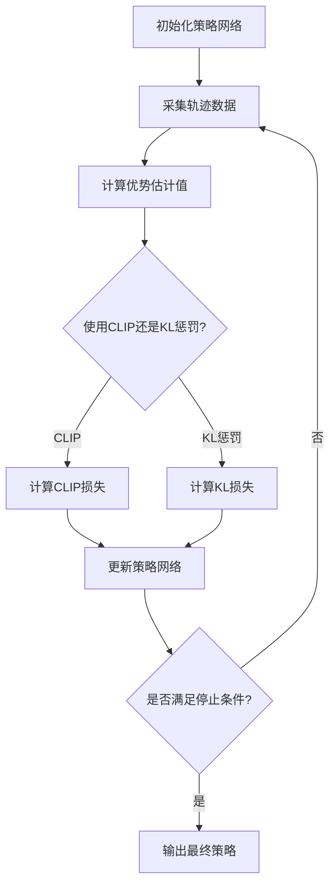

# PPO(Proximal Policy Optimization) - 原理与代码实例讲解

## 1.背景介绍

强化学习(Reinforcement Learning)是机器学习的一个重要分支,它关注如何基于环境反馈来学习行为策略,以最大化预期的长期回报。策略梯度(Policy Gradient)方法是解决连续控制问题的有效方法之一,它直接对策略函数进行优化。然而,经典的策略梯度方法存在数据高方差、收敛慢等问题。为了解决这些问题,Proximal Policy Optimization(PPO)算法应运而生。

PPO是一种高效、稳定的策略梯度算法,由OpenAI在2017年提出。它通过约束新旧策略之间的差异,实现了数据高效利用和稳定收敛。PPO算法广泛应用于连续控制、机器人控制、游戏AI等领域,是目前强化学习中最成熟、最常用的算法之一。

## 2.核心概念与联系

### 2.1 策略梯度算法

策略梯度算法是直接对策略函数进行优化的强化学习算法。它通过最大化期望回报来更新策略参数,公式如下:

$$\nabla_{\theta}J(\theta) = \mathbb{E}_{\tau \sim p_{\theta}(\tau)}[r(\tau)\nabla_{\theta}\log p_{\theta}(\tau)]$$

其中,$\theta$是策略参数,$\tau$是轨迹序列,$r(\tau)$是轨迹的回报。

策略梯度算法的优点是可以直接对连续空间的策略进行优化,但缺点是方差较大,收敛较慢。

### 2.2 PPO算法

PPO算法的核心思想是通过约束新旧策略之间的差异,来控制策略更新的幅度,从而实现数据高效利用和稳定收敛。PPO算法通过以下两种方式之一来约束策略更新:

1. **CLIP算法**:将新旧策略的比值约束在一个区间内,公式如下:

$$L^{CLIP}(\theta) = \hat{\mathbb{E}}_t[min(r_t(\theta)\hat{A}_t, clip(r_t(\theta), 1-\epsilon, 1+\epsilon)\hat{A}_t)]$$

其中,$r_t(\theta)$是新旧策略比值,$\hat{A}_t$是优势估计值,$\epsilon$是超参数,用于控制约束区间的大小。

2. **Adaptive KL Penalty**:通过自适应调整KL散度惩罚项的系数,来控制新旧策略之间的差异,公式如下:

$$L^{KL}(\theta) = \hat{\mathbb{E}}_t[\pi_{\theta}(a_t|s_t)\hat{A}_t] - \beta KL[\pi_{\text{old}}(\cdot|s_t), \pi_{\theta}(\cdot|s_t)]$$

其中,$\beta$是自适应调整的KL惩罚系数。

通过上述约束,PPO算法可以在每次更新时保持新旧策略的相似性,避免了策略突变导致的不稳定性。

## 3.核心算法原理具体操作步骤

PPO算法的核心步骤如下:



1. **初始化策略网络**:使用神经网络来表示策略函数,初始化网络参数。
2. **采集轨迹数据**:让智能体与环境交互,采集状态-动作-回报的轨迹数据。
3. **计算优势估计值**:根据采集的轨迹数据,使用基线函数(如状态值函数)计算优势估计值。
4. **选择约束方式**:根据需求选择使用CLIP算法或Adaptive KL Penalty来约束策略更新。
5. **计算损失函数**:根据选择的约束方式,计算相应的损失函数(CLIP损失或KL损失)。
6. **更新策略网络**:使用优化算法(如Adam)来最小化损失函数,更新策略网络的参数。
7. **判断停止条件**:根据设定的条件(如最大迭代次数或收敛条件)判断是否停止训练。如果不满足,则返回步骤2继续训练;否则输出最终的策略网络。

## 4.数学模型和公式详细讲解举例说明

### 4.1 优势估计

优势估计是策略梯度算法中一个重要概念,它表示采取某个动作相对于基线的优势程度。优势估计值可以用以下公式计算:

$$A_t = r_t + \gamma V(s_{t+1}) - V(s_t)$$

其中,$A_t$是时间步$t$的优势估计值,$r_t$是即时回报,$\gamma$是折现因子,$V(s_t)$是状态值函数,表示处于状态$s_t$时的期望回报。

优势估计值的正负号表示采取该动作相对于基线的好坏程度。在PPO算法中,优势估计值被用于计算CLIP损失和KL损失。

### 4.2 CLIP损失

CLIP损失是PPO算法中约束策略更新的一种方式。它通过将新旧策略的比值约束在一个区间内,来控制策略更新的幅度。CLIP损失的公式如下:

$$L^{CLIP}(\theta) = \hat{\mathbb{E}}_t[min(r_t(\theta)\hat{A}_t, clip(r_t(\theta), 1-\epsilon, 1+\epsilon)\hat{A}_t)]$$

其中,$r_t(\theta) = \frac{\pi_{\theta}(a_t|s_t)}{\pi_{\theta_{old}}(a_t|s_t)}$是新旧策略的比值,$\hat{A}_t$是优势估计值,$\epsilon$是超参数,用于控制约束区间的大小。

CLIP损失通过取新旧策略比值和约束区间的最小值,来限制策略更新的幅度。这样可以避免策略突变,提高算法的稳定性。

例如,设$\epsilon=0.2$,如果新旧策略的比值$r_t(\theta)$在$[0.8, 1.2]$区间内,则直接使用$r_t(\theta)\hat{A}_t$作为损失;如果$r_t(\theta)$超出该区间,则使用区间边界值$0.8\hat{A}_t$或$1.2\hat{A}_t$作为损失。这样可以防止新策略与旧策略差异过大。

### 4.3 Adaptive KL Penalty

Adaptive KL Penalty是PPO算法中另一种约束策略更新的方式。它通过自适应调整KL散度惩罚项的系数,来控制新旧策略之间的差异。KL损失的公式如下:

$$L^{KL}(\theta) = \hat{\mathbb{E}}_t[\pi_{\theta}(a_t|s_t)\hat{A}_t] - \beta KL[\pi_{\text{old}}(\cdot|s_t), \pi_{\theta}(\cdot|s_t)]$$

其中,$\pi_{\theta}(a_t|s_t)$是新策略在状态$s_t$下采取动作$a_t$的概率,$\hat{A}_t$是优势估计值,$\beta$是自适应调整的KL惩罚系数,$KL[\pi_{\text{old}}(\cdot|s_t), \pi_{\theta}(\cdot|s_t)]$是新旧策略在状态$s_t$下的KL散度。

KL散度是衡量两个概率分布差异的一种度量方式。在PPO算法中,KL散度惩罚项被用于约束新旧策略之间的差异。如果新旧策略的差异过大,KL散度值就会增加,从而增大惩罚项的值,使得优化过程趋向于减小新旧策略的差异。

$\beta$是一个自适应调整的系数,它根据每次策略更新后的KL散度值进行调整。如果KL散度值过大,则增加$\beta$的值,从而加大惩罚力度;反之则减小$\beta$的值,放松约束。这种自适应调整机制可以使算法在新旧策略差异较小时保持高采样效率,在差异较大时加强约束,从而实现数据高效利用和稳定收敛。

## 5.项目实践:代码实例和详细解释说明

以下是使用PyTorch实现PPO算法的代码示例,并对关键部分进行了详细解释。

### 5.1 PPO算法实现

```python
import torch
import torch.nn as nn
from torch.distributions import Categorical

class PPOAgent:
    def __init__(self, state_dim, action_dim, hidden_dim=64, lr=3e-4, gamma=0.99, lmbda=0.95, eps_clip=0.2):
        self.gamma = gamma
        self.eps_clip = eps_clip
        self.lmbda = lmbda

        self.policy = PolicyNetwork(state_dim, action_dim, hidden_dim)
        self.value_func = ValueNetwork(state_dim, hidden_dim)
        self.optimizer = torch.optim.Adam([
            {'params': self.policy.parameters(), 'lr': lr},
            {'params': self.value_func.parameters(), 'lr': lr}
        ])

    def get_action(self, state):
        state = torch.FloatTensor(state)
        action_probs = self.policy(state)
        dist = Categorical(action_probs)
        action = dist.sample()
        return action.item()

    def compute_gae(self, next_value, rewards, masks, values):
        values = torch.cat(values)
        gae = 0
        returns = []
        for step in reversed(range(len(rewards))):
            delta = rewards[step] + self.gamma * next_value * masks[step] - values[step]
            gae = delta + self.gamma * self.lmbda * masks[step] * gae
            returns.insert(0, gae + values[step])
        return returns

    def ppo_iter(self, mini_batch_size, states, actions, log_probs, returns, advantages):
        batch_size = len(states)
        for _ in range(batch_size // mini_batch_size):
            rand_ids = np.random.randint(0, batch_size, mini_batch_size)
            yield states[rand_ids, :], actions[rand_ids], log_probs[rand_ids], returns[rand_ids], advantages[rand_ids]

    def ppo_update(self, ppo_epochs, mini_batch_size, states, actions, log_probs, returns, advantages):
        for _ in range(ppo_epochs):
            for state, action, old_log_probs, return_, advantage in self.ppo_iter(mini_batch_size, states, actions, log_probs, returns, advantages):
                dist = self.policy(state)
                entropy = dist.entropy().mean()
                new_log_probs = dist.log_prob(action)

                ratio = (new_log_probs - old_log_probs).exp()
                surr1 = ratio * advantage
                surr2 = torch.clamp(ratio, 1.0 - self.eps_clip, 1.0 + self.eps_clip) * advantage

                actor_loss = - torch.min(surr1, surr2).mean()
                critic_loss = (return_ - self.value_func(state)).pow(2).mean()

                loss = 0.5 * critic_loss + actor_loss - 0.001 * entropy

                self.optimizer.zero_grad()
                loss.backward()
                self.optimizer.step()
```

**解释**:

1. `PPOAgent`类实现了PPO算法的核心逻辑。
2. `__init__`方法初始化策略网络、值函数网络和优化器。
3. `get_action`方法根据当前状态采样一个动作。
4. `compute_gae`方法计算广义优势估计(GAE)值,用于估计优势函数。
5. `ppo_iter`方法实现了小批量采样的迭代器。
6. `ppo_update`方法是PPO算法的核心更新过程:
   - 计算新旧策略的比率`ratio`。
   - 根据CLIP算法计算surrogate损失`surr1`和`surr2`。
   - 计算actor损失`actor_loss`和critic损失`critic_loss`。
   - 将actor损失、critic损失和熵损失合并为总损失`loss`。
   - 反向传播并更新网络参数。

### 5.2 策略网络和值函数网络

```python
class PolicyNetwork(nn.Module):
    def __init__(self, state_dim, action_dim, hidden_dim=64):
        super(PolicyNetwork, self).__init__()
        self.fc1 = nn.Linear(state_dim, hidden_dim)
        self.fc2 = nn.Linear(hidden_dim, hidden_dim)
        self.fc3 = nn.Linear(hidden_dim, action_dim)

    def forward(self, x):
        x = torch.tanh(self.fc1(x))
        x = torch.tanh(self.fc2(x))
        action_probs = torch.softmax(self.fc3(x), dim=-1)
        return action_probs

class ValueNetwork(nn.Module):
    def __init__(self, state_dim, hidden_dim=64):
        super(ValueNetwork, self).__init__()
        self.fc1