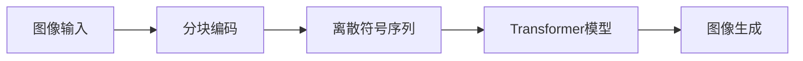

# Parti原理与代码实例讲解

## 1. 背景介绍

在人工智能的发展历程中，生成模型一直是一个重要的研究领域。近年来，随着深度学习技术的进步，生成对抗网络（GAN）和变分自编码器（VAE）等模型在图像生成、文本生成等方面取得了显著的成果。Parti是谷歌研究团队提出的一种基于Transformer的大规模图像生成模型，它在图像生成的质量和多样性上都有着卓越的表现。

## 2. 核心概念与联系

Parti模型的核心概念是基于Transformer的序列到序列（Seq2Seq）学习框架，它将图像生成任务视为一个序列生成问题。Parti模型通过对图像进行分块编码，将其转换为一系列的离散符号，然后使用Transformer模型进行处理，最终生成图像。



## 3. 核心算法原理具体操作步骤

Parti模型的操作步骤可以分为以下几个阶段：

1. 图像分块：将输入图像分割成小块。
2. 编码：对每个图像块进行编码，转换为离散符号。
3. 序列化：将离散符号序列输入到Transformer模型中。
4. Transformer处理：Transformer模型对序列进行处理，学习序列之间的关系。
5. 图像重构：根据Transformer输出的序列重构图像。

## 4. 数学模型和公式详细讲解举例说明

Parti模型的数学基础是Transformer的自注意力机制。自注意力机制的核心公式如下：

$$
\text{Attention}(Q, K, V) = \text{softmax}\left(\frac{QK^T}{\sqrt{d_k}}\right)V
$$

其中，$Q$、$K$、$V$分别代表查询（Query）、键（Key）和值（Value），$d_k$是键的维度。通过这个公式，模型能够计算出每个位置对其他位置的注意力权重，从而捕捉序列内部的依赖关系。

## 5. 项目实践：代码实例和详细解释说明

在实践中，我们可以使用如下伪代码来实现Parti模型的基本框架：

```python
# 图像分块
def image_partition(image):
    # 将图像分割成小块并编码为符号序列
    pass

# Transformer模型
class TransformerModel:
    def __init__(self):
        # 初始化Transformer模型
        pass
    
    def forward(self, sequence):
        # 前向传播，处理序列
        pass

# 图像生成
def image_generation(sequence):
    # 根据序列重构图像
    pass

# 主流程
def parti_model(image):
    sequence = image_partition(image)
    transformer = TransformerModel()
    processed_sequence = transformer.forward(sequence)
    generated_image = image_generation(processed_sequence)
    return generated_image
```

## 6. 实际应用场景

Parti模型在多个领域都有广泛的应用，例如：

- 艺术创作：生成高质量的艺术图像。
- 游戏开发：自动生成游戏场景和角色。
- 设计辅助：帮助设计师快速生成设计草图。

## 7. 工具和资源推荐

为了方便开发者使用Parti模型，以下是一些有用的工具和资源：

- TensorFlow或PyTorch：两个主流的深度学习框架，都支持Transformer模型的实现。
- Hugging Face Transformers：提供了大量预训练的Transformer模型，可以直接使用或进行微调。

## 8. 总结：未来发展趋势与挑战

Parti模型作为一种新兴的图像生成技术，未来有着广阔的发展前景。然而，它也面临着一些挑战，如计算资源的需求、模型的可解释性等。

## 9. 附录：常见问题与解答

Q1: Parti模型的训练数据是怎样的？
A1: Parti模型通常需要大量的图像数据进行训练，以学习丰富的图像特征和模式。

Q2: Parti模型如何处理不同尺寸的图像？
A2: Parti模型通常会将所有图像调整到统一的尺寸，或者使用可变尺寸的处理方法。

作者：禅与计算机程序设计艺术 / Zen and the Art of Computer Programming