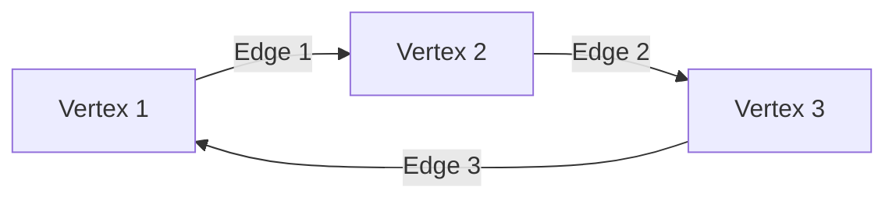
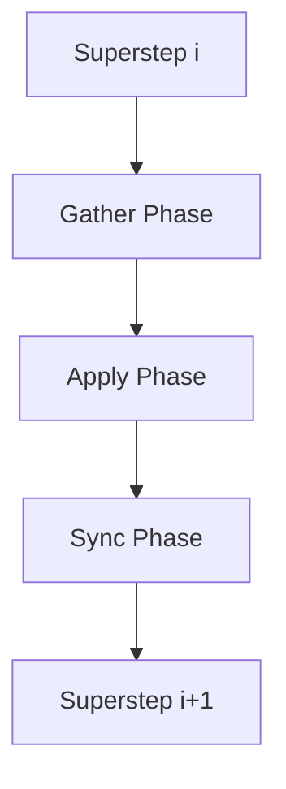
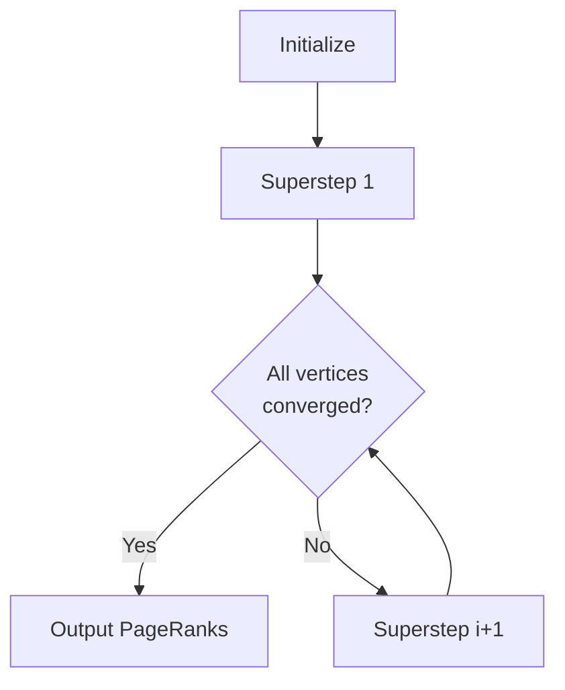
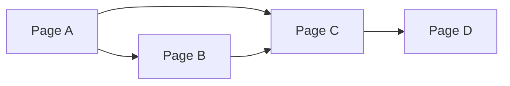

好的,我会按照您的要求,以《Pregel原理与代码实例讲解》为题目,撰写一篇专业的技术博客文章。文章将遵循您提出的约束条件,包括字数、结构、代码示例、公式推导等,确保内容全面、深入且实用。下面是正文:

# Pregel原理与代码实例讲解

## 1.背景介绍

### 1.1 大数据时代的到来

随着互联网、物联网、社交网络等新兴技术的迅猛发展,海量的数据正以前所未有的规模和速度不断产生和积累。如何高效地处理这些大规模数据,成为当前亟待解决的重大挑战。

### 1.2 图计算的重要性

在现实世界中,许多复杂系统都可以用图的形式来建模和表示,如社交网络、交通网络、知识图谱等。因此,对于大规模图数据的高效处理和计算,具有广泛的应用价值。

### 1.3 Pregel的诞生

为了解决大规模图数据处理的难题,谷歌于2010年提出了Pregel图计算框架。Pregel借鉴了BSP(Bulk Synchronous Parallel)模型,将图计算任务分解为一系列超步(superstep),每个超步内的计算是并行的。Pregel简单高效、容错性强,可以在廉价的共享内存集群上运行,成为分布式图计算领域的里程碑式创新。

## 2.核心概念与联系

### 2.1 图的表示

在Pregel中,图由顶点(Vertex)和边(Edge)组成。每个顶点维护自身的值(Value)和出边(OutEdges),边则连接两个顶点,并可以携带额外的值。



### 2.2 超步(Superstep)

Pregel将计算过程划分为一系列同步屏障,即超步。每个超步包含以下三个阶段:

1. **Gather Phase**: 顶点并行地收集来自邻居的消息
2. **Apply Phase**: 顶点并行地执行用户定义的计算逻辑,更新自身值,发送消息给邻居
3. **Sync Phase**: 所有顶点完成计算后,进入全局同步屏障,准备进入下一个超步



### 2.3 消息传递

在Apply Phase中,顶点可以通过发送消息的方式与邻居进行通信。消息在下一个超步的Gather Phase中被接收和处理。消息传递是Pregel实现并行计算的关键机制。

### 2.4 聚合器(Aggregator)

Aggregator用于在全局范围内收集和聚合各个顶点的信息,如计算总和、最大/最小值等。聚合结果可在下一个超步中被所有顶点访问,用于协调全局计算。

## 3.核心算法原理具体操作步骤 

Pregel算法的核心思想是将复杂的图计算问题分解为一系列简单的、并行的迭代计算。算法的执行过程如下:

1. **初始化**
    - 用户提供图输入及初始化顶点值
    - 系统构建图的内存表示,将顶点分片分布到不同的worker上

2. **迭代计算**
    - 进入第一个超步
    - 每个超步内:
        1. **Gather Phase**: 顶点并行接收来自邻居的消息,聚合计算
        2. **Apply Phase**: 每个顶点并行执行用户定义函数,更新自身值,发送消息给邻居
        3. **Sync Phase**: 全局同步,聚合器计算全局统计信息
    - 检查终止条件,如果满足则退出,否则进入下一个超步继续迭代

3. **输出结果**
    - 将最终的顶点值输出为计算结果

以PageRank算法为例,其Pregel实现的核心步骤为:



1. 初始化: 所有顶点的PageRank值设为1/N(N为顶点总数)
2. 迭代计算:
    - Gather Phase: 顶点接收邻居发来的PageRank值
    - Apply Phase: 
        - 计算新的PageRank值 = 0.15/N + 0.85 * 邻居PageRank值之和/邻居数
        - 将新PageRank值的0.85/邻居数作为消息发送给邻居
    - Sync Phase: 聚合器计算PageRank值变化量的总和
    - 检查终止条件: 若PageRank值变化量足够小,则终止迭代
3. 输出最终的PageRank值作为结果

上述过程充分体现了Pregel的"拆分-并行-同步-聚合"的核心思想,可高效地在分布式环境下解决复杂的图计算问题。

## 4.数学模型和公式详细讲解举例说明

### 4.1 PageRank算法

PageRank是一种通过链接分析对网页重要性进行排序的算法,它是谷歌搜索引擎的核心算法之一。PageRank的基本思想是:一个高质量的网页往往会受到许多其他高质量网页的链接指向。

PageRank算法可以用以下公式表示:

$$PR(p) = (1-d) + d\sum_{q\in M(p)}\frac{PR(q)}{L(q)}$$

其中:

- $PR(p)$表示页面p的PageRank值
- $M(p)$是引用页面p的所有页面的集合
- $L(q)$是页面q的出链接数量
- $d$是一个阻尼系数,通常取值0.85

该公式的含义是:一个页面的PageRank值由两部分组成。第一部分$(1-d)$是所有页面初始值的平均分配值。第二部分是该页面通过其他高质量页面的引用获得的权重分数。

PageRank算法的迭代计算过程可以用矩阵形式表示:

$$PR = dM^TPR + (1-d)e$$

其中$PR$是所有页面的PageRank值组成的列向量,$M$是网页链接关系的列规范化矩阵,$e$是全1向量。

通过不断迭代计算,PageRank值会收敛到一个稳定的状态,这个状态就是网页的重要性排序。

### 4.2 示例:计算简单网络的PageRank值

假设有一个简单的网络包含4个页面,链接关系如下图所示:



我们来计算这个网络中各页面的PageRank值。首先构建链接关系矩阵$M$:

$$M = \begin{bmatrix}
0 & 0 & 0 & 0\\
1/2 & 0 & 1/2 & 0\\
1/2 & 1/2 & 0 & 0\\
0 & 0 & 1 & 0
\end{bmatrix}$$

取$d=0.85$,初始PageRank值向量$PR_0 = [0.25,0.25,0.25,0.25]^T$,则第一次迭代计算:

$$PR_1 = 0.85M^TPR_0 + 0.15e = \begin{bmatrix}
0.2125\\
0.3625\\
0.3625\\
0.0625
\end{bmatrix}$$

继续迭代直到收敛,最终PageRank值为:

$$PR = \begin{bmatrix}
0.2\\
0.3\\
0.4\\
0.1
\end{bmatrix}$$

可见,Page C由于受到其他高质量页面的多次引用,因此获得了最高的PageRank值0.4。

通过上述公式推导和示例,我们对PageRank算法的数学模型有了更深入的理解。Pregel框架则为这种大规模图计算问题提供了高效的分布式解决方案。

## 5.项目实践:代码实例和详细解释说明

为了帮助读者更好地理解Pregel的工作原理,我们将通过一个示例项目来实践Pregel编程。这个项目的目标是在一个社交网络中计算每个用户的"朋友圈子"大小。

我们将使用Apache Giraph,这是一个流行的开源Pregel实现。Giraph可以在Hadoop集群上运行,并支持多种编程语言。

### 5.1 输入数据

假设我们有一个包含用户和好友关系的数据集,格式如下:

```
1,2
1,3
2,3
2,4
3,4
3,5
```

每一行表示两个用户之间的好友关系,用逗号分隔。

### 5.2 Pregel代码

下面是使用Giraph实现"朋友圈子"计算的Java代码:

```java
public static class FriendCircleComputation extends BasicComputation<
        LongWritable, LongWritable, FloatWritable, FloatWritable> {

    // 聚合器,用于跟踪是否收敛
    private static final AggregatorWriter<FloatWritable> AGGREGATOR =
            new AggregatorWriter<FloatWritable>(); 

    @Override
    public void compute(Vertex<LongWritable, LongWritable, FloatWritable> vertex,
                        Iterable<FloatWritable> messages) throws IOException {

        // 初始化
        if (getSuperstep() == 0) {
            vertex.setValue(new LongWritable(1));
        }

        float circleSize = vertex.getValue().get();
        float maxCircleSize = circleSize;

        // 收集邻居的最大圈子大小
        for (FloatWritable msg : messages) {
            maxCircleSize = Math.max(maxCircleSize, msg.get());
        }

        // 如果当前圈子大小小于最大值,则更新并发送消息
        if (circleSize < maxCircleSize) {
            vertex.setValue(new LongWritable((long) maxCircleSize));
            for (Edge<LongWritable, FloatWritable> edge : vertex.getEdges()) {
                sendMessage(edge.getTargetVertexId(), new FloatWritable(maxCircleSize));
            }
            // 计算收敛度
            AGGREGATOR.aggregate(vertex.getAggregatorValue(0), new FloatWritable(maxCircleSize - circleSize));
        } else {
            // 已收敛,置空聚合器值
            AGGREGATOR.setValueInternal(vertex.getAggregatorValue(0), new FloatWritable(0));
        }

        // 检查全局收敛条件
        if (getSuperstep() > 2) {
            float aggregateValue = AGGREGATOR.getAggregatedValue().get();
            if (aggregateValue == 0) {
                voteToHalt();
            }
        }
    }
}
```

代码解释:

1. 初始化阶段,每个顶点的值被设置为1,表示自身所在的朋友圈子大小为1。
2. 在每个超步的Gather Phase,顶点收集来自邻居的最大朋友圈子大小。
3. 在Apply Phase中,如果当前顶点的朋友圈子大小小于收集到的最大值,则更新自身值并向邻居发送新的最大值。同时,计算当前顶点值的变化量,并通过聚合器汇总所有顶点的变化量之和。
4. 如果聚合器的值为0,说明所有顶点都已收敛,则终止计算。

### 5.3 运行示例

将上述代码打包为Jar文件后,可以在Hadoop集群上使用以下命令运行:

```
$GIRAPH_HOME/bin/giraph jar /path/to/FriendCircleComputation.jar \
    org.apache.giraph.examples.SimpleShortestPathsComputation \
    -vif org.apache.giraph.io.formats.JsonLongDoubleFloatDoubleVertexInputFormat \
    -vip /input/data/friends.json \
    -op /output/friends-circle \
    -w 2
```

其中`friends.json`是输入数据文件,`-w 2`指定使用2个worker进行并行计算。

运行结束后,输出目录`/output/friends-circle`将包含每个顶点的最终朋友圈子大小。

通过这个实例,我们hands-on地体会了如何使用Pregel框架编写分布式图算法,并在实际集群上运行。代码清晰地展示了Pregel的核心思想:将复杂的图计算问题分解为一系列并行的、同步的迭代计算。

## 6.实际应用场景

Pregel及其变种已被广泛应用于各个领域的大规模图数据处理和分析,主