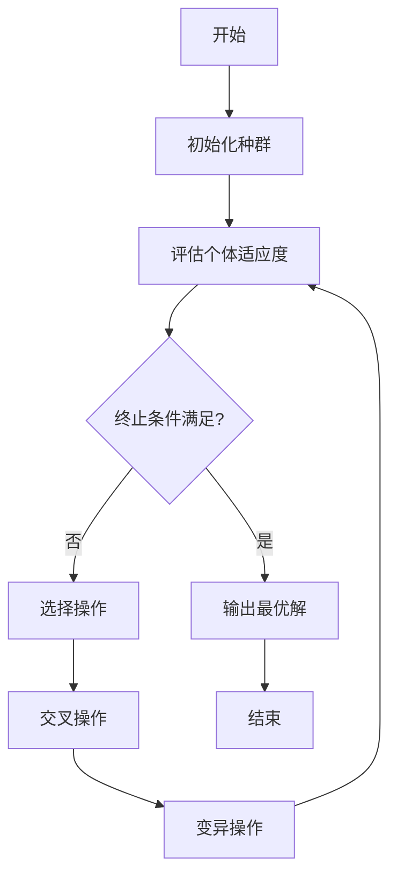

# Python机器学习实战：实现与优化遗传算法

## 1.背景介绍

在现代计算机科学和人工智能领域中,遗传算法(Genetic Algorithm,GA)作为一种重要的生物启发式优化算法,已被广泛应用于各种复杂优化问题的求解。遗传算法借鉴了生物进化过程中的自然选择和遗传机制,通过模拟生物群体的繁衍过程,对问题的可能解集合进行迭代优化,最终获得满足条件的最优解或近似最优解。

作为一种通用的搜索算法,遗传算法可以有效解决诸如组合优化、机器学习、规划调度等领域的复杂问题。与传统的数学编程方法相比,遗传算法不需要事先了解问题的具体数学模型,只需将问题抽象为适应度函数,便可通过模拟进化过程自动搜索最优解。此外,遗传算法还具有全局寻优能力强、易于并行化等优点,使其在解决高维、非线性、多峰值等复杂优化问题时表现出色。

在Python生态系统中,已有多个成熟的遗传算法库可供使用,如DEAP、PyGAD等。这些库提供了遗传算法的核心组件和算法实现,大大简化了算法的开发和应用过程。同时,Python作为一种高级编程语言,具有简洁易读的语法特性和丰富的数据处理工具,使得遗传算法的实现和优化变得更加高效和便捷。

本文将全面介绍如何使用Python实现和优化遗传算法,包括遗传算法的核心概念、算法原理、数学模型、编码实践、应用场景等内容,为读者提供一个完整的学习和实践路径。

## 2.核心概念与联系

在深入探讨遗传算法的具体实现之前,我们需要先了解一些核心概念及其内在联系,为后续的算法设计和优化奠定基础。

### 2.1 个体(Individual)

个体是遗传算法中最基本的单元,表示问题的一个可能解。在实际编码中,个体通常使用一个固定长度的二进制串或其他编码方式来表示。

### 2.2 种群(Population)

种群是由多个个体组成的集合,表示问题的解空间。遗传算法通过对种群中的个体进行选择、交叉和变异操作,不断产生新的个体,从而逐步优化种群质量。

### 2.3 适应度函数(Fitness Function)

适应度函数用于评估个体的优劣程度,是遗传算法中最关键的部分之一。根据问题的具体需求,适应度函数可以是需要最大化或最小化的目标函数,也可以是对约束条件的惩罚函数。

### 2.4 选择(Selection)

选择操作根据个体的适应度值,从当前种群中选择出一部分个体,作为下一代种群的父代。常用的选择策略包括轮盘赌选择、锦标赛选择、排名选择等。

### 2.5 交叉(Crossover)

交叉操作通过对选定的父代个体进行部分基因交换,产生新的子代个体。交叉是遗传算法中最主要的变异方式,能够有效扩大搜索空间,提高种群的多样性。

### 2.6 变异(Mutation)

变异操作通过改变个体部分基因的值,产生新的个体。变异操作可以防止算法过早收敛,增加种群的多样性,从而提高算法的全局搜索能力。

上述核心概念相互关联、相互作用,共同构成了遗传算法的基本框架。在实际编码实现中,我们需要根据具体问题,合理设计这些概念的编码方式和操作策略,以提高算法的性能和效率。

## 3.核心算法原理具体操作步骤

遗传算法的核心思想是模拟生物进化过程,通过选择、交叉和变异等操作,不断优化种群质量,最终获得满足条件的最优解或近似最优解。下面我们将详细介绍遗传算法的具体操作步骤。

1. **初始化种群**

   首先,我们需要随机生成一个初始种群,包含一定数量的个体。每个个体都是问题的一个可能解,通常使用二进制串或其他编码方式来表示。初始种群的多样性对算法的性能有重要影响,因此需要保证种群具有足够的多样性。

2. **评估个体适应度**

   对于种群中的每个个体,我们需要计算其适应度值,以衡量其优劣程度。适应度函数的设计直接影响算法的收敛性和最终结果,因此需要根据具体问题进行合理设计。

3. **终止条件判断**

   在每次迭代后,我们需要检查是否满足算法终止条件。常用的终止条件包括:

   - 达到最大迭代次数
   - 种群适应度值收敛到一定范围内
   - 找到满足要求的最优解

   如果终止条件满足,则输出当前种群中适应度最高的个体作为最优解,并结束算法。否则,进入下一步骤。

4. **选择操作**

   选择操作根据个体的适应度值,从当前种群中选择出一部分个体,作为下一代种群的父代。常用的选择策略包括轮盘赌选择、锦标赛选择、排名选择等。选择压力的大小会影响算法的收敛速度和解的质量。

5. **交叉操作**

   交叉操作通过对选定的父代个体进行部分基因交换,产生新的子代个体。交叉是遗传算法中最主要的变异方式,能够有效扩大搜索空间,提高种群的多样性。常用的交叉方式包括单点交叉、多点交叉、均匀交叉等。

6. **变异操作**

   变异操作通过改变个体部分基因的值,产生新的个体。变异操作可以防止算法过早收敛,增加种群的多样性,从而提高算法的全局搜索能力。常用的变异方式包括基因反转变异、均匀变异等。变异概率的设置对算法性能有重要影响。

7. **更新种群**

   通过选择、交叉和变异操作,我们获得了一批新的个体。将这些新个体与原种群中的部分个体合并,形成新一代的种群。

8. **回到步骤2**

   对新一代种群重复执行步骤2~7,直到满足终止条件。

通过上述步骤的不断迭代,遗传算法能够逐步优化种群质量,最终获得满足条件的最优解或近似最优解。在实际编码实现中,我们需要根据具体问题,合理设计编码方式、适应度函数、选择策略、交叉方式、变异方式等参数,以提高算法的性能和效率。

## 4.数学模型和公式详细讲解举例说明

虽然遗传算法是一种启发式优化算法,但它的背后也存在着一些数学模型和公式,这些模型和公式可以帮助我们更好地理解和优化算法。下面我们将详细介绍一些常用的数学模型和公式。

### 4.1 编码方式

在遗传算法中,我们需要将问题的可能解编码为一个固定长度的字符串,通常使用二进制编码或其他编码方式。编码方式的选择会直接影响算法的性能和效率。

对于一个长度为$n$的二进制编码,其编码空间的大小为$2^n$,即有$2^n$种可能的编码方式。因此,编码长度的选择需要权衡搜索空间的大小和计算复杂度。

### 4.2 适应度函数

适应度函数用于评估个体的优劣程度,是遗传算法中最关键的部分之一。适应度函数的设计直接影响算法的收敛性和最终结果。

对于一个需要最小化的目标函数$f(x)$,我们可以将适应度函数设计为:

$$
\text{fitness}(x) = \frac{1}{1 + f(x)}
$$

对于一个需要最大化的目标函数$g(x)$,我们可以将适应度函数设计为:

$$
\text{fitness}(x) = g(x)
$$

如果问题存在约束条件,我们还可以在适应度函数中加入惩罚项,以惩罚违反约束条件的个体。

### 4.3 选择策略

选择操作根据个体的适应度值,从当前种群中选择出一部分个体,作为下一代种群的父代。常用的选择策略包括轮盘赌选择、锦标赛选择、排名选择等。

**轮盘赌选择**

在轮盘赌选择中,每个个体被选中的概率与其适应度值成正比。具体来说,对于一个包含$N$个个体的种群,第$i$个个体被选中的概率为:

$$
p_i = \frac{\text{fitness}(x_i)}{\sum_{j=1}^N \text{fitness}(x_j)}
$$

其中,$\text{fitness}(x_i)$表示第$i$个个体的适应度值。

**锦标赛选择**

在锦标赛选择中,我们随机选择$k$个个体,并从中选择适应度值最高的个体作为父代。该过程重复进行,直到选择出足够数量的父代个体。锦标赛选择的优点是计算简单,并且可以通过调整$k$的值来控制选择压力。

**排名选择**

在排名选择中,我们首先根据个体的适应度值对种群进行排序,然后根据个体的排名来确定其被选中的概率。具体来说,排名第$i$的个体被选中的概率为:

$$
p_i = \frac{N - i + 1}{\sum_{j=1}^N j}
$$

其中,$N$表示种群大小。排名选择的优点是可以避免适应度值过大的个体占据过多的选择概率,从而保持种群的多样性。

### 4.4 交叉操作

交叉操作通过对选定的父代个体进行部分基因交换,产生新的子代个体。常用的交叉方式包括单点交叉、多点交叉、均匀交叉等。

**单点交叉**

在单点交叉中,我们随机选择一个交叉点,然后交换两个父代个体在该点后面的基因,产生两个新的子代个体。例如,对于两个父代个体$P_1 = 10101010$和$P_2 = 01010101$,如果交叉点选择在第4位,则产生的子代个体为$C_1 = 10100101$和$C_2 = 01011010$。

**多点交叉**

多点交叉与单点交叉类似,只是我们选择多个交叉点,并交换父代个体在这些交叉点之间的基因。

**均匀交叉**

在均匀交叉中,我们对于每一个基因位,都有一定的概率从父代个体中随机选择一个基因值。均匀交叉可以更好地保持种群的多样性。

交叉操作的目的是通过组合父代个体的优良基因,产生更优秀的子代个体,从而不断优化种群质量。交叉概率的选择需要权衡探索和利用之间的平衡。

### 4.5 变异操作

变异操作通过改变个体部分基因的值,产生新的个体。常用的变异方式包括基因反转变异、均匀变异等。

**基因反转变异**

在基因反转变异中,我们随机选择一个或多个基因位,并反转它们的值。例如,对于个体$X = 10101010$,如果我们选择反转第3和第6个基因位,则产生的新个体为$X' = 10111000$。

**均匀变异**

在均匀变异中,我们对于每一个基因位,都有一定的概率将其值反转。均匀变异可以更好地探索搜索空间,但也可能破坏个体的优良基因。

变异操作的目的是增加种群的多样性,防止算法过早收敛,从而提高算法的全局搜索能力。变异概率的选择需要权