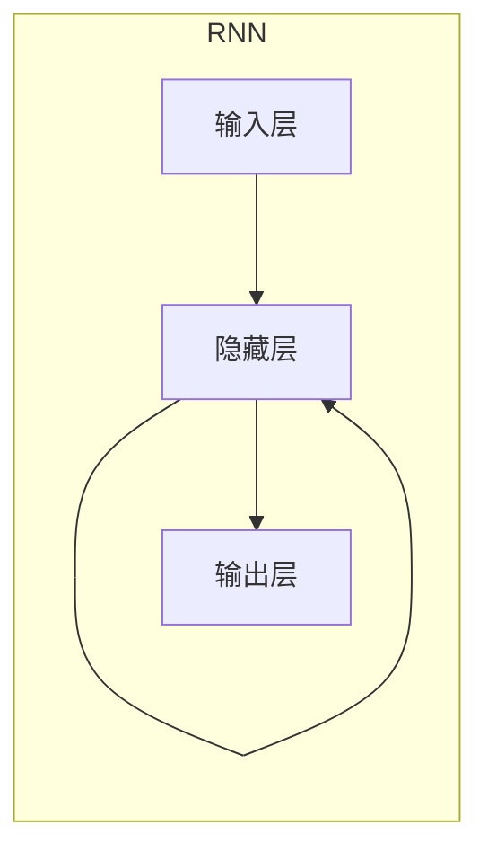

# Python机器学习实战：循环神经网络(RNN)与自然语言处理(NLP)

## 1.背景介绍

### 1.1 自然语言处理概述

自然语言处理(Natural Language Processing, NLP)是人工智能领域的一个重要分支,旨在使计算机能够理解和生成人类语言。它广泛应用于机器翻译、语音识别、问答系统、文本分类、情感分析等领域。随着深度学习技术的发展,NLP取得了长足进步,其中循环神经网络(Recurrent Neural Network, RNN)在序列数据建模方面发挥着关键作用。

### 1.2 循环神经网络简介

循环神经网络是一种专门设计用于处理序列数据的神经网络模型。与传统的前馈神经网络不同,RNN能够捕捉序列数据中的时序信息,使其在自然语言处理、语音识别、时间序列预测等任务中表现出色。RNN的核心思想是在每个时间步,网络会接收当前输入和上一时间步的隐藏状态,并计算出当前时间步的隐藏状态和输出。

## 2.核心概念与联系

### 2.1 RNN的基本结构

RNN的基本结构由输入层、隐藏层和输出层组成。在每个时间步,输入层接收当前输入数据,隐藏层根据当前输入和上一时间步的隐藏状态计算新的隐藏状态,输出层则根据当前隐藏状态计算输出。这种循环结构使RNN能够捕捉序列数据中的长期依赖关系。



### 2.2 RNN在NLP中的应用

RNN在自然语言处理任务中发挥着重要作用,例如:

1. **语言模型(Language Modeling)**: 预测下一个单词或字符的概率分布。
2. **机器翻译(Machine Translation)**: 将一种语言的句子翻译成另一种语言。
3. **文本生成(Text Generation)**: 根据给定的上下文生成连贯的文本。
4. **情感分析(Sentiment Analysis)**: 判断文本的情感倾向(正面、负面或中性)。
5. **命名实体识别(Named Entity Recognition)**: 识别文本中的人名、地名、组织机构名等实体。

## 3.核心算法原理具体操作步骤

### 3.1 RNN的前向传播

RNN的前向传播过程可以描述如下:

1. 在时间步 $t$,将输入 $x_t$ 传递给隐藏层。
2. 隐藏层根据当前输入 $x_t$ 和上一时间步的隐藏状态 $h_{t-1}$ 计算新的隐藏状态 $h_t$:

$$h_t = \tanh(W_{hh}h_{t-1} + W_{xh}x_t + b_h)$$

其中 $W_{hh}$ 和 $W_{xh}$ 分别是隐藏层到隐藏层和输入层到隐藏层的权重矩阵, $b_h$ 是隐藏层的偏置项。

3. 输出层根据当前隐藏状态 $h_t$ 计算输出 $y_t$:

$$y_t = W_{hy}h_t + b_y$$

其中 $W_{hy}$ 是隐藏层到输出层的权重矩阵, $b_y$ 是输出层的偏置项。

4. 重复步骤1-3,直到处理完整个序列。

### 3.2 RNN的反向传播

RNN的反向传播过程用于计算损失函数相对于模型参数的梯度,以便进行参数更新。由于RNN的循环结构,反向传播需要通过时间反向传播误差项。具体步骤如下:

1. 计算输出层的误差项:

$$\delta_t^{(o)} = \frac{\partial L}{\partial y_t}$$

其中 $L$ 是损失函数, $y_t$ 是时间步 $t$ 的输出。

2. 计算隐藏层的误差项:

$$\delta_t^{(h)} = \frac{\partial L}{\partial h_t} = \frac{\partial L}{\partial y_t}\frac{\partial y_t}{\partial h_t} + \frac{\partial L}{\partial h_{t+1}}\frac{\partial h_{t+1}}{\partial h_t}$$

其中第一项是当前时间步的误差传播,第二项是下一时间步的误差反向传播。

3. 更新权重矩阵和偏置项:

$$\begin{aligned}
W_{hh} &\leftarrow W_{hh} - \eta\sum_t\delta_t^{(h)}h_{t-1}^T \\
W_{xh} &\leftarrow W_{xh} - \eta\sum_t\delta_t^{(h)}x_t^T \\
W_{hy} &\leftarrow W_{hy} - \eta\sum_t\delta_t^{(o)}h_t^T \\
b_h &\leftarrow b_h - \eta\sum_t\delta_t^{(h)} \\
b_y &\leftarrow b_y - \eta\sum_t\delta_t^{(o)}
\end{aligned}$$

其中 $\eta$ 是学习率。

4. 重复步骤1-3,直到完成整个序列的反向传播。

### 3.3 RNN的变种

虽然基本的RNN模型能够捕捉序列数据中的时序信息,但它存在梯度消失和梯度爆炸的问题,这使得它难以学习长期依赖关系。为了解决这个问题,研究人员提出了多种RNN变种,如长短期记忆网络(LSTM)和门控循环单元(GRU)。这些变种通过引入门控机制来控制信息的流动,从而更好地捕捉长期依赖关系。

## 4.数学模型和公式详细讲解举例说明

### 4.1 LSTM模型

长短期记忆网络(Long Short-Term Memory, LSTM)是RNN的一种变种,它通过引入门控机制来控制信息的流动,从而解决了基本RNN模型中的梯度消失和梯度爆炸问题。LSTM的核心思想是使用一个细胞状态(cell state)来传递信息,并通过三个门(forget gate、input gate和output gate)来控制信息的流动。

LSTM的前向传播过程可以描述如下:

1. 忘记门(forget gate)决定了细胞状态中有多少信息需要被遗忘:

$$f_t = \sigma(W_f[h_{t-1}, x_t] + b_f)$$

其中 $W_f$ 和 $b_f$ 分别是忘记门的权重矩阵和偏置项, $\sigma$ 是sigmoid激活函数。

2. 输入门(input gate)决定了新的信息有多少需要被更新到细胞状态中:

$$\begin{aligned}
i_t &= \sigma(W_i[h_{t-1}, x_t] + b_i) \\
\tilde{C}_t &= \tanh(W_C[h_{t-1}, x_t] + b_C)
\end{aligned}$$

其中 $W_i$、$W_C$、$b_i$ 和 $b_C$ 分别是输入门和候选细胞状态的权重矩阵和偏置项。

3. 更新细胞状态:

$$C_t = f_t \odot C_{t-1} + i_t \odot \tilde{C}_t$$

其中 $\odot$ 表示元素wise乘积操作。

4. 输出门(output gate)决定了细胞状态中有多少信息需要输出:

$$\begin{aligned}
o_t &= \sigma(W_o[h_{t-1}, x_t] + b_o) \\
h_t &= o_t \odot \tanh(C_t)
\end{aligned}$$

其中 $W_o$ 和 $b_o$ 分别是输出门的权重矩阵和偏置项。

LSTM通过这种门控机制,能够更好地捕捉长期依赖关系,从而在许多自然语言处理任务中取得了优异的表现。

### 4.2 GRU模型

门控循环单元(Gated Recurrent Unit, GRU)是另一种RNN变种,它相比LSTM结构更加简单,但也能够有效地捕捉长期依赖关系。GRU的核心思想是使用更新门(update gate)和重置门(reset gate)来控制信息的流动。

GRU的前向传播过程可以描述如下:

1. 更新门(update gate)决定了有多少信息需要被保留:

$$z_t = \sigma(W_z[h_{t-1}, x_t] + b_z)$$

其中 $W_z$ 和 $b_z$ 分别是更新门的权重矩阵和偏置项。

2. 重置门(reset gate)决定了有多少信息需要被忘记:

$$r_t = \sigma(W_r[h_{t-1}, x_t] + b_r)$$

其中 $W_r$ 和 $b_r$ 分别是重置门的权重矩阵和偏置项。

3. 计算候选隐藏状态:

$$\tilde{h}_t = \tanh(W_h[r_t \odot h_{t-1}, x_t] + b_h)$$

其中 $W_h$ 和 $b_h$ 分别是候选隐藏状态的权重矩阵和偏置项。

4. 更新隐藏状态:

$$h_t = (1 - z_t) \odot h_{t-1} + z_t \odot \tilde{h}_t$$

GRU相比LSTM结构更加简单,但在许多任务中也能够取得与LSTM相当的性能。

## 5.项目实践：代码实例和详细解释说明

在本节中,我们将使用PyTorch框架实现一个基于RNN的文本分类模型,并在IMDB电影评论数据集上进行训练和测试。

### 5.1 数据准备

首先,我们需要导入必要的库和数据集:

```python
import torch
import torch.nn as nn
from torchtext.legacy import data
from torchtext.legacy import datasets

# 设置种子以确保可重复性
SEED = 1234
torch.manual_seed(SEED)

# 加载IMDB数据集
TEXT = data.Field(tokenize='spacy', batch_first=True)
LABEL = data.LabelField(dtype=torch.float)
train_data, test_data = datasets.IMDB.splits(TEXT, LABEL)

# 构建词表
TEXT.build_vocab(train_data, max_size=25000, vectors="glove.6B.100d")
LABEL.build_vocab(train_data)

# 创建迭代器
BATCH_SIZE = 64
train_iterator, test_iterator = data.BucketIterator.splits(
    (train_data, test_data), 
    batch_size=BATCH_SIZE,
    sort_key=lambda x: len(x.text),
    device=torch.device('cuda' if torch.cuda.is_available() else 'cpu'))
```

我们使用torchtext库加载IMDB电影评论数据集,并构建词表和数据迭代器。

### 5.2 模型定义

接下来,我们定义基于RNN的文本分类模型:

```python
class RNNClassifier(nn.Module):
    def __init__(self, input_dim, embedding_dim, hidden_dim, output_dim, n_layers, bidirectional, dropout):
        super().__init__()
        self.embedding = nn.Embedding(input_dim, embedding_dim)
        self.rnn = nn.LSTM(embedding_dim, hidden_dim, num_layers=n_layers, bidirectional=bidirectional, dropout=dropout)
        self.fc = nn.Linear(hidden_dim * 2 if bidirectional else hidden_dim, output_dim)
        self.dropout = nn.Dropout(dropout)
        
    def forward(self, text):
        embedded = self.dropout(self.embedding(text))
        output, (hidden, cell) = self.rnn(embedded)
        hidden = torch.cat((hidden[-2,:,:], hidden[-1,:,:]), dim=1)
        return self.fc(hidden.squeeze(0))

INPUT_DIM = len(TEXT.vocab)
EMBEDDING_DIM = 100
HIDDEN_DIM = 256
OUTPUT_DIM = 1
N_LAYERS = 2
BIDIRECTIONAL = True
DROPOUT = 0.5

model = RNNClassifier(INPUT_DIM, EMBEDDING_DIM, HIDDEN_DIM, OUTPUT_DIM, N_LAYERS, BIDIRECTIONAL, DROPOUT)
```

我们定义了一个基于LSTM的RNN分类器,其中包括嵌入层、LSTM层和全连接层。模型的输入是文本序列,输出是二分类结果(正面或负面评论)。

### 5.3 模型训练

接下来,我们定义训练和评估函数,并进行模型训练:

```python
import torch.optim as optim
from tqdm import tqdm

device = torch.device('cuda' if torch.cuda.is_available() else 'cpu')
model = model.to(device)
criterion = nn.BCEWithLogitsLoss()
optimizer = optim.Adam(model.parameters())

def train(model, iterator, optimizer, criterion):
    epoch_loss = 0
    epoch_acc = 0
    model.train()
    for batch in tqdm(iterator):
        optimizer