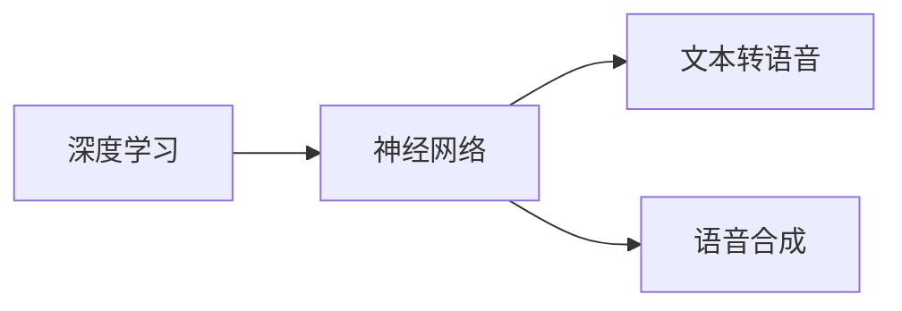

# Python深度学习实践：合成人类语言的语音合成技术

## 1. 背景介绍
随着人工智能技术的飞速发展，语音合成技术已经从单纯的文本转语音（TTS）发展到能够模拟人类情感和语调的高级合成。Python作为一种高效、易学的编程语言，已经成为深度学习实践的首选工具。本文将深入探讨如何利用Python和深度学习技术实现高质量的语音合成。

## 2. 核心概念与联系
在深入语音合成技术之前，我们需要理解几个核心概念及其相互之间的联系：

- **深度学习（Deep Learning）**：一种通过多层神经网络模拟人脑处理信息的机器学习技术。
- **神经网络（Neural Network）**：由大量节点（或称神经元）相互连接构成的计算模型，用于模拟复杂的非线性关系。
- **文本转语音（TTS）**：将文本信息转换为口语的技术。
- **语音合成（Speech Synthesis）**：创建人类语音的过程，不仅包括文本内容，还包括语调、节奏和情感。

这些概念之间的联系是，深度学习提供了强大的工具来训练神经网络，而神经网络是实现文本转语音和语音合成的基础。



## 3. 核心算法原理具体操作步骤
语音合成的核心算法原理可以分为以下几个步骤：

1. **文本分析**：将输入的文本转换为语音合成的内部表示，包括语言学分析和标准化。
2. **声学模型**：使用深度学习模型来预测语音的声学特征，如音高、时长等。
3. **声码器（Vocoder）**：将声学模型的输出转换为可听的波形。

## 4. 数学模型和公式详细讲解举例说明
以声学模型为例，我们通常使用长短期记忆网络（LSTM）或Transformer模型来预测声学特征。以下是LSTM的基本数学模型：

$$
\begin{align*}
f_t &= \sigma(W_f \cdot [h_{t-1}, x_t] + b_f) \\
i_t &= \sigma(W_i \cdot [h_{t-1}, x_t] + b_i) \\
\tilde{C}_t &= \tanh(W_C \cdot [h_{t-1}, x_t] + b_C) \\
C_t &= f_t * C_{t-1} + i_t * \tilde{C}_t \\
o_t &= \sigma(W_o \cdot [h_{t-1}, x_t] + b_o) \\
h_t &= o_t * \tanh(C_t)
\end{align*}
$$

其中，$f_t, i_t, o_t$ 分别是遗忘门、输入门和输出门的激活函数，$C_t$ 是细胞状态，$h_t$ 是隐藏状态，$x_t$ 是输入，$W$ 和 $b$ 是模型参数。

## 5. 项目实践：代码实例和详细解释说明
以下是一个简单的LSTM网络实现，用于声学模型的构建：

```python
import torch
import torch.nn as nn

class SpeechSynthesisModel(nn.Module):
    def __init__(self, input_dim, hidden_dim, output_dim):
        super(SpeechSynthesisModel, self).__init__()
        self.lstm = nn.LSTM(input_dim, hidden_dim, batch_first=True)
        self.fc = nn.Linear(hidden_dim, output_dim)

    def forward(self, x):
        output, (hidden, cell) = self.lstm(x)
        output = self.fc(output)
        return output

# 示例化模型
model = SpeechSynthesisModel(input_dim=100, hidden_dim=256, output_dim=80)
```

这段代码定义了一个简单的LSTM网络，用于从输入特征预测声学特征。

## 6. 实际应用场景
语音合成技术在多个领域都有广泛应用，包括：

- **虚拟助手**：如Siri、Alexa等。
- **导航系统**：为用户提供语音指引。
- **有声读物**：将文本书籍转换为语音形式。

## 7. 工具和资源推荐
- **TensorFlow** 和 **PyTorch**：两个主流的深度学习框架。
- **LibriTTS** 和 **LJSpeech**：常用的语音数据集。
- **NVIDIA Tacotron 2** 和 **WaveGlow**：高质量的TTS模型和声码器。

## 8. 总结：未来发展趋势与挑战
语音合成技术的未来发展趋势包括更自然的语音、跨语言模型和低资源语言的支持。挑战则包括提高合成语音的自然度和情感表达能力。

## 9. 附录：常见问题与解答
Q1: 语音合成的准确性如何提高？
A1: 通过更大的数据集、更深的模型和更细致的调参来提高。

Q2: 如何评估语音合成的质量？
A2: 通常通过主观听力测试和客观评价指标（如MOS）来评估。

作者：禅与计算机程序设计艺术 / Zen and the Art of Computer Programming