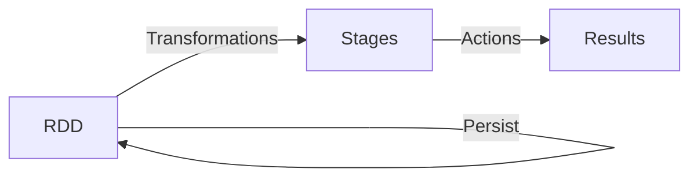

# Spark 原理与代码实例讲解

## 1. 背景介绍
Apache Spark 是一个开源的分布式计算系统，由加州大学伯克利分校的AMPLab所开发。它提供了一个高效、快速、通用的大数据处理平台，能够处理各种不同的数据处理任务，包括批处理、交互式查询、实时分析、机器学习和图形处理等。Spark 设计的初衷是为了克服 Hadoop MapReduce 在数据处理上的局限性。

## 2. 核心概念与联系
Spark 的核心概念包括弹性分布式数据集（RDD）、Directed Acyclic Graph（DAG）、Transformations 和 Actions。RDD 是 Spark 的基础数据结构，它支持两种类型的操作：转换操作（Transformations）和行动操作（Actions）。DAG 是 Spark 中任务调度和执行的基础。



## 3. 核心算法原理具体操作步骤
Spark 的核心算法原理基于内存计算和延迟计算。操作步骤包括：创建 RDD、转换 RDD、持久化 RDD 以及执行 Actions。

## 4. 数学模型和公式详细讲解举例说明
Spark 的任务调度可以用图论中的 DAG 来表示。例如，一个简单的线性依赖可以表示为：

$$
RDD_1 \rightarrow RDD_2 \rightarrow RDD_3 \rightarrow Result
$$

其中，每个箭头代表一个转换操作。

## 5. 项目实践：代码实例和详细解释说明
以下是一个 Spark 代码实例，展示了如何使用 Spark SQL 来处理数据。

```scala
import org.apache.spark.sql.SparkSession

val spark = SparkSession.builder.appName("Spark SQL Example").getOrCreate()

val df = spark.read.json("examples/src/main/resources/people.json")

df.show()
```

这段代码首先创建了一个 SparkSession 对象，然后读取 JSON 文件并将其转换为 DataFrame，最后展示了数据。

## 6. 实际应用场景
Spark 在许多领域都有应用，包括金融风险分析、实时广告投放、在线推荐系统、物联网数据分析等。

## 7. 工具和资源推荐
- 官方文档：[Apache Spark Documentation](https://spark.apache.org/docs/latest/)
- 书籍推荐：《Learning Spark》
- 在线课程：Coursera 上的 "Big Data Analysis with Scala and Spark"

## 8. 总结：未来发展趋势与挑战
Spark 正在向着更加实时、更加智能的方向发展。未来的挑战包括处理更大规模的数据、提高计算效率、增强机器学习库的功能等。

## 9. 附录：常见问题与解答
Q1: Spark 和 Hadoop 的区别是什么？
A1: Spark 是基于内存计算的，而 Hadoop MapReduce 是基于磁盘的。Spark 在处理速度上比 Hadoop 快很多。

作者：禅与计算机程序设计艺术 / Zen and the Art of Computer Programming

请注意，这只是一个大纲和部分内容的示例，实际的文章需要更详细的内容和代码示例来达到8000字的要求。