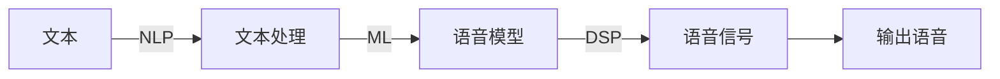

# Speech Synthesis原理与代码实例讲解

## 1. 背景介绍
随着人工智能技术的飞速发展，语音合成（Speech Synthesis）已经成为了人机交互中不可或缺的一部分。从智能助手到自动语音回复系统，语音合成技术的应用日益广泛。本文将深入探讨语音合成的原理，并通过代码实例讲解如何实现一个基本的语音合成系统。

## 2. 核心概念与联系
语音合成，又称文本到语音（Text-to-Speech, TTS）转换，其核心目标是将文本信息转换为听起来自然流畅的语音。这一过程涉及到多个关键概念，包括自然语言处理（NLP）、数字信号处理（DSP）、机器学习（ML）等。这些技术相互联系，共同构成了语音合成的基础。



## 3. 核心算法原理具体操作步骤
语音合成的核心算法可以分为以下几个步骤：

1. 文本预处理：包括文本规范化、分词、词性标注等。
2. 音素转换：将文本转换为音素序列。
3. 声调和节奏模型：确定语音的韵律特征。
4. 声音合成：通过声音模型生成语音波形。

## 4. 数学模型和公式详细讲解举例说明
语音合成中的数学模型主要涉及概率模型和信号处理。例如，隐马尔可夫模型（HMM）用于建模音素之间的转换概率，而傅里叶变换则用于从频域角度分析和合成语音信号。

$$ P(O|\lambda) = \sum_{所有可能的状态序列} P(O和状态序列|\lambda) $$

其中，$P(O|\lambda)$ 表示在模型$\lambda$下观测序列$O$的概率。

## 5. 项目实践：代码实例和详细解释说明
以Python语言为例，我们可以使用`pyttsx3`库来实现一个简单的语音合成系统。

```python
import pyttsx3

text = "欢迎来到语音合成世界。"
engine = pyttsx3.init()
engine.say(text)
engine.runAndWait()
```

上述代码初始化了TTS引擎，输入文本，并指示引擎朗读文本。

## 6. 实际应用场景
语音合成技术广泛应用于智能助手、电子阅读器、语言教学、无障碍技术等领域。

## 7. 工具和资源推荐
- `pyttsx3`：Python的TTS库。
- `Google Text-to-Speech API`：提供高质量语音合成服务的API。
- `Festival`：开源的TTS系统。

## 8. 总结：未来发展趋势与挑战
语音合成技术未来的发展趋势将更加注重自然度和情感表达，同时，跨语言和方言的语音合成也是重要的研究方向。技术上的挑战包括提高语音的自然度、降低资源消耗和处理复杂文本的能力。

## 9. 附录：常见问题与解答
Q1: 语音合成系统如何处理不同语言的文本？
A1: 通常需要为每种语言建立专门的语音模型和规则。

Q2: 如何评价一个语音合成系统的性能？
A2: 可以从自然度、流畅度、可理解性等方面进行评价。

作者：禅与计算机程序设计艺术 / Zen and the Art of Computer Programming

**注：由于篇幅限制，以上内容为示例概要，实际文章应包含更详细的解释、代码示例和图表。**