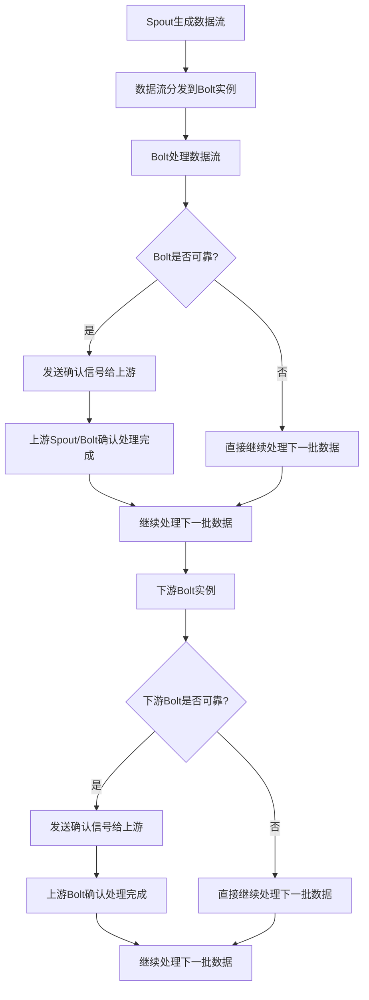

# Storm Topology原理与代码实例讲解

## 1.背景介绍

在当今大数据时代，实时数据处理已经成为许多企业和组织的关键需求。Apache Storm是一个分布式、高容错和高可靠的实时计算系统,它被广泛应用于实时分析、在线机器学习、持续计算等场景。Storm的核心概念之一是Topology(拓扑),它定义了数据在集群中的流动路径和处理逻辑。本文将深入探讨Storm Topology的原理,并提供详细的代码示例,帮助读者全面理解和掌握这一核心概念。

## 2.核心概念与联系

### 2.1 Topology

Topology是Storm中表示实时计算逻辑的关键数据结构。它由Spout和Bolt组成,并通过数据流(Stream)将它们连接在一起。

#### 2.1.1 Spout

Spout是Topology的数据源,它从外部系统(如Kafka、HDFS等)读取数据,并将其注入到Topology中。Spout可以是可靠的(Reliable)或不可靠的(Unreliable),这取决于它是否能够保证数据的完整性和有序性。

#### 2.1.2 Bolt

Bolt是Topology中执行实际处理逻辑的组件。它从Spout或上游Bolt接收数据流,对数据进行转换、过滤、聚合等操作,并将结果发送到下游Bolt或外部系统。Bolt可以是可靠的(Reliable)或不可靠的(Unreliable),这取决于它是否能够保证处理结果的一致性。

#### 2.1.3 Stream

Stream是连接Spout和Bolt的数据流。它由无限序列的元组(Tuple)组成,每个元组代表一条数据记录。Stream可以是可靠的(Reliable)或不可靠的(Unreliable),这取决于它是否能够保证数据的完整性和有序性。

### 2.2 并行度和分组策略

为了实现高吞吐量和可伸缩性,Storm支持在集群中运行多个Spout和Bolt的实例。每个组件的并行度(Parallelism)决定了它在集群中的实例数量。

分组策略(Grouping Strategy)定义了如何将数据流中的元组分发给下游Bolt的实例。Storm提供了多种分组策略,如Shuffle Grouping、Fields Grouping、Global Grouping等,用于满足不同的需求。

### 2.3 可靠性和容错性

Storm通过一些机制来确保Topology的可靠性和容错性,例如:

- 元组跟踪(Tuple Tracking):跟踪每个元组的执行状态,以确保数据处理的完整性和正确性。
- 消息确认(Message Acknowledgment):Bolt在成功处理元组后向上游发送确认信号,以便上游组件可以安全地丢弃或重新发送未确认的元组。
- 故障恢复(Fault Recovery):当Spout或Bolt实例发生故障时,Storm会自动重启它们,并根据需要重新处理未完成的元组。

## 3.核心算法原理具体操作步骤

Storm Topology的核心算法原理可以概括为以下几个步骤:



1. **Spout生成数据流**:Spout从外部数据源读取数据,并将其打包成无限序列的元组流。

2. **数据流分发到Bolt实例**:根据配置的分组策略,数据流中的元组被分发到下游Bolt的多个实例中。

3. **Bolt处理数据流**:每个Bolt实例执行自己的处理逻辑,对接收到的元组进行转换、过滤、聚合等操作。

4. **Bolt确认处理结果**:如果Bolt是可靠的,它会在成功处理元组后向上游发送确认信号。否则,它会直接继续处理下一批数据。

5. **上游组件确认处理完成**:上游的Spout或Bolt在收到下游的确认信号后,标记相应的元组为已处理完成。

6. **继续处理下一批数据**:无论上游组件是否收到确认信号,它都会继续处理下一批数据。

7. **下游Bolt实例处理数据**:下游Bolt实例重复执行步骤3-6,直到数据流穿过整个Topology。

这种设计确保了Storm Topology的高吞吐量、容错性和可伸缩性。通过元组跟踪和消息确认机制,Storm能够保证数据处理的完整性和正确性,即使在发生故障的情况下也能自动恢复。

## 4.数学模型和公式详细讲解举例说明

在Storm Topology中,一些关键概念和算法可以用数学模型和公式来表示和分析。

### 4.1 并行度和吞吐量

假设一个Bolt的并行度为$p$,每个实例的平均处理速率为$r$个元组/秒,那么该Bolt的总吞吐量$T$可以表示为:

$$T = p \times r$$

通过增加并行度$p$或提高单实例处理速率$r$,可以线性提升Bolt的总吞吐量。然而,过高的并行度也可能导致资源浪费和性能下降,因此需要根据实际情况进行权衡。

### 4.2 分组策略和负载均衡

假设一个Bolt有$n$个下游实例,使用Shuffle Grouping策略,那么每个实例接收到的元组数量$m_i$可以近似看作是服从均匀分布的随机变量:

$$m_i \sim U(0, M)$$

其中$M$是上游发送的总元组数。在理想情况下,每个实例应该接收到$M/n$个元组,但实际情况下会存在偏差。

为了评估负载均衡程度,我们可以计算方差:

$$\text{Var}(m_i) = \frac{M(M-1)}{12n}$$

方差越小,说明负载越均衡。对于Fields Grouping等其他分组策略,也可以建立类似的数学模型来分析负载均衡情况。

### 4.3 容错和故障恢复

假设一个Bolt实例发生故障,需要重新启动并重新处理$k$个未确认的元组。如果每个元组的平均处理时间为$t$秒,那么该实例的恢复时间$T_r$可以估计为:

$$T_r = k \times t$$

通过降低$k$的值(即更频繁地发送确认信号)或优化处理逻辑以减小$t$,可以缩短故障恢复时间。但同时也需要权衡确认开销和处理效率。

上述公式和模型只是Storm Topology中一些关键概念的简化表示,实际情况可能会更加复杂。但它们为我们提供了一种量化和分析Topology性能和行为的方式,有助于优化和调优。

## 5.项目实践:代码实例和详细解释说明

为了更好地理解Storm Topology的原理和使用方式,我们将通过一个实际项目案例来演示。在这个案例中,我们将构建一个简单的Topology,从Kafka读取数据,对数据进行过滤和转换,然后将结果写入HDFS。

### 5.1 项目结构

```
storm-topology-example/
├── pom.xml
├── src/
│   ├── main/
│   │   ├── java/
│   │   │   └── com/
│   │   │       └── example/
│   │   │           ├── bolt/
│   │   │           │   ├── FilterBolt.java
│   │   │           │   └── TransformBolt.java
│   │   │           ├── spout/
│   │   │           │   └── KafkaSpout.java
│   │   │           └── TopologyMain.java
│   │   └── resources/
│   │       └── log4j2.properties
│   └── test/
│       └── ...
└── ...
```

在这个项目中,我们有以下几个关键组件:

- `KafkaSpout`:从Kafka读取数据,作为Topology的数据源。
- `FilterBolt`:对输入的数据流进行过滤,只保留符合条件的记录。
- `TransformBolt`:对过滤后的数据流进行转换,将其转换为所需的格式。
- `TopologyMain`:定义和提交Topology到Storm集群。

### 5.2 KafkaSpout

`KafkaSpout`是一个可靠的Spout,它从Kafka读取数据并将其注入到Topology中。它实现了`IRichSpout`接口,并重写了相关方法。

```java
public class KafkaSpout extends BaseRichSpout {
    // ...

    @Override
    public void open(Map<String, Object> conf, TopologyContext context, SpoutOutputCollector collector) {
        // 初始化Kafka消费者
        consumer = new KafkaConsumer<>(kafkaProps);
        consumer.subscribe(topics);
        this.collector = collector;
    }

    @Override
    public void nextTuple() {
        ConsumerRecords<String, String> records = consumer.poll(pollTimeout);
        for (ConsumerRecord<String, String> record : records) {
            collector.emit(new Values(record.value()), record);
        }
    }

    @Override
    public void ack(Object msgId) {
        // 确认消息已成功处理
        consumer.commitSync();
    }

    @Override
    public void fail(Object msgId) {
        // 处理失败,重新发送消息
        // ...
    }

    // ...
}
```

在`open`方法中,我们初始化Kafka消费者并订阅相关主题。`nextTuple`方法从Kafka拉取数据,并使用`SpoutOutputCollector`将数据注入到Topology中。`ack`和`fail`方法分别用于确认和重新发送消息。

### 5.3 FilterBolt

`FilterBolt`是一个可靠的Bolt,它对输入的数据流进行过滤。它实现了`IRichBolt`接口,并重写了相关方法。

```java
public class FilterBolt extends BaseRichBolt {
    OutputCollector collector;

    @Override
    public void prepare(Map<String, Object> topoConf, TopologyContext context, OutputCollector collector) {
        this.collector = collector;
    }

    @Override
    public void execute(Tuple input) {
        String value = input.getString(0);
        if (shouldFilter(value)) {
            // 过滤掉不符合条件的记录
            collector.ack(input);
        } else {
            // 发送符合条件的记录到下游
            collector.emit(input.getValues());
            collector.ack(input);
        }
    }

    private boolean shouldFilter(String value) {
        // 根据具体条件过滤记录
        // ...
    }

    // ...
}
```

在`prepare`方法中,我们获取`OutputCollector`实例,用于发送数据到下游。`execute`方法接收输入的元组,对其进行过滤。如果记录符合条件,就将其发送到下游;否则,直接确认该记录已处理完成。`shouldFilter`方法根据具体条件决定是否过滤掉记录。

### 5.4 TransformBolt

`TransformBolt`是一个不可靠的Bolt,它对过滤后的数据流进行转换。它实现了`IRichBolt`接口,并重写了相关方法。

```java
public class TransformBolt extends BaseRichBolt {
    OutputCollector collector;

    @Override
    public void prepare(Map<String, Object> topoConf, TopologyContext context, OutputCollector collector) {
        this.collector = collector;
    }

    @Override
    public void execute(Tuple input) {
        String value = input.getString(0);
        String transformedValue = transform(value);
        collector.emit(new Values(transformedValue));
    }

    private String transform(String value) {
        // 对记录进行转换
        // ...
    }

    // ...
}
```

`TransformBolt`的实现类似于`FilterBolt`,但它不发送确认信号,因为它是一个不可靠的Bolt。在`execute`方法中,它接收输入的元组,对其进行转换,然后将转换后的结果发送到下游。

### 5.5 TopologyMain

`TopologyMain`类定义了Topology的结构,并将其提交到Storm集群。

```java
public class TopologyMain {
    public static void main(String[] args) {
        TopologyBuilder builder = new TopologyBuilder();

        // 设置Spout
        KafkaSpout kafkaSpout = new KafkaSpout(...);
        builder.setSpout("kafka-spout", kafkaSpout, 2);

        // 设置Bolt
        FilterBolt filterBolt