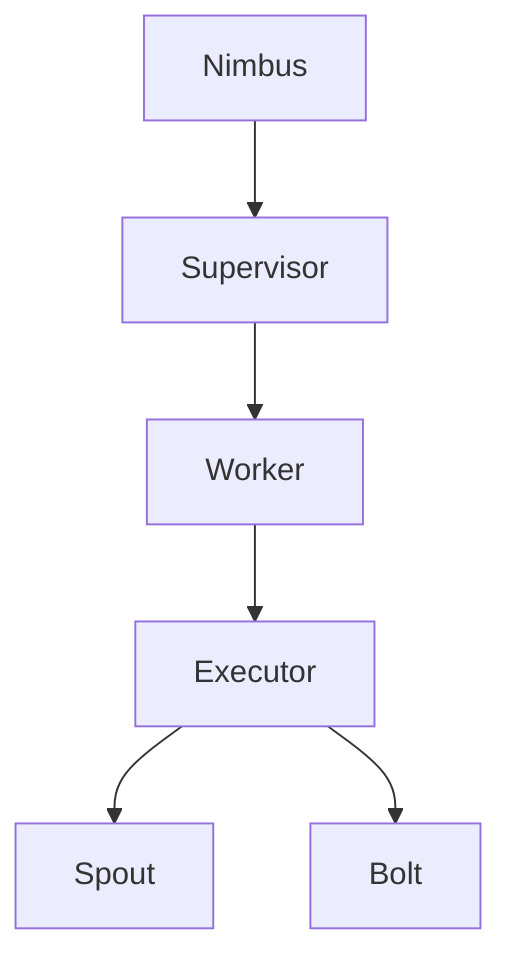

# Storm原理与代码实例讲解

## 1.背景介绍

在大数据时代，实时数据处理变得越来越重要。Apache Storm作为一个分布式实时计算系统，能够处理大量的数据流，并且具有高容错性和低延迟的特点。Storm的出现填补了批处理系统（如Hadoop）和实时处理系统之间的空白，使得实时数据处理变得更加高效和可扩展。

Storm最初由Twitter开源，现已成为Apache基金会的顶级项目。它的设计理念是简单、可扩展和容错，适用于各种实时数据处理场景，如实时分析、在线机器学习、持续计算等。

## 2.核心概念与联系

在深入探讨Storm的原理和实现之前，我们需要了解一些核心概念：

### 2.1 拓扑（Topology）

拓扑是Storm中的一个基本概念，它定义了数据流的处理逻辑。一个拓扑由多个Spout和Bolt组成，Spout负责数据的产生，Bolt负责数据的处理。拓扑一旦提交到Storm集群中，就会一直运行，直到被手动停止。

### 2.2 Spout

Spout是数据流的源头，负责从外部数据源读取数据并将其发送到拓扑中。Spout可以是可靠的（ack机制）或不可靠的，具体取决于应用场景的需求。

### 2.3 Bolt

Bolt是数据处理的核心组件，负责接收Spout或其他Bolt发送的数据，并进行相应的处理。Bolt可以执行各种操作，如过滤、聚合、连接等。

### 2.4 Stream

Stream是Storm中的数据流，表示一系列连续的数据。Stream由多个Tuple组成，每个Tuple是一个有序的键值对集合。

### 2.5 Tuple

Tuple是Storm中的基本数据单元，类似于数据库中的行。Tuple可以包含任意数量的字段，每个字段都有一个名称和一个值。

### 2.6 Worker和Executor

Worker是Storm集群中的一个JVM进程，负责执行拓扑中的任务。Executor是Worker中的一个线程，负责执行具体的Spout或Bolt。

### 2.7 Nimbus和Supervisor

Nimbus是Storm集群的主节点，负责管理和调度拓扑。Supervisor是从节点，负责启动和停止Worker进程。

以下是Storm核心组件的关系图：



## 3.核心算法原理具体操作步骤

Storm的核心算法主要包括数据流的调度、任务的分配和容错机制。以下是具体的操作步骤：

### 3.1 数据流的调度

数据流的调度是指如何将数据从Spout传递到Bolt，并在Bolt之间传递。Storm使用Stream Grouping来实现数据流的调度，常见的Grouping方式有：

- Shuffle Grouping：随机分配数据到下游Bolt，保证负载均衡。
- Fields Grouping：根据指定字段的值进行分组，相同值的数据会被分配到同一个Bolt。
- All Grouping：将数据复制到所有下游Bolt。
- Global Grouping：将数据分配到一个Bolt中。
- Direct Grouping：由上游Bolt指定下游Bolt。

### 3.2 任务的分配

任务的分配是指如何将拓扑中的Spout和Bolt分配到集群中的Worker和Executor。Storm使用Nimbus进行任务的分配，具体步骤如下：

1. Nimbus接收到提交的拓扑。
2. Nimbus根据拓扑的配置和集群的资源情况，计算出每个Spout和Bolt的并行度。
3. Nimbus将计算结果发送给Supervisor。
4. Supervisor启动相应数量的Worker进程。
5. Worker进程启动Executor线程，执行具体的Spout和Bolt。

### 3.3 容错机制

Storm的容错机制主要包括任务的重试和状态的恢复。具体步骤如下：

1. 当一个Tuple被处理失败时，Storm会将其标记为失败，并将其重新发送到Spout。
2. Spout接收到失败的Tuple后，会重新发送该Tuple。
3. 如果一个Tuple在指定时间内没有被处理完毕，Storm会将其标记为超时，并进行重试。
4. Storm使用Zookeeper来存储拓扑的状态信息，当Nimbus或Supervisor重启时，可以从Zookeeper中恢复状态。

## 4.数学模型和公式详细讲解举例说明

Storm的核心算法可以用数学模型来描述。以下是一些关键的数学公式和模型：

### 4.1 数据流模型

数据流可以表示为一个有向无环图（DAG），其中节点表示Spout或Bolt，边表示数据流的方向。设 $G = (V, E)$ 为数据流图，其中 $V$ 表示节点集合，$E$ 表示边集合。

### 4.2 任务分配模型

任务分配可以表示为一个二分图匹配问题。设 $T = \{t_1, t_2, \ldots, t_n\}$ 为任务集合，$W = \{w_1, w_2, \ldots, w_m\}$ 为Worker集合。任务分配的目标是找到一个匹配 $M \subseteq T \times W$，使得每个任务都被分配到一个Worker，并且满足资源约束。

### 4.3 容错模型

容错模型可以表示为一个马尔可夫链。设 $S = \{s_0, s_1, \ldots, s_k\}$ 为状态集合，$P = (p_{ij})$ 为状态转移矩阵，其中 $p_{ij}$ 表示从状态 $s_i$ 转移到状态 $s_j$ 的概率。容错机制的目标是最小化系统的平均故障恢复时间。

### 4.4 公式示例

假设一个简单的拓扑包含一个Spout和两个Bolt，数据流的调度方式为Shuffle Grouping。设 $r_s$ 为Spout的速率，$r_{b1}$ 和 $r_{b2}$ 为两个Bolt的处理速率。则系统的吞吐量可以表示为：

$$
\text{Throughput} = \min(r_s, r_{b1}, r_{b2})
$$

## 5.项目实践：代码实例和详细解释说明

为了更好地理解Storm的工作原理，我们通过一个简单的代码实例来演示如何使用Storm进行实时数据处理。以下是一个简单的WordCount拓扑的实现：

### 5.1 环境准备

首先，确保已经安装了Java和Maven，并下载了Storm的二进制包。

### 5.2 代码实现

以下是WordCount拓扑的代码实现：

```java
import org.apache.storm.Config;
import org.apache.storm.LocalCluster;
import org.apache.storm.topology.TopologyBuilder;
import org.apache.storm.tuple.Fields;
import org.apache.storm.tuple.Values;
import org.apache.storm.spout.SpoutOutputCollector;
import org.apache.storm.spout.ISpout;
import org.apache.storm.task.OutputCollector;
import org.apache.storm.task.TopologyContext;
import org.apache.storm.topology.IRichBolt;
import org.apache.storm.topology.OutputFieldsDeclarer;
import org.apache.storm.topology.base.BaseRichSpout;
import org.apache.storm.topology.base.BaseRichBolt;

import java.util.Map;
import java.util.Random;

public class WordCountTopology {

    public static class RandomSentenceSpout extends BaseRichSpout {
        private SpoutOutputCollector collector;
        private Random random;

        @Override
        public void open(Map conf, TopologyContext context, SpoutOutputCollector collector) {
            this.collector = collector;
            this.random = new Random();
        }

        @Override
        public void nextTuple() {
            String[] sentences = new String[]{
                "the cow jumped over the moon",
                "an apple a day keeps the doctor away",
                "four score and seven years ago",
                "snow white and the seven dwarfs",
                "i am at two with nature"
            };
            String sentence = sentences[random.nextInt(sentences.length)];
            collector.emit(new Values(sentence));
        }

        @Override
        public void declareOutputFields(OutputFieldsDeclarer declarer) {
            declarer.declare(new Fields("sentence"));
        }
    }

    public static class SplitSentenceBolt extends BaseRichBolt {
        private OutputCollector collector;

        @Override
        public void prepare(Map conf, TopologyContext context, OutputCollector collector) {
            this.collector = collector;
        }

        @Override
        public void execute(org.apache.storm.tuple.Tuple tuple) {
            String sentence = tuple.getStringByField("sentence");
            String[] words = sentence.split(" ");
            for (String word : words) {
                collector.emit(new Values(word));
            }
        }

        @Override
        public void declareOutputFields(OutputFieldsDeclarer declarer) {
            declarer.declare(new Fields("word"));
        }
    }

    public static class WordCountBolt extends BaseRichBolt {
        private OutputCollector collector;
        private Map<String, Integer> counts;

        @Override
        public void prepare(Map conf, TopologyContext context, OutputCollector collector) {
            this.collector = collector;
            this.counts = new HashMap<>();
        }

        @Override
        public void execute(org.apache.storm.tuple.Tuple tuple) {
            String word = tuple.getStringByField("word");
            Integer count = counts.get(word);
            if (count == null) {
                count = 0;
            }
            count++;
            counts.put(word, count);
            collector.emit(new Values(word, count));
        }

        @Override
        public void declareOutputFields(OutputFieldsDeclarer declarer) {
            declarer.declare(new Fields("word", "count"));
        }
    }

    public static void main(String[] args) {
        TopologyBuilder builder = new TopologyBuilder();
        builder.setSpout("spout", new RandomSentenceSpout(), 1);
        builder.setBolt("split", new SplitSentenceBolt(), 2).shuffleGrouping("spout");
        builder.setBolt("count", new WordCountBolt(), 2).fieldsGrouping("split", new Fields("word"));

        Config conf = new Config();
        conf.setDebug(true);

        LocalCluster cluster = new LocalCluster();
        cluster.submitTopology("word-count", conf, builder.createTopology());

        try {
            Thread.sleep(10000);
        } catch (InterruptedException e) {
            e.printStackTrace();
        }

        cluster.shutdown();
    }
}
```

### 5.3 代码解释

- `RandomSentenceSpout`：生成随机句子并发送到拓扑中。
- `SplitSentenceBolt`：将句子拆分成单词并发送到下游Bolt。
- `WordCountBolt`：统计每个单词的出现次数并输出结果。

### 5.4 运行拓扑

将上述代码保存为`WordCountTopology.java`，使用Maven进行编译和运行：

```bash
mvn clean package
java -cp target/your-jar-file.jar WordCountTopology
```

## 6.实际应用场景

Storm在实际应用中有广泛的应用场景，以下是一些典型的应用场景：

### 6.1 实时数据分析

Storm可以用于实时数据分析，如实时日志分析、实时点击流分析等。通过将数据流实时传输到Storm拓扑中，可以实现对数据的实时处理和分析。

### 6.2 在线机器学习

Storm可以用于在线机器学习，如实时推荐系统、实时分类等。通过将数据流实时传输到Storm拓扑中，可以实现对数据的实时训练和预测。

### 6.3 持续计算

Storm可以用于持续计算，如实时监控、实时报警等。通过将数据流实时传输到Storm拓扑中，可以实现对数据的实时计算和处理。

## 7.工具和资源推荐

以下是一些常用的工具和资源，帮助你更好地使用Storm：

### 7.1 开发工具

- IntelliJ IDEA：一款强大的Java开发工具，支持Storm的开发和调试。
- Maven：一个项目管理和构建工具，支持Storm项目的依赖管理和构建。

### 7.2 资源推荐

- [Storm官网](https://storm.apache.org/): 提供了Storm的官方文档和教程。
- [Storm GitHub仓库](https://github.com/apache/storm): 提供了Storm的源码和示例代码。
- [Storm用户社区](https://storm.apache.org/community.html): 提供了Storm的用户交流和支持。

## 8.总结：未来发展趋势与挑战

Storm作为一个分布式实时计算系统，已经在大数据领域得到了广泛的应用。未来，随着数据量的不断增长和实时处理需求的不断增加，Storm将面临更多的挑战和机遇。

### 8.1 发展趋势

- 更高的性能：未来Storm将进一步优化性能，提高数据处理的吞吐量和低延迟。
- 更好的容错性：未来Storm将进一步增强容错机制，提高系统的可靠性和稳定性。
- 更强的扩展性：未来Storm将进一步增强扩展性，支持更大规模的数据处理和更多的应用场景。

### 8.2 挑战

- 数据一致性：在分布式系统中，保证数据的一致性是一个重要的挑战。未来Storm需要进一步优化数据一致性机制，确保数据处理的准确性。
- 资源管理：在大规模数据处理场景中，如何高效地管理和调度资源是一个重要的挑战。未来Storm需要进一步优化资源管理机制，提高资源的利用率。

## 9.附录：常见问题与解答

### 9.1 如何处理数据丢失问题？

Storm提供了可靠的消息处理机制，通过ack机制可以确保数据不会丢失。如果一个Tuple在处理过程中失败，Storm会将其重新发送到Spout进行重试。

### 9.2 如何提高数据处理的性能？

可以通过增加Spout和Bolt的并行度来提高数据处理的性能。此外，可以使用更高效的算法和数据结构来优化数据处理的逻辑。

### 9.3 如何监控Storm集群的运行状态？

可以使用Storm自带的UI界面来监控集群的运行状态。此外，可以使用第三方监控工具，如Prometheus和Grafana，来监控集群的性能指标。

### 9.4 如何处理数据的有序性问题？

可以使用Fields Grouping来保证数据的有序性。通过指定字段进行分组，可以确保相同字段的数据被分配到同一个Bolt中，从而保证数据的有序性。

### 9.5 如何进行故障恢复？

Storm使用Zookeeper来存储拓扑的状态信息，当Nimbus或Supervisor重启时，可以从Zookeeper中恢复状态。此外，可以使用Storm的容错机制，通过重试机制来进行故障恢复。

---

作者：禅与计算机程序设计艺术 / Zen and the Art of Computer Programming