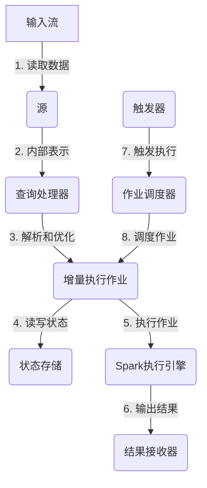

# Structured Streaming原理与代码实例讲解

## 1.背景介绍

### 1.1 大数据流处理的需求

在当今数据爆炸式增长的时代,传统的批量处理数据的方式已经无法满足实时数据处理的需求。越来越多的应用场景需要实时地从不断产生的数据流中提取有价值的信息,并根据这些信息及时作出反应。例如,网络安全监控需要实时检测恶意流量;物联网设备需要实时处理传感器数据并作出响应;电子商务网站需要实时分析用户行为数据以提供个性化推荐等。

### 1.2 流处理系统的演进

为了满足这种实时数据处理的需求,流处理系统应运而生。最初的流处理系统如Apache Storm和Apache Spark Streaming采用了微批处理的架构,将流数据切分成小批次进行处理。虽然这种方式可以提供近乎实时的处理能力,但它存在一些固有的缺陷,如处理延迟、数据丢失的风险以及代码复杂性等。

随着需求的不断演进,Apache Spark推出了全新的Structured Streaming引擎,旨在提供一种更加高效、可靠和易于使用的流处理解决方案。

## 2.核心概念与联系

### 2.1 Structured Streaming概念

Apache Spark Structured Streaming是Spark 2.0版本引入的一种新型流处理引擎,它将流数据视为一种不断追加的表(Unbounded Table)。与传统的微批处理架构不同,Structured Streaming采用了增量执行的方式,能够在数据到达时立即进行处理,从而实现低延迟和端到端的exactlyonce语义。

### 2.2 核心概念

Structured Streaming的核心概念包括:

- **输入流(Input Stream)**: 持续不断产生的数据流,可以来自各种数据源,如Kafka、文件系统等。
- **结果表(Result Table)**: 流处理的最终输出,表示经过处理后的数据集。
- **查询(Query)**: 定义了从输入流到结果表的转换逻辑,类似于批处理中的作业(Job)。
- **触发器(Trigger)**: 控制查询的执行时机,可以是基于时间间隔或数据条目数量的触发方式。
- **检查点(Checkpoint)**: 用于容错和状态管理,将中间结果持久化以便故障恢复。

### 2.3 Structured Streaming与批处理的关系

Structured Streaming的设计理念是将流处理视为一种增量的批处理,因此它与Spark的批处理引擎紧密相关。事实上,Structured Streaming查询在内部被转换为一系列的增量执行作业,每个作业都会读取自上次检查点以来的新数据,并根据查询逻辑进行处理。这种设计使得Structured Streaming可以无缝地与Spark的批处理API集成,并且能够充分利用Spark的优化器和执行引擎。

## 3.核心算法原理具体操作步骤

### 3.1 Structured Streaming执行流程

Structured Streaming的执行流程可以概括为以下几个步骤:

1. **创建输入流**: 从数据源(如Kafka、文件系统等)创建一个输入流。
2. **定义流查询**: 使用Dataset/DataFrame API定义从输入流到结果表的转换逻辑。
3. **设置查询输出模式**: 指定查询输出的模式,如完整模式(Append)或更新模式(Update)。
4. **启动流查询**: 启动查询并指定触发器,查询将持续运行直到被手动停止。
5. **增量执行**: 每当触发器被激活时,Structured Streaming就会读取自上次检查点以来的新数据,并根据查询逻辑进行增量执行。
6. **输出结果**: 将处理后的结果输出到外部数据接收器(如文件系统、Kafka等)或内存中。
7. **检查点管理**: 定期将中间状态保存到检查点,以实现容错和状态管理。

### 3.2 Structured Streaming内部架构

Structured Streaming的内部架构由以下几个关键组件组成:

1. **源(Source)**: 负责从外部数据源读取数据,并将其转换为Spark的内部表示(如RDD或DataFrame)。
2. **查询处理器(Query Processor)**: 负责解析和优化查询逻辑,并将其转换为一系列的增量执行作业。
3. **状态存储(State Store)**: 用于存储中间状态和检查点信息,通常使用外部存储系统(如HDFS)来实现容错和故障恢复。
4. **作业调度器(Job Scheduler)**: 负责根据触发器的条件安排和执行增量作业。
5. **结果接收器(Sink)**: 将处理后的结果输出到外部数据接收器或内存中。

这些组件协同工作,形成了Structured Streaming的端到端数据处理管道。



上图展示了Structured Streaming的核心执行流程。输入流数据首先被源组件读取并转换为Spark内部表示,然后由查询处理器解析和优化查询逻辑,生成一系列的增量执行作业。这些作业会读写状态存储以实现容错和状态管理,并由Spark执行引擎执行。最终,处理后的结果会被输出到结果接收器。整个过程由触发器和作业调度器协调控制。

## 4.数学模型和公式详细讲解举例说明

在Structured Streaming中,输入流被视为一种无边界的追加只读表(Unbounded Append-Only Table)。我们可以使用关系代数来形式化地描述这种表的语义。

假设我们有一个输入流$S$,它是一个无边界的追加只读表,其中每一行代表一个数据记录。在时间$t$,表$S$包含了从流开始到时间$t$为止的所有记录,记作$S(t)$。我们可以将$S$看作是一个随时间变化的表的序列,即:

$$S = [S(0), S(1), S(2), \dots, S(t), \dots]$$

其中,$S(0)$是一个空表,而$S(t+1)$是通过将新到达的记录追加到$S(t)$而得到的。

现在,假设我们有一个流查询$Q$,它将输入流$S$转换为结果表$R$。我们可以将$Q$看作是一个无状态的关系转换操作符,即:

$$R(t) = Q(S(t))$$

这意味着在时间$t$,结果表$R(t)$是通过将查询$Q$应用于输入流$S$的前缀$S(t)$而得到的。

然而,在实际情况中,查询$Q$通常会维护一些内部状态,例如用于连接或会话窗口的状态。我们可以将这种有状态的查询$Q$看作是一个状态转换函数,它将输入流$S$的前缀和当前状态$\sigma$映射为结果表$R$和新的状态$\sigma'$:

$$\begin{align*}
(R(t), \sigma'(t)) &= Q(S(t), \sigma(t-1))\\
\sigma(0) &= \sigma_0
\end{align*}$$

其中,$\sigma_0$是初始状态。

在Structured Streaming中,状态$\sigma$通常被持久化到检查点中,以实现容错和故障恢复。当发生故障时,查询可以从最近的检查点恢复执行,而不会丢失任何已处理的记录。

此外,Structured Streaming还支持多种输出模式,如Append模式和Update模式。在Append模式下,结果表$R$只包含新输出的记录;而在Update模式下,结果表$R$包含了所有当前有效的记录,旧记录会被新记录覆盖。这种语义可以通过适当地定义查询$Q$来实现。

通过将流处理建模为增量的关系转换,Structured Streaming能够在保证exactlyonce语义的同时,实现低延迟和高吞吐量的流处理。这种设计也使得Structured Streaming能够无缝地集成Spark的批处理API和优化器,从而提供了一致的编程模型和性能优化。

## 5.项目实践:代码实例和详细解释说明

为了更好地理解Structured Streaming的使用方式,我们将通过一个实际项目案例来演示如何使用Structured Streaming进行流处理。在这个案例中,我们将从Kafka主题读取实时日志数据,对日志进行解析和统计,并将结果输出到控制台。

### 5.1 项目设置

首先,我们需要导入必要的依赖项和创建SparkSession:

```scala
// Spark版本为3.2.1
import org.apache.spark.sql.functions._
import org.apache.spark.sql.streaming.Trigger
import org.apache.spark.sql.types._

val spark = SparkSession
  .builder()
  .appName("StructuredStreamingExample")
  .getOrCreate()

import spark.implicits._
```

### 5.2 定义输入流

我们将从Kafka主题"logs"读取日志数据,并将其定义为一个输入流:

```scala
val kafkaSourceDF = spark
  .readStream
  .format("kafka")
  .option("kafka.bootstrap.servers", "localhost:9092")
  .option("subscribe", "logs")
  .load()

val logDataDF = kafkaSourceDF.selectExpr("CAST(value AS STRING)")
```

这里,我们使用`spark.readStream`创建了一个来自Kafka的输入流,并通过`selectExpr`将Kafka消息的值转换为字符串。

### 5.3 解析日志数据

接下来,我们需要解析日志数据的格式。假设日志数据的格式为`"[LEVEL] message"`(例如`"[INFO] Starting server"`),我们可以使用正则表达式来提取日志级别和消息内容:

```scala
import org.apache.spark.sql.functions.regexp_extract

val logData = logDataDF
  .select(
    regexp_extract($"value", """^\[(.+)]\s+(.+)""", 2).alias("level"),
    regexp_extract($"value", """^\[(.+)]\s+(.+)""", 1).alias("message")
  )
```

这里,我们使用`regexp_extract`函数来提取日志级别和消息内容,并将它们分别命名为`level`和`message`列。

### 5.4 统计日志级别

现在,我们可以对解析后的日志数据进行统计,例如计算每个日志级别的消息数量:

```scala
val logStats = logData
  .groupBy($"level")
  .count()
  .orderBy($"count".desc)
```

这里,我们使用`groupBy`和`count`对日志级别进行分组统计,并使用`orderBy`对结果进行排序。

### 5.5 启动流查询

最后,我们可以启动流查询并将结果输出到控制台:

```scala
val query = logStats
  .writeStream
  .outputMode("complete")
  .format("console")
  .trigger(Trigger.ProcessingTime("10 seconds"))
  .start()

query.awaitTermination()
```

在这个例子中,我们使用`writeStream`启动了一个流查询,并指定了输出模式为`complete`(表示每次触发时输出完整的结果集)。我们还设置了输出格式为`console`,并使用`trigger`指定了一个基于处理时间的触发器(每10秒触发一次)。

`query.awaitTermination()`会使当前线程一直等待,直到流查询被手动停止。在实际应用中,您可以使用`query.stop()`来停止查询。

运行这个示例后,您应该能够在控制台中看到类似如下的输出:

```
-------------------------------------------
Batch: 0
-------------------------------------------
+-----+-----+
|level|count|
+-----+-----+
|ERROR|    3|
| WARN|   15|
| INFO|   82|
+-----+-----+

-------------------------------------------
Batch: 1
-------------------------------------------
+-----+-----+
|level|count|
+-----+-----+
|ERROR|    3|
| WARN|   18|
| INFO|   92|
+-----+-----+
```

这个输出显示了每个批次中不同日志级别的消息数量。

通过这个示例,我们可以看到使用Structured Streaming进行流处理是多么简单和高效。无论是从外部源读取数据、转换和处理数据,还是将结果输出到外部接收器,Structured Streaming都提供了一致的API和优秀的性能。

## 6.实际应用场景

Structured Streaming由于其低延迟、exactlyonce语