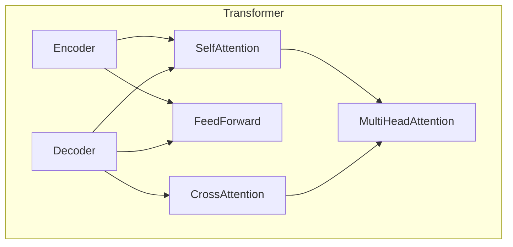
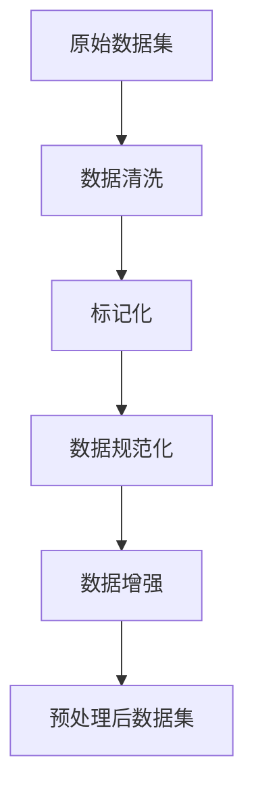
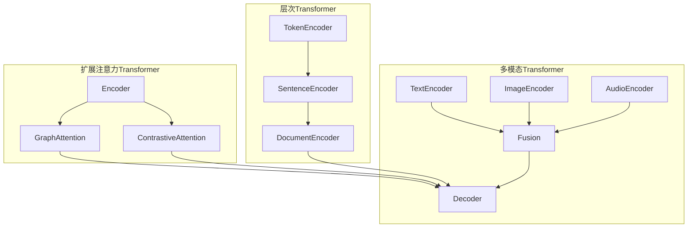
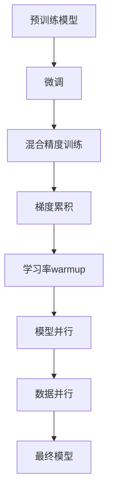

# Transformer大模型实战 用更多的数据集进行训练

## 1.背景介绍

随着人工智能技术的不断发展,Transformer模型在自然语言处理(NLP)、计算机视觉(CV)等领域取得了卓越的成就。作为一种基于注意力机制的神经网络架构,Transformer模型能够有效地捕捉输入序列中长距离依赖关系,从而提高模型的性能。然而,训练高质量的Transformer大模型需要大量的计算资源和海量的数据集,这对于许多研究机构和企业来说是一个巨大的挑战。

通过利用更多的数据集进行训练,我们可以显著提高Transformer大模型的性能和泛化能力。这不仅有助于模型在特定领域取得更好的结果,还能促进模型在跨领域任务中的应用。本文将探讨如何利用多种数据集训练Transformer大模型,包括数据预处理、模型架构调整、训练策略优化等关键步骤。

## 2.核心概念与联系

### 2.1 Transformer模型架构

Transformer模型是一种基于自注意力(Self-Attention)机制的序列到序列(Seq2Seq)模型,主要由编码器(Encoder)和解码器(Decoder)两个部分组成。编码器负责将输入序列编码为高维向量表示,而解码器则根据编码器的输出和目标序列生成预测结果。

Transformer模型的核心创新在于引入了多头自注意力机制,它允许模型同时关注输入序列中的不同位置,从而更好地捕捉长距离依赖关系。此外,Transformer还采用了位置编码(Positional Encoding)来注入序列的位置信息,以及层归一化(Layer Normalization)和残差连接(Residual Connection)来加速训练过程。



### 2.2 数据集的重要性

训练高质量的Transformer大模型需要大量的数据集。数据集不仅决定了模型的性能上限,还影响着模型的泛化能力。通常情况下,使用更多的数据集进行训练可以提高模型的性能,但同时也会增加计算资源的需求和训练时间。

为了充分利用现有的数据资源,我们需要合理地组合和利用多种数据集。这不仅可以扩大模型的知识覆盖面,还能促进模型在不同领域和任务之间的知识迁移,从而提高模型的泛化能力。

## 3.核心算法原理具体操作步骤

### 3.1 数据预处理

在训练Transformer大模型之前,需要对数据集进行适当的预处理,以确保数据的质量和一致性。常见的预处理步骤包括:

1. **数据清洗**: 去除数据集中的噪音、错误和重复数据。
2. **标记化(Tokenization)**: 将文本数据转换为模型可以理解的token序列。
3. **数据规范化**: 对数值型数据进行归一化或标准化处理,以减小不同特征之间的量级差异。
4. **数据增强**: 通过一些技术(如随机遮挡、同义词替换等)生成更多的训练数据,以增强模型的泛化能力。



### 3.2 模型架构调整

为了充分利用多种数据集,我们需要对Transformer模型的架构进行适当的调整,以适应不同类型的数据。常见的调整策略包括:

1. **多模态输入**: 对于包含文本、图像、音频等多模态数据的数据集,可以设计相应的编码器模块,将不同模态的数据编码为统一的向量表示。
2. **层次编码器**: 对于层次结构数据(如网页、XML文档等),可以设计层次编码器,分别编码不同层次的信息。
3. **注意力机制扩展**: 根据任务的特点,可以扩展注意力机制,如引入图注意力(Graph Attention)、对比注意力(Contrastive Attention)等。



### 3.3 训练策略优化

在训练Transformer大模型时,我们需要采用一些优化策略,以提高训练效率和模型性能。常见的优化策略包括:

1. **预训练与微调**: 首先在大型通用数据集上预训练模型,获得良好的初始化参数,然后在特定任务数据集上进行微调,以提高模型性能。
2. **混合精度训练**: 利用半精度(FP16)或更低精度(INT8)进行训练,可以减少内存占用,加速计算速度。
3. **梯度累积**: 将多个小批次的梯度累积起来,等效于使用更大的批次大小进行训练,可以提高训练稳定性。
4. **学习率warmup**: 在训练初期使用较小的学习率,逐渐增大到合适的水平,有助于模型收敛。
5. **模型并行与数据并行**: 在多个GPU或TPU上并行训练模型,可以加速训练过程。



## 4.数学模型和公式详细讲解举例说明

### 4.1 自注意力机制

自注意力机制是Transformer模型的核心部分,它允许模型同时关注输入序列中的不同位置,从而更好地捕捉长距离依赖关系。给定一个输入序列 $X = (x_1, x_2, \dots, x_n)$,自注意力机制首先计算查询(Query)、键(Key)和值(Value)向量:

$$
Q = XW^Q, K = XW^K, V = XW^V
$$

其中 $W^Q, W^K, W^V$ 分别表示查询、键和值的权重矩阵。然后,计算注意力分数:

$$
\text{Attention}(Q, K, V) = \text{softmax}\left(\frac{QK^T}{\sqrt{d_k}}\right)V
$$

其中 $d_k$ 是缩放因子,用于防止内积过大导致梯度消失或爆炸。多头自注意力机制是通过将查询、键和值投影到不同的子空间,并独立计算注意力,最后将结果拼接起来得到:

$$
\text{MultiHead}(Q, K, V) = \text{Concat}(head_1, \dots, head_h)W^O
$$

$$
\text{where } head_i = \text{Attention}(QW_i^Q, KW_i^K, VW_i^V)
$$

这种机制可以让模型同时关注不同的子空间,提高了模型的表示能力。

### 4.2 位置编码

由于Transformer模型没有像RNN那样的递归结构,无法直接捕捉序列的位置信息。因此,Transformer引入了位置编码(Positional Encoding)来注入位置信息。对于序列中的第 $i$ 个位置,其位置编码定义为:

$$
PE_{(pos, 2i)} = \sin\left(\frac{pos}{10000^{2i/d_\text{model}}}\right)
$$

$$
PE_{(pos, 2i+1)} = \cos\left(\frac{pos}{10000^{2i/d_\text{model}}}\right)
$$

其中 $pos$ 表示位置索引,而 $d_\text{model}$ 是模型的embedding维度。位置编码与输入embedding相加,作为Transformer的输入。这种编码方式可以让模型自动学习到序列的位置信息。

## 5.项目实践:代码实例和详细解释说明

在本节中,我们将通过一个实际的代码示例,演示如何利用多种数据集训练Transformer大模型。我们将使用PyTorch框架,并基于HuggingFace的Transformers库进行开发。

### 5.1 数据准备

首先,我们需要准备多种数据集,并将它们转换为统一的格式。以下是一个示例代码,展示了如何加载和预处理两个不同领域的数据集:

```python
from datasets import load_dataset

# 加载数据集
dataset1 = load_dataset("squad", "v2") # 问答数据集
dataset2 = load_dataset("multi_nli") # 自然语言推理数据集

# 预处理数据集
def preprocess_function(examples):
    # 对数据进行标记化、截断、填充等预处理操作
    ...
    return tokenized_examples

tokenizer = AutoTokenizer.from_pretrained("bert-base-uncased")
dataset1 = dataset1.map(preprocess_function, batched=True)
dataset2 = dataset2.map(preprocess_function, batched=True)
```

### 5.2 模型定义

接下来,我们定义Transformer模型的架构。为了适应多种数据集,我们将使用一个通用的编码器-解码器结构,并根据需要进行扩展。以下是一个基本的Transformer模型定义:

```python
from transformers import BertConfig, BertModel, BertForSequenceClassification

# 定义配置
config = BertConfig(
    vocab_size=tokenizer.vocab_size,
    max_position_embeddings=512,
    num_attention_heads=12,
    num_hidden_layers=12,
    type_vocab_size=2,
)

# 定义编码器
encoder = BertModel(config)

# 定义解码器和任务头
decoder = BertForSequenceClassification(config)
```

对于需要处理多模态数据的情况,我们可以扩展模型架构,添加额外的编码器模块:

```python
from transformers import VisionEncoderDecoderModel

# 定义多模态编码器-解码器模型
multi_modal_model = VisionEncoderDecoderModel.from_encoder_decoder_pretrained(
    "bert-base-uncased", "bert-base-uncased"
)

# 添加图像编码器
from transformers import BertImageProcessor, BertImageModel

image_processor = BertImageProcessor.from_pretrained("bert-base-uncased")
image_encoder = BertImageModel.from_pretrained("bert-base-uncased")
multi_modal_model.encoder = image_encoder
```

### 5.3 模型训练

最后,我们可以定义训练循环,并使用优化策略(如梯度累积、混合精度训练等)来加速训练过程。以下是一个基本的训练循环示例:

```python
from transformers import Trainer, TrainingArguments

# 定义训练参数
training_args = TrainingArguments(
    output_dir="output",
    num_train_epochs=3,
    per_device_train_batch_size=8,
    gradient_accumulation_steps=2,
    fp16=True,
    ...
)

# 定义训练器
trainer = Trainer(
    model=model,
    args=training_args,
    train_dataset=combined_dataset,
    ...
)

# 训练模型
trainer.train()
```

在训练过程中,我们可以使用多种数据集进行联合训练,或者采用预训练-微调的策略。通过合理利用多种数据集,我们可以显著提高Transformer大模型的性能和泛化能力。

## 6.实际应用场景

利用多种数据集训练的Transformer大模型可以应用于各种自然语言处理任务,如机器翻译、文本摘要、问答系统、情感分析等。此外,它们还可以扩展到其他领域,如计算机视觉、多模态任务等。以下是一些典型的应用场景:

1. **多语种机器翻译**: 通过利用多种语言的平行语料库进行训练,Transformer大模型可以实现高质量的多语种机器翻译。
2. **多领域问答系统**: 结合多种领域的知识库和问答数据集,Transformer大模型可以构建覆盖范围广泛的问答系统。
3. **多模态内容理解**: 利用包含文本、图像、视频等多模态数据的数据集,Transformer大模型可以实现对多模态内容的深度理解和分析。
4. **知识图谱构建**: 通过整合结构化数据(如知识库、ontology等)和