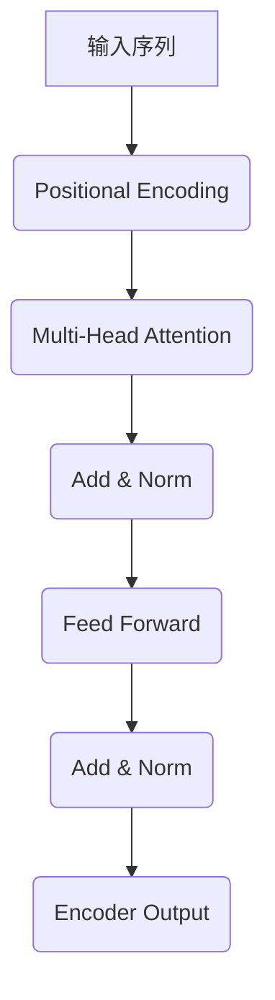
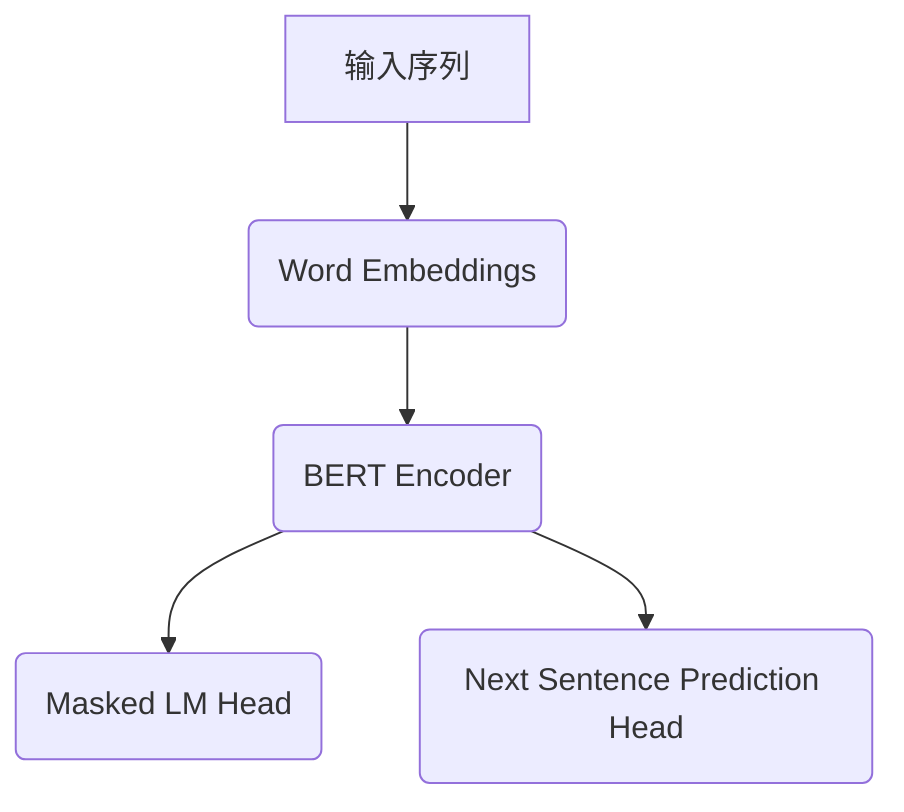
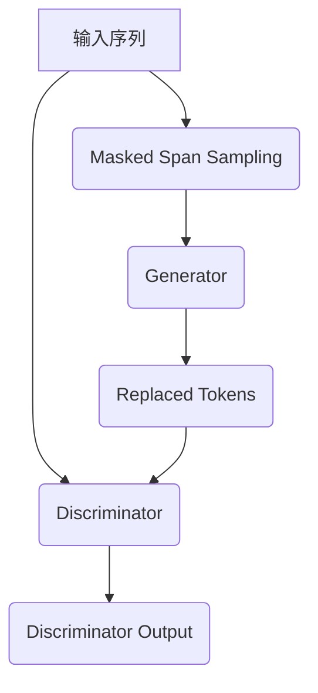

# Transformer大模型实战 训练ELECTRA 模型

## 1.背景介绍

随着自然语言处理(NLP)技术的快速发展,Transformer模型因其强大的表现能力而备受关注。作为一种全新的基于注意力机制的神经网络架构,Transformer不仅在机器翻译、文本生成等传统NLP任务上表现出色,而且还展现出了在一些复杂的语言理解和生成任务中的优异能力。

ELECTRA(Efficiently Learning an Encoder that Classifies Token Replacements Accurately)是一种新型的自监督语言表示模型,它通过改进传统的语言模型预训练方式,以更高效的方式学习语义表示,从而在下游NLP任务中取得了令人瞩目的成绩。ELECTRA模型的核心思想是将输入文本进行随机采样,用一个小生成器模型来预测被掩蔽的词,而判别器模型则需要区分被替换的词是否为原词。这种对比学习方式使得ELECTRA在相同的计算资源下,比BERT等经典模型表现更优异。

本文将深入探讨ELECTRA模型的原理、训练过程及其在实际应用中的表现。我们将从头实现一个ELECTRA模型,并在公开数据集上进行预训练,最后在下游NLP任务上评估其性能表现。

## 2.核心概念与联系

### 2.1 Transformer模型

Transformer是一种全新的基于注意力机制的序列到序列(Seq2Seq)模型,它完全摒弃了RNN和CNN等传统模型结构,整个网络由注意力层和前馈层构成。Transformer的主要创新点在于使用多头自注意力机制来捕获输入序列中不同位置之间的依赖关系,从而更好地建模长距离依赖。

Transformer的编码器(Encoder)将输入序列映射为一系列连续的向量表示,而解码器(Decoder)则根据编码器的输出生成目标序列。在机器翻译等序列生成任务中,Transformer展现出了卓越的性能。



### 2.2 BERT模型

BERT(Bidirectional Encoder Representations from Transformers)是一种基于Transformer的双向编码器语言模型,通过预训练学习上下文表示,并在下游NLP任务中进行微调(fine-tuning),取得了卓越的成绩。

BERT的预训练过程包括两个任务:被掩蔽语言模型(Masked Language Model)和下一句预测(Next Sentence Prediction)。前者通过随机掩蔽部分词元,并基于上下文预测被掩蔽的词元,后者则判断两个句子是否相邻。BERT在大规模无标注语料上进行预训练,学习到了通用的语义表示,从而为下游NLP任务提供了强大的迁移能力。



### 2.3 ELECTRA模型

ELECTRA模型的核心思想是通过对比学习的方式来学习语义表示,与BERT等传统语言模型预训练方式不同。ELECTRA由两个模型组成:生成器(Generator)和判别器(Discriminator)。

生成器的作用是从输入序列中随机采样一些位置,并用一个小的掩蔽语言模型来预测被掩蔽的词元。而判别器的任务则是区分输入序列中的词元是否被生成器替换。通过这种对比学习方式,判别器可以学习到更加准确和鲁棒的语义表示。

ELECTRA的优势在于,相较于BERT等传统方法,它只需要一个小的生成器来替换词元,而判别器则可以利用所有输入信息,从而可以在相同的计算资源下获得更好的性能。



## 3.核心算法原理具体操作步骤

ELECTRA模型的训练过程包括以下几个核心步骤:

### 3.1 输入数据预处理

1. 对输入文本进行标记化(Tokenization),将文本切分为词元(Token)序列。
2. 添加特殊词元,如`[CLS]`(分类标记)和`[SEP]`(分隔标记)。
3. 将词元映射为对应的词元ID。
4. 执行Padding,使每个batch中的序列长度一致。

### 3.2 掩蔽采样(Masked Span Sampling)

1. 从输入序列中随机采样一些连续的span(片段),其长度服从对数几何分布(Geometric Distribution)。
2. 对于每个采样的span,用生成器替换其中80%的词元,保留20%的词元不变。

### 3.3 生成器(Generator)

生成器是一个小的掩蔽语言模型,其作用是预测被掩蔽的词元。具体操作步骤如下:

1. 将输入序列输入到Transformer编码器中,获得每个词元的上下文表示。
2. 对于被掩蔽的词元位置,使用一个前馈神经网络来预测其词元ID。
3. 使用交叉熵损失函数(Cross-Entropy Loss)优化生成器模型。

### 3.4 判别器(Discriminator)

判别器是一个大型的Transformer模型,其任务是区分输入序列中的词元是否被生成器替换。具体操作步骤如下:

1. 将输入序列(包括被替换的词元)输入到Transformer编码器中,获得每个词元的上下文表示。
2. 对于每个词元位置,使用一个二分类前馈神经网络来判断该词元是否被替换。
3. 使用二元交叉熵损失函数(Binary Cross-Entropy Loss)优化判别器模型。

### 3.5 联合训练

ELECTRA模型通过对生成器和判别器进行联合训练,以最小化两者的损失函数之和。具体步骤如下:

1. 在每个训练步骤中,首先进行掩蔽采样,获得被替换的词元。
2. 使用生成器预测被掩蔽的词元,计算生成器损失。
3. 将原始序列和被替换的词元输入到判别器,计算判别器损失。
4. 计算总损失为生成器损失和判别器损失之和。
5. 使用优化器(如Adam)对模型参数进行更新。

## 4.数学模型和公式详细讲解举例说明

### 4.1 对数几何分布(Geometric Distribution)

ELECTRA中的掩蔽采样过程使用了对数几何分布来控制被采样span的长度。对数几何分布是一种离散概率分布,可以用来描述一个成功事件发生前需要进行的失败次数。在ELECTRA中,我们将"成功"定义为采样一个新的span,而"失败"则是继续扩展当前span的长度。

对数几何分布的概率质量函数(PMF)如下所示:

$$P(X=k) = \frac{\alpha(1-\alpha)^k}{k}, \quad k=0,1,2,\ldots$$

其中,$\alpha$是成功概率,$k$是失败次数。在ELECTRA中,$\alpha$通常设置为0.2,这意味着平均每5个词元就会开始一个新的span。

为了更好地控制span长度,ELECTRA还引入了一个上限$L$,当span长度超过$L$时,强制开始一个新的span。这种截断的对数几何分布可以写为:

$$P(X=k) = \begin{cases}
\frac{\alpha(1-\alpha)^k}{k}, & \text{if } k < L \\
(1-\alpha)^L, & \text{if } k = L
\end{cases}$$

### 4.2 交叉熵损失函数(Cross-Entropy Loss)

交叉熵损失函数是一种常用的衡量模型预测值与真实值之间差异的函数,广泛应用于分类问题中。在ELECTRA的生成器训练中,我们使用交叉熵损失函数来优化模型预测被掩蔽词元的能力。

设$y_i$为第$i$个词元的真实ID,$\hat{y}_i$为模型预测的概率分布,交叉熵损失函数可以表示为:

$$\mathcal{L}_{CE} = -\sum_{i=1}^{N} \log P(y_i|\hat{y}_i)$$

其中,$N$是被掩蔽词元的总数。对于单个词元,$\log P(y_i|\hat{y}_i)$可以进一步展开为:

$$\log P(y_i|\hat{y}_i) = \sum_{j=1}^{V} \mathbb{1}_{[y_i=j]}\log \hat{y}_{i,j}$$

这里,$V$是词表大小,$\mathbb{1}_{[y_i=j]}$是指示函数,当$y_i=j$时取值为1,否则为0。$\hat{y}_{i,j}$是模型预测第$i$个词元为第$j$个词元的概率。

通过最小化交叉熵损失函数,生成器可以学习到更准确的语义表示,从而更好地预测被掩蔽的词元。

### 4.3 二元交叉熵损失函数(Binary Cross-Entropy Loss)

在ELECTRA的判别器训练中,我们使用二元交叉熵损失函数来优化模型区分被替换词元的能力。这是一个二分类问题,判别器需要预测每个词元是否被生成器替换。

设$y_i \in \{0, 1\}$为第$i$个词元的真实标签(0表示未被替换,1表示被替换),$\hat{y}_i$为模型预测的概率,二元交叉熵损失函数可以表示为:

$$\mathcal{L}_{BCE} = -\sum_{i=1}^{N} [y_i \log \hat{y}_i + (1 - y_i) \log (1 - \hat{y}_i)]$$

其中,$N$是输入序列的长度。对于单个词元,$y_i \log \hat{y}_i$衡量了模型正确预测被替换词元的概率,$\log (1 - \hat{y}_i)$衡量了模型正确预测未被替换词元的概率。

通过最小化二元交叉熵损失函数,判别器可以学习到更加鲁棒的语义表示,从而更好地区分被替换的词元。

## 5.项目实践:代码实例和详细解释说明

在这一部分,我们将从头实现一个ELECTRA模型,并在公开数据集上进行预训练。我们将使用PyTorch作为深度学习框架,并利用Hugging Face的Transformers库来加速模型的构建和训练。

### 5.1 数据预处理

我们将使用GLUE基准数据集中的一个子集作为预训练语料。首先,我们需要对原始文本进行标记化和编码:

```python
from transformers import ElectraTokenizer

tokenizer = ElectraTokenizer.from_pretrained('electra-base-discriminator')

def encode(text):
    encoded = tokenizer.encode_plus(
        text,
        add_special_tokens=True,
        max_length=512,
        padding='max_length',
        truncation=True,
        return_tensors='pt'
    )
    return encoded
```

这里我们使用了Hugging Face提供的预训练ELECTRA判别器模型的词元器。`encode_plus`函数将文本转换为词元ID序列,并执行必要的填充和截断操作。

### 5.2 掩蔽采样

接下来,我们实现掩蔽采样函数,用于生成被替换的词元:

```python
import torch
import torch.nn.functional as F

def sample_spans(inputs, alpha=0.2, max_span_len=5):
    mask = torch.full_like(inputs, False)
    span_lengths = F.geometric(torch.tensor(alpha)).long() + 1
    span_lengths = torch.clamp(span_lengths, max=max_span_len)
    
    for length in span_lengths:
        start = torch.randint(0, inputs.size(-1) - length + 1, (1,))
        mask[:, start:start+length] = True
    
    return mask
```

这个函数首先创建一个与输入序列等长的掩码张量,初始值全为False。然后,我们使用对数几何分布采样span长度,并在随机位置设置掩码为True。最后,我们返回这个掩码张量,用于替换被掩蔽的词元。

### 5.3 生成器模型

生成器模型是一个小型的掩蔽语言模型,用于预测被掩蔽的词元