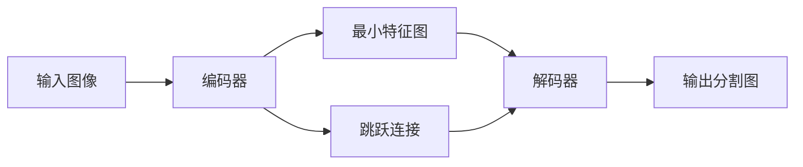

# UNet原理与代码实例讲解

## 1. 背景介绍

在医学图像分割领域，准确快速地从复杂的医学图像中提取出感兴趣的区域一直是一个挑战。2015年，Olaf Ronneberger等人提出了UNet，这是一个基于卷积神经网络的架构，专为医学图像分割设计。UNet的提出，不仅在医学图像分割任务上取得了显著的成绩，也为后续的图像分割研究提供了新的思路。

## 2. 核心概念与联系

UNet的核心概念是一种对称的U形结构，它包含一个收缩路径（编码器）和一个对称的扩展路径（解码器）。编码器用于捕获图像的上下文信息，而解码器则用于精确定位感兴趣的区域。两者之间通过跳跃连接（skip connections）相连，这些连接可以将编码器中的特征图直接与解码器中的相应层相连，以保持边缘信息。



## 3. 核心算法原理具体操作步骤

UNet的操作步骤可以分为以下几个阶段：

1. **收缩路径**：通过连续的卷积层和池化层，逐步降低特征图的空间维度，同时增加通道数，以提取更高层次的特征。
2. **最小特征图**：在收缩路径的最底部，得到具有最高层次特征的最小特征图。
3. **扩展路径**：通过上采样和卷积操作，逐步恢复特征图的空间维度，同时减少通道数，以恢复图像的细节。
4. **跳跃连接**：将收缩路径中的特征图与扩展路径中的相应层相连，以保留边缘和细节信息。
5. **输出层**：最后通过一个1x1的卷积将特征图转换为最终的分割图。

## 4. 数学模型和公式详细讲解举例说明

UNet的数学模型主要涉及卷积操作、池化操作和上采样操作。以卷积操作为例，其数学公式可以表示为：

$$
f_{i,j}^{(l+1)} = \sigma\left(\sum_{m=0}^{M-1}\sum_{n=0}^{N-1}w_{m,n}^{(l)} \cdot f_{i+m,j+n}^{(l)} + b^{(l)}\right)
$$

其中，$f_{i,j}^{(l)}$ 是第 $l$ 层的特征图在位置 $(i, j)$ 的值，$w_{m,n}^{(l)}$ 是卷积核的权重，$b^{(l)}$ 是偏置项，$\sigma$ 是激活函数，$M$ 和 $N$ 是卷积核的尺寸。

## 5. 项目实践：代码实例和详细解释说明

在实践中，UNet可以使用以下Python代码实现：

```python
import torch
import torch.nn as nn

class UNet(nn.Module):
    def __init__(self):
        super(UNet, self).__init__()
        # 定义UNet的编码器部分
        # ...
        
        # 定义UNet的解码器部分
        # ...
        
        # 定义最终的1x1卷积输出层
        self.final_layer = nn.Conv2d(in_channels, out_channels, kernel_size=1)
    
    def forward(self, x):
        # 前向传播过程
        # ...
        return x

# 实例化模型并应用于输入数据
unet = UNet()
input_data = torch.randn(1, 1, 572, 572)  # 假设输入数据是一个572x572的图像
output = unet(input_data)
```

在这个代码示例中，我们定义了UNet模型的基本结构，并通过`forward`方法实现了数据的前向传播过程。实际项目中，编码器和解码器的具体实现会涉及更多细节，如卷积层的参数设置、激活函数的选择等。

## 6. 实际应用场景

UNet在医学图像分割领域有广泛的应用，如细胞分割、器官定位、病变检测等。除此之外，UNet也被应用于卫星图像分割、道路检测等其他领域。

## 7. 工具和资源推荐

- **PyTorch**：一个开源的机器学习库，适合于快速实验和实现复杂的神经网络结构。
- **TensorFlow**：谷歌开发的另一个开源机器学习库，同样适用于实现UNet。
- **Medical Segmentation Decathlon**：一个医学图像分割的数据集，包含多种不同的医学图像分割任务。

## 8. 总结：未来发展趋势与挑战

UNet自提出以来，已经成为医学图像分割的一个重要基准。未来的发展趋势可能包括更深层次的网络结构、更有效的训练策略、以及对小样本学习的优化。同时，如何将UNet与其他类型的神经网络结构相结合，以处理更复杂的图像分割任务，也是一个重要的研究方向。

## 9. 附录：常见问题与解答

- **Q: UNet适用于哪些类型的图像分割任务？**
- **A:** UNet最初是为医学图像分割设计的，但其强大的特征提取能力使其也适用于其他类型的图像分割任务。

- **Q: UNet的跳跃连接有什么作用？**
- **A:** 跳跃连接可以将编码器中的高分辨率特征直接传递到解码器，有助于恢复图像的细节和边缘信息。

- **Q: 如何选择UNet中的卷积核大小和层数？**
- **A:** 卷积核大小和层数的选择通常基于具体的应用场景和数据集。一般来说，较大的卷积核可以捕获更广泛的上下文信息，而较多的层数可以提取更深层次的特征。

作者：禅与计算机程序设计艺术 / Zen and the Art of Computer Programming