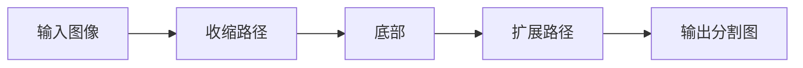

# UNet原理与代码实例讲解

## 1. 背景介绍

在医学图像分割领域，UNet模型因其出色的性能和灵活的结构而广受欢迎。自2015年由Olaf Ronneberger等人提出以来，UNet已成为许多图像分割任务的基准。它的设计充分考虑了医学图像的特点，如对细节的高度敏感性和对上下文信息的需求。

## 2. 核心概念与联系

UNet的核心概念在于其U形结构，它由一个收缩路径和一个对称的扩展路径组成。收缩路径负责捕获图像的上下文信息，而扩展路径则用于精确定位图像的各个部分。这两个路径通过跳跃连接相互作用，保证了在分割过程中信息的无损传递。



## 3. 核心算法原理具体操作步骤

UNet的操作步骤可以分为以下几个阶段：

1. **收缩路径**：通过连续的卷积和池化操作，逐步提取特征并降低空间维度。
2. **底部**：在最低分辨率处进行特征提取。
3. **扩展路径**：通过上采样和卷积操作，逐步恢复图像的空间维度，并与收缩路径的特征图进行融合。
4. **输出**：最后一层卷积将特征图转换为分割图。

## 4. 数学模型和公式详细讲解举例说明

UNet的数学模型主要基于卷积神经网络（CNN）。卷积操作可以表示为：

$$
f_{i,j}^{(l)} = \sigma\left(\sum_{m}\sum_{n}w_{m,n}^{(l)} \cdot x_{i+m,j+n}^{(l-1)} + b^{(l)}\right)
$$

其中，$f_{i,j}^{(l)}$ 是第 $l$ 层在位置 $(i, j)$ 的特征图，$w_{m,n}^{(l)}$ 是卷积核的权重，$x_{i+m,j+n}^{(l-1)}$ 是前一层的输入，$b^{(l)}$ 是偏置项，$\sigma$ 是激活函数。

## 5. 项目实践：代码实例和详细解释说明

以下是UNet模型的一个简化代码实例，使用Python和TensorFlow框架：

```python
import tensorflow as tf

def conv_block(input_tensor, num_filters):
    x = tf.keras.layers.Conv2D(num_filters, (3, 3), padding='same')(input_tensor)
    x = tf.keras.layers.Activation('relu')(x)
    x = tf.keras.layers.Conv2D(num_filters, (3, 3), padding='same')(x)
    x = tf.keras.layers.Activation('relu')(x)
    return x

def encoder_block(input_tensor, num_filters):
    x = conv_block(input_tensor, num_filters)
    p = tf.keras.layers.MaxPooling2D((2, 2))(x)
    return x, p

def decoder_block(input_tensor, concat_tensor, num_filters):
    x = tf.keras.layers.Conv2DTranspose(num_filters, (2, 2), strides=(2, 2), padding='same')(input_tensor)
    x = tf.keras.layers.concatenate([x, concat_tensor], axis=-1)
    x = conv_block(x, num_filters)
    return x

def unet_model(input_size, num_classes):
    inputs = tf.keras.Input(shape=input_size)

    # Encoder
    x1, p1 = encoder_block(inputs, 64)
    x2, p2 = encoder_block(p1, 128)
    x3, p3 = encoder_block(p2, 256)
    x4, p4 = encoder_block(p3, 512)

    # Bottom
    x5 = conv_block(p4, 1024)

    # Decoder
    x6 = decoder_block(x5, x4, 512)
    x7 = decoder_block(x6, x3, 256)
    x8 = decoder_block(x7, x2, 128)
    x9 = decoder_block(x8, x1, 64)

    # Output
    outputs = tf.keras.layers.Conv2D(num_classes, (1, 1), activation='softmax')(x9)

    model = tf.keras.Model(inputs=[inputs], outputs=[outputs])
    return model

# Create UNet model
unet = unet_model((256, 256, 1), 2)
unet.compile(optimizer='adam', loss='categorical_crossentropy', metrics=['accuracy'])
```

这段代码定义了一个UNet模型，其中包含了编码器、底部和解码器的构建过程。每个编码器块通过卷积块和池化层逐步降低特征图的维度，而解码器块则通过转置卷积和特征图融合逐步恢复维度。

## 6. 实际应用场景

UNet在医学图像分割中的应用非常广泛，包括但不限于细胞分割、器官定位、病变检测等。它的高精度和灵活性使其在处理各种复杂图像时都能表现出色。

## 7. 工具和资源推荐

- TensorFlow或PyTorch：这两个框架都提供了构建和训练UNet模型所需的工具和库。
- Medical Segmentation Decathlon：一个包含多种医学图像数据集的挑战，适合测试和提升UNet模型的性能。
- NVIDIA CUDA和cuDNN：用于加速模型训练的GPU计算库。

## 8. 总结：未来发展趋势与挑战

UNet模型虽然已经非常成熟，但仍有改进空间。未来的发展趋势可能包括模型的轻量化、效率提升以及更好的泛化能力。同时，如何处理不均衡数据和小样本学习也是未来研究的重点。

## 9. 附录：常见问题与解答

- **Q: UNet模型的参数量是否过大？**
- A: UNet模型确实有较多的参数，但通过技术如深度可分离卷积等可以有效减少参数量。

- **Q: UNet在非医学图像分割任务上的表现如何？**
- A: UNet也可以应用于非医学领域的图像分割任务，并且同样能够取得良好的效果。

- **Q: 如何处理UNet模型的过拟合问题？**
- A: 可以通过数据增强、正则化技术或者使用更多的训练数据来缓解过拟合问题。

作者：禅与计算机程序设计艺术 / Zen and the Art of Computer Programming