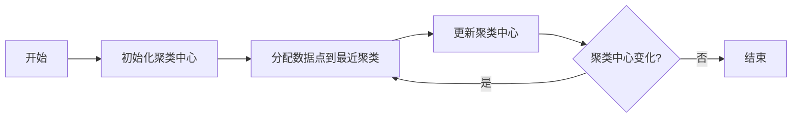

# Unsupervised Learning 原理与代码实战案例讲解

## 1. 背景介绍

在人工智能的众多分支中，无监督学习(Unsupervised Learning)是一种重要的机器学习方法。与监督学习不同，无监督学习不依赖于标注数据，它通过分析数据本身的结构和分布特征来发现数据中的模式。这种学习方式在现实世界中有着广泛的应用，如市场细分、社交网络分析、异常检测等。

## 2. 核心概念与联系

无监督学习的核心在于发现数据中的内在结构和关系。它主要包括聚类(Clustering)、降维(Dimensionality Reduction)、密度估计(Density Estimation)等技术。聚类旨在将数据集中的样本分组，使得同一组内的样本相似度高，不同组间的样本相似度低。降维则是减少数据的维度，提取最有用的信息。密度估计则是估计数据生成的概率分布。

## 3. 核心算法原理具体操作步骤

以K-Means聚类算法为例，其操作步骤如下：

1. 初始化：随机选择K个数据点作为初始聚类中心。
2. 分配：将每个数据点分配到最近的聚类中心所在的类。
3. 更新：重新计算每个类的聚类中心。
4. 重复：重复分配和更新步骤，直到聚类中心不再变化。



## 4. 数学模型和公式详细讲解举例说明

K-Means算法的目标是最小化每个点到其聚类中心的距离的平方和，即：

$$
J = \sum_{i=1}^{m}\sum_{k=1}^{K}w_{ik}\|x^{(i)} - \mu_k\|^2
$$

其中，$m$ 是数据点的数量，$K$ 是聚类的数量，$x^{(i)}$ 是数据点，$\mu_k$ 是聚类中心，$w_{ik}$ 是指示变量，如果数据点 $x^{(i)}$ 属于聚类 $k$，则 $w_{ik}=1$，否则 $w_{ik}=0$。

## 5. 项目实践：代码实例和详细解释说明

以下是使用Python中的scikit-learn库实现K-Means算法的简单示例：

```python
from sklearn.cluster import KMeans
import numpy as np

# 假设有一组二维数据点
X = np.array([[1, 2], [1, 4], [1, 0],
              [10, 2], [10, 4], [10, 0]])

# 应用K-Means算法，设置聚类数为2
kmeans = KMeans(n_clusters=2, random_state=0).fit(X)

# 输出聚类中心和每个数据点的所属类别
print(kmeans.cluster_centers_)
print(kmeans.labels_)
```

## 6. 实际应用场景

无监督学习在许多领域都有应用，例如：

- 市场细分：根据消费者行为对市场进行细分。
- 社交网络分析：发现社交网络中的社区结构。
- 异常检测：检测信用卡欺诈、网络入侵等异常行为。

## 7. 工具和资源推荐

- scikit-learn：一个强大的Python机器学习库。
- TensorFlow：谷歌开源的机器学习框架。
- UMAP：一种有效的降维技术。

## 8. 总结：未来发展趋势与挑战

无监督学习的未来发展趋势包括更好的算法效率、更强的模型解释能力和更广泛的应用场景。挑战则包括如何处理高维数据、如何评估无监督学习的性能等。

## 9. 附录：常见问题与解答

Q1: 无监督学习和监督学习有什么区别？
A1: 监督学习需要标注数据，而无监督学习不需要。

Q2: 如何选择合适的聚类数？
A2: 可以使用肘部法则(Elbow Method)等方法来估计。

Q3: 无监督学习可以用于哪些类型的数据？
A3: 无监督学习适用于任何类型的数据，但是对数据的质量和结构有一定要求。

作者：禅与计算机程序设计艺术 / Zen and the Art of Computer Programming