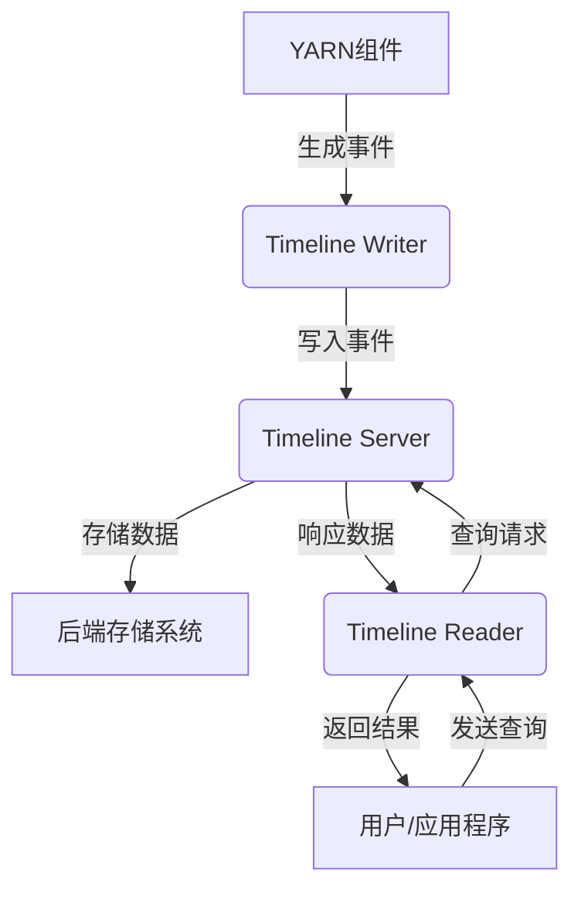

# YARN Timeline Server原理与代码实例讲解

## 1. 背景介绍

在大数据时代,Apache Hadoop生态系统扮演着至关重要的角色。作为Hadoop的核心组件之一,YARN(Yet Another Resource Negotiator)负责集群资源管理和作业调度。YARN Timeline Server作为YARN的一个关键子系统,为整个Hadoop集群提供了强大的监控和调试能力。

YARN Timeline Server的主要目的是收集和存储作业、应用程序和系统活动的历史信息。这些信息对于故障排查、性能分析和审计等方面都有着重要意义。Timeline Server提供了一个统一的接口,允许用户和应用程序查询这些历史数据,从而深入了解整个集群的运行状况。

### 1.1 YARN架构回顾

在深入探讨YARN Timeline Server之前,让我们快速回顾一下YARN的整体架构。YARN由两个主要组件组成:ResourceManager(RM)和NodeManager(NM)。

- **ResourceManager(RM)**: 集群资源管理器,负责分配资源并监控应用程序。RM包括两个主要组件:Scheduler和ApplicationsManager。
- **NodeManager(NM)**: 节点管理器,运行在每个工作节点上,负责管理节点上的资源并监控容器的执行情况。

YARN采用主从架构,ResourceManager作为主节点,NodeManager作为从节点。应用程序向ResourceManager申请资源,ResourceManager根据调度策略分配资源,并指示NodeManager启动容器运行任务。

### 1.2 Timeline Server的作用

在传统的YARN架构中,作业和应用程序的历史信息只存储在本地文件系统中,这给集群监控和故障排查带来了诸多挑战。Timeline Server的引入旨在解决这些问题,为YARN提供一个集中式的历史数据存储和访问系统。

Timeline Server的主要作用包括:

1. **收集和存储历史数据**: 从YARN组件(如ResourceManager、NodeManager和应用程序)收集历史事件数据,并将其存储在后端存储系统中。
2. **提供统一查询接口**: 为用户和应用程序提供统一的RESTful API,用于查询和检索历史数据。
3. **支持数据分析和可视化**: 通过提供丰富的历史数据,Timeline Server为数据分析和可视化工具提供了强有力的支持。
4. **简化故障排查和审计**: 借助历史数据,用户可以更容易地排查故障、分析性能瓶颈并进行审计。

总的来说,YARN Timeline Server为YARN生态系统带来了更好的可观测性、可调试性和可审计性,提高了整个Hadoop集群的可维护性和可靠性。

## 2. 核心概念与联系

为了更好地理解YARN Timeline Server的工作原理,我们需要了解一些核心概念及其相互关系。

### 2.1 核心概念

1. **Entity(实体)**: 表示一个独立的对象,如应用程序、作业或容器等。每个实体都有一个唯一的ID。
2. **Event(事件)**: 描述实体在其生命周期中发生的动作或状态变化。事件包含时间戳、事件类型和相关数据等信息。
3. **Timeline(时间线)**: 一组按时间顺序排列的事件,描述了一个实体的整个生命周期。
4. **Timeline Domain(时间线域)**: 一组相关的时间线,通常对应于一个应用程序或服务。
5. **Timeline Flow(时间线流)**: 一组属于同一个时间线域的时间线。

### 2.2 核心组件

YARN Timeline Server由以下几个核心组件组成:

1. **Timeline Server**: 主服务器组件,负责接收和存储事件数据,并提供查询接口。
2. **Timeline Reader**: 客户端组件,用于从Timeline Server读取和查询历史数据。
3. **Timeline Writer**: 客户端组件,用于向Timeline Server写入事件数据。
4. **Timeline Cache**: 用于缓存最近访问的时间线数据,提高查询性能。
5. **Timeline Store**: 后端存储系统,用于持久化存储时间线数据。

### 2.3 核心流程

YARN Timeline Server的核心流程如下:

1. **事件生成**: YARN组件(如ResourceManager、NodeManager和应用程序)在运行过程中生成事件数据。
2. **事件写入**: 通过Timeline Writer将事件数据写入Timeline Server。
3. **数据存储**: Timeline Server将接收到的事件数据存储在后端存储系统(如HBase或MySQL)中。
4. **数据查询**: 用户或应用程序通过Timeline Reader向Timeline Server发送查询请求,获取所需的历史数据。
5. **数据响应**: Timeline Server从后端存储系统检索相关数据,并将结果返回给客户端。

下面是一个简单的Mermaid流程图,描述了YARN Timeline Server的核心工作流程:

## 3. 核心算法原理具体操作步骤

YARN Timeline Server的核心算法原理涉及事件数据的收集、存储和查询等多个方面。让我们逐一探讨这些核心算法的具体操作步骤。

### 3.1 事件数据收集

事件数据收集是Timeline Server的基础,它涉及以下几个关键步骤:

1. **事件生成**: YARN组件(如ResourceManager、NodeManager和应用程序)在运行过程中生成事件数据。每个事件都包含时间戳、事件类型、实体ID和相关数据等信息。

2. **事件缓冲**: 为了提高性能,YARN组件通常会在内存中缓冲一定数量的事件,而不是立即将每个事件都写入Timeline Server。

3. **事件发送**: 当缓冲区达到一定大小或经过一定时间后,YARN组件会将缓冲的事件批量发送到Timeline Server。这通常是通过Timeline Writer客户端组件完成的。

4. **事件接收**: Timeline Server接收到事件数据后,会进行一些预处理,如验证数据格式、过滤无效数据等。

5. **事件分发**: Timeline Server将接收到的事件数据根据时间线域(Timeline Domain)进行分发,确保属于同一个时间线域的事件被存储在一起。

### 3.2 事件数据存储

收集到的事件数据需要被持久化存储,以便后续查询和分析。Timeline Server支持多种后端存储系统,如HBase、MySQL等。无论使用何种存储系统,事件数据存储都涉及以下几个关键步骤:

1. **数据编码**: 为了节省存储空间和提高效率,Timeline Server会对事件数据进行编码。常用的编码方式包括Protobuf和Avro等。

2. **数据分区**: 为了提高查询性能,Timeline Server会根据时间线域和时间戳等因素对事件数据进行分区存储。

3. **数据写入**: 编码和分区后的事件数据会被写入后端存储系统。根据存储系统的不同,写入方式也有所差异。例如,对于HBase,Timeline Server会将事件数据写入相应的行键和列族中。

4. **数据压缩**: 为了节省存储空间,Timeline Server通常会对存储的事件数据进行压缩。常用的压缩算法包括GZip、Snappy等。

5. **数据清理**: 为了避免存储系统过度膨胀,Timeline Server会定期清理过期的历史数据。清理策略可以根据数据保留时间或存储空间阈值等因素进行配置。

### 3.3 事件数据查询

Timeline Server提供了一套RESTful API,用于查询和检索历史事件数据。事件数据查询涉及以下几个关键步骤:

1. **查询请求**: 用户或应用程序通过Timeline Reader客户端组件向Timeline Server发送查询请求。查询请求可以包含多种过滤条件,如时间范围、实体ID、事件类型等。

2. **请求解析**: Timeline Server接收到查询请求后,会对请求进行解析和验证,确保请求合法且具有足够的权限。

3. **数据检索**: Timeline Server根据查询条件从后端存储系统中检索相关的事件数据。根据存储系统的不同,检索方式也有所差异。例如,对于HBase,Timeline Server会根据行键范围扫描相应的数据。

4. **数据过滤**: 从存储系统检索到的原始数据可能包含一些无关的事件,因此需要进行进一步的过滤,以满足查询条件。

5. **数据响应**: 过滤后的事件数据会被编码成响应格式(如JSON或Protobuf),并返回给客户端。

6. **数据缓存**: 为了提高查询性能,Timeline Server会将最近访问的数据缓存在内存中。后续的相似查询可以直接从缓存中获取数据,避免重复检索。

通过上述步骤,YARN Timeline Server能够高效地收集、存储和查询大量的历史事件数据,为YARN生态系统提供强大的监控和调试支持。

## 4. 数学模型和公式详细讲解举例说明

在YARN Timeline Server的设计和实现中,并没有直接涉及复杂的数学模型或公式。但是,为了优化系统性能和资源利用率,Timeline Server确实采用了一些简单但有效的算法和策略。

### 4.1 事件数据压缩

为了节省存储空间,Timeline Server会对存储的事件数据进行压缩。常用的压缩算法包括GZip和Snappy等。

假设原始事件数据的大小为$S_0$,经过压缩后的大小为$S_c$,则压缩率$R$可以表示为:

$$
R = \frac{S_0 - S_c}{S_0}
$$

其中,压缩率$R$的取值范围为$[0, 1)$。压缩率越高,说明压缩效果越好,存储空间节省越多。

不同的压缩算法具有不同的压缩率和压缩/解压缩速度。GZip通常具有较高的压缩率,但压缩和解压缩速度较慢。而Snappy的压缩率略低于GZip,但压缩和解压缩速度更快。Timeline Server需要在压缩率和速度之间进行权衡,以获得最佳的性能和存储利用率。

### 4.2 事件数据分区

为了提高查询性能,Timeline Server会根据时间线域和时间戳等因素对事件数据进行分区存储。假设我们将事件数据按照时间线域和时间戳进行分区,每个分区包含$N$个事件,则查询时间复杂度可以表示为:

$$
T(n) = O(\log_b n) + c_1 + c_2 \cdot \frac{n}{N}
$$

其中:

- $n$是查询涉及的总事件数量
- $b$是分区索引的基数(通常为2或更高)
- $c_1$是查找分区索引的常数时间开销
- $c_2$是扫描单个分区的常数时间开销
- $\frac{n}{N}$表示需要扫描的分区数量

通过适当选择分区粒度$N$,我们可以在查询时间和存储开销之间达成平衡。较小的$N$意味着更多的分区,查询时间复杂度更接近$O(\log_b n)$,但存储开销也会增加。相反,较大的$N$可以减少存储开销,但查询时间复杂度会趋近于$O(n)$。

### 4.3 事件数据缓存

为了进一步提高查询性能,Timeline Server会将最近访问的数据缓存在内存中。假设缓存命中率为$p$,则查询时间$T$可以表示为:

$$
T = p \cdot T_c + (1 - p) \cdot T_s
$$

其中:

- $T_c$是从缓存中获取数据的时间
- $T_s$是从存储系统中获取数据的时间

通常情况下,$T_c \ll T_s$,因此提高缓存命中率$p$可以显著降低查询时间$T$。

Timeline Server采用了基于LRU(Least Recently Used)策略的缓存算法,当缓存空间不足时,会淘汰最近最少使用的数据。此外,Timeline Server还支持基于时间线域的缓存分区,以进一步提高缓存命中率。

通过上述数学模型和公式,我们可以更好地理解YARN Timeline Server在存储优化、查询优化和缓存优化方面的设计思路和策略。

## 5. 项目实践:代码实例和详细解释说明

为了更好地理解