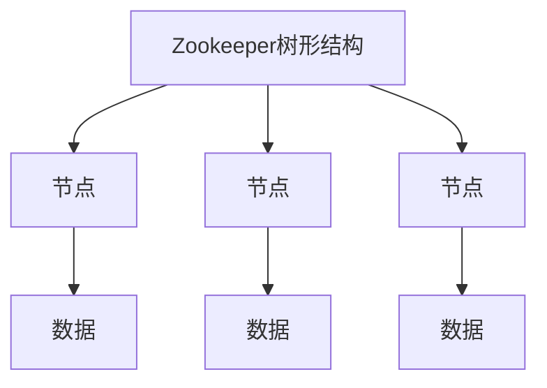
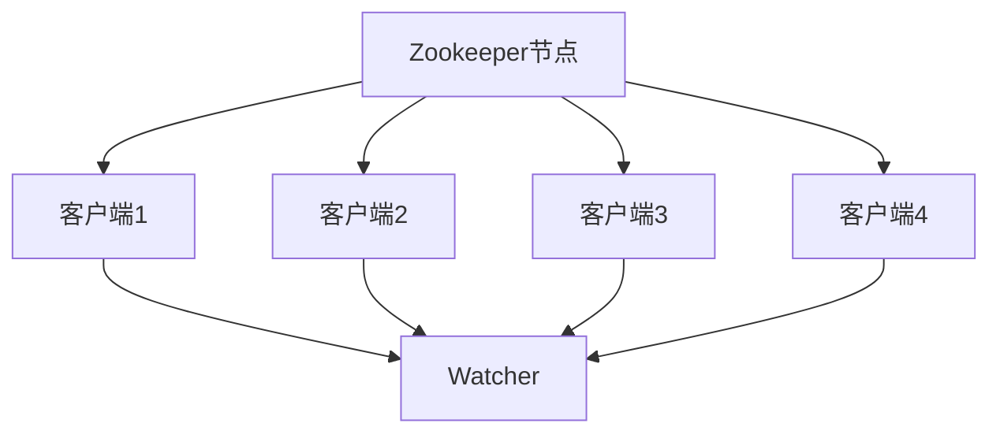
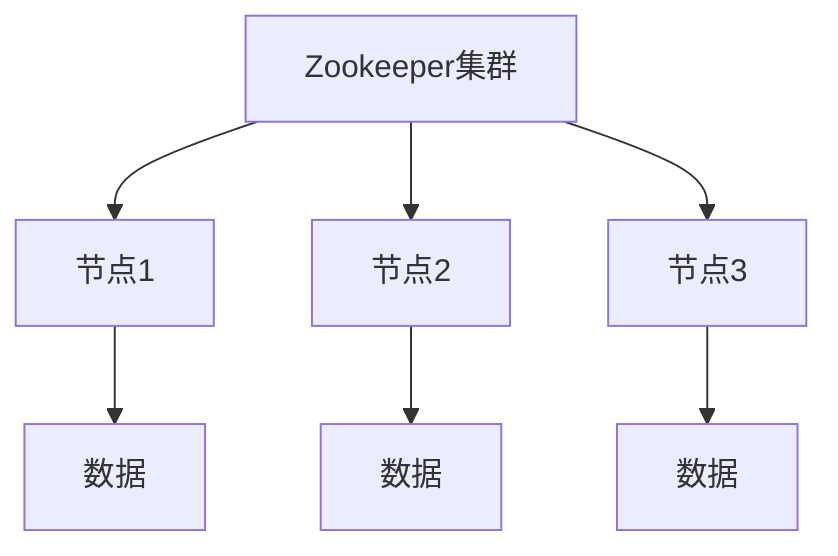
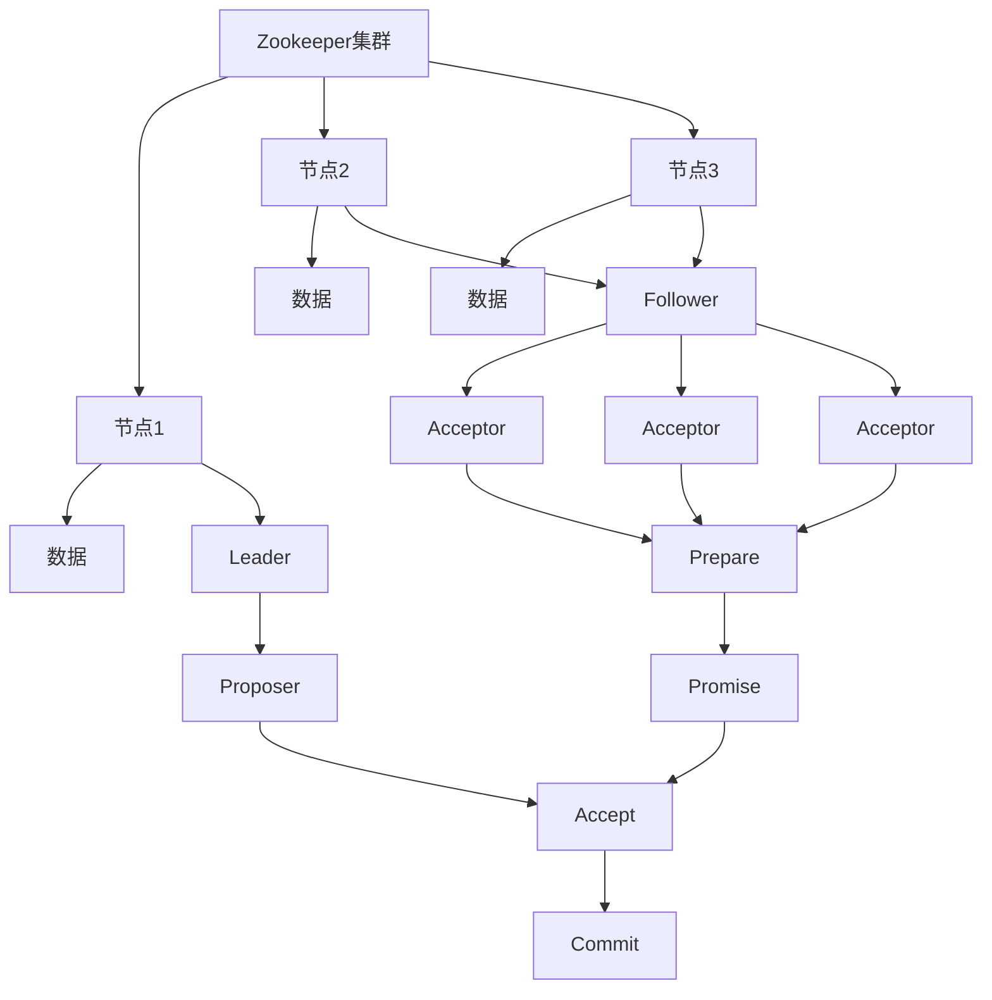
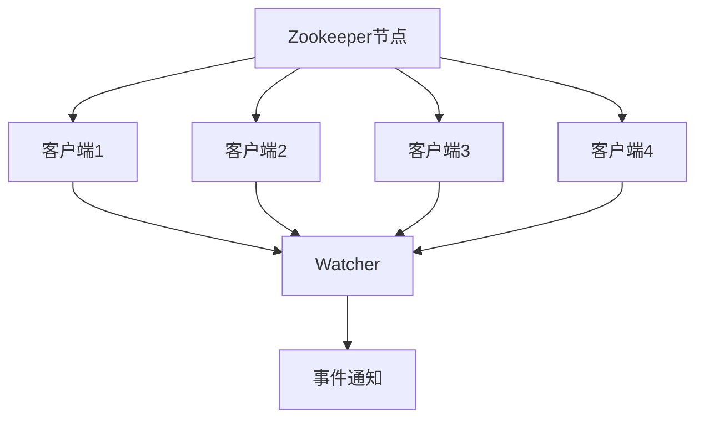

## 1. 背景介绍

Zookeeper是一个分布式的开源协调服务，它可以用于分布式应用程序的协调和管理。Zookeeper最初是由雅虎公司开发的，后来成为了Apache的一个顶级项目。Zookeeper提供了一种分布式的协调机制，可以用于解决分布式应用程序中的一些常见问题，例如分布式锁、分布式队列、分布式配置等。

## 2. 核心概念与联系

### 2.1 Zookeeper的数据模型

Zookeeper的数据模型是一个树形结构，类似于文件系统。每个节点都可以存储数据，并且可以有多个子节点。每个节点都有一个版本号，当节点的数据发生变化时，版本号会自增。Zookeeper的数据模型可以用下面的Mermaid流程图来表示：



### 2.2 Zookeeper的Watcher机制

Zookeeper的Watcher机制是一种事件通知机制，当某个节点的数据发生变化时，Zookeeper会通知所有对该节点注册了Watcher的客户端。Watcher机制可以用下面的Mermaid流程图来表示：



### 2.3 Zookeeper的Quorum机制

Zookeeper的Quorum机制是一种多数派决策机制，当Zookeeper集群中的节点数量为奇数时，只要超过一半的节点存活，集群就可以正常工作。Quorum机制可以用下面的Mermaid流程图来表示：



## 3. 核心算法原理具体操作步骤

### 3.1 Zookeeper的数据同步算法

Zookeeper的数据同步算法是基于Paxos算法的，它可以保证在分布式环境下数据的一致性。Zookeeper的数据同步算法可以用下面的Mermaid流程图来表示：



### 3.2 Zookeeper的Watcher机制实现原理

Zookeeper的Watcher机制是基于事件通知的，当某个节点的数据发生变化时，Zookeeper会通知所有对该节点注册了Watcher的客户端。Watcher机制的实现原理可以用下面的Mermaid流程图来表示：



## 4. 数学模型和公式详细讲解举例说明

Zookeeper的算法原理涉及到一些数学模型和公式，例如Paxos算法中的Prepare和Promise阶段。这些数学模型和公式可以用latex格式来表示，例如：

$$
Prepare(n) \\
Promise(n, n', v) \\
Accept(n, v) \\
Commit(n, v)
$$

## 5. 项目实践：代码实例和详细解释说明

### 5.1 Zookeeper的安装和配置

Zookeeper的安装和配置非常简单，只需要下载Zookeeper的二进制包，解压后修改配置文件即可。下面是一个简单的Zookeeper配置文件示例：

```properties
tickTime=2000
initLimit=10
syncLimit=5
dataDir=/var/lib/zookeeper
clientPort=2181
```

### 5.2 Zookeeper的Java API使用示例

Zookeeper提供了Java API，可以用Java程序来操作Zookeeper。下面是一个简单的Java程序示例，用于创建一个Zookeeper节点：

```java
import org.apache.zookeeper.*;

public class ZookeeperExample {
    public static void main(String[] args) throws Exception {
        ZooKeeper zk = new ZooKeeper("localhost:2181", 3000, null);
        zk.create("/example", "data".getBytes(), ZooDefs.Ids.OPEN_ACL_UNSAFE, CreateMode.PERSISTENT);
        zk.close();
    }
}
```

## 6. 实际应用场景

Zookeeper可以用于解决分布式应用程序中的一些常见问题，例如分布式锁、分布式队列、分布式配置等。下面是一些实际应用场景的示例：

### 6.1 分布式锁

分布式锁是一种常见的分布式应用程序问题，可以用Zookeeper来解决。下面是一个简单的分布式锁实现示例：

```java
import org.apache.zookeeper.*;

public class DistributedLock {
    private ZooKeeper zk;
    private String lockPath;
    private String lockName;

    public DistributedLock(String connectString, String lockPath, String lockName) throws Exception {
        this.zk = new ZooKeeper(connectString, 3000, null);
        this.lockPath = lockPath;
        this.lockName = lockName;
        if (zk.exists(lockPath, false) == null) {
            zk.create(lockPath, new byte[0], ZooDefs.Ids.OPEN_ACL_UNSAFE, CreateMode.PERSISTENT);
        }
    }

    public void lock() throws Exception {
        String lockNode = zk.create(lockPath + "/" + lockName, new byte[0], ZooDefs.Ids.OPEN_ACL_UNSAFE, CreateMode.EPHEMERAL_SEQUENTIAL);
        while (true) {
            String[] nodes = zk.getChildren(lockPath, false).toArray(new String[0]);
            String minNode = nodes[0];
            for (String node : nodes) {
                if (node.compareTo(minNode) < 0) {
                    minNode = node;
                }
            }
            if (lockNode.endsWith(minNode)) {
                return;
            }
            zk.exists(lockPath + "/" + minNode, true);
        }
    }

    public void unlock() throws Exception {
        zk.delete(lockPath + "/" + lockName, -1);
    }
}
```

### 6.2 分布式队列

分布式队列是一种常见的分布式应用程序问题，可以用Zookeeper来解决。下面是一个简单的分布式队列实现示例：

```java
import org.apache.zookeeper.*;

public class DistributedQueue {
    private ZooKeeper zk;
    private String queuePath;

    public DistributedQueue(String connectString, String queuePath) throws Exception {
        this.zk = new ZooKeeper(connectString, 3000, null);
        this.queuePath = queuePath;
        if (zk.exists(queuePath, false) == null) {
            zk.create(queuePath, new byte[0], ZooDefs.Ids.OPEN_ACL_UNSAFE, CreateMode.PERSISTENT);
        }
    }

    public void offer(String data) throws Exception {
        zk.create(queuePath + "/item-", data.getBytes(), ZooDefs.Ids.OPEN_ACL_UNSAFE, CreateMode.PERSISTENT_SEQUENTIAL);
    }

    public String poll() throws Exception {
        while (true) {
            String[] nodes = zk.getChildren(queuePath, false).toArray(new String[0]);
            if (nodes.length == 0) {
                Thread.sleep(1000);
                continue;
            }
            String minNode = nodes[0];
            for (String node : nodes) {
                if (node.compareTo(minNode) < 0) {
                    minNode = node;
                }
            }
            byte[] data = zk.getData(queuePath + "/" + minNode, false, null);
            zk.delete(queuePath + "/" + minNode, -1);
            return new String(data);
        }
    }
}
```

### 6.3 分布式配置

分布式配置是一种常见的分布式应用程序问题，可以用Zookeeper来解决。下面是一个简单的分布式配置实现示例：

```java
import org.apache.zookeeper.*;

public class DistributedConfig {
    private ZooKeeper zk;
    private String configPath;

    public DistributedConfig(String connectString, String configPath) throws Exception {
        this.zk = new ZooKeeper(connectString, 3000, null);
        this.configPath = configPath;
        if (zk.exists(configPath, false) == null) {
            zk.create(configPath, new byte[0], ZooDefs.Ids.OPEN_ACL_UNSAFE, CreateMode.PERSISTENT);
        }
    }

    public void set(String key, String value) throws Exception {
        zk.setData(configPath + "/" + key, value.getBytes(), -1);
    }

    public String get(String key) throws Exception {
        byte[] data = zk.getData(configPath + "/" + key, false, null);
        return new String(data);
    }
}
```

## 7. 工具和资源推荐

### 7.1 Zookeeper官方网站

Zookeeper官方网站提供了Zookeeper的文档、下载、社区等资源，是学习和使用Zookeeper的必备网站。

### 7.2 Zookeeper源码

Zookeeper源码是学习和理解Zookeeper的重要资源，可以从Zookeeper官方网站下载。

### 7.3 Zookeeper书籍

Zookeeper书籍是学习和理解Zookeeper的重要资源，例如《Zookeeper权威指南》、《Zookeeper实战》等。

## 8. 总结：未来发展趋势与挑战

Zookeeper作为一个分布式协调服务，已经被广泛应用于分布式应用程序中。未来，随着分布式应用程序的不断发展，Zookeeper将面临更多的挑战和机遇。

## 9. 附录：常见问题与解答

### 9.1 Zookeeper的性能如何？

Zookeeper的性能非常高，可以支持每秒数万次的读写操作。

### 9.2 Zookeeper的数据一致性如何保证？

Zookeeper的数据一致性是通过Paxos算法来保证的，可以保证在分布式环境下数据的一致性。

### 9.3 Zookeeper的Watcher机制如何实现？

Zookeeper的Watcher机制是基于事件通知的，当某个节点的数据发生变化时，Zookeeper会通知所有对该节点注册了Watcher的客户端。

### 9.4 Zookeeper的Quorum机制如何实现？

Zookeeper的Quorum机制是一种多数派决策机制，当Zookeeper集群中的节点数量为奇数时，只要超过一半的节点存活，集群就可以正常工作。