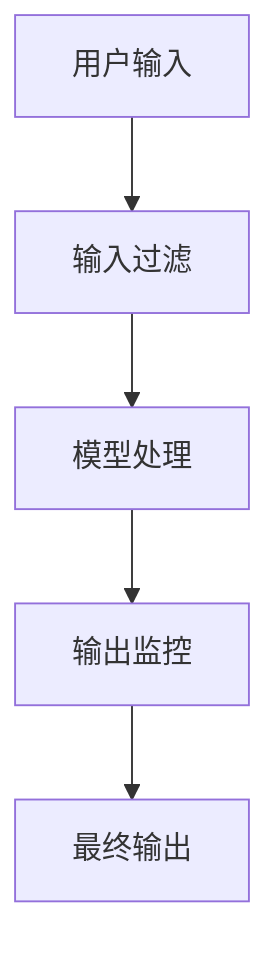

# 【LangChain编程：从入门到实践】模型内容安全

## 1.背景介绍

随着人工智能技术的迅猛发展，语言模型在各个领域的应用越来越广泛。然而，随着这些模型的普及，内容安全问题也日益凸显。内容安全不仅仅是防止恶意内容的生成，还包括防止模型输出不准确、不适当或有害的信息。LangChain作为一种新兴的编程框架，旨在帮助开发者更好地管理和控制语言模型的输出，确保内容的安全性和可靠性。

## 2.核心概念与联系

### 2.1 LangChain简介

LangChain是一种用于构建和管理语言模型的编程框架。它提供了一系列工具和接口，帮助开发者更好地控制模型的输入和输出，确保生成内容的安全性和准确性。

### 2.2 内容安全的定义

内容安全指的是确保语言模型生成的内容不包含恶意、误导、不适当或有害的信息。这包括但不限于防止生成仇恨言论、虚假信息、隐私泄露和其他有害内容。

### 2.3 LangChain与内容安全的关系

LangChain通过提供一系列的安全机制和工具，帮助开发者在使用语言模型时更好地控制内容的生成。这些机制包括输入过滤、输出监控、上下文管理等。

## 3.核心算法原理具体操作步骤

### 3.1 输入过滤

输入过滤是确保模型接收到的输入数据是安全和适当的第一道防线。通过对输入数据进行预处理，可以过滤掉潜在的恶意或不适当内容。



### 3.2 输出监控

输出监控是对模型生成的内容进行实时监控，确保其不包含任何不适当或有害的信息。可以使用规则引擎或机器学习模型来检测和过滤不安全的输出。

### 3.3 上下文管理

上下文管理是通过控制模型的上下文信息，确保生成的内容在语义上是连贯和安全的。通过管理上下文，可以避免模型生成出与当前对话或任务不相关的内容。

## 4.数学模型和公式详细讲解举例说明

### 4.1 语言模型的基本原理

语言模型的基本原理是通过统计和概率方法来预测下一个词或句子的可能性。常见的语言模型包括n-gram模型、隐马尔可夫模型（HMM）和神经网络模型。

$$
P(w_1, w_2, ..., w_n) = \prod_{i=1}^{n} P(w_i | w_1, w_2, ..., w_{i-1})
$$

### 4.2 输入过滤的数学模型

输入过滤可以看作是一个分类问题，通过训练一个分类器来判断输入是否安全。假设输入数据为 $X$，分类器的输出为 $Y$，则有：

$$
Y = f(X)
$$

其中，$f$ 是分类器函数。

### 4.3 输出监控的数学模型

输出监控同样可以看作是一个分类问题，通过训练一个分类器来判断输出是否安全。假设输出数据为 $O$，分类器的输出为 $Z$，则有：

$$
Z = g(O)
$$

其中，$g$ 是分类器函数。

## 5.项目实践：代码实例和详细解释说明

### 5.1 输入过滤代码实例

以下是一个简单的输入过滤代码示例，使用Python和正则表达式来过滤不适当的输入内容。

```python
import re

def input_filter(input_text):
    # 定义不适当内容的正则表达式
    inappropriate_patterns = [r'不适当词汇1', r'不适当词汇2']
    
    for pattern in inappropriate_patterns:
        if re.search(pattern, input_text):
            return False
    return True

# 测试输入过滤函数
input_text = "这是一个测试输入"
if input_filter(input_text):
    print("输入内容安全")
else:
    print("输入内容不安全")
```

### 5.2 输出监控代码实例

以下是一个简单的输出监控代码示例，使用Python和机器学习模型来监控输出内容。

```python
from sklearn.feature_extraction.text import TfidfVectorizer
from sklearn.linear_model import LogisticRegression

# 训练数据
train_texts = ["安全内容1", "不安全内容1", "安全内容2", "不安全内容2"]
train_labels = [1, 0, 1, 0]

# 向量化
vectorizer = TfidfVectorizer()
X_train = vectorizer.fit_transform(train_texts)

# 训练分类器
classifier = LogisticRegression()
classifier.fit(X_train, train_labels)

def output_monitor(output_text):
    X_test = vectorizer.transform([output_text])
    prediction = classifier.predict(X_test)
    return prediction[0] == 1

# 测试输出监控函数
output_text = "这是一个测试输出"
if output_monitor(output_text):
    print("输出内容安全")
else:
    print("输出内容不安全")
```

## 6.实际应用场景

### 6.1 社交媒体内容生成

在社交媒体平台上，语言模型可以用于生成自动回复、评论和帖子。通过LangChain的内容安全机制，可以确保生成的内容不会引发争议或传播虚假信息。

### 6.2 客服聊天机器人

在客服系统中，聊天机器人需要处理大量用户查询。通过LangChain，可以确保机器人生成的回复内容准确且不含有害信息，从而提升用户体验。

### 6.3 教育和培训

在教育和培训领域，语言模型可以用于生成学习材料和考试题目。通过LangChain，可以确保生成的内容符合教育标准，不包含不适当信息。

## 7.工具和资源推荐

### 7.1 LangChain官方文档

LangChain的官方文档提供了详细的使用指南和API参考，是开发者入门和深入了解LangChain的最佳资源。

### 7.2 内容安全相关的开源项目

- [OpenAI GPT-3](https://github.com/openai/gpt-3): 提供了强大的语言模型，可以与LangChain结合使用。
- [Hugging Face Transformers](https://github.com/huggingface/transformers): 提供了多种预训练的语言模型，支持与LangChain集成。

### 7.3 在线课程和培训

- [Coursera: Natural Language Processing](https://www.coursera.org/learn/natural-language-processing): 提供了全面的自然语言处理课程，适合初学者和进阶学习者。
- [Udacity: AI for Everyone](https://www.udacity.com/course/ai-for-everyone--ud123): 提供了人工智能基础课程，适合所有对AI感兴趣的人。

## 8.总结：未来发展趋势与挑战

随着语言模型的不断发展，内容安全将成为一个越来越重要的课题。未来，LangChain将继续优化其内容安全机制，提供更强大的工具和接口，帮助开发者更好地控制和管理语言模型的输出。然而，内容安全也面临着诸多挑战，如恶意攻击、隐私保护和道德伦理问题。开发者需要不断学习和适应新的技术和方法，确保语言模型的安全性和可靠性。

## 9.附录：常见问题与解答

### 9.1 LangChain是否支持多语言？

是的，LangChain支持多语言，可以处理和生成多种语言的内容。

### 9.2 如何集成LangChain与现有的AI系统？

LangChain提供了丰富的API接口，可以与现有的AI系统无缝集成。开发者可以参考官方文档中的集成指南。

### 9.3 LangChain的性能如何？

LangChain的性能取决于具体的使用场景和配置。通过合理的优化和配置，可以实现高效的内容生成和管理。

### 9.4 如何处理LangChain中的隐私问题？

LangChain提供了一系列隐私保护机制，如数据加密、访问控制等。开发者可以根据具体需求选择合适的隐私保护方案。

### 9.5 LangChain是否开源？

是的，LangChain是一个开源项目，开发者可以自由使用和修改其代码。

---

作者：禅与计算机程序设计艺术 / Zen and the Art of Computer Programming