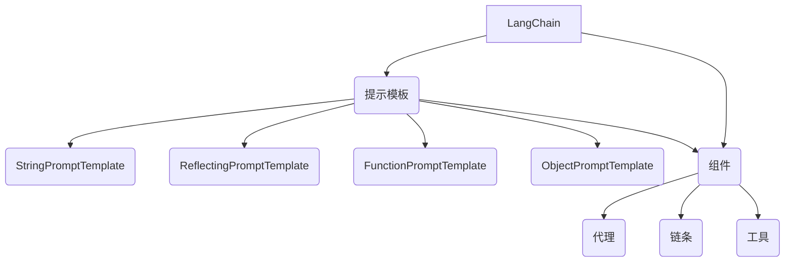

# 【LangChain编程：从入门到实践】自定义提示模板

## 1. 背景介绍

### 1.1 什么是LangChain?

LangChain是一个用于构建应用程序的框架,旨在与大型语言模型(LLM)进行交互。它为开发人员提供了一种简单、一致和可扩展的方式来构建各种基于LLM的应用程序,如问答系统、总结工具、代码生成器等。LangChain可以与多种LLM进行集成,如OpenAI的GPT-3、Anthropic的Claude、Google的PaLM等。

### 1.2 自定义提示模板的重要性

在与LLM交互时,提示(Prompt)质量对模型输出的准确性和相关性至关重要。自定义提示模板可以帮助您优化提示,从而获得更好的结果。通过定制提示模板,您可以:

- 提供更多上下文和指导,以获得更准确和相关的输出
- 减少LLM输出中的偏差和不当内容
- 提高输出的一致性和可重复性
- 简化提示构建过程,提高开发效率

### 1.3 LangChain提示模板功能概述

LangChain提供了多种方式来自定义提示模板,包括:

- 基本字符串模板
- 基于反射的模板
- 基于函数的模板
- 基于对象的模板

这些模板可以与LangChain的各种组件(如代理、链条、工具等)集成,为您提供灵活的自定义选项。

## 2. 核心概念与联系

### 2.1 提示(Prompt)

提示是与LLM交互的基础。它是一段文本,用于指导LLM生成所需的输出。提示可以包括指令、上下文信息、示例输入/输出等。

### 2.2 提示模板(Prompt Template)

提示模板是一种结构化的方式来构建提示。它允许您定义提示的不同部分,如指令、输入变量等。提示模板可以使提示构建过程更加简单和一致。

### 2.3 LangChain组件

LangChain提供了多种组件来构建LLM应用程序,如:

- **代理(Agents)**: 代理是一种高级抽象,可以根据指令自主地计划和执行任务。
- **链条(Chains)**: 链条是一系列可组合的组件,用于处理特定任务。
- **工具(Tools)**: 工具是可由代理或链条调用的外部资源,如网络API、数据库等。

提示模板可以与这些组件集成,以自定义与LLM的交互方式。

### 2.4 LangChain提示模板类

LangChain提供了多种提示模板类,每种类型都有其特定的用途和功能。以下是一些常用的提示模板类:

- `StringPromptTemplate`: 基于字符串的简单模板
- `ReflectingPromptTemplate`: 基于反射的模板,可自动填充输入变量
- `FunctionPromptTemplate`: 基于函数的模板,可自定义提示构建逻辑
- `ObjectPromptTemplate`: 基于对象的模板,支持复杂的提示结构

这些提示模板类可以单独使用,也可以相互组合以满足不同的需求。



## 3. 核心算法原理具体操作步骤

### 3.1 基本字符串模板

`StringPromptTemplate`是最基本的提示模板类,它允许您使用Python字符串格式化语法来构建提示。

```python
from langchain.prompts import StringPromptTemplate

prompt = StringPromptTemplate(
    template="请给出一个{adjective}的{subject}的例子。"
)

output = prompt.format(adjective="有趣的", subject="编程语言")
print(output)
# 输出: 请给出一个有趣的编程语言的例子。
```

在上面的示例中,我们定义了一个包含两个占位符(`{adjective}`和`{subject}`)的字符串模板。然后,我们使用`format`方法将占位符替换为实际值。

### 3.2 基于反射的模板

`ReflectingPromptTemplate`是一种更高级的提示模板,它可以自动填充输入变量。这对于处理具有多个输入参数的复杂提示非常有用。

```python
from langchain.prompts import ReflectingPromptTemplate

class Person:
    def __init__(self, name, age):
        self.name = name
        self.age = age

person = Person("Alice", 30)

prompt = ReflectingPromptTemplate(
    input_variables=["person"],
    template="这是一个{person.age}岁的人,名叫{person.name}。"
)

output = prompt.format(person=person)
print(output)
# 输出: 这是一个30岁的人,名叫Alice。
```

在上面的示例中,我们定义了一个`Person`类,并创建了一个`ReflectingPromptTemplate`实例。`input_variables`参数指定了需要填充的输入变量。模板字符串中的`{person.age}`和`{person.name}`将被自动替换为相应的属性值。

### 3.3 基于函数的模板

`FunctionPromptTemplate`允许您使用自定义函数来构建提示。这为您提供了最大的灵活性,可以实现复杂的提示构建逻辑。

```python
from langchain.prompts import FunctionPromptTemplate

def prompt_template(subject, adjective):
    return f"请给出一个{adjective}的{subject}的例子。"

prompt = FunctionPromptTemplate(
    template=prompt_template,
    input_variables=["subject", "adjective"]
)

output = prompt.format(subject="编程语言", adjective="有趣的")
print(output)
# 输出: 请给出一个有趣的编程语言的例子。
```

在上面的示例中,我们定义了一个`prompt_template`函数,用于构建提示字符串。然后,我们创建了一个`FunctionPromptTemplate`实例,并指定了`template`和`input_variables`参数。`format`方法将自动调用`prompt_template`函数,并用提供的输入值替换占位符。

### 3.4 基于对象的模板

`ObjectPromptTemplate`是最灵活的提示模板类,它允许您使用对象来定义提示的结构。这对于构建复杂的提示非常有用。

```python
from langchain.prompts import ObjectPromptTemplate, StringPromptTemplate

object_prompt = ObjectPromptTemplate(
    template="这是一个{person_info}的人,名叫{name}。",
    input_variables=["person_info", "name"],
    partial_variables={"person_info": "年龄为{age}岁"}
)

name_prompt = StringPromptTemplate(
    template="Alice",
    input_variables=["name"]
)

age_prompt = StringPromptTemplate(
    template="30",
    input_variables=["age"]
)

output = object_prompt.format(
    person_info=age_prompt.format(age=30),
    name=name_prompt.format()
)
print(output)
# 输出: 这是一个年龄为30岁的人,名叫Alice。
```

在上面的示例中,我们定义了一个`ObjectPromptTemplate`实例,它包含一个主模板和两个子模板(`name_prompt`和`age_prompt`)。主模板使用`{person_info}`和`{name}`占位符,而`person_info`占位符又被`age_prompt`的输出替换。这种嵌套结构允许您构建复杂的提示。

## 4. 数学模型和公式详细讲解举例说明

在自然语言处理(NLP)领域,提示模板的构建可以借鉴一些数学模型和公式,以更好地理解和优化提示的结构和效果。

### 4.1 信息论和熵(Entropy)

在信息论中,熵是一个度量信息含量或不确定性的概念。在提示模板设计中,我们可以借鉴熵的概念来衡量提示的信息丰富度和清晰度。

熵公式:

$$
H(X) = -\sum_{i=1}^{n} P(x_i) \log_2 P(x_i)
$$

其中,`X`是一个离散随机变量,`n`是可能值的数量,`P(x_i)`是`X`取值`x_i`的概率。

一个高熵的提示模板通常包含更多的信息和上下文,可以帮助LLM生成更准确和相关的输出。相反,一个低熵的提示模板可能会导致LLM产生不相关或模糊的输出。

### 4.2 语言模型和概率

提示模板的构建也可以借鉴语言模型和概率理论。我们可以将提示模板视为一个条件概率问题,即给定提示`P`,我们希望LLM生成期望的输出`Y`。

条件概率公式:

$$
P(Y|P) = \frac{P(P|Y)P(Y)}{P(P)}
$$

其中,`P(Y|P)`是给定提示`P`时生成输出`Y`的概率,`P(P|Y)`是给定输出`Y`时观察到提示`P`的概率,`P(Y)`是输出`Y`的先验概率,`P(P)`是提示`P`的边际概率。

通过优化提示模板,我们可以最大化`P(Y|P)`的值,从而提高LLM生成期望输出的概率。这可能涉及调整提示的结构、添加更多上下文信息或示例等。

### 4.3 序列到序列模型

许多LLM都是基于序列到序列(Seq2Seq)模型,这种模型将输入序列映射到输出序列。在提示模板设计中,我们可以将提示视为输入序列,而LLM的输出则是目标序列。

Seq2Seq模型通常使用注意力机制来捕获输入和输出序列之间的依赖关系。通过优化提示模板,我们可以帮助模型更好地关注相关信息,从而生成更准确的输出。

例如,我们可以在提示中添加特殊标记或关键词,以引导模型关注特定的任务或输出类型。

## 5. 项目实践:代码实例和详细解释说明

在本节中,我们将通过一个实际项目来演示如何在LangChain中使用自定义提示模板。我们将构建一个简单的问答系统,用于回答有关编程语言的问题。

### 5.1 项目设置

首先,我们需要安装LangChain和OpenAI的Python库:

```bash
pip install langchain openai
```

然后,在Python脚本中导入必要的模块:

```python
import os
from langchain.llms import OpenAI
from langchain.prompts import PromptTemplate
from langchain.chains import LLMChain
```

### 5.2 定义提示模板

我们将使用`PromptTemplate`来定义提示模板。在这个示例中,我们将使用一个基本的字符串模板:

```python
prompt_template = PromptTemplate(
    input_variables=["question"],
    template="请回答以下关于编程语言的问题:\n{question}"
)
```

这个提示模板将接受一个名为`question`的输入变量,并将其插入到模板字符串中。

### 5.3 创建LLM实例

接下来,我们需要创建一个LLM实例。在这个示例中,我们将使用OpenAI的GPT-3模型:

```python
llm = OpenAI(temperature=0.7)
```

`temperature`参数控制了模型输出的随机性。较高的温度值会产生更多样化的输出,而较低的温度值会产生更保守和确定性的输出。

### 5.4 创建LLMChain实例

现在,我们可以创建一个`LLMChain`实例,将提示模板和LLM实例结合起来:

```python
chain = LLMChain(llm=llm, prompt=prompt_template)
```

`LLMChain`是LangChain中的一个组件,它将提示模板和LLM实例封装在一起,提供了一种简单的方式来与LLM交互。

### 5.5 使用LLMChain回答问题

最后,我们可以使用`LLMChain`实例来回答问题:

```python
question = "Python是一种什么类型的编程语言?"
result = chain.run(question)
print(result)
```

这将输出LLM生成的回答。

完整的代码如下:

```python
import os
from langchain.llms import OpenAI
from langchain.prompts import PromptTemplate
from langchain.chains import LLMChain

# 定义提示模板
prompt_template = PromptTemplate(
    input_variables=["question"],
    template="请回答以下关于编程语言的问题:\n{question}"
)

# 创建LLM实例
llm = OpenAI(temperature=0.7)

# 创建LLMChain实例
chain = LLMChain(llm=llm,