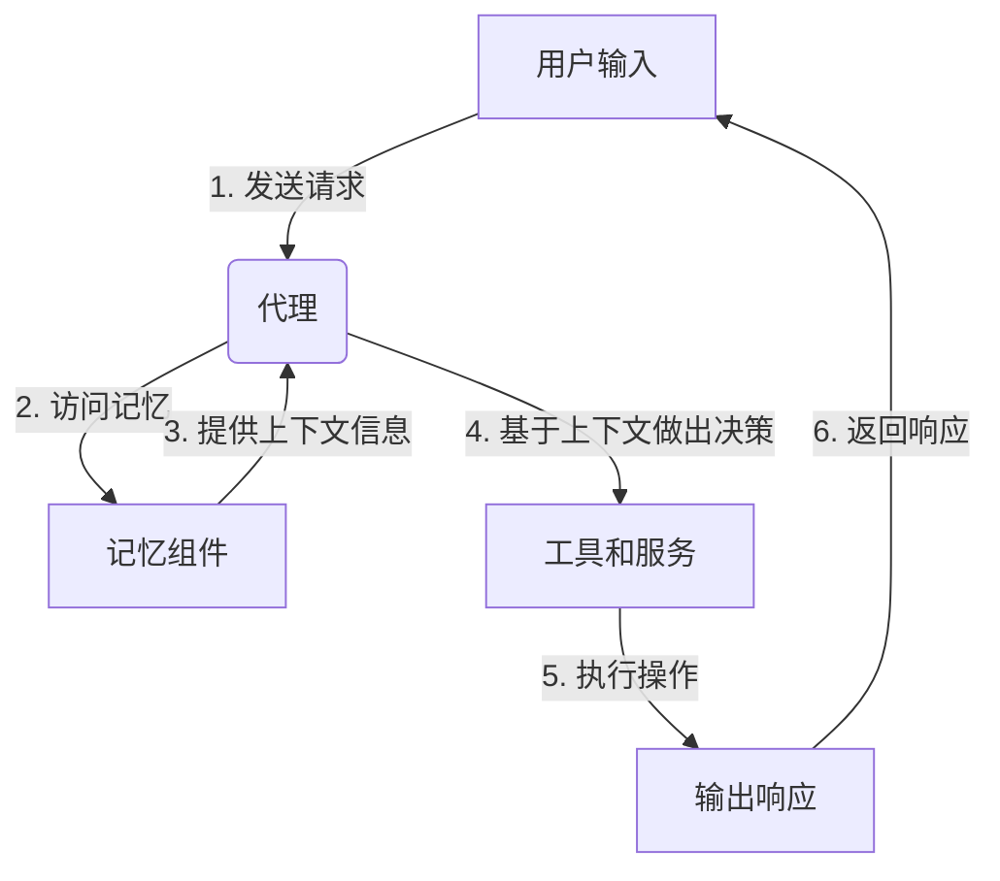

# 【LangChain编程：从入门到实践】记忆组件的应用

## 1. 背景介绍

在当前的人工智能时代，自然语言处理(NLP)已经成为一个热门领域。LangChain是一个强大的Python库,旨在构建可扩展和可组合的应用程序,以与大型语言模型(LLM)进行交互。其中,记忆组件是LangChain的一个关键特性,它允许您在对话过程中保存和检索上下文信息,从而提供更加连贯和相关的响应。

### 1.1 什么是记忆组件?

记忆组件是LangChain中的一个模块,它提供了一种机制来存储和检索与当前对话相关的信息。这种信息可以是先前的对话历史、外部数据源或任何其他相关上下文。通过记忆组件,LangChain可以更好地理解用户的意图,并提供更加准确和连贯的响应。

### 1.2 为什么需要记忆组件?

在与大型语言模型进行对话时,缺乏上下文信息可能会导致响应不连贯或不相关。例如,如果用户提到了一个之前讨论过的主题,但语言模型没有记住先前的对话历史,它可能会给出不相关或矛盾的回应。记忆组件通过保存和检索相关信息,可以帮助解决这个问题,从而提高对话质量和用户体验。

## 2. 核心概念与联系

### 2.1 记忆组件的类型

LangChain提供了多种记忆组件,每种组件都有其特定的用途和特点。以下是一些常见的记忆组件类型:

1. **ConversationBufferMemory**: 这是最基本的记忆组件,它简单地存储对话历史。每次用户发送新的消息时,它都会将消息添加到缓冲区中。

2. **ConversationBufferWindowMemory**: 这个组件类似于`ConversationBufferMemory`,但它只存储最近的一部分对话历史,以限制内存使用。

3. **ConversationEntityMemory**: 这个组件使用命名实体识别(NER)来提取对话中的关键实体(如人名、地名等),并将它们存储为记忆。

4. **ConversationSummaryMemory**: 这个组件使用摘要技术来生成对话历史的摘要,并将其存储为记忆。

5. **ConversationKGMemory**: 这个组件将对话历史转换为知识图谱(KG),并将其存储为记忆。

6. **VectorStoreRetrieverMemory**: 这个组件使用向量存储来存储和检索相关信息。它可以与各种向量存储(如FAISS、Weaviate等)集成。

这些只是LangChain中可用的一些记忆组件。您可以根据具体需求选择合适的组件,或者组合使用多个组件来满足不同的需求。

### 2.2 记忆组件与代理的关系

在LangChain中,记忆组件通常与代理(Agent)一起使用。代理是一个高级抽象,它可以根据目标和可用工具执行一系列操作。记忆组件为代理提供了上下文信息,使其能够做出更加明智的决策。

代理可以访问记忆组件中存储的信息,并将其用于各种任务,如问答、任务规划和决策制定。通过将记忆组件与代理结合使用,您可以构建更加智能和上下文感知的应用程序。



在上面的流程图中,用户输入被发送给代理。代理访问记忆组件以获取相关的上下文信息。基于这些信息,代理决定调用哪些工具和服务来执行所需的操作。最后,代理将结果输出为响应,并将其返回给用户。

## 3. 核心算法原理具体操作步骤

### 3.1 记忆组件的基本工作原理

记忆组件的基本工作原理可以概括为以下几个步骤:

1. **存储**: 记忆组件从对话历史、外部数据源或其他相关信息中提取并存储相关数据。

2. **检索**: 当代理需要上下文信息时,记忆组件会根据查询检索相关的数据。

3. **更新**: 每次新的对话或信息被添加时,记忆组件都会更新其存储的数据。

4. **过滤和排序**: 记忆组件可能会对检索到的数据进行过滤和排序,以提供最相关的信息。

不同类型的记忆组件可能会在具体实现上有所不同,但它们都遵循这个基本原理。

### 3.2 记忆组件的具体操作步骤

以`ConversationBufferMemory`为例,我们来看看记忆组件的具体操作步骤:

1. **初始化**: 首先,我们需要创建一个`ConversationBufferMemory`实例:

```python
from langchain.memory import ConversationBufferMemory

memory = ConversationBufferMemory()
```

2. **存储对话历史**: 每次用户发送新的消息时,我们将其添加到记忆组件中:

```python
human_input = "Hello, how are you?"
memory.save_context({"input": human_input}, human_input)
```

3. **检索上下文信息**: 当代理需要上下文信息时,它可以从记忆组件中检索相关数据:

```python
context = memory.load_memory_variables({})
```

4. **更新记忆**: 在对话过程中,记忆组件会持续更新存储的信息:

```python
ai_response = "I'm doing well, thank you for asking!"
memory.save_context({"output": ai_response}, human_input)
```

5. **重复步骤2-4**: 对于每个新的用户输入和代理响应,重复步骤2-4以持续更新记忆组件。

这只是一个简单的示例,但它说明了记忆组件的基本操作步骤。在实际应用中,您可能需要使用更复杂的记忆组件,并将其与代理和其他LangChain组件集成。

## 4. 数学模型和公式详细讲解举例说明

在讨论记忆组件时,我们可能会涉及到一些与信息检索和相似性计算相关的数学模型和公式。以下是一些常见的模型和公式:

### 4.1 向量空间模型 (Vector Space Model)

向量空间模型是一种常用的信息检索模型,它将文档表示为向量,并基于向量之间的相似性计算相关性。在这个模型中,每个文档被表示为一个向量,其中每个维度对应一个特征(通常是单词)的权重。

假设我们有一个包含$n$个唯一词项的文档集合,那么每个文档$d_i$可以表示为一个$n$维向量:

$$\vec{d_i} = (w_{i1}, w_{i2}, \dots, w_{in})$$

其中$w_{ij}$是词项$j$在文档$d_i$中的权重。常用的权重计算方法包括词频(TF)和词频-逆文档频率(TF-IDF)。

给定一个查询$q$和一个文档$d_i$,它们之间的相似性可以使用余弦相似度来计算:

$$\text{sim}(q, d_i) = \frac{\vec{q} \cdot \vec{d_i}}{|\vec{q}||\vec{d_i}|} = \frac{\sum_{j=1}^{n} q_j \cdot w_{ij}}{\sqrt{\sum_{j=1}^{n} q_j^2} \sqrt{\sum_{j=1}^{n} w_{ij}^2}}$$

其中$\vec{q}$是查询向量,而$\vec{d_i}$是文档向量。相似度值越高,表示查询和文档之间的相关性越高。

在LangChain中,`VectorStoreRetrieverMemory`组件使用向量空间模型来存储和检索相关信息。它将对话历史或其他上下文信息转换为向量,并使用相似性计算来检索最相关的信息。

### 4.2 BM25 模型

BM25是一种流行的信息检索模型,它考虑了词频、文档长度和查询词项的重要性等因素。BM25模型的公式如下:

$$\text{score}(D, Q) = \sum_{q \in Q} \text{IDF}(q) \cdot \frac{f(q, D) \cdot (k_1 + 1)}{f(q, D) + k_1 \cdot \left(1 - b + b \cdot \frac{|D|}{avgdl}\right)}$$

其中:

- $Q$是查询词项集合
- $D$是文档
- $f(q, D)$是词项$q$在文档$D$中出现的次数
- $|D|$是文档$D$的长度
- $avgdl$是文档集合中文档的平均长度
- $k_1$和$b$是调整参数,用于控制词频和文档长度的影响程度

$\text{IDF}(q)$是逆文档频率,用于衡量一个词项在整个文档集合中的重要性,它的计算公式如下:

$$\text{IDF}(q) = \log \frac{N - n(q) + 0.5}{n(q) + 0.5}$$

其中$N$是文档集合的总数,而$n(q)$是包含词项$q$的文档数量。

BM25模型综合考虑了多个因素,因此在许多信息检索任务中表现良好。在LangChain中,您可以使用`VectorStoreRetrieverMemory`组件并指定适当的相似性函数来利用BM25模型。

### 4.3 语义相似度模型

除了基于词袋模型的传统信息检索方法,我们还可以使用基于语义的相似度模型来计算查询和文档之间的相关性。这些模型通常利用预训练的语言模型来捕获单词的语义信息。

一种常见的语义相似度模型是基于transformer的双塔模型。在这种模型中,查询和文档分别通过两个独立的transformer编码器进行编码,生成对应的向量表示。然后,我们可以使用余弦相似度或其他相似性函数来计算这两个向量之间的相似性。

假设我们有一个查询$q$和一个文档$d$,它们分别被编码为向量$\vec{q}$和$\vec{d}$,那么它们之间的语义相似度可以用余弦相似度来计算:

$$\text{sim}_\text{semantic}(q, d) = \frac{\vec{q} \cdot \vec{d}}{|\vec{q}||\vec{d}|}$$

在LangChain中,您可以使用预训练的语言模型(如BERT、RoBERTa等)来计算语义相似度,并将其用于记忆组件的检索过程。这种方法可以提供更准确的相关性评估,尤其是在处理复杂的自然语言查询时。

通过利用这些数学模型和公式,记忆组件可以更有效地存储和检索相关信息,从而提高整个系统的性能和准确性。

## 5. 项目实践:代码实例和详细解释说明

在本节中,我们将通过一个实际的代码示例来演示如何在LangChain中使用记忆组件。我们将构建一个简单的问答系统,它可以根据对话历史提供相关的响应。

### 5.1 导入所需的库

首先,我们需要导入所需的库:

```python
from langchain.memory import ConversationBufferMemory
from langchain.llms import OpenAI
from langchain.chains import ConversationChain
```

在这个示例中,我们将使用`ConversationBufferMemory`作为记忆组件,`OpenAI`作为语言模型,以及`ConversationChain`来管理对话流程。

### 5.2 初始化记忆组件和语言模型

接下来,我们需要初始化记忆组件和语言模型:

```python
memory = ConversationBufferMemory()
llm = OpenAI(temperature=0)
```

我们创建了一个`ConversationBufferMemory`实例来存储对话历史,并使用`OpenAI`语言模型作为后端。`temperature`参数控制语言模型的输出多样性,我们将其设置为0以获得确定性的响应。

### 5.3 创建对话链

现在,我们可以创建一个`ConversationChain`实例,将记忆组件和语言模型集成到对话流程中:

```python
conversation = ConversationChain(llm=llm, memory=memory)
```

`ConversationChain`将管理对话的