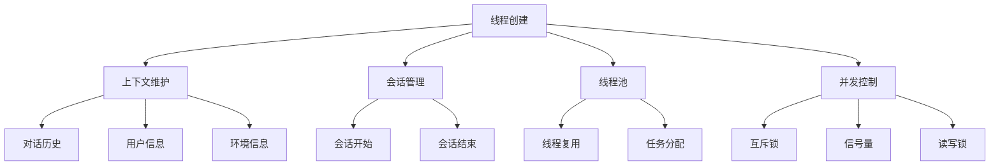

# 【大模型应用开发 动手做AI Agent】创建线程

## 1.背景介绍

随着人工智能技术的不断发展,大型语言模型(Large Language Model,LLM)已经成为当前最受关注的AI技术之一。这些模型通过在海量数据上进行预训练,获得了广博的知识和出色的自然语言理解与生成能力,在各种自然语言处理任务中表现出色。

然而,LLM只是一个基础模型,要将其应用于实际场景,还需要进行进一步的开发和部署。其中,创建线程(Thread Creation)是一个关键环节,它允许用户与LLM进行持续的对话交互,使得LLM可以根据上下文信息做出更加准确和连贯的响应。

本文将重点介绍如何在应用程序中创建线程,并与LLM进行交互,从而开发出功能强大的AI Agent。我们将探讨线程创建的核心概念、算法原理、实现细节,以及在实际应用中的最佳实践。无论您是AI开发者、软件工程师还是对人工智能感兴趣的爱好者,相信本文都能为您提供有价值的见解和指导。

## 2.核心概念与联系

在深入探讨线程创建的细节之前,我们需要先了解一些核心概念及其相互关系:

### 2.1 线程(Thread)

线程是操作系统能够进行运算调度的最小单元。它包含了指令寄存器、堆栈、程序计数器等,是一个独立的执行流。通过创建多个线程,应用程序可以实现并发执行,提高效率和响应能力。

### 2.2 上下文(Context)

上下文指的是当前对话的状态信息,包括对话历史、用户信息、环境信息等。保持上下文的连贯性对于LLM做出准确响应至关重要。在创建线程时,需要为每个线程维护一个独立的上下文信息。

### 2.3 会话(Session)

会话是指用户与应用程序之间的一次交互过程。在会话期间,用户可以与LLM进行多轮对话,每次对话都会更新上下文信息。会话结束后,相关的上下文信息可以被保存或者丢弃。

### 2.4 线程池(Thread Pool)

线程池是一种线程管理机制,它预先创建了若干个线程,并将它们缓存起来。当有新的任务到来时,线程池会从缓存中取出一个线程执行任务,任务执行完毕后线程会被归还到线程池中。线程池可以提高系统的响应速度,减少线程创建和销毁的开销。

### 2.5 并发控制(Concurrency Control)

由于多个线程可能会同时访问共享资源(如上下文信息),因此需要进行并发控制,以避免出现竞态条件和数据不一致等问题。常见的并发控制机制包括互斥锁、信号量、读写锁等。

上述概念相互关联,共同构成了线程创建及其在LLM应用中的基础架构。下面我们将详细介绍线程创建的核心算法原理和具体实现步骤。



## 3.核心算法原理具体操作步骤

### 3.1 线程创建算法

线程创建算法的核心思想是为每个新的会话创建一个独立的线程,并为该线程分配一个独立的上下文信息。算法的具体步骤如下:

1. 接收新的会话请求
2. 从线程池中获取一个空闲线程,如果线程池中没有空闲线程,则创建一个新线程
3. 为该线程分配一个新的上下文信息对象
4. 将会话请求与线程及其上下文信息进行绑定
5. 启动线程,开始处理会话请求

在处理会话请求的过程中,线程需要不断更新其上下文信息,以反映当前对话的状态。当会话结束时,线程会将上下文信息保存或者丢弃,并将自身归还到线程池中,等待下一个任务的分配。

### 3.2 上下文维护算法

上下文维护算法的目标是为每个线程保持一个独立的、连贯的上下文信息。算法的具体步骤如下:

1. 在线程创建时,为该线程分配一个新的上下文信息对象
2. 在会话过程中,每次接收到新的用户输入时,将其添加到上下文信息的对话历史中
3. 根据对话历史、用户信息、环境信息等,更新上下文信息的其他部分
4. 将更新后的上下文信息传递给LLM,以生成响应
5. 将LLM的响应添加到对话历史中
6. 重复步骤3-5,直到会话结束

通过上述算法,每个线程都维护着一个独立的上下文信息,从而确保LLM的响应是基于当前会话的完整上下文,避免了上下文混淆的问题。

### 3.3 线程池管理算法

线程池管理算法的目标是高效地复用线程,减少线程创建和销毁的开销。算法的具体步骤如下:

1. 初始化线程池,设置线程池的大小(最小线程数和最大线程数)
2. 当有新的任务到来时:
    a. 如果线程池中有空闲线程,则从线程池中取出一个空闲线程执行任务
    b. 如果线程池中没有空闲线程,且当前线程数小于最大线程数,则创建一个新线程执行任务
    c. 如果线程池中没有空闲线程,且当前线程数已达到最大线程数,则将任务加入队列,等待空闲线程
3. 当任务执行完毕时,线程会将自身归还到线程池中,等待下一个任务的分配

通过线程池管理算法,我们可以复用已创建的线程,避免了频繁创建和销毁线程带来的开销,从而提高了系统的响应速度和效率。

### 3.4 并发控制算法

由于多个线程可能会同时访问共享资源(如上下文信息),因此需要进行并发控制,以避免出现竞态条件和数据不一致等问题。常见的并发控制算法包括:

1. **互斥锁(Mutex)算法**:
    a. 每个共享资源都有一个相关联的互斥锁
    b. 线程在访问共享资源之前,必须先获取该资源的互斥锁
    c. 只有一个线程可以持有该互斥锁
    d. 线程访问完共享资源后,必须释放互斥锁

2. **信号量(Semaphore)算法**:
    a. 每个共享资源都有一个相关联的信号量
    b. 信号量的初始值表示可以同时访问该资源的线程数
    c. 线程在访问共享资源之前,必须先获取信号量
    d. 如果信号量的值大于0,则线程可以访问资源,并将信号量值减1
    e. 如果信号量的值为0,则线程需要等待,直到有其他线程释放信号量
    f. 线程访问完共享资源后,必须释放信号量

3. **读写锁(Reader-Writer Lock)算法**:
    a. 每个共享资源都有一个相关联的读写锁
    b. 读锁和写锁是互斥的,即不能同时持有读锁和写锁
    c. 多个线程可以同时持有读锁,但只有一个线程可以持有写锁
    d. 线程在读取共享资源时,必须先获取读锁
    e. 线程在修改共享资源时,必须先获取写锁
    f. 线程访问完共享资源后,必须释放相应的锁

通过上述并发控制算法,我们可以确保多个线程在访问共享资源时不会产生冲突,从而保证了数据的一致性和正确性。

## 4.数学模型和公式详细讲解举例说明

在线程创建和管理过程中,我们可以使用一些数学模型和公式来量化和优化系统的性能。下面我们将介绍几个常见的模型和公式。

### 4.1 小批量响应时间模型

在处理大量会话请求时,我们通常会将请求分成多个小批量(Mini-Batch)进行处理,以提高效率。小批量响应时间模型可以帮助我们估计处理一个小批量所需的时间,从而优化批量大小和资源分配。

假设一个小批量包含 $N$ 个请求,每个请求的平均处理时间为 $t_p$,小批量的响应时间 $T$ 可以表示为:

$$T = N \times t_p + t_o$$

其中 $t_o$ 是一些固定的开销时间,如数据传输时间、上下文加载时间等。

通过调整小批量大小 $N$,我们可以在响应时间和吞吐量之间进行权衡。较大的 $N$ 可以提高吞吐量,但也会增加响应时间;较小的 $N$ 则可以减小响应时间,但吞吐量会降低。

### 4.2 线程池大小优化模型

合理设置线程池的大小对于提高系统的响应能力和资源利用率至关重要。我们可以使用下面的模型来确定最佳的线程池大小:

假设系统的总任务到达率为 $\lambda$,任务的平均服务时间为 $1/\mu$,线程池的大小为 $N$,则系统的响应时间 $R$ 可以表示为:

$$R = \frac{1}{\mu - \lambda} + \frac{\lambda}{N\mu(\mu - \lambda)}$$

我们可以通过求解上式,找到使响应时间 $R$ 最小化的线程池大小 $N$。

### 4.3 并发控制开销模型

并发控制机制(如互斥锁、信号量等)虽然可以保证数据的正确性,但也会带来一定的开销。我们可以使用下面的模型来估计并发控制的开销:

假设一个线程在获取锁时的平均等待时间为 $t_w$,在持有锁期间的平均执行时间为 $t_h$,则该线程的总执行时间 $T$ 可以表示为:

$$T = t_w + t_h$$

如果有 $N$ 个线程同时竞争同一个锁,那么总的执行时间 $T_{\text{total}}$ 可以表示为:

$$T_{\text{total}} = N \times t_w + t_h$$

通过分析上述模型,我们可以发现,减小线程数 $N$ 和等待时间 $t_w$ 是降低并发控制开销的关键。我们可以通过优化锁的粒度、使用更高效的锁算法等方式来实现这一目标。

以上是一些常见的数学模型和公式,它们可以帮助我们量化和优化线程创建及其相关过程的性能。在实际应用中,我们还需要结合具体的场景和需求,进行进一步的建模和分析。

## 5.项目实践:代码实例和详细解释说明

为了更好地理解线程创建的实现细节,我们将提供一个基于Python的代码示例,并对其进行详细的解释说明。

### 5.1 代码结构

```
.
├── agent.py
├── context.py
├── thread_pool.py
└── utils.py
```

- `agent.py`: 实现了AI Agent的核心逻辑,包括接收用户输入、调用LLM生成响应、维护会话上下文等功能。
- `context.py`: 定义了上下文信息的数据结构和相关操作。
- `thread_pool.py`: 实现了线程池的创建和管理。
- `utils.py`: 包含一些通用的工具函数。

### 5.2 上下文信息(context.py)

```python
class Context:
    def __init__(self, user_id):
        self.user_id = user_id
        self.history = []
        self.metadata = {}

    def add_message(self, role, content):
        self.history.append({"role": role, "content": content})

    def get_history(self):
        return self.history

    def set_metadata(self, key, value):
        self.metadata[key] = value

    def get_metadata