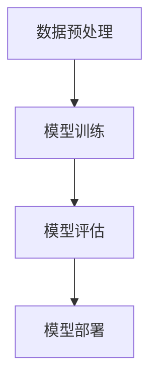

# 【大模型应用开发 动手做AI Agent】第三轮思考：模型完成任务

## 1.背景介绍

在人工智能领域，AI Agent（智能代理）已经成为一个热门话题。随着大模型（如GPT-4、BERT等）的发展，AI Agent的能力得到了显著提升。大模型不仅能够理解和生成自然语言，还能完成复杂的任务，如编写代码、进行数据分析、甚至是自动化决策。本文将深入探讨如何利用大模型开发AI Agent，并详细介绍其核心概念、算法原理、数学模型、项目实践、实际应用场景、工具和资源、未来发展趋势与挑战，以及常见问题与解答。

## 2.核心概念与联系

### 2.1 大模型

大模型是指具有大量参数和复杂结构的深度学习模型，如GPT-4、BERT等。这些模型通过大量数据训练，能够理解和生成自然语言，具有强大的泛化能力。

### 2.2 AI Agent

AI Agent是指能够自主感知环境、做出决策并执行任务的智能系统。AI Agent通常由感知模块、决策模块和执行模块组成。

### 2.3 大模型与AI Agent的联系

大模型为AI Agent提供了强大的自然语言处理能力，使其能够更好地理解任务需求和环境信息，从而做出更准确的决策。

## 3.核心算法原理具体操作步骤

### 3.1 数据预处理

数据预处理是大模型训练的第一步。包括数据清洗、数据标注和数据增强等步骤。

### 3.2 模型训练

模型训练是指通过大量数据对大模型进行训练，使其能够学习数据中的模式和规律。常用的训练算法包括梯度下降、Adam优化器等。

### 3.3 模型评估

模型评估是指通过测试数据对训练好的模型进行评估，衡量其性能。常用的评估指标包括准确率、召回率、F1值等。

### 3.4 模型部署

模型部署是指将训练好的模型应用到实际环境中，使其能够实时处理任务。常用的部署工具包括TensorFlow Serving、Docker等。



## 4.数学模型和公式详细讲解举例说明

### 4.1 梯度下降算法

梯度下降算法是大模型训练的核心算法之一。其基本思想是通过不断调整模型参数，使损失函数达到最小值。

$$
\theta = \theta - \alpha \nabla J(\theta)
$$

其中，$\theta$ 表示模型参数，$\alpha$ 表示学习率，$J(\theta)$ 表示损失函数。

### 4.2 Adam优化器

Adam优化器是梯度下降算法的一种改进版本，能够更快地收敛到最优解。

$$
m_t = \beta_1 m_{t-1} + (1 - \beta_1) g_t
$$

$$
v_t = \beta_2 v_{t-1} + (1 - \beta_2) g_t^2
$$

$$
\hat{m}_t = \frac{m_t}{1 - \beta_1^t}
$$

$$
\hat{v}_t = \frac{v_t}{1 - \beta_2^t}
$$

$$
\theta_t = \theta_{t-1} - \alpha \frac{\hat{m}_t}{\sqrt{\hat{v}_t} + \epsilon}
$$

其中，$m_t$ 和 $v_t$ 分别表示一阶和二阶动量，$\beta_1$ 和 $\beta_2$ 是动量衰减系数，$\epsilon$ 是一个小常数。

## 5.项目实践：代码实例和详细解释说明

### 5.1 数据预处理

```python
import pandas as pd
from sklearn.model_selection import train_test_split

# 读取数据
data = pd.read_csv('data.csv')

# 数据清洗
data = data.dropna()

# 数据标注
data['label'] = data['text'].apply(lambda x: 1 if 'positive' in x else 0)

# 数据增强
data['text'] = data['text'].apply(lambda x: x + ' augmented')

# 划分训练集和测试集
train_data, test_data = train_test_split(data, test_size=0.2)
```

### 5.2 模型训练

```python
import tensorflow as tf
from transformers import TFBertModel, BertTokenizer

# 加载预训练模型和分词器
tokenizer = BertTokenizer.from_pretrained('bert-base-uncased')
model = TFBertModel.from_pretrained('bert-base-uncased')

# 数据编码
train_encodings = tokenizer(train_data['text'].tolist(), truncation=True, padding=True)
test_encodings = tokenizer(test_data['text'].tolist(), truncation=True, padding=True)

# 构建数据集
train_dataset = tf.data.Dataset.from_tensor_slices((
    dict(train_encodings),
    train_data['label'].tolist()
))
test_dataset = tf.data.Dataset.from_tensor_slices((
    dict(test_encodings),
    test_data['label'].tolist()
))

# 模型编译
model.compile(optimizer=tf.keras.optimizers.Adam(learning_rate=5e-5),
              loss=tf.keras.losses.SparseCategoricalCrossentropy(from_logits=True),
              metrics=['accuracy'])

# 模型训练
model.fit(train_dataset.shuffle(1000).batch(32), epochs=3, batch_size=32)
```

### 5.3 模型评估

```python
# 模型评估
loss, accuracy = model.evaluate(test_dataset.batch(32))
print(f'Loss: {loss}, Accuracy: {accuracy}')
```

### 5.4 模型部署

```python
import tensorflow as tf
import tensorflow_serving.apis.predict_pb2 as predict_pb2
import tensorflow_serving.apis.prediction_service_pb2_grpc as prediction_service_pb2_grpc
import grpc

# 模型保存
model.save('saved_model/my_model')

# 模型加载
loaded_model = tf.keras.models.load_model('saved_model/my_model')

# 模型预测
def predict(text):
    encodings = tokenizer(text, truncation=True, padding=True, return_tensors='tf')
    predictions = loaded_model(encodings)
    return tf.nn.softmax(predictions.logits, axis=-1)

# gRPC客户端
channel = grpc.insecure_channel('localhost:8500')
stub = prediction_service_pb2_grpc.PredictionServiceStub(channel)

def grpc_predict(text):
    request = predict_pb2.PredictRequest()
    request.model_spec.name = 'my_model'
    request.inputs['input_ids'].CopyFrom(tf.make_tensor_proto(tokenizer.encode(text, truncation=True, padding=True)))
    result = stub.Predict(request, 10.0)
    return result
```

## 6.实际应用场景

### 6.1 客服机器人

利用大模型开发的AI Agent可以用于客服机器人，能够自动回答用户问题，提高客服效率。

### 6.2 智能推荐系统

AI Agent可以根据用户行为数据，利用大模型进行分析和预测，为用户推荐个性化内容。

### 6.3 自动化决策系统

在金融、医疗等领域，AI Agent可以利用大模型进行数据分析和自动化决策，提高决策的准确性和效率。

## 7.工具和资源推荐

### 7.1 开发工具

- TensorFlow：一个开源的机器学习框架，支持大规模分布式训练和推理。
- PyTorch：一个开源的深度学习框架，具有灵活的动态计算图和强大的社区支持。
- Hugging Face Transformers：一个开源的自然语言处理库，提供了大量预训练的大模型。

### 7.2 数据集

- IMDB：一个电影评论数据集，常用于情感分析任务。
- SQuAD：一个问答数据集，常用于阅读理解任务。
- COCO：一个图像数据集，常用于图像分类和目标检测任务。

### 7.3 学习资源

- 《深度学习》：一本经典的深度学习教材，详细介绍了深度学习的基本概念和算法。
- Coursera：一个在线学习平台，提供了大量的机器学习和深度学习课程。
- GitHub：一个开源代码托管平台，提供了大量的机器学习和深度学习项目代码。

## 8.总结：未来发展趋势与挑战

### 8.1 未来发展趋势

随着大模型的不断发展，AI Agent的能力将会越来越强。未来，AI Agent将能够处理更加复杂的任务，如多模态数据处理、跨领域知识整合等。同时，AI Agent的应用场景也将更加广泛，如智能家居、自动驾驶、智能医疗等。

### 8.2 挑战

尽管大模型和AI Agent具有巨大的潜力，但也面临一些挑战。首先，大模型的训练和推理需要大量的计算资源，成本较高。其次，大模型的黑箱特性使得其决策过程难以解释，存在一定的风险。最后，数据隐私和安全问题也是一个重要的挑战，需要在开发和应用过程中加以重视。

## 9.附录：常见问题与解答

### 9.1 大模型的训练需要多长时间？

大模型的训练时间取决于数据量、模型复杂度和计算资源。一般来说，训练一个大模型可能需要几天到几周的时间。

### 9.2 如何选择合适的大模型？

选择大模型时需要考虑任务需求、数据量和计算资源。对于自然语言处理任务，可以选择GPT-4、BERT等预训练模型；对于图像处理任务，可以选择ResNet、EfficientNet等预训练模型。

### 9.3 如何提高大模型的训练效率？

可以通过数据并行、模型并行和混合精度训练等方法提高大模型的训练效率。同时，选择合适的优化器和学习率调度策略也可以加快模型的收敛速度。

### 9.4 如何解决大模型的过拟合问题？

可以通过增加数据量、使用数据增强技术、正则化方法（如L2正则化、Dropout）等手段来解决大模型的过拟合问题。

### 9.5 如何解释大模型的决策过程？

可以通过可解释性技术（如注意力机制、特征重要性分析）来解释大模型的决策过程。同时，开发透明的模型架构和算法也是提高模型可解释性的重要手段。

---

作者：禅与计算机程序设计艺术 / Zen and the Art of Computer Programming