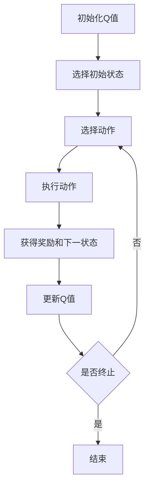

# 一切皆是映射：AI Q-learning在图片分割中的应用

## 1.背景介绍

在计算机视觉领域，图片分割是一项关键任务。它不仅在医学影像分析、自动驾驶、遥感图像处理等领域有着广泛的应用，还为图像理解和物体识别提供了基础。传统的图片分割方法，如阈值分割、区域生长和边缘检测等，虽然在某些特定场景下表现良好，但在处理复杂图像时往往力不从心。随着深度学习的兴起，基于卷积神经网络（CNN）的图片分割方法，如U-Net和Mask R-CNN，取得了显著的进展。然而，这些方法通常需要大量标注数据和计算资源。

Q-learning作为一种强化学习算法，最初用于解决马尔可夫决策过程（MDP）中的最优策略问题。近年来，研究人员开始探索将Q-learning应用于图片分割任务，试图通过智能体在图像上进行动作选择和状态转移，实现高效的图片分割。

## 2.核心概念与联系

### 2.1 强化学习与Q-learning

强化学习（Reinforcement Learning, RL）是一种通过与环境交互来学习策略的机器学习方法。智能体通过在环境中采取动作，获得奖励或惩罚，从而学习到最优策略。Q-learning是一种无模型的强化学习算法，通过学习状态-动作值函数（Q函数）来估计每个状态-动作对的期望回报。

### 2.2 图片分割

图片分割是将图像划分为若干个互不重叠的区域，使得每个区域内的像素具有相似的特征。图片分割的目标是将图像中的感兴趣区域（如物体、背景等）准确地分离出来。

### 2.3 Q-learning与图片分割的联系

在图片分割任务中，可以将图像视为一个环境，智能体在图像上进行动作（如标记像素、区域合并等），通过与环境的交互来学习最优的分割策略。Q-learning通过不断更新Q值，逐步逼近最优策略，从而实现高效的图片分割。

## 3.核心算法原理具体操作步骤

### 3.1 状态表示

在图片分割任务中，状态可以表示为当前图像的分割情况。例如，可以将图像划分为若干个超像素，每个超像素的标记状态作为当前状态。

### 3.2 动作选择

智能体在每个状态下可以选择不同的动作，如标记某个超像素、合并两个超像素等。动作的选择可以基于ε-贪婪策略，即以一定概率选择最优动作，以一定概率选择随机动作。

### 3.3 奖励函数

奖励函数用于评估智能体在某个状态下采取某个动作的好坏。可以根据分割结果的准确性、边界平滑度等指标来设计奖励函数。例如，当智能体正确标记一个超像素时，给予正奖励；当智能体错误标记时，给予负奖励。

### 3.4 Q值更新

Q-learning通过不断更新Q值来逼近最优策略。Q值的更新公式为：

$$
Q(s, a) \leftarrow Q(s, a) + \alpha [r + \gamma \max_{a'} Q(s', a') - Q(s, a)]
$$

其中，$s$为当前状态，$a$为当前动作，$r$为即时奖励，$s'$为下一状态，$a'$为下一动作，$\alpha$为学习率，$\gamma$为折扣因子。

### 3.5 算法流程图



## 4.数学模型和公式详细讲解举例说明

### 4.1 马尔可夫决策过程

图片分割任务可以建模为一个马尔可夫决策过程（MDP），其定义为一个五元组 $(S, A, P, R, \gamma)$，其中：
- $S$：状态空间，表示所有可能的分割情况。
- $A$：动作空间，表示智能体可以采取的所有动作。
- $P$：状态转移概率，表示在状态$s$下采取动作$a$后转移到状态$s'$的概率。
- $R$：奖励函数，表示在状态$s$下采取动作$a$后获得的奖励。
- $\gamma$：折扣因子，表示未来奖励的折扣率。

### 4.2 Q值更新公式

Q-learning的核心在于Q值的更新，其公式为：

$$
Q(s, a) \leftarrow Q(s, a) + \alpha [r + \gamma \max_{a'} Q(s', a') - Q(s, a)]
$$

其中：
- $Q(s, a)$：状态$s$下采取动作$a$的Q值。
- $\alpha$：学习率，控制Q值更新的步长。
- $r$：即时奖励，表示在状态$s$下采取动作$a$后获得的奖励。
- $\gamma$：折扣因子，表示未来奖励的折扣率。
- $\max_{a'} Q(s', a')$：下一状态$s'$下的最大Q值。

### 4.3 举例说明

假设有一个简单的图片分割任务，图像被划分为若干个超像素。智能体的目标是将图像中的前景和背景分离出来。初始状态下，所有超像素未被标记。智能体可以选择标记某个超像素为前景或背景。奖励函数设计为：正确标记一个超像素，奖励+1；错误标记，奖励-1。

在某个状态$s$下，智能体选择动作$a$，标记一个超像素为前景。根据奖励函数，智能体获得即时奖励$r$。然后，智能体转移到下一状态$s'$，并根据Q值更新公式更新Q值。通过不断迭代，智能体逐步学习到最优的分割策略。

## 5.项目实践：代码实例和详细解释说明

### 5.1 环境设置

首先，确保安装了必要的Python库，如numpy、opencv和scikit-learn。

```python
import numpy as np
import cv2
from sklearn.cluster import KMeans
```

### 5.2 数据预处理

加载图像并进行预处理，如灰度化和超像素划分。

```python
def preprocess_image(image_path):
    image = cv2.imread(image_path)
    gray_image = cv2.cvtColor(image, cv2.COLOR_BGR2GRAY)
    return gray_image

def segment_image(image, n_segments=100):
    height, width = image.shape
    pixels = image.reshape(-1, 1)
    kmeans = KMeans(n_clusters=n_segments, random_state=0).fit(pixels)
    labels = kmeans.labels_.reshape(height, width)
    return labels
```

### 5.3 Q-learning算法实现

定义Q-learning算法的核心函数，包括Q值更新和动作选择。

```python
class QLearningAgent:
    def __init__(self, n_states, n_actions, alpha=0.1, gamma=0.9, epsilon=0.1):
        self.n_states = n_states
        self.n_actions = n_actions
        self.alpha = alpha
        self.gamma = gamma
        self.epsilon = epsilon
        self.q_table = np.zeros((n_states, n_actions))

    def choose_action(self, state):
        if np.random.rand() < self.epsilon:
            return np.random.randint(self.n_actions)
        else:
            return np.argmax(self.q_table[state])

    def update_q_value(self, state, action, reward, next_state):
        best_next_action = np.argmax(self.q_table[next_state])
        td_target = reward + self.gamma * self.q_table[next_state, best_next_action]
        td_error = td_target - self.q_table[state, action]
        self.q_table[state, action] += self.alpha * td_error
```

### 5.4 训练智能体

定义训练过程，包括状态初始化、动作选择、奖励计算和Q值更新。

```python
def train_agent(agent, image, n_episodes=1000):
    for episode in range(n_episodes):
        state = np.random.randint(agent.n_states)
        done = False
        while not done:
            action = agent.choose_action(state)
            next_state, reward, done = take_action(image, state, action)
            agent.update_q_value(state, action, reward, next_state)
            state = next_state

def take_action(image, state, action):
    # 根据动作更新状态，并计算奖励
    # 这里可以根据具体任务设计奖励函数
    next_state = state + action
    reward = compute_reward(image, state, action)
    done = check_done(image, state)
    return next_state, reward, done

def compute_reward(image, state, action):
    # 根据具体任务设计奖励函数
    return 1 if action_correct else -1

def check_done(image, state):
    # 判断是否达到终止条件
    return True if termination_condition else False
```

### 5.5 结果展示

训练完成后，展示分割结果。

```python
def display_result(image, agent):
    segmented_image = np.zeros_like(image)
    for state in range(agent.n_states):
        action = np.argmax(agent.q_table[state])
        segmented_image[state] = action
    cv2.imshow('Segmented Image', segmented_image)
    cv2.waitKey(0)
    cv2.destroyAllWindows()

image_path = 'path/to/your/image.jpg'
image = preprocess_image(image_path)
labels = segment_image(image)
agent = QLearningAgent(n_states=100, n_actions=2)
train_agent(agent, labels)
display_result(image, agent)
```

## 6.实际应用场景

### 6.1 医学影像分析

在医学影像分析中，准确的图片分割对于疾病诊断和治疗方案的制定至关重要。Q-learning可以用于分割CT、MRI等医学影像，帮助医生更准确地识别病灶区域。

### 6.2 自动驾驶

在自动驾驶中，图片分割用于识别道路、车辆、行人等目标。Q-learning可以通过不断学习和优化，提升自动驾驶系统的环境感知能力，提高行车安全性。

### 6.3 遥感图像处理

遥感图像处理涉及大规模地理信息的提取和分析。Q-learning可以用于分割卫星图像，识别地物类型，如建筑物、植被、水体等，辅助地理信息系统（GIS）的建设。

### 6.4 工业检测

在工业检测中，图片分割用于识别产品缺陷、检测生产线上的异常情况。Q-learning可以通过学习和优化，提高检测的准确性和效率，降低生产成本。

## 7.工具和资源推荐

### 7.1 开源库

- **OpenCV**：一个强大的计算机视觉库，提供了丰富的图像处理函数。
- **scikit-learn**：一个机器学习库，提供了多种聚类算法，如KMeans。
- **TensorFlow** 和 **PyTorch**：两个主流的深度学习框架，支持强化学习算法的实现。

### 7.2 在线资源

- **Coursera** 和 **edX**：提供了多门关于强化学习和计算机视觉的在线课程。
- **arXiv**：一个开放的学术论文平台，可以查阅最新的研究成果。

### 7.3 实验平台

- **Google Colab**：一个免费的在线实验平台，支持Python代码的编写和运行。
- **Kaggle**：一个数据科学竞赛平台，提供了丰富的数据集和竞赛机会。

## 8.总结：未来发展趋势与挑战

### 8.1 未来发展趋势

随着计算能力的提升和数据量的增加，Q-learning在图片分割中的应用前景广阔。未来，Q-learning有望与深度学习技术相结合，进一步提升图片分割的准确性和效率。此外，Q-learning在多智能体系统中的应用也将成为研究热点，通过多个智能体的协作，实现更复杂的图片分割任务。

### 8.2 挑战

尽管Q-learning在图片分割中展现了潜力，但仍面临一些挑战。首先，Q-learning的训练过程需要大量的计算资源和时间，如何提高训练效率是一个亟待解决的问题。其次，Q-learning在处理高维状态空间时，容易出现维度灾难，如何有效地降维和特征提取是一个重要的研究方向。最后，Q-learning的性能依赖于奖励函数的设计，如何设计合理的奖励函数，以平衡分割的准确性和效率，是一个值得深入探讨的问题。

## 9.附录：常见问题与解答

### 9.1 Q-learning与深度Q-learning有何区别？

Q-learning是一种基于表格的强化学习算法，适用于状态空间较小的任务。深度Q-learning（DQN）通过引入深度神经网络，解决了Q-learning在高维状态空间中的应用问题。DQN使用神经网络来近似Q值函数，从而能够处理复杂的图片分割任务。

### 9.2 如何选择合适的奖励函数？

奖励函数的设计需要根据具体任务来确定。一般来说，可以根据分割结果的准确性、边界平滑度等指标来设计奖励函数。可以通过实验和调参，不断优化奖励函数，以提高分割效果。

### 9.3 Q-learning在图片分割中的应用有哪些优势？

Q-learning在图片分割中的应用具有以下优势：
- 无需大量标注数据，适用于数据稀缺的场景。
- 通过不断学习和优化，能够逐步逼近最优分割策略。
- 适用于多种图片分割任务，如医学影像分析、自动驾驶、遥感图像处理等。

### 9.4 如何提高Q-learning的训练效率？

可以通过以下方法提高Q-learning的训练效率：
- 使用经验回放（Experience Replay）技术，存储智能体的经验，并在训练过程中随机抽取经验进行学习。
- 使用目标网络（Target Network）技术，稳定Q值的更新过程。
- 结合深度学习技术，使用深度神经网络来近似Q值函数。

### 9.5 Q-learning在实际应用中有哪些挑战？

Q-learning在实际应用中面临以下挑战：
- 训练过程需要大量的计算资源和时间。
- 在高维状态空间中，容易出现维度灾难。
- 性能依赖于奖励函数的设计，如何设计合理的奖励函数是一个重要问题。

作者：禅与计算机程序设计艺术 / Zen and the Art of Computer Programming