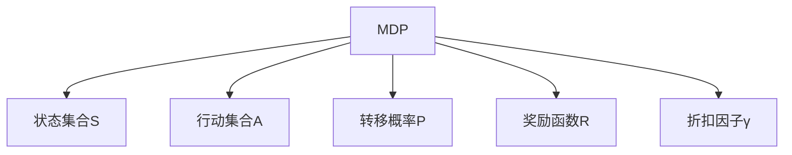
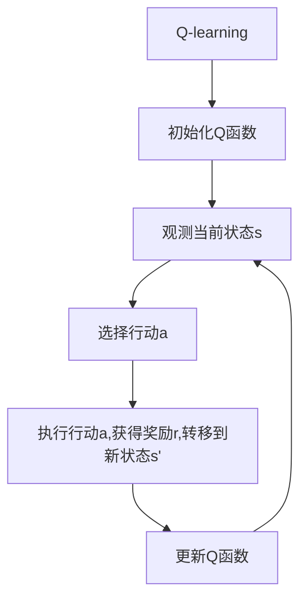

# 一切皆是映射：AI Q-learning在音乐制作中的应用

## 1. 背景介绍

### 1.1 音乐与人工智能的交汇

在过去的几十年里，人工智能(AI)技术在各个领域都取得了长足的进步,音乐制作也不例外。随着机器学习和深度学习算法的不断发展,AI已经能够在音乐创作、编曲、混音等多个环节发挥作用。其中,强化学习(Reinforcement Learning)是一种非常有前景的AI技术,它可以通过不断试错和优化,逐步找到最优解决方案。

### 1.2 Q-learning算法简介  

Q-learning是强化学习中的一种经典算法,它可以让智能体(Agent)通过与环境(Environment)的互动,学习如何在特定状态下采取最佳行动,从而最大化预期的累积奖励。Q-learning算法的核心思想是建立一个Q函数(Q-function),用于估计在特定状态采取特定行动后,可以获得的预期奖励。通过不断更新和优化Q函数,智能体可以逐步找到最优策略。

### 1.3 音乐制作中的Q-learning应用

在音乐制作领域,Q-learning算法可以被用于自动作曲、编曲、伴奏生成等任务。通过将音乐元素(如音符、和弦、节奏等)映射为状态和行动,并设计合理的奖励函数,智能体可以学习如何组合这些元素,生成富有创意和感染力的音乐作品。与传统的基于规则或模板的方法相比,Q-learning算法具有更强的自主学习和创新能力,有望推动音乐创作进入一个全新的阶段。

## 2. 核心概念与联系

### 2.1 马尔可夫决策过程(MDP)

在理解Q-learning算法之前,我们需要先了解马尔可夫决策过程(Markov Decision Process,MDP)的概念。MDP是一种数学模型,用于描述一个智能体在不确定环境中进行决策的过程。它包含以下几个核心要素:

- 状态集合(State Space) $\mathcal{S}$
- 行动集合(Action Space) $\mathcal{A}$
- 转移概率(Transition Probability) $\mathcal{P}_{ss'}^a = \mathcal{P}(s'|s,a)$
- 奖励函数(Reward Function) $\mathcal{R}_s^a$
- 折扣因子(Discount Factor) $\gamma \in [0,1]$

其中,转移概率$\mathcal{P}_{ss'}^a$表示在状态$s$下采取行动$a$后,转移到状态$s'$的概率。奖励函数$\mathcal{R}_s^a$定义了在状态$s$下采取行动$a$后,可以获得的即时奖励。折扣因子$\gamma$用于平衡当前奖励和未来奖励的重要性。

在音乐制作的场景中,我们可以将音乐元素(如音符、和弦、节奏等)映射为MDP中的状态和行动。例如,一个状态可以表示当前的音符序列,而行动则对应于在该序列后面添加一个新的音符。转移概率可以通过音乐理论和数据统计得到,奖励函数则需要根据具体的目标(如旋律流畅度、和声丰富度等)进行设计。

### 2.2 Q-learning算法原理

Q-learning算法的目标是找到一个最优策略(Optimal Policy) $\pi^*$,使得在遵循该策略时,可以获得最大的预期累积奖励。为此,Q-learning引入了Q函数(Q-function)的概念,用于估计在某个状态$s$下采取某个行动$a$后,可以获得的预期累积奖励,即:

$$Q^*(s,a) = \mathbb{E}_\pi \left[ \sum_{k=0}^\infty \gamma^k r_{t+k+1} \Big| s_t=s, a_t=a, \pi \right]$$

其中,$r_t$表示在时间步$t$获得的即时奖励,$\gamma$是折扣因子,用于平衡当前奖励和未来奖励的权重。

Q-learning算法通过不断更新Q函数,逐步逼近最优Q函数$Q^*$。更新规则如下:

$$Q(s_t,a_t) \leftarrow Q(s_t,a_t) + \alpha \left[ r_t + \gamma \max_{a'} Q(s_{t+1},a') - Q(s_t,a_t) \right]$$

其中,$\alpha$是学习率,用于控制更新幅度。$r_t$是在时间步$t$获得的即时奖励,$\gamma \max_{a'} Q(s_{t+1},a')$则表示在下一个状态$s_{t+1}$下,采取最优行动可以获得的预期累积奖励。

通过不断更新Q函数,智能体可以逐步学习到最优策略$\pi^*$,即在每个状态下采取能够最大化预期累积奖励的行动。

## 3. 核心算法原理具体操作步骤

Q-learning算法的具体操作步骤如下:

1. **初始化Q函数**

   首先,我们需要初始化Q函数,通常将所有状态-行动对的Q值设置为0或一个较小的常数。

2. **观测当前状态**

   智能体观测当前所处的状态$s_t$。

3. **选择行动**

   根据当前的Q函数值,智能体选择一个行动$a_t$。常见的选择策略包括:
   - $\epsilon$-贪婪(Epsilon-Greedy):以概率$\epsilon$随机选择一个行动,以概率$1-\epsilon$选择当前Q值最大的行动。
   - 软max(Softmax):根据Q值的softmax分布,按概率选择行动。

4. **执行行动并获得反馈**

   智能体执行选择的行动$a_t$,获得即时奖励$r_t$,并转移到新的状态$s_{t+1}$。

5. **更新Q函数**

   根据Q-learning更新规则,更新Q函数:

   $$Q(s_t,a_t) \leftarrow Q(s_t,a_t) + \alpha \left[ r_t + \gamma \max_{a'} Q(s_{t+1},a') - Q(s_t,a_t) \right]$$

6. **重复步骤2-5**

   重复步骤2-5,直到达到终止条件(如最大迭代次数或收敛)。

在实际应用中,我们通常使用函数逼近器(如神经网络)来表示和学习Q函数,从而应对大规模的状态和行动空间。此外,还可以采用各种技巧(如经验回放、目标网络等)来提高算法的稳定性和收敛速度。

## 4. 数学模型和公式详细讲解举例说明

### 4.1 马尔可夫决策过程(MDP)

在第2.1节中,我们介绍了马尔可夫决策过程(MDP)的基本概念。现在,我们将通过一个具体的例子,进一步说明MDP中的各个要素。

假设我们要设计一个简单的音乐游戏,玩家需要根据给定的音符序列,按正确的节奏敲击键盘。我们可以将这个游戏建模为一个MDP:

- 状态集合$\mathcal{S}$:所有可能的音符序列。
- 行动集合$\mathcal{A}$:按键或不按键。
- 转移概率$\mathcal{P}_{ss'}^a$:如果玩家按键正确,则转移到下一个音符序列的概率为1;否则,保持在当前序列的概率为1。
- 奖励函数$\mathcal{R}_s^a$:如果玩家按键正确,获得正奖励;否则,获得负奖励或0奖励。
- 折扣因子$\gamma$:通常设置为一个较小的值(如0.9),表示未来的奖励相对于当前奖励的重要性较低。

在这个例子中,我们的目标是找到一个最优策略$\pi^*$,使得玩家在遵循该策略时,可以获得最高的总体分数(即预期累积奖励)。

### 4.2 Q-learning更新规则推导

现在,我们来推导Q-learning算法的更新规则。

首先,我们定义Q函数为:

$$Q^*(s,a) = \mathbb{E}_\pi \left[ \sum_{k=0}^\infty \gamma^k r_{t+k+1} \Big| s_t=s, a_t=a, \pi \right]$$

其中,$r_t$表示在时间步$t$获得的即时奖励,$\gamma$是折扣因子。

根据马尔可夫性质,我们可以将Q函数展开为:

$$\begin{aligned}
Q^*(s,a) &= \mathbb{E}_\pi \left[ r_t + \gamma \sum_{k=0}^\infty \gamma^k r_{t+k+2} \Big| s_t=s, a_t=a, \pi \right] \\
&= \mathbb{E}_\pi \left[ r_t + \gamma \mathbb{E}_\pi \left[ \sum_{k=0}^\infty \gamma^k r_{t+k+2} \Big| s_{t+1}, \pi \right] \Big| s_t=s, a_t=a, \pi \right] \\
&= \mathbb{E}_\pi \left[ r_t + \gamma \max_{a'} Q^*(s_{t+1},a') \Big| s_t=s, a_t=a, \pi \right]
\end{aligned}$$

其中,我们利用了$\max_{a'} Q^*(s_{t+1},a')$表示在状态$s_{t+1}$下采取最优行动可以获得的预期累积奖励。

现在,我们定义一个时间差分(Temporal Difference,TD)目标:

$$y_t = r_t + \gamma \max_{a'} Q(s_{t+1},a')$$

则Q-learning的更新规则可以写为:

$$Q(s_t,a_t) \leftarrow Q(s_t,a_t) + \alpha \left[ y_t - Q(s_t,a_t) \right]$$

其中,$\alpha$是学习率,用于控制更新幅度。

这个更新规则的直观解释是:我们将Q函数的当前估计值$Q(s_t,a_t)$向TD目标$y_t$逼近。通过不断更新,Q函数最终会收敛到最优Q函数$Q^*$。

### 4.3 Q-learning在音乐制作中的应用示例

现在,让我们来看一个Q-learning在音乐制作中的具体应用示例。

假设我们要设计一个系统,能够自动生成一段简单的钢琴曲。我们可以将这个问题建模为一个MDP:

- 状态集合$\mathcal{S}$:所有可能的音符序列。
- 行动集合$\mathcal{A}$:添加不同的音符。
- 转移概率$\mathcal{P}_{ss'}^a$:由音乐理论和数据统计得到。
- 奖励函数$\mathcal{R}_s^a$:可以根据旋律流畅度、和声丰富度等因素设计。
- 折扣因子$\gamma$:设置为一个较大的值(如0.9),表示未来的奖励相对重要。

我们可以使用Q-learning算法,让智能体通过不断尝试和学习,找到一个最优策略$\pi^*$,即在每个状态下添加哪个音符,可以生成最富有创意和感染力的音乐作品。

具体来说,算法的操作步骤如下:

1. 初始化Q函数,将所有状态-行动对的Q值设置为0或一个较小的常数。
2. 观测当前的音符序列$s_t$。
3. 根据当前的Q函数值,选择一个行动(添加一个音符)$a_t$。可以使用$\epsilon$-贪婪或softmax策略。
4. 执行选择的行动$a_t$,获得即时奖励$r_t$,并转移到新的音符序列$s_{t+1}$。
5. 根据Q-learning更新规则,更新Q函数:

   $$Q(s_t,a_t) \leftarrow Q(s_t,a_t) + \alpha \left[ r_t + \gamma \max_{a'} Q(s_{t+1},a') - Q(s_t,a