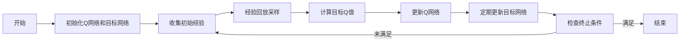

# 一切皆是映射：AI深度强化学习DQN原理入门

## 1. 背景介绍
在人工智能的众多分支中，深度强化学习（Deep Reinforcement Learning, DRL）以其在处理决策问题上的卓越能力而备受关注。DRL结合了深度学习的感知能力和强化学习的决策能力，使得机器能够在复杂的环境中自主学习如何做出最优决策。DQN（Deep Q-Network）作为DRL的开山之作，其在游戏领域的成功应用，如打破人类在Atari游戏上的记录，标志着AI在认知和决策上的一个重要进展。

## 2. 核心概念与联系
### 2.1 强化学习基础
- **状态（State）**：环境的描述。
- **动作（Action）**：智能体可以执行的操作。
- **奖励（Reward）**：执行动作后环境给予的反馈。
- **策略（Policy）**：从状态到动作的映射。
- **价值函数（Value Function）**：预测未来奖励的函数。

### 2.2 深度学习与强化学习的结合
- **深度学习**：通过多层神经网络提取高维数据特征。
- **DQN**：利用深度神经网络近似Q-函数（动作价值函数）。

### 2.3 DQN的核心组件
- **经验回放（Experience Replay）**：存储智能体的经验，打破数据间的相关性。
- **目标网络（Target Network）**：稳定学习过程，减少目标值的波动。

## 3. 核心算法原理具体操作步骤


## 4. 数学模型和公式详细讲解举例说明
DQN的核心是Q学习，其目标是学习一个策略，使得累积奖励最大化。Q函数定义为$Q(s, a)$，表示在状态$s$下采取动作$a$所能获得的预期回报。Q学习的更新公式为：

$$
Q_{\text{new}}(s_t, a_t) \leftarrow Q(s_t, a_t) + \alpha \left[ r_{t+1} + \gamma \max_{a} Q(s_{t+1}, a) - Q(s_t, a_t) \right]
$$

其中，$\alpha$ 是学习率，$\gamma$ 是折扣因子。

## 5. 项目实践：代码实例和详细解释说明
```python
# 伪代码示例
class DQN:
    def __init__(self):
        self.q_network = self.build_network()
        self.target_network = self.build_network()
        self.update_target_network()

    def build_network(self):
        # 构建深度神经网络
        pass

    def update_target_network(self):
        # 更新目标网络的权重
        pass

    def train(self, state, action, reward, next_state, done):
        # 训练过程
        pass
```

## 6. 实际应用场景
DQN已被应用于多个领域，包括但不限于：
- 游戏AI
- 机器人控制
- 自然语言处理
- 推荐系统

## 7. 工具和资源推荐
- **TensorFlow** 和 **PyTorch**：两个主流的深度学习框架。
- **OpenAI Gym**：提供了多种环境，用于测试和开发强化学习算法。
- **Stable Baselines**：一个高质量的强化学习实现库。

## 8. 总结：未来发展趋势与挑战
DQN的成功开启了深度强化学习的新篇章，但仍面临诸多挑战，如样本效率、泛化能力和安全性等。未来的研究将继续在这些方向上深入，以实现更加智能和可靠的AI系统。

## 9. 附录：常见问题与解答
- **Q: DQN和传统Q学习有何不同？**
- **A:** DQN使用深度神经网络来近似Q函数，能够处理高维状态空间。

- **Q: 经验回放的作用是什么？**
- **A:** 经验回放通过随机采样打破数据间的时间相关性，提高学习稳定性。

- **Q: 为什么需要目标网络？**
- **A:** 目标网络可以稳定学习过程，防止学习目标随着网络权重的更新而频繁变化。

作者：禅与计算机程序设计艺术 / Zen and the Art of Computer Programming