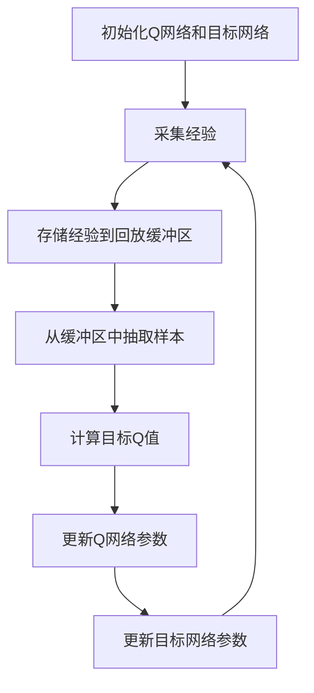

# 一切皆是映射：DQN的故障诊断与调试技巧：如何快速定位问题

## 1.背景介绍

深度强化学习（Deep Reinforcement Learning, DRL）近年来在多个领域取得了显著的成果，其中深度Q网络（Deep Q-Network, DQN）作为一种经典的DRL算法，广泛应用于游戏AI、机器人控制、自动驾驶等领域。然而，DQN的训练过程复杂，容易出现各种问题。本文旨在探讨DQN的故障诊断与调试技巧，帮助读者快速定位和解决问题。

## 2.核心概念与联系

### 2.1 深度强化学习与DQN

深度强化学习结合了深度学习和强化学习的优势，通过神经网络来近似Q值函数，从而解决高维状态空间下的决策问题。DQN是深度强化学习的代表性算法之一。

### 2.2 Q值与Q网络

Q值（Q-value）表示在某一状态下采取某一动作的预期回报。Q网络（Q-Network）是一个神经网络，用于近似Q值函数。

### 2.3 经验回放与目标网络

经验回放（Experience Replay）用于存储智能体的经验，以便在训练时随机抽取，打破数据相关性。目标网络（Target Network）用于稳定训练过程，通过固定一段时间更新一次目标网络的参数，减少Q值估计的波动。

### 2.4 映射关系

在DQN中，状态、动作、奖励和Q值之间存在复杂的映射关系。理解这些映射关系是故障诊断与调试的关键。

## 3.核心算法原理具体操作步骤

### 3.1 初始化

初始化Q网络和目标网络的参数，设置经验回放缓冲区的大小和其他超参数。

### 3.2 采集经验

智能体在环境中执行动作，采集状态、动作、奖励和下一个状态，存储到经验回放缓冲区。

### 3.3 更新Q网络

从经验回放缓冲区中随机抽取一批样本，计算目标Q值，使用均方误差损失函数更新Q网络的参数。

### 3.4 更新目标网络

每隔固定步数，将Q网络的参数复制到目标网络。

### 3.5 重复训练

重复上述步骤，直到智能体的表现达到预期。



## 4.数学模型和公式详细讲解举例说明

### 4.1 Q值函数

Q值函数 $Q(s, a)$ 表示在状态 $s$ 下采取动作 $a$ 的预期回报。DQN通过神经网络来近似Q值函数。

### 4.2 Bellman方程

Bellman方程用于更新Q值：

$$
Q(s, a) = r + \gamma \max_{a'} Q'(s', a')
$$

其中，$r$ 是奖励，$\gamma$ 是折扣因子，$Q'$ 是目标网络的Q值。

### 4.3 损失函数

DQN使用均方误差损失函数来更新Q网络的参数：

$$
L(\theta) = \mathbb{E}[(r + \gamma \max_{a'} Q'(s', a'; \theta^-) - Q(s, a; \theta))^2]
$$

其中，$\theta$ 是Q网络的参数，$\theta^-$ 是目标网络的参数。

### 4.4 例子

假设智能体在状态 $s$ 下采取动作 $a$，获得奖励 $r$，转移到下一个状态 $s'$。目标Q值为：

$$
y = r + \gamma \max_{a'} Q'(s', a')
$$

损失函数为：

$$
L(\theta) = (y - Q(s, a; \theta))^2
$$

通过反向传播算法更新Q网络的参数 $\theta$。

## 5.项目实践：代码实例和详细解释说明

### 5.1 环境设置

首先，设置环境和超参数：

```python
import gym
import numpy as np
import tensorflow as tf
from collections import deque

env = gym.make('CartPole-v1')
state_size = env.observation_space.shape[0]
action_size = env.action_space.n
batch_size = 32
n_episodes = 1000
output_dir = 'model_output/cartpole/'

if not os.path.exists(output_dir):
    os.makedirs(output_dir)
```

### 5.2 构建Q网络

构建Q网络和目标网络：

```python
def build_model():
    model = tf.keras.Sequential()
    model.add(tf.keras.layers.Dense(24, input_dim=state_size, activation='relu'))
    model.add(tf.keras.layers.Dense(24, activation='relu'))
    model.add(tf.keras.layers.Dense(action_size, activation='linear'))
    model.compile(loss='mse', optimizer=tf.keras.optimizers.Adam(lr=0.001))
    return model

model = build_model()
target_model = build_model()
```

### 5.3 经验回放缓冲区

初始化经验回放缓冲区：

```python
memory = deque(maxlen=2000)

def remember(state, action, reward, next_state, done):
    memory.append((state, action, reward, next_state, done))
```

### 5.4 训练过程

定义训练过程：

```python
def train_model():
    if len(memory) < batch_size:
        return
    minibatch = random.sample(memory, batch_size)
    for state, action, reward, next_state, done in minibatch:
        target = reward
        if not done:
            target = reward + 0.95 * np.amax(target_model.predict(next_state)[0])
        target_f = model.predict(state)
        target_f[0][action] = target
        model.fit(state, target_f, epochs=1, verbose=0)
    if epsilon > epsilon_min:
        epsilon *= epsilon_decay
```

### 5.5 主循环

主循环：

```python
for e in range(n_episodes):
    state = env.reset()
    state = np.reshape(state, [1, state_size])
    for time in range(500):
        action = np.argmax(model.predict(state)[0])
        next_state, reward, done, _ = env.step(action)
        reward = reward if not done else -10
        next_state = np.reshape(next_state, [1, state_size])
        remember(state, action, reward, next_state, done)
        state = next_state
        if done:
            print(f"episode: {e}/{n_episodes}, score: {time}, e: {epsilon:.2}")
            break
        train_model()
    if e % 10 == 0:
        target_model.set_weights(model.get_weights())
        model.save(output_dir + f"weights_{e:04d}.hdf5")
```

## 6.实际应用场景

### 6.1 游戏AI

DQN在游戏AI中表现出色，如在Atari游戏中击败人类玩家。

### 6.2 机器人控制

DQN用于机器人控制，可以实现复杂的任务，如抓取物体、导航等。

### 6.3 自动驾驶

DQN在自动驾驶中用于决策和路径规划，提高车辆的安全性和效率。

## 7.工具和资源推荐

### 7.1 开源库

- TensorFlow: 强大的深度学习框架，支持DQN的实现。
- PyTorch: 另一个流行的深度学习框架，易于调试和扩展。

### 7.2 在线资源

- OpenAI Gym: 提供丰富的环境，用于测试和训练DQN。
- DeepMind Lab: 高度可定制的3D环境，用于研究和开发DRL算法。

### 7.3 书籍推荐

- 《深度强化学习》：详细介绍了DRL的理论和实践。
- 《强化学习：原理与实践》：深入探讨了强化学习的核心概念和算法。

## 8.总结：未来发展趋势与挑战

### 8.1 发展趋势

- 多智能体系统：研究多个智能体之间的协作和竞争。
- 自适应学习：开发能够自适应调整超参数的算法。
- 解释性AI：提高DQN的可解释性，增强用户信任。

### 8.2 挑战

- 稳定性：DQN的训练过程容易不稳定，需要进一步研究。
- 数据效率：提高DQN的样本效率，减少训练数据的需求。
- 实际应用：将DQN应用于更多实际场景，解决现实问题。

## 9.附录：常见问题与解答

### 9.1 为什么DQN的训练过程不稳定？

DQN的训练过程不稳定，主要是因为Q值估计的波动。可以通过使用目标网络和经验回放缓冲区来缓解这一问题。

### 9.2 如何选择超参数？

超参数的选择需要根据具体问题进行调整。可以通过网格搜索或随机搜索来优化超参数。

### 9.3 如何提高DQN的样本效率？

可以通过优先经验回放（Prioritized Experience Replay）和双重DQN（Double DQN）等方法来提高DQN的样本效率。

### 9.4 如何调试DQN代码？

调试DQN代码时，可以通过可视化工具（如TensorBoard）来监控训练过程，检查Q值、损失函数等指标。

### 9.5 DQN在实际应用中有哪些限制？

DQN在实际应用中可能面临高维状态空间、连续动作空间等挑战。可以通过改进算法或结合其他方法来解决这些问题。

---

作者：禅与计算机程序设计艺术 / Zen and the Art of Computer Programming