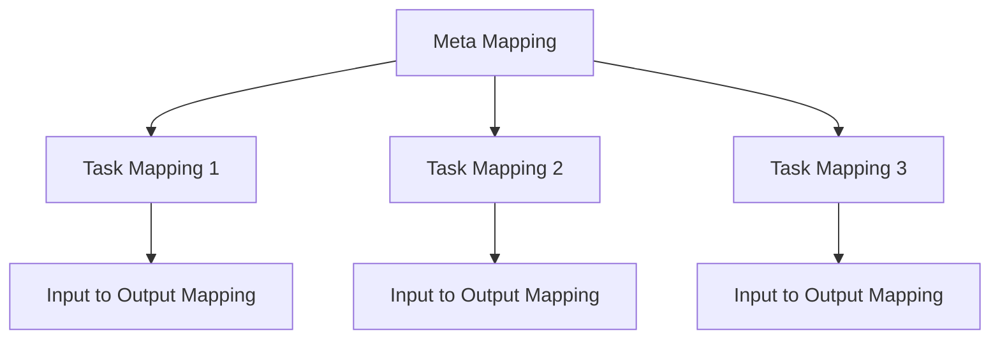
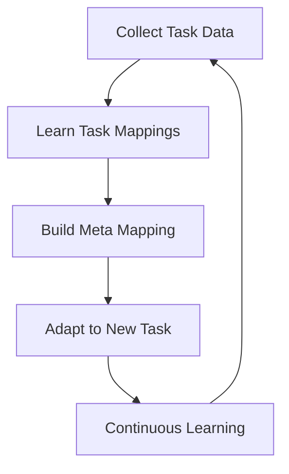

# 一切皆是映射：实现机器人快速适应性的元学习框架

## 1.背景介绍

在当今快节奏的技术发展时代，机器人系统需要具备快速适应新环境和任务的能力。传统的机器学习方法通常需要大量的数据和计算资源来训练模型,并且每次面临新的任务时都需要从头开始训练,这使得它们难以满足实时适应的需求。因此,我们需要一种新的学习范式,能够快速获取新知识并将其泛化到新任务中。元学习(Meta-Learning)作为一种前沿的人工智能技术,为解决这一挑战提供了新的思路。

### 1.1 什么是元学习?

元学习是一种构建在机器学习之上的学习方法,旨在提高模型快速学习新任务的能力。与传统的机器学习不同,元学习不是直接学习任务本身,而是学习如何更好地学习新任务。它利用过去的经验来获取一种"学习的能力",从而能够在新的任务中更快地适应和学习。

### 1.2 元学习在机器人领域的应用

在机器人领域,元学习可以赋予机器人快速适应新环境和任务的能力。例如,一个机器人在学习如何在办公室环境中导航后,它可以利用元学习快速适应家庭环境,而无需从头开始训练。这种适应性对于机器人在复杂和多变的真实世界中顺利运行至关重要。

### 1.3 映射思想在元学习中的重要性

本文提出了一种基于映射思想的元学习框架,旨在实现机器人的快速适应性。在这种框架中,一切都被视为映射关系,包括输入到输出的映射、任务到任务的映射,甚至是学习算法本身。通过学习这些映射关系,模型可以获得强大的泛化能力,从而快速适应新的环境和任务。

## 2.核心概念与联系

### 2.1 映射的定义

在本框架中,映射被定义为一种从一个空间映射到另一个空间的函数关系。形式上,给定两个集合 $\mathcal{X}$ 和 $\mathcal{Y}$,映射 $f$ 是一个函数 $f: \mathcal{X} \rightarrow \mathcal{Y}$,它将 $\mathcal{X}$ 中的每个元素 $x$ 映射到 $\mathcal{Y}$ 中的一个元素 $y$。

### 2.2 任务映射

在机器人领域,我们通常会遇到各种不同的任务,如导航、物体识别、运动规划等。每个任务都可以被视为一个映射,将输入(如传感器数据)映射到期望的输出(如机器人动作)。通过学习这些任务映射,机器人可以获得解决特定任务的能力。

$$
\begin{align*}
\text{Task Mapping:} \quad & f_{\tau}: \mathcal{X}_{\tau} \rightarrow \mathcal{Y}_{\tau} \\
& \text{where} \quad \mathcal{X}_{\tau} \text{ is the input space for task } \tau \\
& \text{and} \quad \mathcal{Y}_{\tau} \text{ is the output space for task } \tau
\end{align*}
$$

### 2.3 元映射

元映射是指将一个任务映射到另一个任务映射的函数关系。通过学习元映射,模型可以获得快速适应新任务的能力,而不是每次都从头开始学习。

$$
\begin{align*}
\text{Meta Mapping:} \quad & g: \mathcal{T} \rightarrow \mathcal{F} \\
& \text{where} \quad \mathcal{T} \text{ is the space of tasks} \\
& \text{and} \quad \mathcal{F} \text{ is the space of task mappings}
\end{align*}
$$

### 2.4 映射的组合

在实际应用中,我们通常需要组合多个映射来解决复杂的问题。例如,我们可以将输入映射到一个中间表示,然后将该表示映射到最终的输出。这种映射的组合可以用函数复合来表示:

$$
f \circ g: \mathcal{X} \rightarrow \mathcal{Z} \rightarrow \mathcal{Y}
$$

其中 $g: \mathcal{X} \rightarrow \mathcal{Z}$ 是第一个映射,将输入映射到中间表示,而 $f: \mathcal{Z} \rightarrow \mathcal{Y}$ 是第二个映射,将中间表示映射到最终输出。

### 2.5 映射的层次结构

在元学习框架中,我们可以构建一个映射的层次结构,其中较低层次的映射被用于学习较高层次的映射。例如,我们可以首先学习任务映射,然后使用这些任务映射来学习元映射。这种层次结构可以帮助模型更好地理解和泛化不同层次的映射关系。



## 3.核心算法原理具体操作步骤

基于映射思想的元学习框架包括以下几个关键步骤:

### 3.1 收集任务数据

第一步是收集一组不同但相关的任务数据,用于训练模型。这些数据应该包含输入、期望输出以及任务描述等信息。

### 3.2 学习任务映射

利用收集到的数据,我们可以训练一个模型来学习每个任务的映射关系,即将输入映射到期望输出。这可以使用各种机器学习算法来实现,如深度神经网络、决策树等。

### 3.3 构建元映射

在学习了多个任务映射之后,我们可以将它们作为输入,训练一个元模型来学习元映射。也就是说,元模型需要学习如何根据新任务的描述,快速生成该任务的映射函数。

这可以通过各种方法来实现,例如:

1. **优化器学习**: 元模型被训练为一个优化器,它可以根据新任务的数据快速调整模型参数,从而生成该任务的映射函数。

2. **网络权重生成**: 元模型直接生成新任务的神经网络权重,从而实现快速适应。

3. **注意力机制**: 元模型利用注意力机制从先前学习的任务映射中选择相关的部分,并组合成新任务的映射函数。

### 3.4 快速适应新任务

在训练好元模型之后,当遇到一个新的任务时,我们只需要将该任务的描述输入到元模型中,它就可以快速生成该任务的映射函数。然后,我们可以使用这个映射函数来解决新任务,而无需从头开始训练。

### 3.5 持续学习和改进

在实际应用中,我们可以不断地收集新的任务数据,并使用它们来改进元模型。这种持续学习的过程可以让模型不断提高其快速适应新任务的能力。



## 4.数学模型和公式详细讲解举例说明

在本节中,我们将详细讨论元学习框架中的数学模型和公式,并给出具体的例子加深理解。

### 4.1 任务映射的形式化表示

我们可以将任务映射 $f_{\tau}$ 形式化表示为一个参数化的函数:

$$
f_{\tau}(x; \theta_{\tau}) = y
$$

其中 $x \in \mathcal{X}_{\tau}$ 是输入, $y \in \mathcal{Y}_{\tau}$ 是期望输出, $\theta_{\tau}$ 是该任务映射的参数。

例如,在一个图像分类任务中,输入 $x$ 可以是一张图像,输出 $y$ 是该图像的类别标签,而 $\theta_{\tau}$ 则是一个深度神经网络的权重参数。

### 4.2 元映射的形式化表示

元映射 $g$ 可以被表示为一个函数,它将任务描述 $\tau$ 映射到该任务的映射函数 $f_{\tau}$ 的参数 $\theta_{\tau}$:

$$
g(\tau; \phi) = \theta_{\tau}
$$

其中 $\phi$ 是元映射的参数。

例如,在一个优化器学习的场景中, $g$ 可以被实现为一个神经网络,它根据任务描述 $\tau$ 生成一组初始参数 $\theta_{\tau}$,然后使用一个优化算法来调整这些参数,从而获得该任务的最终映射函数。

### 4.3 元学习目标函数

在训练元模型时,我们需要定义一个合适的目标函数来优化元映射的参数 $\phi$。一种常见的方法是最小化在一组支持任务 (support tasks) 上的损失,并在一组查询任务 (query tasks) 上评估泛化能力。

具体来说,给定一组支持任务 $\mathcal{T}_s = \{\tau_1, \tau_2, \ldots, \tau_n\}$ 和一组查询任务 $\mathcal{T}_q = \{\tau'_1, \tau'_2, \ldots, \tau'_m\}$,我们可以定义元学习的目标函数为:

$$
\begin{align*}
\min_{\phi} \sum_{\tau' \in \mathcal{T}_q} \mathcal{L}_{\tau'}(f_{\tau'}(x; g(\tau'; \phi)))
\end{align*}
$$

其中 $\mathcal{L}_{\tau'}$ 是任务 $\tau'$ 的损失函数,例如交叉熵损失或均方误差。

在优化过程中,我们首先使用支持任务 $\mathcal{T}_s$ 来计算梯度,然后使用这些梯度来更新元映射的参数 $\phi$,从而最小化查询任务 $\mathcal{T}_q$ 上的损失。这种方式可以提高模型在新任务上的泛化能力。

### 4.4 模型集成

在某些情况下,我们可以将多个任务映射函数集成在一起,以获得更好的性能。例如,我们可以将多个神经网络的输出进行加权平均,从而获得最终的预测结果:

$$
\hat{y} = \sum_{i=1}^{k} w_i f_{\tau_i}(x; \theta_{\tau_i})
$$

其中 $\hat{y}$ 是最终的预测输出, $f_{\tau_i}$ 是第 $i$ 个任务映射函数, $w_i$ 是对应的权重系数。这些权重系数可以通过在验证集上的性能来确定。

## 5.项目实践：代码实例和详细解释说明

在这一节中,我们将提供一个基于 PyTorch 的代码示例,实现一个简单的元学习框架。虽然这个示例相对简单,但它展示了元学习的核心思想和实现方式。

### 5.1 问题设置

我们将考虑一个简单的回归问题,其中每个任务都是在一个不同的正弦函数上进行回归。具体来说,给定一个输入 $x$,我们需要预测对应的输出 $y$,其中 $y = A \sin(x - B) + C$。不同任务之间的区别在于 $A$、$B$ 和 $C$ 的值不同。

我们的目标是训练一个元模型,能够快速适应新的正弦函数任务,而不需要从头开始训练。

### 5.2 数据生成

首先,我们定义一个函数来生成特定任务的数据:

```python
import torch
import numpy as np

def generate_task_data(num_samples, amp, phase, vert, noise_std=0.1):
    x = torch.rand(num_samples) * 8 * np.pi
    y = amp * torch.sin(x - phase) + vert
    y += torch.randn_like(y) * noise_std
    return x, y
```

这个函数会生成 `num_samples` 个样本,其中 $x$ 是在 $[0, 8\pi]$ 范围内均匀采样的输入, $y$ 是对应的正弦函数输出,加上了一些高斯噪声。

### 5.3 任务映射模型

接下来,我们定义一个简单的神经网络模型,作为任务映射函数:

```python
import torch.nn as nn

class TaskModel(nn.Module):
    def __init__(self):
        super().__init__()
        self.layers = nn.Sequential(
            nn.Linear(1, 64),
            nn