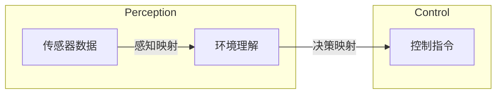
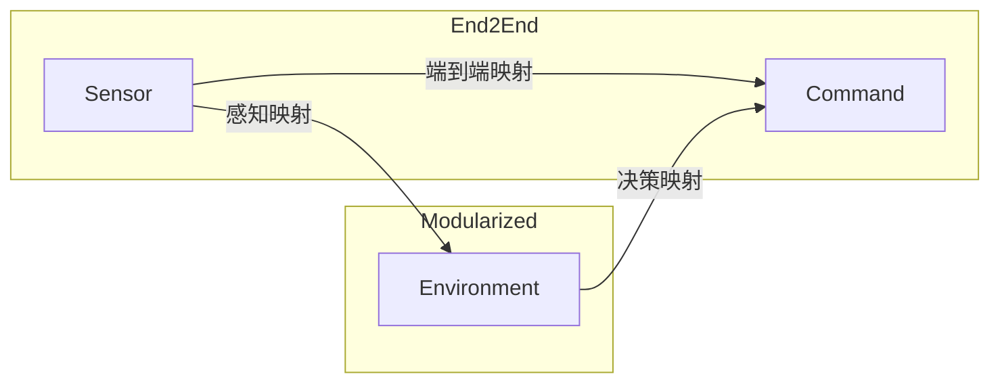
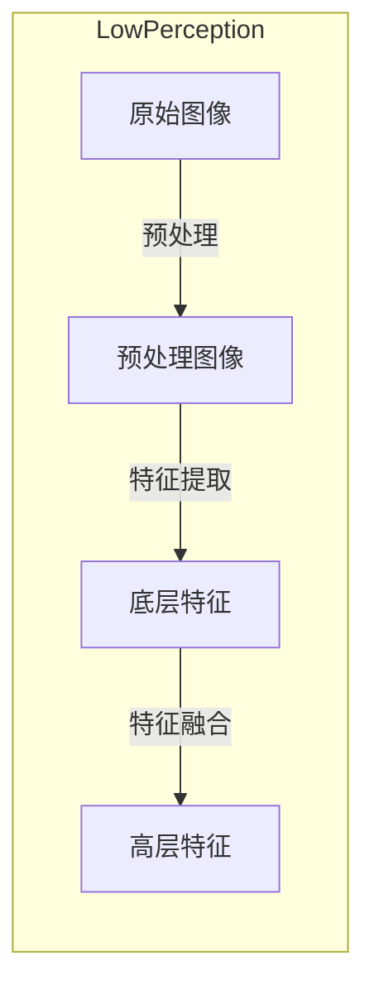
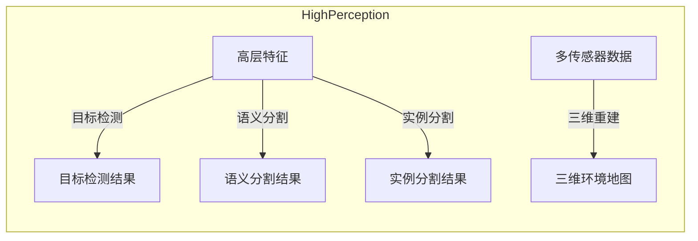
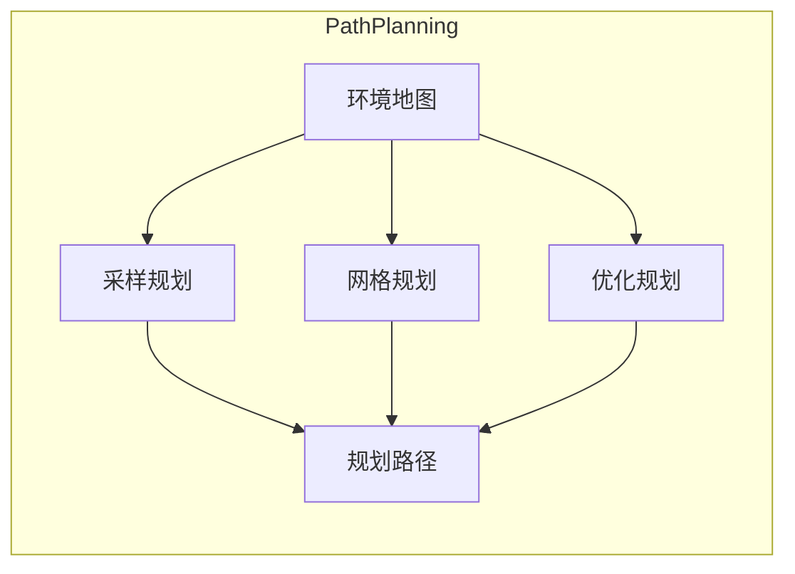
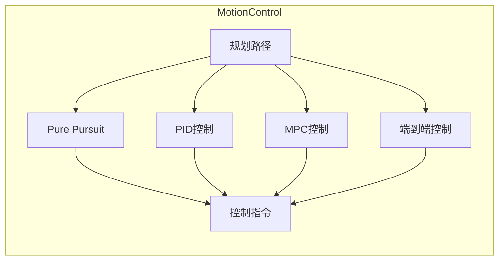
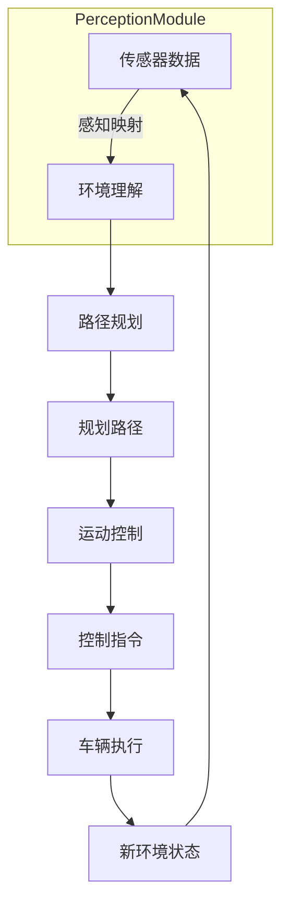

# 一切皆是映射：无人驾驶车辆中的神经网络系统

## 1.背景介绍

### 1.1 无人驾驶汽车的崛起

近年来,无人驾驶汽车技术的快速发展引起了全球关注。无人驾驶汽车有望彻底改变未来出行方式,提高交通效率,减少事故发生,节省能源,促进环境可持续发展。作为支撑无人驾驶技术的核心,感知与决策系统扮演着至关重要的角色。

### 1.2 感知与决策的挑战

无人驾驶汽车在复杂多变的真实环境中行驶,需要实时感知周围环境,并根据感知信息作出适当决策。这对传统的规则based方法带来了巨大挑战:

- 环境复杂多变,规则制定困难
- 需要处理海量高维度传感器数据
- 实时性要求高,延迟低

### 1.3 神经网络在无人驾驶中的应用

基于深度学习的神经网络以其强大的数据驱动能力和端到端建模优势,为解决无人驾驶感知与决策问题提供了新的可能。神经网络可从大量数据中自动学习特征,摆脱人工设计特征的限制,展现出优异的泛化性能。

## 2.核心概念与联系

### 2.1 神经网络的本质:映射函数

神经网络的本质是一种参数化的高维非线性映射函数。给定一个输入x,神经网络通过层层传递变换,最终输出一个映射值y=f(x;θ),其中θ为可学习的参数。不同的网络结构、参数设置即对应不同的映射函数。

```mermaid
graph LR
    subgraph Network
    X[输入 x] -->|映射 f(x;θ)| Y[输出 y]
    end
```

### 2.2 无人驾驶中的映射任务

在无人驾驶系统中,神经网络需要学习两类核心映射:

1. **感知映射** 将传感器数据(如相机、雷达等)映射为对环境的理解,例如三维空间中的障碍物、车道线、交通标志物等。

2. **决策映射** 将感知的环境状态映射为车辆的控制指令,如油门、刹车、转向等。



这两类映射相互衔接,感知与决策两大系统通过不断迭代形成闭环控制。

### 2.3 端到端与模块化方法

神经网络可以采用端到端(End-to-End)或模块化(Modularized)的方式构建无人驾驶系统:

- **端到端方法** 直接将传感器数据映射为控制指令,优点是简单,缺点是黑盒操作,可解释性差。
- **模块化方法** 分别构建感知模块和决策模块,模块间存在明确的接口,可解释性好,但需要人为设计合理的模块划分。



大多数现有系统采用模块化方法,本文将重点介绍感知与决策两大模块中的神经网络技术。

## 3.核心算法原理具体操作步骤  

### 3.1 感知模块:从传感器到环境理解

感知模块的任务是从传感器数据中理解环境,包括检测和跟踪障碍物、识别道路标志物、建立三维环境地图等。这一过程可分为底层感知和高层理解两个阶段。

#### 3.1.1 底层感知:从传感器到特征

底层感知旨在从原始传感器数据中提取有用的特征,通常由卷积神经网络(CNN)和其变种承担。以相机图像为例:

1. **预处理** 对原始图像进行标准化、数据增强等预处理,提高训练数据的多样性。

2. **特征提取** 使用卷积神经网络从图像中自动提取多尺度特征,捕获不同级别的视觉模式。

3. **特征融合** 将多个尺度的特征进行融合,形成最终的特征表示。



#### 3.1.2 高层理解:从特征到语义

高层理解旨在从底层特征中提取出具有语义意义的信息,常见的方法有:

- **目标检测** 在图像或点云中定位并识别出感兴趣的目标,如车辆、行人、交通标志等。
- **语义分割** 对图像或点云中的每个像素/点进行分类,获得精细的语义分割图。
- **实例分割** 在语义分割的基础上进一步区分同类目标的不同实例。
- **三维重建** 从多个传感器数据融合三维环境信息,构建高精度三维地图。

上述任务通常由卷积神经网络、变形卷积网络、注意力机制等算法实现。



#### 3.1.3 多传感器融合

现代无人驾驶系统通常融合多种传感器数据,如相机、雷达、激光雷达等,以获得更加全面准确的环境感知能力。常见的融合方式有:

- **早期融合** 在特征提取阶段对原始数据进行融合,由统一的神经网络处理。
- **晚期融合** 分别对各传感器数据进行单独处理,在高层融合各模态的结果。
- **半晚期融合** 在特征层进行特征融合,在决策层进行结果融合。

```mermaid
graph LR
    subgraph EarlyFusion
    Camera[相机] --> EarlyFusion[早期融合]
    Lidar[激光雷达] --> EarlyFusion
    Radar[雷达] --> EarlyFusion
    EarlyFusion --> Perception[感知结果]
    end
    
    subgraph LateFusion
    Camera --> CameraPerception[相机感知]
    Lidar --> LidarPerception[激光感知] 
    Radar --> RadarPerception[雷达感知]
    CameraPerception --> LateFusion[晚期融合]
    LidarPerception --> LateFusion
    RadarPerception --> LateFusion
    LateFusion --> Perception
    end
    
    subgraph SemiLateFusion
    Camera --> CameraFeature[相机特征]
    Lidar --> LidarFeature[激光特征]
    Radar --> RadarFeature[雷达特征] 
    CameraFeature --> FeatureFusion[特征融合]
    LidarFeature --> FeatureFusion
    RadarFeature --> FeatureFusion
    FeatureFusion --> ModalPerception[单模态感知]
    ModalPerception --> ResultFusion[结果融合]
    ResultFusion --> Perception
    end
```

### 3.2 决策模块:从环境到控制指令

决策模块的任务是根据感知得到的环境信息,作出合理的控制决策,输出车辆的控制指令。这一过程可分为路径规划和运动控制两个阶段。

#### 3.2.1 路径规划

路径规划模块负责在当前环境约束下,为车辆安全高效到达目标点规划出一条合理的路径。常见的路径规划算法有:

- **采样规划** 如RRT、RRT*等,通过在配置空间中随机采样获得路径。
- **网格规划** 如A*、D*等,在离散网格地图上进行最优路径搜索。  
- **优化规划** 如CHOMP、STOMP等,将路径规划建模为优化问题求解。

近年来,基于深度学习的神经网络路径规划方法也取得了长足进展,如基于行为克隆的端到端路径规划等。



#### 3.2.2 运动控制

运动控制模块负责根据规划路径,生成车辆的实际控制指令,包括油门/刹车、转向角等。常见的运动控制算法有:

- **Pure Pursuit** 简单有效的几何追踪算法。
- **PID控制** 经典的反馈控制算法,通过比例、积分、微分三个控制回路实现跟踪。
- **MPC控制** 基于模型预测的最优控制,能够处理多约束条件。
- **端到端控制** 基于神经网络直接从传感器数据生成控制指令。



### 3.3 感知与决策闭环

感知与决策两大模块相互衔接,形成闭环控制系统:

1. 感知模块从传感器数据获取当前环境信息
2. 决策模块根据环境规划路径,生成控制指令
3. 车辆执行控制指令,改变环境状态
4. 感知模块获取新的环境信息,循环执行

在这一闭环过程中,神经网络在感知和决策各个环节发挥着关键作用。



## 4.数学模型和公式详细讲解举例说明

神经网络在无人驾驶系统中扮演着核心角色,本节将详细介绍其中的数学原理。

### 4.1 前馈神经网络

前馈神经网络(Feedforward Neural Network)是最基本的神经网络结构,由多个全连接层组成。给定输入$x$,网络通过层层传递变换得到输出$y$:

$$y=f(x;W,b)=\phi(W_L\phi(W_{L-1}...\phi(W_1x+b_1)+b_{L-1})+b_L)$$

其中$W_i$和$b_i$分别为第$i$层的权重和偏置参数,$\phi$为非线性激活函数,如ReLU、Sigmoid等。训练过程是通过优化算法(如梯度下降)学习参数$W,b$,使得输出$y$逼近期望值。

前馈网络常用于简单的分类、回归任务,如端到端的车辆控制。但对于高维输入(如图像),需要卷积神经网络来提取局部特征。

### 4.2 卷积神经网络

卷积神经网络(Convolutional Neural Network)在低层由卷积层和池化层组成,用于从高维输入(如图像)中提取局部特征。卷积层通过滑动卷积核在输入特征图上进行卷积操作,获得新的特征图:

$$z_{i,j}^l=\phi\left(\sum_{m,n}w_{m,n}^lx_{i+m,j+n}^{l-1}+b^l\right)$$

其中$x^{l-1}$为上层输入,$z^l$为输出特征图,$w$为卷积核权重,$b$为偏置,后接非线性激活函数$\phi$。

池化层通过对邻域区域进行下采样,达到降低特征分辨率、增强平移不变性的目的。高层则由全