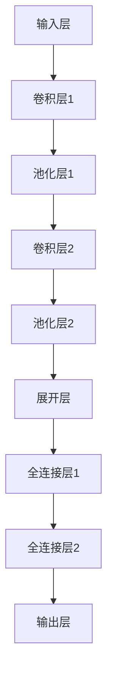

## 1. 背景介绍

农业是人类社会的基础产业之一，而现代农业科技的发展也越来越依赖于人工智能技术的应用。深度学习作为人工智能技术的重要分支之一，已经在农业领域得到了广泛的应用。本文将介绍深度学习在农业科技中的实践，包括核心概念、算法原理、数学模型、项目实践、实际应用场景、工具和资源推荐、未来发展趋势与挑战以及常见问题与解答。

## 2. 核心概念与联系

深度学习是一种基于神经网络的机器学习方法，其核心概念包括神经网络、反向传播算法、卷积神经网络、循环神经网络等。在农业科技中，深度学习可以应用于图像识别、语音识别、自然语言处理等方面，以提高农业生产效率和质量。

## 3. 核心算法原理具体操作步骤

深度学习的核心算法原理是神经网络，其训练过程主要包括前向传播和反向传播两个步骤。前向传播是指将输入数据通过神经网络的各个层进行计算，得到输出结果的过程；反向传播是指根据输出结果和真实结果之间的误差，通过调整神经网络的权重和偏置，使得误差最小化的过程。在农业科技中，可以通过训练神经网络来实现图像识别、语音识别等任务。

## 4. 数学模型和公式详细讲解举例说明

深度学习的数学模型主要是神经网络模型，其核心公式包括前向传播公式和反向传播公式。前向传播公式可以表示为：

$$
a^{(l)} = g(z^{(l)}) = g(W^{(l)}a^{(l-1)} + b^{(l)})
$$

其中，$a^{(l)}$表示第$l$层的激活值，$z^{(l)}$表示第$l$层的加权输入，$W^{(l)}$表示第$l$层的权重矩阵，$b^{(l)}$表示第$l$层的偏置向量，$g$表示激活函数。

反向传播公式可以表示为：

$$
\delta^{(l)} = (W^{(l+1)})^T \delta^{(l+1)} \odot g'(z^{(l)})
$$

其中，$\delta^{(l)}$表示第$l$层的误差，$\odot$表示逐元素乘法，$g'$表示激活函数的导数。

在农业科技中，可以通过调整神经网络的权重和偏置来实现图像识别、语音识别等任务。

## 5. 项目实践：代码实例和详细解释说明

以下是一个基于深度学习的图像识别项目实践，使用Python语言和TensorFlow框架实现。

### 5.1 数据集准备

本项目使用的是一个包含10种不同种类的水果图片的数据集，共有约10000张图片。首先需要将数据集分为训练集和测试集，以便进行模型训练和测试。

### 5.2 模型设计

本项目使用的是一个卷积神经网络模型，包括多个卷积层和池化层，以及全连接层和输出层。具体结构如下所示：

### 5.3 模型训练

使用训练集对模型进行训练，采用交叉熵损失函数和Adam优化器。训练过程中需要注意设置合适的学习率和批次大小，以及进行数据增强等操作。

### 5.4 模型测试

使用测试集对模型进行测试，计算准确率和损失值等指标。可以通过调整模型结构和超参数来提高模型性能。

## 6. 实际应用场景

深度学习在农业科技中的实际应用场景包括图像识别、语音识别、自然语言处理等方面。例如，可以通过图像识别技术来识别农作物的病虫害，以便及时采取措施进行防治；可以通过语音识别技术来实现智能化的农业机器人控制；可以通过自然语言处理技术来实现智能化的农业问答系统等。

## 7. 工具和资源推荐

深度学习在农业科技中的应用需要使用到一些工具和资源，包括Python语言、TensorFlow框架、Keras框架、PyTorch框架、Caffe框架等。此外，还可以参考一些相关的论文和书籍，例如《深度学习》、《Python深度学习》等。

## 8. 总结：未来发展趋势与挑战

深度学习在农业科技中的应用前景广阔，可以帮助提高农业生产效率和质量。未来，随着人工智能技术的不断发展和深入应用，深度学习在农业科技中的应用将会越来越广泛。同时，也面临着一些挑战，例如数据质量不高、算法复杂度高、计算资源有限等问题。

## 9. 附录：常见问题与解答

Q：深度学习在农业科技中的应用有哪些？

A：深度学习在农业科技中的应用包括图像识别、语音识别、自然语言处理等方面。

Q：深度学习的核心算法是什么？

A：深度学习的核心算法是神经网络，其训练过程主要包括前向传播和反向传播两个步骤。

Q：深度学习在农业科技中的应用面临哪些挑战？

A：深度学习在农业科技中的应用面临着数据质量不高、算法复杂度高、计算资源有限等问题。