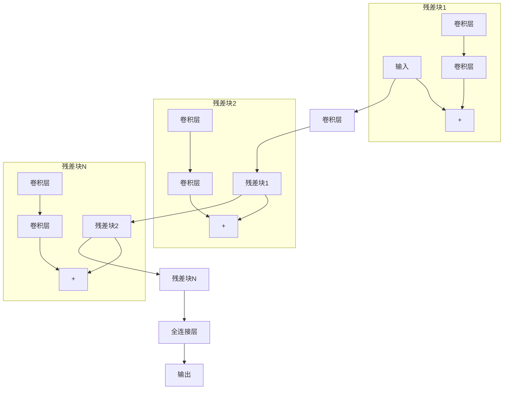

# 从零开始大模型开发与微调：ResNet诞生的背景

## 1.背景介绍

在深度学习领域,卷积神经网络(Convolutional Neural Networks, CNN)因其在计算机视觉任务中的卓越表现而广受关注。然而,随着网络层数的增加,训练深层网络变得越来越困难,因为梯度消失或梯度爆炸问题会阻碍网络的收敛。为了解决这一问题,2015年,微软研究院的何恺明等人提出了残差网络(Residual Network, ResNet)。ResNet通过引入残差连接(Residual Connection)的设计,成功训练了比以往更深的网络,在ImageNet数据集上取得了当时最好的结果,从而引发了深度神经网络发展的新浪潮。

### 1.1 传统卷积神经网络的局限性

传统的卷积神经网络由多个卷积层、池化层和全连接层组成。随着网络层数的增加,信息在前向传播时需要经过更多的非线性变换,这使得网络难以直接学习恒等映射(Identity Mapping),从而导致梯度消失或梯度爆炸问题。这种问题会阻碍网络的收敛,限制了网络的深度和性能。

### 1.2 残差网络的提出

为了解决深层网络训练困难的问题,何恺明等人提出了残差网络(ResNet)。ResNet的核心思想是在网络中引入残差连接(Residual Connection),使网络能够更容易地学习恒等映射,从而缓解梯度消失或梯度爆炸问题。

## 2.核心概念与联系

### 2.1 残差连接

残差连接是ResNet的核心创新。它通过在网络中添加一个"快捷路径"(Shortcut Connection),将输入直接传递到后面的层,使网络能够更容易地学习恒等映射。这种设计可以显著提高深层网络的训练效率和性能。

在ResNet中,每个残差块(Residual Block)由两个或多个卷积层组成,输入首先经过这些卷积层进行非线性变换,然后将变换后的输出与输入相加,得到残差块的输出。这种设计使网络能够更容易地学习残差映射(Residual Mapping),而不是直接学习期望的映射,从而简化了优化过程。

### 2.2 网络架构

ResNet的网络架构由多个残差块组成,每个残差块包含两个或多个卷积层。残差块之间通过残差连接相连,形成一个深层网络。ResNet还采用了批量归一化(Batch Normalization)和ReLU激活函数,以提高训练稳定性和收敛速度。

### 2.3 Mermaid流程图



上图展示了ResNet的基本架构。输入经过一系列卷积层后,进入残差块。每个残差块由两个卷积层和一个残差连接组成。残差连接将输入直接传递到残差块的输出,与卷积层的输出相加。这种设计使网络能够更容易地学习恒等映射,从而缓解梯度消失或梯度爆炸问题。多个残差块堆叠形成深层网络,最后通过全连接层输出结果。

## 3.核心算法原理具体操作步骤

ResNet的核心算法原理可以总结为以下几个步骤:

1. **构建残差块**:
   - 将输入通过一个或多个卷积层进行非线性变换,得到 $F(x)$。
   - 将输入 $x$ 直接传递到残差块的输出,作为恒等映射分支。
   - 将 $F(x)$ 和 $x$ 相加,得到残差块的输出 $y = F(x) + x$。

2. **堆叠残差块**:
   - 将多个残差块堆叠起来,形成深层网络。每个残差块的输出作为下一个残差块的输入。

3. **添加批量归一化和激活函数**:
   - 在每个卷积层之后,应用批量归一化(Batch Normalization)和ReLU激活函数,以提高训练稳定性和收敛速度。

4. **前向传播和反向传播**:
   - 在前向传播过程中,输入数据经过堆叠的残差块和全连接层,得到输出结果。
   - 在反向传播过程中,计算损失函数对网络参数的梯度,并使用优化算法(如随机梯度下降)更新网络参数。

5. **训练和评估**:
   - 在训练集上训练ResNet模型,通过迭代优化网络参数,使模型在验证集上达到最佳性能。
   - 在测试集上评估训练好的ResNet模型,获得最终的性能指标。

通过上述步骤,ResNet能够成功训练比以往更深的卷积神经网络,并在各种计算机视觉任务中取得优异的性能。

## 4.数学模型和公式详细讲解举例说明

在ResNet中,残差块的数学表达式如下:

$$y = F(x, W) + x$$

其中:
- $x$ 是残差块的输入
- $F(x, W)$ 是残差块中的非线性变换,由一个或多个卷积层组成,参数为 $W$
- $y$ 是残差块的输出,即 $F(x, W)$ 和 $x$ 的元素wise相加

通过这种设计,ResNet能够更容易地学习恒等映射 $F(x, W) = 0$,从而缓解梯度消失或梯度爆炸问题。

我们来看一个具体的例子。假设残差块中有两个卷积层,第一个卷积层的输出为 $z_1 = W_1 * x$,第二个卷积层的输出为 $z_2 = W_2 * z_1$,那么残差块的输出可以表示为:

$$y = z_2 + x = W_2 * (W_1 * x) + x$$

在反向传播过程中,残差连接可以直接将梯度传递到较浅层,避免了梯度在深层网络中消失或爆炸。具体来说,假设损失函数为 $L$,则残差块的梯度为:

$$\frac{\partial L}{\partial x} = \frac{\partial L}{\partial y} \left( \frac{\partial y}{\partial z_2} \frac{\partial z_2}{\partial z_1} \frac{\partial z_1}{\partial x} + \frac{\partial y}{\partial x} \right)$$

由于 $\frac{\partial y}{\partial x} = 1$,因此梯度不会在残差连接处消失或爆炸,从而缓解了深层网络训练的困难。

## 5.项目实践:代码实例和详细解释说明

以下是使用PyTorch实现ResNet的代码示例,包括残差块的定义和ResNet网络的构建:

```python
import torch
import torch.nn as nn

# 残差块定义
class ResidualBlock(nn.Module):
    def __init__(self, in_channels, out_channels, stride=1, downsample=None):
        super(ResidualBlock, self).__init__()
        self.conv1 = nn.Conv2d(in_channels, out_channels, kernel_size=3, stride=stride, padding=1, bias=False)
        self.bn1 = nn.BatchNorm2d(out_channels)
        self.relu = nn.ReLU(inplace=True)
        self.conv2 = nn.Conv2d(out_channels, out_channels, kernel_size=3, stride=1, padding=1, bias=False)
        self.bn2 = nn.BatchNorm2d(out_channels)
        self.downsample = downsample

    def forward(self, x):
        residual = x
        out = self.conv1(x)
        out = self.bn1(out)
        out = self.relu(out)
        out = self.conv2(out)
        out = self.bn2(out)
        if self.downsample is not None:
            residual = self.downsample(x)
        out += residual
        out = self.relu(out)
        return out

# ResNet网络构建
class ResNet(nn.Module):
    def __init__(self, block, layers, num_classes=1000):
        super(ResNet, self).__init__()
        self.in_channels = 64
        self.conv1 = nn.Conv2d(3, 64, kernel_size=7, stride=2, padding=3, bias=False)
        self.bn1 = nn.BatchNorm2d(64)
        self.relu = nn.ReLU(inplace=True)
        self.maxpool = nn.MaxPool2d(kernel_size=3, stride=2, padding=1)
        self.layer1 = self._make_layer(block, 64, layers[0])
        self.layer2 = self._make_layer(block, 128, layers[1], stride=2)
        self.layer3 = self._make_layer(block, 256, layers[2], stride=2)
        self.layer4 = self._make_layer(block, 512, layers[3], stride=2)
        self.avgpool = nn.AvgPool2d(7, stride=1)
        self.fc = nn.Linear(512 * block.expansion, num_classes)

    def _make_layer(self, block, out_channels, blocks, stride=1):
        downsample = None
        if stride != 1 or self.in_channels != out_channels * block.expansion:
            downsample = nn.Sequential(
                nn.Conv2d(self.in_channels, out_channels * block.expansion, kernel_size=1, stride=stride, bias=False),
                nn.BatchNorm2d(out_channels * block.expansion)
            )
        layers = []
        layers.append(block(self.in_channels, out_channels, stride, downsample))
        self.in_channels = out_channels * block.expansion
        for i in range(1, blocks):
            layers.append(block(self.in_channels, out_channels))
        return nn.Sequential(*layers)

    def forward(self, x):
        x = self.conv1(x)
        x = self.bn1(x)
        x = self.relu(x)
        x = self.maxpool(x)
        x = self.layer1(x)
        x = self.layer2(x)
        x = self.layer3(x)
        x = self.layer4(x)
        x = self.avgpool(x)
        x = x.view(x.size(0), -1)
        x = self.fc(x)
        return x
```

上述代码中:

1. `ResidualBlock`定义了ResNet中的残差块。它包含两个卷积层、批量归一化层和ReLU激活函数。`forward`函数实现了残差连接,将输入 `x` 直接传递到输出,并与卷积层的输出相加。

2. `ResNet`定义了完整的ResNet网络结构。它由一个卷积层、多个残差块和一个全连接层组成。`_make_layer`函数用于构建一组残差块,并根据需要添加下采样层。`forward`函数实现了网络的前向传播过程。

3. 在构建ResNet时,需要指定残差块的类型(`block`)和每个层中残差块的数量(`layers`)。例如,ResNet-18使用基本残差块,`layers`为`[2, 2, 2, 2]`。

通过这个示例,你可以了解如何使用PyTorch实现ResNet,并深入理解残差块和网络架构的细节。你可以根据需要修改代码,调整网络参数和超参数,以适应不同的任务和数据集。

## 6.实际应用场景

ResNet在计算机视觉领域的各种任务中都取得了卓越的表现,包括图像分类、目标检测、语义分割等。以下是一些典型的应用场景:

1. **图像分类**:
   ResNet最初是为ImageNet图像分类任务而设计的,并在该任务上取得了当时最好的结果。它在各种图像分类数据集和应用中都表现出色,如自然场景分类、人脸识别、医学图像分类等。

2. **目标检测**:
   ResNet也被广泛应用于目标检测任务,如Faster R-CNN、Mask R-CNN等目标检测算法中。ResNet作为主干网络提取图像特征,并将这些特征输入到检测头中进行目标定位和分类。

3. **语义分割**:
   在语义分割任务中,ResNet也被用作编码器网络,提取图像的高级语义特征。这些特征可以输入到解码器网络中,生成每个像素的语义分割掩码。

4. **迁移学习**:
   由于ResNet在ImageNet等大型数据集上的出色表现,它经常被用作迁移学习的基础模型