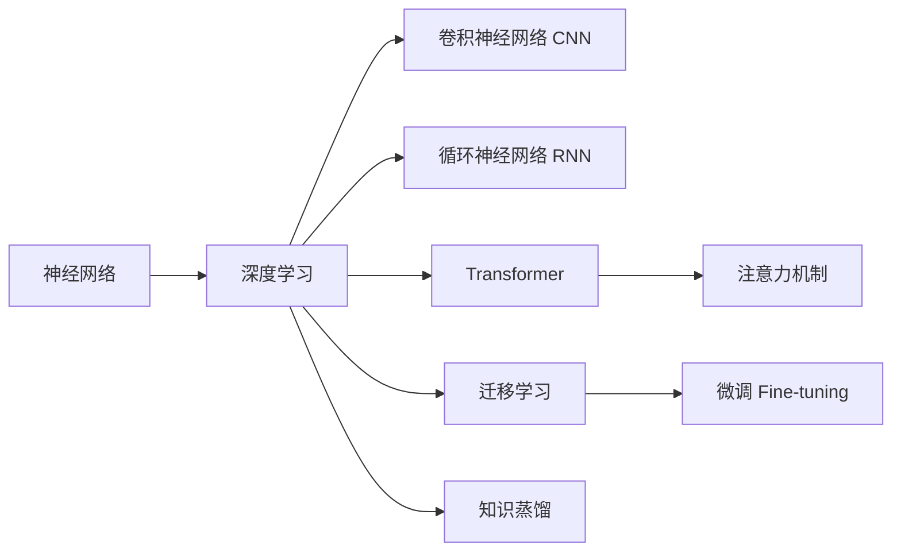

# 从零开始大模型开发与微调：深度学习基础

## 1.背景介绍

### 1.1 人工智能与深度学习的发展历程

人工智能(Artificial Intelligence, AI)作为计算机科学的一个分支,其目标是开发能够模拟人类智能的计算机系统。自1956年达特茅斯会议首次提出"人工智能"的概念以来,AI经历了从早期的符号主义、专家系统到机器学习、深度学习的发展历程。

深度学习(Deep Learning, DL)是机器学习的一个子领域,其本质是通过构建具有多个隐藏层的人工神经网络,并利用大量数据对网络进行训练,从而使网络能够自动学习到数据背后的复杂模式和规律。2006年Geoffrey Hinton等人提出了深度信念网络(Deep Belief Network,DBN),掀开了深度学习的序幕。此后,CNN、RNN等网络结构被相继提出并在图像、语音、自然语言处理等领域取得了突破性进展。

### 1.2 大模型的兴起与应用前景

近年来,随着算力的提升和训练数据的积累,超大规模的深度学习模型(亦称大模型)开始崭露头角。从2018年Google发布的BERT,到2020年OpenAI的GPT-3,再到2022年DeepMind的AlphaFold,大模型不断刷新着人们对AI能力边界的认知。

大模型之所以令人瞩目,主要基于以下优势:

1. 强大的泛化能力:大模型能够从海量数据中学习到丰富的知识,具备较强的迁移和泛化能力,可应用于多种不同的下游任务。

2. 更接近人类智能:大模型在语言理解、知识推理、多模态感知等方面表现出接近甚至超越人类的能力,为实现通用人工智能(AGI)带来希望。

3. 广阔的应用前景:大模型在智能助理、信息检索、内容生成、科学研究等领域具有广泛的应用潜力,有望催生出一批创新性的智能产品和服务。

### 1.3 大模型开发面临的挑战

尽管大模型前景可期,但其开发与应用仍面临诸多挑战:

1. 高昂的算力成本:动辄数百亿、上千亿参数规模的大模型对算力提出了极高要求,训练成本动辄数百万美元,难以被普通研究者和中小企业承担。

2. 训练数据的质量与规模:大模型通常需要在海量高质量数据上进行训练,而数据的获取、清洗和标注本身就是一项极具挑战的工作。

3. 模型的可解释性与可控性:作为一个复杂的黑盒系统,理解大模型的内部工作机制以及控制其输出行为并非易事,这对于模型的应用落地和安全性保障提出了更高要求。

4. 伦理与安全风险:大模型强大的生成能力可能被滥用于制造虚假信息、侵犯隐私等,亟需建立相应的伦理规范和安全防护机制。

## 2.核心概念与联系

### 2.1 神经网络

神经网络(Neural Network)是一种模拟生物神经系统结构和功能的数学模型,由大量的节点(即神经元)通过带权重的连接进行信息传递和处理。一个典型的神经网络由输入层、隐藏层和输出层组成,每一层由若干神经元构成。

### 2.2 深度学习

深度学习是一类基于多层神经网络的机器学习方法。与浅层网络相比,深度学习模型具有更多的隐藏层,能够学习到数据的高层次抽象特征。深度学习的核心思想是通过端到端的学习,让模型自动发掘并学习特征表示,而无需人工设计复杂的特征工程。

### 2.3 卷积神经网络(CNN)

卷积神经网络是一种特殊的深度前馈网络,常用于图像识别等领域。CNN的核心是卷积层和池化层,前者通过卷积操作提取局部特征,后者通过下采样操作实现特征降维和不变性增强。多个卷积层和池化层的堆叠使得CNN能够逐层学习到图像的层次化特征表示。

### 2.4 循环神经网络(RNN)  

循环神经网络是一种适用于处理序列数据的神经网络。RNN引入了状态节点的概念,使得网络能够在时间维度上有记忆能力。在每个时间步,RNN接收当前时刻的输入和上一时刻的状态,并输出当前时刻的状态和预测结果。LSTM、GRU等变体能够缓解RNN面临的梯度消失问题。

### 2.5 Transformer与注意力机制

Transformer是一种基于自注意力机制(Self-Attention)的神经网络结构,最初应用于机器翻译领域。不同于RNN依赖时间序列,Transformer通过注意力机制建模序列内部的依赖关系,能够实现更长距离的信息捕捉。多头注意力和位置编码是Transformer的两个关键设计。

### 2.6 迁移学习与微调

迁移学习是指将一个模型在某个源任务上学到的知识迁移应用到另一个目标任务中,从而提升目标任务的学习效率和效果。对于大模型而言,在海量数据上预训练得到的通用语言模型可以进一步迁移到下游的具体任务中。微调(Fine-tuning)是迁移学习的一种常见形式,即在目标任务的小规模数据集上对预训练模型进行二次训练,使其适配特定任务。

### 2.7 知识蒸馏

知识蒸馏(Knowledge Distillation)指的是使用一个体量更大、性能更强的教师模型(Teacher Model)去指导训练一个更小、更高效的学生模型(Student Model)的过程。知识蒸馏的本质是让学生模型去模仿教师模型的行为,从而继承教师模型学到的知识。对于大模型,知识蒸馏提供了一种模型压缩的思路。

### 核心概念之间的联系

## 3.核心算法原理与操作步骤

### 3.1 反向传播算法(BP)

反向传播是训练神经网络的核心算法,其基本思想是通过误差的反向传播来调整网络权重,使得网络输出与真实标签之间的损失最小化。BP算法的步骤如下:

1. 前向传播:输入数据通过网络的各层计算,得到输出。
2. 计算损失:比较网络输出与真实标签,计算损失函数值。
3. 反向传播:按照链式法则,将损失函数对各层权重和偏置的梯度反向传播至整个网络。
4. 权重更新:根据反向传播得到的梯度,使用优化算法(如SGD)更新各层权重。
5. 重复以上步骤,直至网络收敛或达到预设的训练轮数。

### 3.2 梯度下降优化算法

梯度下降是一种用于寻找函数最小值的优化算法,在深度学习中用于更新网络权重。常见的梯度下降变体有:

- 随机梯度下降(SGD):每次从训练集中随机抽取一个样本来计算梯度并更新权重。
- 小批量梯度下降(Mini-batch SGD):每次从训练集中随机抽取一个小批量样本来计算梯度。
- 动量法(Momentum):在SGD基础上引入动量项,以减少梯度下降过程中的震荡。
- 自适应学习率方法(如AdaGrad、RMSProp、Adam):根据梯度历史自适应调整每个权重的学习率。

### 3.3 Dropout正则化

Dropout是一种常用的正则化方法,用于缓解神经网络的过拟合问题。在训练过程中,Dropout会以一定概率随机"丢弃"(即设为0)网络中的部分神经元,从而减小神经元之间的相互依赖,提高网络的泛化能力。Dropout的实现步骤为:

1. 在前向传播时,以概率p随机屏蔽每一层的部分神经元输出。
2. 被屏蔽的神经元在本轮训练中不再发挥作用,其输出被置为0。
3. 在反向传播时,梯度只通过未被屏蔽的神经元传播。
4. 测试时,取消随机屏蔽,但将每层输出按p进行缩放,以保证输出期望不变。

### 3.4 Batch Normalization

Batch Normalization(BN)是一种加速网络训练、提高模型泛化能力的技术。BN的思想是在每一层的激活函数前,对每个小批量的数据进行归一化,使其均值为0、方差为1,并引入可学习的缩放和平移参数,保证网络表达能力不受影响。BN的计算步骤为:

1. 在每个小批量数据上,计算各个维度的均值和方差。
2. 对每个维度进行归一化:减去均值,除以方差。
3. 引入缩放参数gamma和平移参数beta,对归一化后的数据进行变换。
4. 将变换后的数据送入激活函数。

BN能够缓解内部协变量偏移问题,加速模型收敛,并具有一定的正则化效果。

### 3.5 Beam Search

Beam Search是一种启发式图搜索算法,常用于序列生成任务的解码阶段。与贪心解码每次只保留概率最大的词不同,Beam Search会在每个时间步保留K个得分最高的候选序列,直至生成完整的序列。算法步骤为:

1. 初始化:生成K个只包含起始符的候选序列。
2. 对每个候选序列,基于当前词预测下一个词的概率分布。
3. 从所有候选序列的下一个词中选取得分最高的K个,作为新的候选序列。
4. 重复步骤2-3,直至所有候选序列都生成了终止符或达到最大长度。
5. 从最终的K个候选序列中选取得分最高的作为输出。

Beam Search能够在保证搜索效率的同时,提高序列生成的质量。

## 4.数学模型与公式详解

### 4.1 感知机与多层感知机(MLP)

感知机是一种简单的二分类模型,可视为单层神经网络。给定输入向量$\boldsymbol{x} \in \mathbb{R}^n$和权重向量$\boldsymbol{w} \in \mathbb{R}^n$,感知机的输出为:

$$
\hat{y} = \text{sign}(\boldsymbol{w}^T\boldsymbol{x} + b)
$$

其中$b$为偏置项,$\text{sign}$为符号函数。感知机的学习过程即为寻找一组权重,使其能够将训练样本正确分类。

多层感知机是一种前馈神经网络,由输入层、一个或多个隐藏层和输出层组成。MLP可以看作多个感知机的级联,每一层的输出经过非线性变换后作为下一层的输入:

$$
\begin{aligned}
\boldsymbol{h}_1 &= \sigma(\boldsymbol{W}_1\boldsymbol{x} + \boldsymbol{b}_1) \\
\boldsymbol{h}_2 &= \sigma(\boldsymbol{W}_2\boldsymbol{h}_1 + \boldsymbol{b}_2) \\
&\vdots \\
\hat{\boldsymbol{y}} &= \boldsymbol{W}_L\boldsymbol{h}_{L-1} + \boldsymbol{b}_L
\end{aligned}
$$

其中$\boldsymbol{W}_l$和$\boldsymbol{b}_l$分别为第$l$层的权重矩阵和偏置向量,$\sigma$为激活函数(如sigmoid、tanh、ReLU等)。MLP能够学习输入到输出的复杂非线性映射。

### 4.2 卷积与池化

卷积和池化是卷积神经网络的核心操作。二维卷积运算可表示为:

$$
\boldsymbol{Y}[i,j] = \sum_{m}\sum_{n} \boldsymbol{X}[i-m, j-n