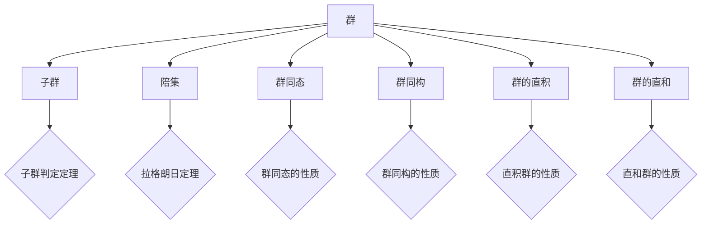

# 代数群引论：第一章 群概形的初等性质

## 1. 背景介绍
### 1.1 代数学的发展历程
### 1.2 群论的起源与意义
### 1.3 群论在现代数学中的地位

## 2. 核心概念与联系
### 2.1 群的定义与性质
#### 2.1.1 群的定义
群是一个二元运算下封闭且满足结合律、单位元、逆元三条性质的非空集合。设 $G$ 为一个非空集合，若在 $G$ 上定义了一个二元运算 $\cdot$，使得：
1. 封闭性：对任意 $a,b \in G$，都有 $a \cdot b \in G$；
2. 结合律：对任意 $a,b,c \in G$，都有 $(a \cdot b) \cdot c = a \cdot (b \cdot c)$；
3. 单位元：存在元素 $e \in G$，使得对任意 $a \in G$，都有 $a \cdot e = e \cdot a = a$；
4. 逆元：对任意 $a \in G$，存在元素 $a^{-1} \in G$，使得 $a \cdot a^{-1} = a^{-1} \cdot a = e$。

则称 $(G, \cdot)$ 为一个群。其中，$\cdot$ 称为群的运算，$e$ 称为群的单位元。

#### 2.1.2 群的基本性质
- 单位元唯一性
- 逆元唯一性
- 消去律
- 幂运算

### 2.2 子群的概念
#### 2.2.1 子群的定义
设 $(G, \cdot)$ 是一个群，$H$ 是 $G$ 的非空子集。如果 $H$ 对群 $G$ 的运算封闭，即对任意 $a,b \in H$，都有 $a \cdot b \in H$，则称 $H$ 是群 $G$ 的一个子群，记作 $H \leq G$。

#### 2.2.2 子群的判定定理
设 $(G, \cdot)$ 是一个群，$H$ 是 $G$ 的非空子集。则 $H \leq G$ 的充要条件是：对任意 $a,b \in H$，都有 $a \cdot b^{-1} \in H$。

### 2.3 陪集与拉格朗日定理
#### 2.3.1 陪集的定义
设 $H$ 是群 $G$ 的一个子群，$a \in G$。称集合 $aH = \{ah \mid h \in H\}$ 为 $a$ 关于子群 $H$ 的左陪集，$Ha = \{ha \mid h \in H\}$ 为 $a$ 关于子群 $H$ 的右陪集。

#### 2.3.2 拉格朗日定理
设 $G$ 是一个有限群，$H \leq G$，则 $|H|$ 整除 $|G|$，即存在正整数 $k$ 使得 $|G| = k|H|$。其中，$k$ 称为子群 $H$ 在群 $G$ 中的指数，记作 $[G:H]$。

### 2.4 群同态与同构
#### 2.4.1 群同态的定义
设 $(G, \cdot)$ 和 $(G', \ast)$ 是两个群，映射 $\varphi: G \to G'$ 满足：对任意 $a,b \in G$，都有 $\varphi(a \cdot b) = \varphi(a) \ast \varphi(b)$，则称 $\varphi$ 是从群 $G$ 到群 $G'$ 的一个同态映射，简称为群同态。

#### 2.4.2 群同构的定义
如果群同态 $\varphi: G \to G'$ 是一个双射，则称 $\varphi$ 是从群 $G$ 到群 $G'$ 的一个同构映射，简称为群同构。此时，称群 $G$ 与群 $G'$ 同构，记作 $G \cong G'$。

### 2.5 群的直积与直和
#### 2.5.1 群的直积
设 $(G_1, \cdot_1), (G_2, \cdot_2), \dots, (G_n, \cdot_n)$ 是 $n$ 个群，在它们的笛卡尔积 $G_1 \times G_2 \times \dots \times G_n$ 上定义运算 $\cdot$：对任意 $(a_1, a_2, \dots, a_n), (b_1, b_2, \dots, b_n) \in G_1 \times G_2 \times \dots \times G_n$，$(a_1, a_2, \dots, a_n) \cdot (b_1, b_2, \dots, b_n) = (a_1 \cdot_1 b_1, a_2 \cdot_2 b_2, \dots, a_n \cdot_n b_n)$。则 $(G_1 \times G_2 \times \dots \times G_n, \cdot)$ 构成一个群，称为群 $G_1, G_2, \dots, G_n$ 的直积，记作 $G_1 \times G_2 \times \dots \times G_n$。

#### 2.5.2 群的直和
设 $G_1, G_2, \dots, G_n$ 是 $n$ 个群，则它们的直积 $G_1 \times G_2 \times \dots \times G_n$ 的子群 $\{(a_1, a_2, \dots, a_n) \mid a_i \in G_i, 1 \leq i \leq n, 至多有限个 a_i \neq e_i\}$ 称为群 $G_1, G_2, \dots, G_n$ 的直和，记作 $G_1 \oplus G_2 \oplus \dots \oplus G_n$。其中，$e_i$ 表示群 $G_i$ 的单位元。

## 3. 核心算法原理具体操作步骤
### 3.1 群的基本运算
#### 3.1.1 群元素的乘法运算
#### 3.1.2 群元素的幂运算
#### 3.1.3 群元素的逆元计算

### 3.2 子群的判定
#### 3.2.1 利用子群的定义判定
#### 3.2.2 利用子群的判定定理判定

### 3.3 陪集的计算
#### 3.3.1 左陪集的计算
#### 3.3.2 右陪集的计算

### 3.4 群同态与同构的判定
#### 3.4.1 群同态的判定
#### 3.4.2 群同构的判定

### 3.5 群的直积与直和的计算
#### 3.5.1 群的直积计算
#### 3.5.2 群的直和计算

## 4. 数学模型和公式详细讲解举例说明
### 4.1 群的数学模型
### 4.2 子群的数学模型
### 4.3 陪集与拉格朗日定理的数学模型
### 4.4 群同态与同构的数学模型
### 4.5 群的直积与直和的数学模型

## 5. 项目实践：代码实例和详细解释说明
### 5.1 群的基本运算的代码实现
### 5.2 子群判定的代码实现
### 5.3 陪集计算的代码实现
### 5.4 群同态与同构判定的代码实现
### 5.5 群的直积与直和计算的代码实现

## 6. 实际应用场景
### 6.1 群论在密码学中的应用
### 6.2 群论在物理学中的应用
### 6.3 群论在化学中的应用
### 6.4 群论在计算机科学中的应用

## 7. 工具和资源推荐
### 7.1 群论学习资源推荐
#### 7.1.1 书籍推荐
#### 7.1.2 视频课程推荐
#### 7.1.3 在线学习网站推荐

### 7.2 群论计算工具推荐
#### 7.2.1 计算机代数系统推荐
#### 7.2.2 在线计算工具推荐

## 8. 总结：未来发展趋势与挑战
### 8.1 群论研究的现状
### 8.2 群论未来的发展方向
### 8.3 群论研究面临的挑战

## 9. 附录：常见问题与解答
### 9.1 群的定义与性质相关问题
### 9.2 子群判定相关问题
### 9.3 陪集与拉格朗日定理相关问题
### 9.4 群同态与同构相关问题
### 9.5 群的直积与直和相关问题

群论作为现代数学的重要分支，其概念与方法已广泛应用于各个领域。本文从群的基本定义与性质出发，系统介绍了子群、陪集、群同态、群同构、直积群、直和群等群论的核心概念。通过详细讲解群论的数学模型与代码实例，帮助读者深入理解群论的内在原理与计算方法。同时，文章还探讨了群论在密码学、物理学、化学、计算机科学等领域的实际应用，展示了群论的广泛应用前景。

群论作为一门抽象而深刻的数学分支，其研究对象是各种运算下封闭且满足特定性质的集合。通过研究群的结构特征与性质，人们可以更好地理解各种数学对象的内在联系，并将其应用于解决实际问题。群论在现代科学技术中扮演着越来越重要的角色，成为了数学家、物理学家、化学家、计算机科学家等的重要工具。

展望未来，群论的研究仍有许多亟待探索的领域。随着计算机技术的不断发展，群论的计算方法与工具也在不断更新与完善。同时，群论与其他数学分支如拓扑学、几何学、代数学等的交叉融合，也为群论的发展带来了新的机遇与挑战。相信通过数学工作者的不懈努力，群论必将在未来取得更加瞩目的成就，为人类科学技术的进步做出更大的贡献。

作者：禅与计算机程序设计艺术 / Zen and the Art of Computer Programming