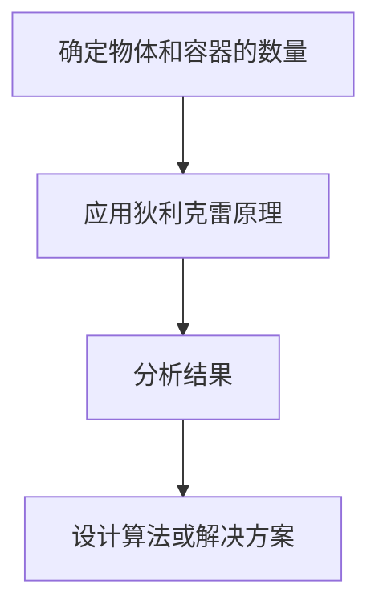

# 像数学家一样思考：狄利克雷原理

## 1.背景介绍

狄利克雷原理（Dirichlet's Principle），又称鸽笼原理，是数学中一个简单但非常强大的工具。它的基本思想是，如果有更多的物体（鸽子）要放入少于物体数量的容器（鸽笼），那么至少有一个容器会包含多个物体。这个原理在计算机科学、算法设计、数据结构等领域有着广泛的应用。

在计算机科学中，狄利克雷原理被用来解决各种问题，例如哈希冲突、负载均衡、资源分配等。理解和应用狄利克雷原理可以帮助程序员设计更高效、更可靠的算法和系统。

## 2.核心概念与联系

### 2.1 狄利克雷原理的基本定义

狄利克雷原理的基本定义是：如果有 $n$ 个物体要放入 $m$ 个容器，并且 $n > m$，那么至少有一个容器会包含多个物体。

### 2.2 数学与计算机科学的联系

狄利克雷原理不仅仅是一个数学概念，它在计算机科学中有着广泛的应用。例如，在哈希表中，狄利克雷原理解释了为什么会发生哈希冲突；在负载均衡中，它帮助我们理解资源分配的基本原理。

### 2.3 其他相关概念

狄利克雷原理还与其他数学和计算机科学概念密切相关，如组合数学、概率论、图论等。这些领域的知识可以帮助我们更好地理解和应用狄利克雷原理。

## 3.核心算法原理具体操作步骤

### 3.1 基本算法步骤

狄利克雷原理的应用通常可以分为以下几个步骤：

1. **确定物体和容器的数量**：首先确定问题中涉及的物体和容器的数量。
2. **应用狄利克雷原理**：根据狄利克雷原理，判断是否存在至少一个容器包含多个物体。
3. **分析结果**：根据分析结果，设计相应的算法或解决方案。

### 3.2 示例：哈希表中的应用

在哈希表中，狄利克雷原理可以用来解释哈希冲突。假设我们有一个哈希表，包含 $m$ 个桶（容器），并且我们要插入 $n$ 个键（物体），如果 $n > m$，根据狄利克雷原理，至少有一个桶会包含多个键，这就是哈希冲突。

### 3.3 示例：负载均衡中的应用

在负载均衡中，狄利克雷原理可以帮助我们理解资源分配的基本原理。假设我们有 $m$ 个服务器（容器），并且有 $n$ 个任务（物体）要分配，如果 $n > m$，根据狄利克雷原理，至少有一个服务器会处理多个任务。

## 4.数学模型和公式详细讲解举例说明

### 4.1 数学模型

狄利克雷原理的数学模型可以用以下公式表示：

$$
\text{如果} \ n > m \ \text{，则} \ \exists \ i \ \text{使得} \ c_i \geq 2
$$

其中，$n$ 是物体的数量，$m$ 是容器的数量，$c_i$ 是第 $i$ 个容器中的物体数量。

### 4.2 举例说明

#### 例子1：哈希表

假设我们有一个哈希表，包含 10 个桶，并且我们要插入 15 个键。根据狄利克雷原理，至少有一个桶会包含多个键。

#### 例子2：负载均衡

假设我们有 5 个服务器，并且有 8 个任务要分配。根据狄利克雷原理，至少有一个服务器会处理多个任务。

### 4.3 Mermaid 流程图

以下是一个简单的 Mermaid 流程图，展示了狄利克雷原理的应用步骤：



## 5.项目实践：代码实例和详细解释说明

### 5.1 哈希表中的应用

以下是一个简单的 Python 代码示例，展示了如何在哈希表中应用狄利克雷原理：

```python
class HashTable:
    def __init__(self, size):
        self.size = size
        self.table = [[] for _ in range(size)]

    def hash_function(self, key):
        return key % self.size

    def insert(self, key, value):
        index = self.hash_function(key)
        self.table[index].append(value)

    def display(self):
        for i, bucket in enumerate(self.table):
            print(f"Bucket {i}: {bucket}")

# 创建一个哈希表，包含 10 个桶
hash_table = HashTable(10)

# 插入 15 个键值对
for i in range(15):
    hash_table.insert(i, f"Value {i}")

# 显示哈希表
hash_table.display()
```

### 5.2 负载均衡中的应用

以下是一个简单的 Python 代码示例，展示了如何在负载均衡中应用狄利克雷原理：

```python
class LoadBalancer:
    def __init__(self, num_servers):
        self.num_servers = num_servers
        self.servers = [[] for _ in range(num_servers)]

    def distribute_task(self, task_id):
        server_index = task_id % self.num_servers
        self.servers[server_index].append(task_id)

    def display(self):
        for i, server in enumerate(self.servers):
            print(f"Server {i}: {server}")

# 创建一个负载均衡器，包含 5 个服务器
load_balancer = LoadBalancer(5)

# 分配 8 个任务
for i in range(8):
    load_balancer.distribute_task(i)

# 显示服务器任务分配情况
load_balancer.display()
```

## 6.实际应用场景

### 6.1 数据库分区

在数据库分区中，狄利克雷原理可以帮助我们理解数据分区的基本原理。假设我们有 $m$ 个分区，并且有 $n$ 个数据要分配，如果 $n > m$，根据狄利克雷原理，至少有一个分区会包含多个数据。

### 6.2 任务调度

在任务调度中，狄利克雷原理可以帮助我们理解任务分配的基本原理。假设我们有 $m$ 个处理器，并且有 $n$ 个任务要分配，如果 $n > m$，根据狄利克雷原理，至少有一个处理器会处理多个任务。

### 6.3 网络流量管理

在网络流量管理中，狄利克雷原理可以帮助我们理解流量分配的基本原理。假设我们有 $m$ 个路由器，并且有 $n$ 个数据包要分配，如果 $n > m$，根据狄利克雷原理，至少有一个路由器会处理多个数据包。

## 7.工具和资源推荐

### 7.1 在线工具

- **Python Tutor**：一个在线工具，可以帮助你可视化 Python 代码的执行过程。
- **Jupyter Notebook**：一个交互式的计算环境，可以帮助你编写和分享代码。

### 7.2 书籍推荐

- **《算法导论》**：一本经典的算法书籍，详细介绍了各种算法和数据结构。
- **《离散数学及其应用》**：一本经典的离散数学书籍，详细介绍了狄利克雷原理及其应用。

### 7.3 在线课程

- **Coursera**：提供各种计算机科学和数学课程，包括算法、数据结构、离散数学等。
- **edX**：提供各种计算机科学和数学课程，包括算法、数据结构、离散数学等。

## 8.总结：未来发展趋势与挑战

狄利克雷原理作为一个简单但强大的数学工具，在计算机科学中有着广泛的应用。随着计算机科学的发展，狄利克雷原理的应用场景将会越来越多。然而，如何在复杂的实际问题中有效地应用狄利克雷原理，仍然是一个挑战。

未来，随着大数据、人工智能、云计算等技术的发展，狄利克雷原理在这些领域的应用将会更加广泛。例如，在大数据分析中，如何有效地分配计算资源；在人工智能中，如何有效地分配训练任务；在云计算中，如何有效地分配存储资源等。

## 9.附录：常见问题与解答

### 9.1 什么是狄利克雷原理？

狄利克雷原理是一个数学概念，基本思想是如果有更多的物体要放入少于物体数量的容器，那么至少有一个容器会包含多个物体。

### 9.2 狄利克雷原理在计算机科学中的应用有哪些？

狄利克雷原理在计算机科学中有着广泛的应用，例如哈希冲突、负载均衡、资源分配等。

### 9.3 如何在实际项目中应用狄利克雷原理？

在实际项目中，可以通过确定物体和容器的数量，应用狄利克雷原理，分析结果，设计相应的算法或解决方案。

### 9.4 狄利克雷原理的局限性是什么？

狄利克雷原理的局限性在于它只能提供一个存在性的结论，不能提供具体的解决方案。在实际应用中，需要结合其他算法和技术来解决具体问题。

### 9.5 如何进一步学习和应用狄利克雷原理？

可以通过阅读相关书籍、参加在线课程、使用在线工具等方式进一步学习和应用狄利克雷原理。

---

作者：禅与计算机程序设计艺术 / Zen and the Art of Computer Programming