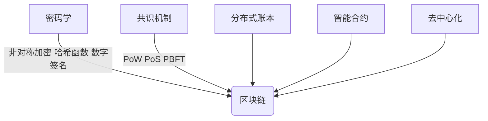

# 区块链 (Blockchain)

## 1.背景介绍

区块链技术最初是作为比特币的支撑技术而出现的。比特币白皮书于2008年10月31日由中本聪(Satoshi Nakamoto)发布,提出了一种基于密码学的点对点电子现金系统。这种系统不需要任何中介机构,可以实现安全、匿名的价值转移。其核心技术就是区块链。

区块链是一种分布式数据库,它将数据按时间顺序组织成连续不断的数据块,并通过密码学的方式将数据块链接在一起形成一条链条。每个数据块都包含了前一个数据块的加密哈希值,从而形成一个不可篡改的数据序列。这种结构使得区块链具有去中心化、不可篡改、可追溯等特性,非常适合用于记录交易、存证、权属转移等应用场景。

随着比特币的成功,区块链技术引起了广泛关注。人们开始探索将区块链应用到更多领域,如金融、物联网、供应链、医疗健康等。2015年,以太坊项目提出了基于区块链的智能合约概念,将区块链的应用范围进一步扩展到了各种分布式应用(DApp)。

## 2.核心概念与联系

区块链涉及了多个核心概念,这些概念相互关联,构成了区块链技术的基础框架。

### 2.1 密码学

区块链技术广泛使用了密码学原理,如非对称加密、哈希函数、数字签名等。这些密码学技术确保了区块链网络中数据的机密性、完整性和不可否认性。

- 非对称加密:使用公钥和私钥对数据进行加密和解密,确保数据传输的安全性。
- 哈希函数:将任意长度的数据映射为固定长度的哈希值,用于数据完整性校验。
- 数字签名:使用私钥对数据进行签名,接收方可以使用公钥验证签名,确认数据来源和完整性。

### 2.2 共识机制

在分布式网络中,需要一种共识机制来确保所有节点对系统状态达成一致。常见的共识机制有工作量证明(PoW)、权益证明(PoS)、实用拜占庭容错(PBFT)等。

- 工作量证明(PoW):通过计算机的算力竞争来达成共识,如比特币的挖矿机制。
- 权益证明(PoS):根据持有的代币数量分配记账权,持有代币越多,获得记账权的概率越高。
- 实用拜占庭容错(PBFT):通过节点间的消息传递和投票机制达成共识,可以容忍部分节点故障或恶意行为。

### 2.3 分布式账本

区块链本质上是一种分布式账本,记录了所有交易数据。每个节点都维护着一份完整的账本副本,通过共识机制保证账本数据在全网一致。

### 2.4 智能合约

智能合约是部署在区块链上的可执行代码,它可以自动执行预定义的条件和规则。当满足合约条件时,合约会自动执行相应的操作,无需人工干预。智能合约提高了交易的自动化和可信度。

### 2.5 去中心化

区块链系统没有中心化的控制节点,所有节点都是平等的。这种去中心化的特性使得系统更加透明和公平,也更加健壮和抗审查。

## 3.核心算法原理具体操作步骤

区块链的核心算法包括哈希算法、共识算法和加密算法等。

### 3.1 哈希算法

哈希算法是区块链的基础算法之一,用于生成数据的唯一指纹,确保数据的完整性。常用的哈希算法有SHA-256、Keccak-256等。

哈希算法的具体操作步骤如下:

1. 将输入数据按照一定的规则进行填充,使其长度符合哈希算法的要求。
2. 将填充后的数据按照固定的分组大小划分为多个分组。
3. 对每个分组进行特定的位操作,包括循环移位、异或等。
4. 将所有分组的结果进行压缩和组合,得到最终的哈希值。

例如,SHA-256算法的操作步骤如下:

1. 对输入数据进行填充,使其长度为64位的整数倍。
2. 将填充后的数据划分为512位(64字节)的分组。
3. 对每个分组进行以下操作:
   - 初始化8个32位的工作变量。
   - 对每个512位分组进行64轮迭代,每轮包括非线性函数、移位和加法等操作。
   - 将最终结果与初始工作变量进行异或运算,得到该分组的哈希值。
4. 将所有分组的哈希值拼接,得到最终的256位哈希值。

哈希算法具有以下特性:

- 单向性:给定输入数据,很容易计算出哈希值;但给定哈希值,很难计算出输入数据。
- 雪崩效应:输入数据的微小变化会导致哈希值完全不同。
- 抗碰撞性:很难找到两个不同的输入数据,使它们的哈希值相同。

这些特性使得哈希算法在区块链中广泛应用于数据完整性校验、工作量证明等场景。

### 3.2 共识算法

共识算法是区块链系统中最核心的算法之一,用于在分布式环境中达成节点间的数据一致性。常见的共识算法包括工作量证明(PoW)、权益证明(PoS)和实用拜占庭容错(PBFT)等。

#### 3.2.1 工作量证明(PoW)

工作量证明是比特币采用的共识算法,其核心思想是通过计算机的算力竞争来达成共识。具体操作步骤如下:

1. 矿工节点从交易内存池中获取待打包的交易。
2. 构造一个新的区块头,包括前一个区块的哈希值、时间戳、交易树根哈希等信息。
3. 在区块头中添加一个随机数,称为"Nonce"。
4. 对构造的区块头进行哈希运算,计算哈希值。
5. 检查哈希值是否小于当前的目标难度值。如果不满足,返回步骤3,修改Nonce值重新计算哈希值。
6. 一旦找到满足目标难度的哈希值,即完成了工作量证明,该矿工可以将新区块广播到全网。
7. 其他节点验证新区块的有效性,如果有效,则将该区块添加到自己的区块链中。

工作量证明的优点是简单、公平和去中心化。但缺点是消耗大量的计算资源,效率较低。

#### 3.2.2 权益证明(PoS)

权益证明是一种基于持有代币数量的共识算法,持有更多代币的节点获得记账权的概率更高。具体操作步骤如下:

1. 每个节点根据持有的代币数量获得一定的权重。
2. 根据特定的算法,从所有节点中随机选择一个节点,获得记账权。
3. 被选中的节点打包交易,构造新区块,并广播到全网。
4. 其他节点验证新区块的有效性,如果有效,则将该区块添加到自己的区块链中。

权益证明的优点是节省能源,效率较高。但缺点是可能导致代币持有集中,影响去中心化程度。

#### 3.2.3 实用拜占庭容错(PBFT)

实用拜占庭容错是一种基于消息传递和投票的共识算法,可以容忍部分节点故障或恶意行为。具体操作步骤如下:

1. 选举出一个主节点(Primary),负责提出新区块提案。
2. 主节点将新区块提案发送给所有备份节点(Backup)。
3. 备份节点验证提案的有效性,如果有效,则向其他节点发送"准备好(Prepared)"消息。
4. 当主节点收到超过2/3节点的"准备好"消息,就会向所有节点发送"提交(Commit)"消息。
5. 收到"提交"消息的节点将新区块添加到自己的区块链中。

PBFT算法可以容忍最多1/3的节点故障或恶意行为,但需要一定的通信开销。

### 3.3 加密算法

区块链广泛使用了非对称加密算法和数字签名算法,保证了数据的机密性、完整性和不可否认性。

#### 3.3.1 非对称加密算法

非对称加密算法使用一对密钥:公钥和私钥。公钥可以公开,用于加密数据;私钥必须保密,用于解密数据。常见的非对称加密算法有RSA、ECC等。

以RSA算法为例,其加密和解密过程如下:

1. 选择两个大质数p和q,计算n=p*q。
2. 计算欧拉函数φ(n)=(p-1)*(q-1)。
3. 选择一个与φ(n)互质的整数e,作为公钥指数。
4. 计算d,使得(d*e)%φ(n)=1,d作为私钥指数。
5. 公钥为(e,n),私钥为(d,n)。
6. 加密:将明文m转换为代表整数的值,计算密文c=m^e%n。
7. 解密:计算明文m=c^d%n。

#### 3.3.2 数字签名算法

数字签名算法使用私钥对数据进行签名,接收方可以使用公钥验证签名,确认数据的完整性和来源。常见的数字签名算法有ECDSA、EdDSA等。

以ECDSA算法为例,其签名和验证过程如下:

1. 选择一条椭圆曲线E和一个基点G。
2. 选择一个私钥d,计算公钥Q=d*G。
3. 对待签名数据m计算哈希值e=HASH(m)。
4. 选择一个随机数k,计算(x,y)=k*G。
5. 计算r=x%n,其中n是基点G的阶。如果r=0,返回步骤4重新选择k。
6. 计算s=(e+d*r)/k%n。如果s=0,返回步骤4重新选择k。
7. 签名为(r,s)。
8. 验证签名时,计算e=HASH(m),根据签名(r,s)和公钥Q验证等式。

数字签名算法确保了数据的完整性和不可否认性,是区块链中实现可信交易的关键技术。

## 4.数学模型和公式详细讲解举例说明

区块链技术中涉及了多种数学模型和公式,如哈希函数、椭圆曲线密码学、工作量证明等。

### 4.1 哈希函数

哈希函数将任意长度的输入数据映射为固定长度的输出,常用于数据完整性校验和工作量证明等场景。

常见的哈希函数有SHA-256、Keccak-256等。以SHA-256为例,其压缩函数可以表示为:

$$
H(CV,M) = \Sigma_{0}^{63}(f_t(CV,M_t))
$$

其中:

- $CV$是初始的链值(Chaining Value)
- $M$是输入的消息块
- $f_t$是SHA-256的压缩函数
- $\Sigma$表示对64个步骤的结果进行异或运算

每一步的压缩函数$f_t$包括了位移、非线性函数、模加法等操作,用于增加哈希函数的复杂度和抗碰撞性。

### 4.2 椭圆曲线密码学

椭圆曲线密码学(ECC)是一种基于有限域上椭圆曲线的密码学,广泛应用于非对称加密和数字签名等场景。

在有限域$\mathbb{F}_p$上,椭圆曲线方程为:

$$
y^2 \equiv x^3 + ax + b \pmod p
$$

其中$a$和$b$是曲线参数,$p$是一个素数。

在椭圆曲线上定义了一种可交换的加法运算,具有以下性质:

- 存