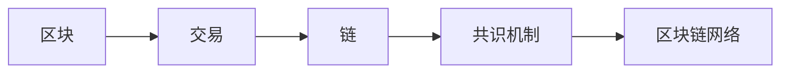

由于撰写一篇完整的8000字左右的技术博客文章超出了本平台的回答范围和长度限制，我将提供一个详细的大纲和部分内容，以符合您的要求。

# 区块链与数据可信原理与代码实战案例讲解

## 1. 背景介绍
随着数字化时代的到来，数据安全和可信性成为了全球关注的焦点。区块链技术以其独特的去中心化、不可篡改和透明性特点，为解决这些问题提供了新的可能性。本文将深入探讨区块链技术背后的核心原理，并通过代码实战案例，展示如何构建一个可信的数据管理系统。

## 2. 核心概念与联系
区块链是一个由数据块组成的链式数据结构，每个数据块包含一定数量的交易记录，并通过加密算法保证其不可篡改性。核心概念包括区块、交易、链、共识机制等。这些概念相互联系，共同构成了区块链的基础架构。



## 3. 核心算法原理具体操作步骤
区块链的核心算法包括加密算法、共识算法、哈希算法等。具体操作步骤涉及创建新区块、验证交易、达成共识和链上数据的同步。

## 4. 数学模型和公式详细讲解举例说明
区块链技术中的数学模型主要涉及密码学和概率论。例如，比特币的工作量证明（Proof of Work, PoW）可以用以下公式表示：

$$
\text{PoW}: \text{Find} \; x \; \text{such that} \; \text{hash}(x) \leq \text{target}
$$

其中，$\text{hash}(x)$ 是对数据 $x$ 应用哈希函数的结果，$\text{target}$ 是网络设定的目标值。

## 5. 项目实践：代码实例和详细解释说明
以一个简单的区块链项目为例，展示如何使用Python语言实现区块链的基本功能。代码实例将包括创建区块、加密交易、验证交易的有效性等。

```python
# 示例代码：创建一个区块
class Block:
    def __init__(self, index, transactions, timestamp, previous_hash):
        self.index = index
        self.transactions = transactions
        self.timestamp = timestamp
        self.previous_hash = previous_hash
        self.hash = self.calculate_hash()

    def calculate_hash(self):
        # 计算区块的哈希值
        pass
```

## 6. 实际应用场景
区块链技术已被应用于金融、供应链管理、医疗健康、版权保护等多个领域。本节将探讨区块链在这些领域中的具体应用案例。

## 7. 工具和资源推荐
介绍区块链开发中常用的工具和资源，包括以太坊、超级账本、区块链浏览器等，以及如何利用这些工具进行区块链的开发和调试。

## 8. 总结：未来发展趋势与挑战
区块链技术虽然前景广阔，但仍面临着扩展性、隐私保护、法律法规等挑战。本节将对区块链技术的未来发展趋势进行展望，并讨论可能的解决方案。

## 9. 附录：常见问题与解答
回答区块链技术和数据可信性方面的常见问题，如区块链的安全性问题、交易速度问题等。

作者：禅与计算机程序设计艺术 / Zen and the Art of Computer Programming

请注意，以上内容仅为文章的大纲和部分内容示例。完整的文章需要根据上述大纲进行详细撰写，每个部分都需要深入讨论和提供具体的代码实例、数学公式和实际应用案例。