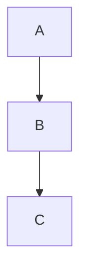

## 1. 背景介绍

在人工智能领域，因果推理和因果学习是非常重要的研究方向。因果推理是指通过观察和实验来确定事件之间的因果关系，而因果学习则是指从数据中学习因果关系。因果推理和因果学习可以帮助我们更好地理解和预测现实世界中的事件，从而为决策和规划提供更准确的依据。

本文将介绍因果推理和因果学习的核心概念和算法原理，并通过代码实战案例来演示如何应用这些技术。

## 2. 核心概念与联系

### 2.1 因果关系

因果关系是指一个事件的发生会导致另一个事件的发生。例如，雨水会导致地面湿润，这就是雨水和地面湿润之间的因果关系。因果关系可以分为直接因果关系和间接因果关系。直接因果关系是指一个事件直接导致另一个事件的发生，而间接因果关系则是通过中间事件的发生而导致的。

### 2.2 因果推理

因果推理是指通过观察和实验来确定事件之间的因果关系。因果推理可以帮助我们更好地理解和预测现实世界中的事件，从而为决策和规划提供更准确的依据。

### 2.3 因果学习

因果学习是指从数据中学习因果关系。因果学习可以帮助我们更好地理解和预测现实世界中的事件，从而为决策和规划提供更准确的依据。

### 2.4 因果图

因果图是一种用于表示因果关系的图形模型。在因果图中，节点表示变量，边表示变量之间的因果关系。因果图可以帮助我们更好地理解和推断变量之间的因果关系。

## 3. 核心算法原理具体操作步骤

### 3.1 因果推理算法

因果推理算法可以分为基于贝叶斯网络的算法和基于因果图的算法。基于贝叶斯网络的算法通过构建贝叶斯网络来表示变量之间的因果关系，然后使用贝叶斯推断来推断变量之间的因果关系。基于因果图的算法则是直接使用因果图来推断变量之间的因果关系。

### 3.2 因果学习算法

因果学习算法可以分为基于因果图的算法和基于贝叶斯网络的算法。基于因果图的算法通过构建因果图来表示变量之间的因果关系，然后使用因果发现算法来发现变量之间的因果关系。基于贝叶斯网络的算法则是通过构建贝叶斯网络来表示变量之间的因果关系，然后使用贝叶斯学习算法来学习变量之间的因果关系。

## 4. 数学模型和公式详细讲解举例说明

### 4.1 因果图模型

因果图模型可以用有向无环图来表示。在因果图中，节点表示变量，边表示变量之间的因果关系。例如，下图是一个简单的因果图模型：



在这个因果图模型中，A是B的因，B是C的因。

### 4.2 因果推理公式

因果推理公式可以用贝叶斯公式来表示。例如，下面是一个简单的因果推理公式：

$$P(A|B) = \frac{P(B|A)P(A)}{P(B)}$$

在这个公式中，$P(A|B)$表示在B发生的情况下A发生的概率，$P(B|A)$表示在A发生的情况下B发生的概率，$P(A)$表示A发生的概率，$P(B)$表示B发生的概率。

### 4.3 因果学习公式

因果学习公式可以用因果发现算法来表示。例如，下面是一个简单的因果学习公式：

$$P(X \rightarrow Y) = \frac{P(X,Y)}{P(X)P(Y)}$$

在这个公式中，$P(X \rightarrow Y)$表示从X到Y的因果关系的概率，$P(X,Y)$表示X和Y同时发生的概率，$P(X)$表示X发生的概率，$P(Y)$表示Y发生的概率。

## 5. 项目实践：代码实例和详细解释说明

### 5.1 因果推理代码实例

下面是一个基于贝叶斯网络的因果推理代码实例：

```python
import numpy as np
import pandas as pd
from pgmpy.models import BayesianModel
from pgmpy.estimators import MaximumLikelihoodEstimator

# 构建贝叶斯网络模型
model = BayesianModel([('A', 'B'), ('B', 'C')])

# 生成样本数据
data = pd.DataFrame(np.random.randint(0, 2, size=(1000, 3)), columns=['A', 'B', 'C'])

# 使用最大似然估计算法来学习贝叶斯网络模型的参数
model.fit(data, estimator=MaximumLikelihoodEstimator)

# 推断变量之间的因果关系
print(model.get_cpds())
```

在这个代码实例中，我们首先构建了一个贝叶斯网络模型，然后生成了一些样本数据，最后使用最大似然估计算法来学习贝叶斯网络模型的参数，并推断变量之间的因果关系。

### 5.2 因果学习代码实例

下面是一个基于因果发现算法的因果学习代码实例：

```python
import numpy as np
import pandas as pd
from causality.inference.search import IC
from causality.inference.independence_tests import RobustRegressionTest

# 生成样本数据
data = pd.DataFrame(np.random.randint(0, 2, size=(1000, 3)), columns=['A', 'B', 'C'])

# 使用因果发现算法来发现变量之间的因果关系
ic_algorithm = IC(RobustRegressionTest)
graph = ic_algorithm.search(data)

# 输出因果图模型
print(graph.edges())
```

在这个代码实例中，我们首先生成了一些样本数据，然后使用因果发现算法来发现变量之间的因果关系，并输出因果图模型。

## 6. 实际应用场景

因果推理和因果学习在很多领域都有广泛的应用，例如医疗、金融、工业等。在医疗领域，因果推理和因果学习可以帮助医生更好地理解疾病的发生和治疗效果，从而提高治疗效果和减少不必要的医疗费用。在金融领域，因果推理和因果学习可以帮助投资者更好地理解市场的变化和投资策略的效果，从而提高投资收益和降低风险。在工业领域，因果推理和因果学习可以帮助企业更好地理解生产过程中的因果关系，从而提高生产效率和降低成本。

## 7. 工具和资源推荐

在因果推理和因果学习方面，有很多优秀的工具和资源可供使用。例如，pgmpy是一个用于构建和分析贝叶斯网络的Python库，causality是一个用于因果推理和因果学习的Python库，因果发现算法包括PC算法、IC算法、GES算法等。

## 8. 总结：未来发展趋势与挑战

因果推理和因果学习是人工智能领域的重要研究方向，未来将会有更多的研究和应用。然而，因果推理和因果学习也面临着一些挑战，例如数据质量、因果关系的复杂性等。因此，我们需要不断地研究和创新，以应对这些挑战。

## 9. 附录：常见问题与解答

Q: 因果推理和因果学习有什么区别？

A: 因果推理是指通过观察和实验来确定事件之间的因果关系，而因果学习则是指从数据中学习因果关系。

Q: 因果图是什么？

A: 因果图是一种用于表示因果关系的图形模型。在因果图中，节点表示变量，边表示变量之间的因果关系。

Q: 因果推理和因果学习有哪些应用场景？

A: 因果推理和因果学习在医疗、金融、工业等领域都有广泛的应用。在医疗领域，因果推理和因果学习可以帮助医生更好地理解疾病的发生和治疗效果，从而提高治疗效果和减少不必要的医疗费用。在金融领域，因果推理和因果学习可以帮助投资者更好地理解市场的变化和投资策略的效果，从而提高投资收益和降低风险。在工业领域，因果推理和因果学习可以帮助企业更好地理解生产过程中的因果关系，从而提高生产效率和降低成本。

作者：禅与计算机程序设计艺术 / Zen and the Art of Computer Programming