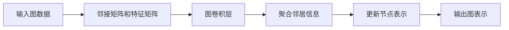

# 图神经网络(Graph Neural Networks) - 原理与代码实例讲解

## 1. 背景介绍

在深度学习领域，图神经网络（Graph Neural Networks，GNNs）是近年来崛起的一类神经网络，它专注于处理图结构数据。与传统的神经网络处理欧几里得数据（如图像、声音等）不同，GNNs 能够直接在图上进行学习，捕捉节点间的复杂关系和图结构的全局信息。从社交网络分析、推荐系统到分子结构识别，GNNs 的应用范围日益扩大，成为了深度学习领域的一个热点。

## 2. 核心概念与联系

### 2.1 图的基本概念

- **节点（Node）**：图中的一个个实体。
- **边（Edge）**：连接节点的线，表示节点间的关系。
- **邻接矩阵（Adjacency Matrix）**：表示节点间连接关系的矩阵。

### 2.2 图神经网络的基本组成

- **图卷积层（Graph Convolutional Layer）**：GNNs 的核心，用于更新节点的表示。
- **聚合函数（Aggregation Function）**：用于聚合邻居节点信息的函数。
- **更新函数（Update Function）**：用于更新节点表示的函数。

### 2.3 图神经网络的类型

- **图卷积网络（GCN）**：一种简单高效的图神经网络。
- **图注意力网络（GAT）**：引入注意力机制的图神经网络。
- **图自编码器（GAE）**：用于图数据无监督学习的网络。

## 3. 核心算法原理具体操作步骤



1. **输入图数据**：输入包含节点特征和边信息的图。
2. **邻接矩阵和特征矩阵**：构建图的邻接矩阵和节点特征矩阵。
3. **图卷积层**：通过图卷积层处理节点特征。
4. **聚合邻居信息**：使用聚合函数聚合邻居节点的信息。
5. **更新节点表示**：使用更新函数更新节点的表示。
6. **输出图表示**：得到图的新表示，用于下游任务。

## 4. 数学模型和公式详细讲解举例说明

以图卷积网络（GCN）为例，节点的特征更新可以表示为：

$$
H^{(l+1)} = \sigma(\hat{D}^{-\frac{1}{2}}\hat{A}\hat{D}^{-\frac{1}{2}}H^{(l)}W^{(l)})
$$

其中，$H^{(l)}$ 是第 $l$ 层的节点特征矩阵，$\hat{A} = A + I_N$ 是邻接矩阵 $A$ 加上自连接的单位矩阵 $I_N$，$\hat{D}$ 是 $\hat{A}$ 的度矩阵，$W^{(l)}$ 是第 $l$ 层的权重矩阵，$\sigma$ 是非线性激活函数。

## 5. 项目实践：代码实例和详细解释说明

以PyTorch框架为例，实现一个简单的GCN层：

```python
import torch
import torch.nn as nn
import torch.nn.functional as F

class GraphConvolution(nn.Module):
    def __init__(self, input_features, output_features):
        super(GraphConvolution, self).__init__()
        self.weight = nn.Parameter(torch.FloatTensor(input_features, output_features))
        self.reset_parameters()

    def reset_parameters(self):
        stdv = 1. / math.sqrt(self.weight.size(1))
        self.weight.data.uniform_(-stdv, stdv)

    def forward(self, input, adj):
        support = torch.mm(input, self.weight)
        output = torch.spmm(adj, support)
        return output
```

在这段代码中，`GraphConvolution` 类定义了一个图卷积层，其中 `forward` 方法实现了上述的数学公式。

## 6. 实际应用场景

图神经网络在多个领域都有广泛应用，例如：

- **社交网络分析**：识别社区结构，推荐好友。
- **推荐系统**：基于用户和商品的交互图进行推荐。
- **生物信息学**：蛋白质结构预测，药物发现。

## 7. 工具和资源推荐

- **PyTorch Geometric**：一个基于PyTorch的图神经网络库。
- **DGL (Deep Graph Library)**：一个易用、高效、可扩展的图神经网络框架。
- **Spektral**：一个基于TensorFlow和Keras的图神经网络库。

## 8. 总结：未来发展趋势与挑战

图神经网络的研究仍在快速发展中，未来的趋势可能包括：

- **可扩展性**：如何在大规模图上有效训练GNNs。
- **动态图处理**：如何处理随时间变化的图结构。
- **解释性**：提高GNNs的可解释性。

## 9. 附录：常见问题与解答

- **Q1**: GNNs 如何处理图的动态变化？
- **A1**: 通过设计能够捕捉图结构变化的模型，如使用循环神经网络（RNN）结构。

- **Q2**: GNNs 在大规模图数据上的训练存在哪些挑战？
- **A2**: 计算资源限制、邻居采样策略、并行计算等。

作者：禅与计算机程序设计艺术 / Zen and the Art of Computer Programming