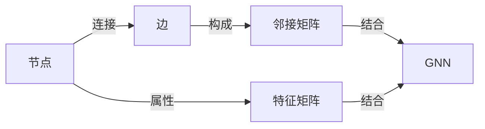
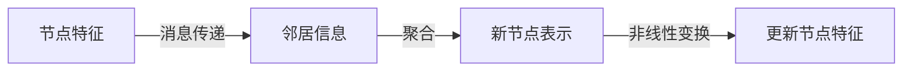

# 图神经网络原理与代码实战案例讲解

## 1. 背景介绍
在过去的十年里，深度学习技术在图像识别、自然语言处理等领域取得了巨大的成功。然而，当我们的数据不再是欧几里得空间中的规则结构，而是以图（Graphs）的形式存在时，传统的神经网络结构就显得力不从心。图神经网络（Graph Neural Networks，GNNs）应运而生，它能够直接在图结构数据上进行学习，捕捉到节点间复杂的关系和依赖，为多种领域的问题提供了新的解决方案。

## 2. 核心概念与联系
图神经网络的核心概念包括节点（Node）、边（Edge）、邻接矩阵（Adjacency Matrix）和特征矩阵（Feature Matrix）。节点代表图中的实体，边代表实体间的关系，邻接矩阵描述了节点间的连接关系，而特征矩阵则包含了每个节点的属性信息。GNN的目标是通过迭代更新节点的表示，以学习节点或图的高级特征表示。



## 3. 核心算法原理具体操作步骤
图神经网络的核心算法原理可以分为消息传递（Message Passing）和聚合（Aggregation）两个步骤。在消息传递阶段，每个节点会收集其邻居节点的信息；在聚合阶段，节点将收集到的信息与自身的特征结合，通过非线性变换生成新的节点表示。



## 4. 数学模型和公式详细讲解举例说明
以图卷积网络（Graph Convolutional Network，GCN）为例，节点的特征更新可以表示为：

$$
H^{(l+1)} = \sigma(\hat{D}^{-\frac{1}{2}}\hat{A}\hat{D}^{-\frac{1}{2}}H^{(l)}W^{(l)})
$$

其中，$H^{(l)}$ 是第 $l$ 层的节点特征矩阵，$\hat{A} = A + I_N$ 是邻接矩阵 $A$ 加上自连接（Identity Matrix $I_N$），$\hat{D}$ 是 $\hat{A}$ 的度矩阵，$W^{(l)}$ 是第 $l$ 层的权重矩阵，$\sigma$ 是非线性激活函数，如ReLU。

## 5. 项目实践：代码实例和详细解释说明
以PyTorch和PyTorch Geometric为基础，我们可以实现一个简单的GCN模型：

```python
import torch
import torch.nn.functional as F
from torch_geometric.nn import GCNConv

class GCN(torch.nn.Module):
    def __init__(self, num_features, num_classes):
        super(GCN, self).__init__()
        self.conv1 = GCNConv(num_features, 16)
        self.conv2 = GCNConv(16, num_classes)

    def forward(self, data):
        x, edge_index = data.x, data.edge_index

        x = self.conv1(x, edge_index)
        x = F.relu(x)
        x = F.dropout(x, training=self.training)
        x = self.conv2(x, edge_index)

        return F.log_softmax(x, dim=1)
```

在这段代码中，我们定义了一个包含两个图卷积层的GCN模型，使用ReLU作为激活函数，并在第一个图卷积层后应用了dropout以防止过拟合。

## 6. 实际应用场景
图神经网络在社交网络分析、蛋白质结构预测、交通网络优化等多个领域都有广泛的应用。例如，在推荐系统中，GNN可以帮助模型更好地理解用户和商品之间的复杂关系，从而提供更精准的推荐。

## 7. 工具和资源推荐
- PyTorch Geometric：一个基于PyTorch的图神经网络库，提供了丰富的GNN模型和工具。
- DGL（Deep Graph Library）：另一个流行的图神经网络框架，支持多种后端。
- GraphGym：一个用于图神经网络实验的平台，可以轻松地进行模型和算法的对比实验。

## 8. 总结：未来发展趋势与挑战
图神经网络的研究仍然是一个活跃的领域，未来的发展趋势可能包括更高效的算法、更好的解释性以及跨模态学习的能力。同时，如何处理大规模图数据、防止过拟合和模型泛化能力的提升也是当前面临的挑战。

## 9. 附录：常见问题与解答
Q1: 图神经网络如何处理大规模图数据？
A1: 可以采用图采样技术，如邻居采样或子图采样，来减少计算和内存的需求。

Q2: 如何评估图神经网络的性能？
A2: 通常使用节点分类、图分类或链接预测等任务的准确率、AUC值等指标来评估。

作者：禅与计算机程序设计艺术 / Zen and the Art of Computer Programming