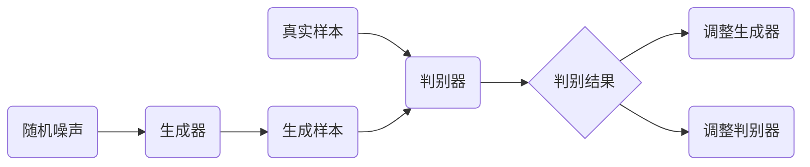

# 基于生成对抗网络的游戏世界风格化生成技术研究

## 1. 背景介绍

随着游戏产业的蓬勃发展，玩家对游戏世界的真实感和多样性提出了更高的要求。传统的游戏内容制作方式，如手工绘制和设计，已经难以满足快速增长的内容需求。生成对抗网络（GANs）作为一种强大的生成模型，近年来在图像生成、风格迁移等领域取得了显著的成果。本文将探讨如何利用GANs技术，实现游戏世界风格化的自动生成，以提高游戏设计的效率和丰富性。

## 2. 核心概念与联系

生成对抗网络（GANs）由两部分组成：生成器（Generator）和判别器（Discriminator）。生成器负责产生数据，判别器负责评估数据的真实性。两者在训练过程中相互竞争，生成器不断学习如何产生更真实的数据，而判别器则不断提高辨别真伪的能力。在游戏世界风格化生成中，GANs可以用来生成新的游戏素材，如纹理、地形、建筑等，并且可以通过风格迁移技术将现有的风格应用到新生成的内容上。

## 3. 核心算法原理具体操作步骤

GANs的训练过程包括以下步骤：

1. 随机生成噪声数据作为生成器的输入。
2. 生成器根据噪声数据生成样本。
3. 判别器评估生成样本和真实样本的真实性。
4. 根据判别器的反馈调整生成器的参数。
5. 重复步骤1-4，直到生成器生成的样本足够真实，判别器无法区分真伪。



## 4. 数学模型和公式详细讲解举例说明

GANs的核心是通过最小化生成器和判别器的损失函数来训练模型。生成器的损失函数可以表示为：

$$
L_G = -\mathbb{E}_{z\sim p_z(z)}[\log(D(G(z)))]
$$

判别器的损失函数可以表示为：

$$
L_D = -\mathbb{E}_{x\sim p_{data}(x)}[\log(D(x))] - \mathbb{E}_{z\sim p_z(z)}[\log(1 - D(G(z)))]
$$

其中，$G(z)$ 是生成器根据输入噪声 $z$ 生成的数据，$D(x)$ 是判别器对样本 $x$ 的真实性评估。通过交替优化这两个损失函数，GANs可以学习生成高质量的数据。

## 5. 项目实践：代码实例和详细解释说明

在游戏世界风格化生成的项目中，我们可以使用Python和TensorFlow来实现一个简单的GANs模型。以下是生成器和判别器的代码示例：

```python
import tensorflow as tf
from tensorflow.keras import layers

# 生成器模型
def make_generator_model():
    model = tf.keras.Sequential()
    model.add(layers.Dense(256, use_bias=False, input_shape=(100,)))
    model.add(layers.BatchNormalization())
    model.add(layers.LeakyReLU())
    model.add(layers.Reshape((16, 16, 1)))
    # ... 添加更多层 ...
    model.add(layers.Conv2DTranspose(1, (5, 5), strides=(2, 2), padding='same', use_bias=False, activation='tanh'))
    return model

# 判别器模型
def make_discriminator_model():
    model = tf.keras.Sequential()
    model.add(layers.Conv2D(64, (5, 5), strides=(2, 2), padding='same', input_shape=[32, 32, 1]))
    model.add(layers.LeakyReLU())
    model.add(layers.Dropout(0.3))
    # ... 添加更多层 ...
    model.add(layers.Flatten())
    model.add(layers.Dense(1))
    return model
```

在这个示例中，生成器和判别器都是使用卷积神经网络构建的。生成器的目标是从随机噪声生成32x32的图像，而判别器则需要判断图像的真实性。

## 6. 实际应用场景

GANs在游戏世界风格化生成中的应用包括：

- 自动生成游戏内的纹理和地形，提高游戏世界的多样性。
- 通过风格迁移技术，将现有的艺术风格应用到新生成的游戏元素上，保持游戏风格的一致性。
- 生成独特的游戏角色和物品，增加游戏的可玩性和吸引力。

## 7. 工具和资源推荐

- TensorFlow和PyTorch：两个强大的机器学习框架，适合构建和训练GANs模型。
- NVIDIA CUDA和cuDNN：用于加速深度学习模型训练的GPU计算库。
- GANs相关的开源项目和论坛：如GitHub上的awesome-generative-models，提供了大量的资源和学习材料。

## 8. 总结：未来发展趋势与挑战

GANs在游戏世界风格化生成中展现出巨大的潜力，但仍面临一些挑战，如训练稳定性、模型泛化能力和高分辨率生成等问题。未来的研究将集中在提高GANs的稳定性和效率，以及探索更多创新的应用场景。

## 9. 附录：常见问题与解答

- Q: GANs训练过程中常见的问题有哪些？
- A: 模式崩溃、训练不稳定、生成样本多样性不足等。

- Q: 如何评估生成模型的性能？
- A: 可以通过视觉质量、多样性和真实性等指标来评估。

- Q: GANs在游戏设计中的实际应用有哪些限制？
- A: 计算资源需求高、模型调优复杂、生成内容的控制性有限等。

作者：禅与计算机程序设计艺术 / Zen and the Art of Computer Programming