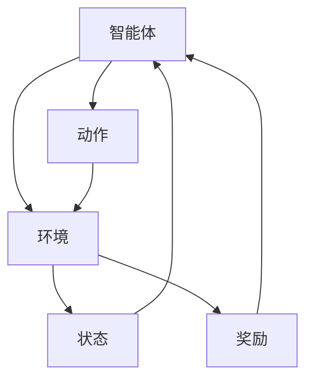

# 增强学习 原理与代码实例讲解

## 1.背景介绍

增强学习（Reinforcement Learning, RL）是机器学习的一个重要分支，近年来在人工智能领域取得了显著的进展。与监督学习和无监督学习不同，增强学习通过与环境的交互来学习策略，以最大化累积奖励。RL在游戏、机器人控制、自动驾驶等领域有着广泛的应用。

增强学习的核心思想源于行为心理学中的强化理论，强调通过奖励和惩罚来引导行为。RL的研究不仅涉及计算机科学，还涉及控制理论、神经科学和经济学等多个学科。

## 2.核心概念与联系

在深入探讨增强学习的算法和实现之前，我们需要了解一些基本概念：

### 2.1 智能体（Agent）

智能体是指在环境中执行动作并接收反馈的实体。智能体的目标是通过选择合适的动作来最大化累积奖励。

### 2.2 环境（Environment）

环境是智能体所处的外部世界，智能体通过与环境的交互来获取状态和奖励。环境可以是物理世界，也可以是虚拟的模拟环境。

### 2.3 状态（State）

状态是对环境在某一时刻的描述。状态可以是环境的完整描述，也可以是部分描述。

### 2.4 动作（Action）

动作是智能体在某一状态下可以执行的操作。动作的选择会影响环境的状态和智能体的奖励。

### 2.5 奖励（Reward）

奖励是智能体在执行某一动作后从环境中获得的反馈。奖励可以是正数（奖励）或负数（惩罚），用于指导智能体的行为。

### 2.6 策略（Policy）

策略是智能体在每一状态下选择动作的规则。策略可以是确定性的，也可以是随机的。

### 2.7 价值函数（Value Function）

价值函数用于评估某一状态或状态-动作对的好坏。常见的价值函数包括状态价值函数和动作价值函数。

### 2.8 Q-函数（Q-Function）

Q-函数是动作价值函数的一种，表示在某一状态下执行某一动作的预期累积奖励。

以下是这些概念之间的关系图：



## 3.核心算法原理具体操作步骤

增强学习的核心算法可以分为两大类：基于值的算法和基于策略的算法。我们将详细介绍其中的代表性算法：Q学习和策略梯度方法。

### 3.1 Q学习算法

Q学习是一种基于值的算法，通过学习状态-动作对的Q值来指导智能体的行为。Q学习的核心步骤如下：

1. 初始化Q表，Q值设为任意值（通常为0）。
2. 在每一轮迭代中，智能体在当前状态下选择一个动作。
3. 执行动作，观察新的状态和奖励。
4. 更新Q值：
   $$
   Q(s, a) \leftarrow Q(s, a) + \alpha [r + \gamma \max_{a'} Q(s', a') - Q(s, a)]
   $$
   其中，$\alpha$ 是学习率，$\gamma$ 是折扣因子。
5. 重复步骤2-4，直到收敛。

### 3.2 策略梯度方法

策略梯度方法直接优化策略，通过梯度上升来最大化累积奖励。策略梯度方法的核心步骤如下：

1. 初始化策略参数$\theta$。
2. 在每一轮迭代中，智能体根据当前策略选择动作。
3. 执行动作，观察新的状态和奖励。
4. 计算梯度：
   $$
   \nabla J(\theta) = \mathbb{E}[\nabla_{\theta} \log \pi_{\theta}(a|s) Q^{\pi}(s, a)]
   $$
5. 更新策略参数：
   $$
   \theta \leftarrow \theta + \alpha \nabla J(\theta)
   $$
6. 重复步骤2-5，直到收敛。

## 4.数学模型和公式详细讲解举例说明

### 4.1 马尔可夫决策过程（MDP）

增强学习通常建模为马尔可夫决策过程（Markov Decision Process, MDP）。MDP由五元组$(S, A, P, R, \gamma)$组成：

- $S$：状态空间
- $A$：动作空间
- $P$：状态转移概率
- $R$：奖励函数
- $\gamma$：折扣因子

在MDP中，智能体在状态$s$下选择动作$a$，转移到新的状态$s'$，并获得奖励$r$。状态转移概率$P(s'|s, a)$表示在状态$s$下执行动作$a$后转移到状态$s'$的概率。

### 4.2 贝尔曼方程

贝尔曼方程是增强学习中的核心公式，用于描述状态价值函数和动作价值函数。状态价值函数的贝尔曼方程为：

$$
V(s) = \max_{a} \left[ R(s, a) + \gamma \sum_{s'} P(s'|s, a) V(s') \right]
$$

动作价值函数的贝尔曼方程为：

$$
Q(s, a) = R(s, a) + \gamma \sum_{s'} P(s'|s, a) \max_{a'} Q(s', a')
$$

### 4.3 Q学习算法的数学推导

Q学习算法的更新公式来源于贝尔曼方程。假设当前状态为$s$，选择动作$a$，转移到新的状态$s'$，获得奖励$r$。Q值的更新公式为：

$$
Q(s, a) \leftarrow Q(s, a) + \alpha [r + \gamma \max_{a'} Q(s', a') - Q(s, a)]
$$

其中，$\alpha$ 是学习率，$\gamma$ 是折扣因子。

### 4.4 策略梯度方法的数学推导

策略梯度方法通过优化策略参数$\theta$来最大化累积奖励。策略梯度的计算公式为：

$$
\nabla J(\theta) = \mathbb{E}[\nabla_{\theta} \log \pi_{\theta}(a|s) Q^{\pi}(s, a)]
$$

其中，$J(\theta)$ 是累积奖励的期望，$\pi_{\theta}(a|s)$ 是策略函数，$Q^{\pi}(s, a)$ 是动作价值函数。

## 5.项目实践：代码实例和详细解释说明

### 5.1 Q学习算法的代码实现

以下是Q学习算法的Python代码实现：

```python
import numpy as np
import gym

# 创建环境
env = gym.make('FrozenLake-v0')

# 初始化Q表
Q = np.zeros((env.observation_space.n, env.action_space.n))

# 设置参数
alpha = 0.1
gamma = 0.99
epsilon = 0.1
num_episodes = 1000

# Q学习算法
for episode in range(num_episodes):
    state = env.reset()
    done = False
    while not done:
        if np.random.rand() < epsilon:
            action = env.action_space.sample()
        else:
            action = np.argmax(Q[state, :])
        
        next_state, reward, done, _ = env.step(action)
        
        Q[state, action] = Q[state, action] + alpha * (reward + gamma * np.max(Q[next_state, :]) - Q[state, action])
        
        state = next_state

print("训练完成后的Q表：")
print(Q)
```

### 5.2 策略梯度方法的代码实现

以下是策略梯度方法的Python代码实现：

```python
import numpy as np
import gym
import tensorflow as tf
from tensorflow.keras import layers

# 创建环境
env = gym.make('CartPole-v1')

# 设置参数
num_episodes = 1000
gamma = 0.99
learning_rate = 0.01

# 创建策略网络
model = tf.keras.Sequential([
    layers.Dense(24, activation='relu', input_shape=(env.observation_space.shape[0],)),
    layers.Dense(24, activation='relu'),
    layers.Dense(env.action_space.n, activation='softmax')
])

optimizer = tf.keras.optimizers.Adam(learning_rate=learning_rate)

# 策略梯度方法
for episode in range(num_episodes):
    state = env.reset()
    done = False
    states, actions, rewards = [], [], []
    
    while not done:
        state = state.reshape([1, env.observation_space.shape[0]])
        action_probs = model(state)
        action = np.random.choice(env.action_space.n, p=np.squeeze(action_probs))
        
        next_state, reward, done, _ = env.step(action)
        
        states.append(state)
        actions.append(action)
        rewards.append(reward)
        
        state = next_state
    
    # 计算折扣奖励
    discounted_rewards = []
    cumulative_reward = 0
    for reward in rewards[::-1]:
        cumulative_reward = reward + gamma * cumulative_reward
        discounted_rewards.insert(0, cumulative_reward)
    
    discounted_rewards = np.array(discounted_rewards)
    discounted_rewards = (discounted_rewards - np.mean(discounted_rewards)) / (np.std(discounted_rewards) + 1e-9)
    
    with tf.GradientTape() as tape:
        loss = 0
        for state, action, reward in zip(states, actions, discounted_rewards):
            state = state.reshape([1, env.observation_space.shape[0]])
            action_probs = model(state)
            action_prob = action_probs[0, action]
            loss += -tf.math.log(action_prob) * reward
    
    grads = tape.gradient(loss, model.trainable_variables)
    optimizer.apply_gradients(zip(grads, model.trainable_variables))

print("训练完成后的策略网络：")
print(model)
```

## 6.实际应用场景

增强学习在多个领域有着广泛的应用，以下是一些典型的应用场景：

### 6.1 游戏

增强学习在游戏中的应用非常广泛，最著名的例子是AlphaGo，它通过增强学习击败了人类围棋冠军。其他应用包括Atari游戏、Dota 2和StarCraft等。

### 6.2 机器人控制

增强学习在机器人控制中的应用可以帮助机器人学习复杂的运动技能，如行走、抓取和操作物体。通过与环境的交互，机器人可以不断优化其动作策略。

### 6.3 自动驾驶

增强学习在自动驾驶中的应用可以帮助车辆在复杂的交通环境中做出最佳决策。通过模拟和实际驾驶数据，增强学习算法可以不断改进驾驶策略，提高安全性和效率。

### 6.4 金融交易

增强学习在金融交易中的应用可以帮助交易系统在动态市场中做出最佳交易决策。通过学习市场数据和交易历史，增强学习算法可以优化交易策略，最大化收益。

## 7.工具和资源推荐

### 7.1 开源库

- **OpenAI Gym**：一个用于开发和比较强化学习算法的工具包，提供了多种环境和接口。
- **TensorFlow**：一个广泛使用的机器学习框架，支持增强学习算法的实现。
- **PyTorch**：另一个流行的机器学习框架，具有灵活性和易用性，适合增强学习的研究和开发。

### 7.2 在线课程

- **Coursera**：提供了多门关于增强学习的在线课程，如“Reinforcement Learning Specialization”。
- **Udacity**：提供了“Deep Reinforcement Learning Nanodegree”课程，涵盖了深度增强学习的基础和高级内容。

### 7.3 书籍

- **《强化学习：原理与实践》**：一本全面介绍增强学习理论和实践的书籍，适合初学者和进阶读者。
- **《深度强化学习》**：一本深入探讨深度增强学习的书籍，适合有一定基础的读者。

## 8.总结：未来发展趋势与挑战

增强学习作为人工智能的重要分支，未来有着广阔的发展前景。然而，增强学习也面临着一些挑战：

### 8.1 数据效率

增强学习算法通常需要大量的交互数据才能达到良好的性能。如何提高数据效率，减少训练时间，是一个重要的研究方向。

### 8.2 稳定性和鲁棒性

增强学习算法在训练过程中可能会出现不稳定和不鲁棒的情况。如何设计稳定和鲁棒的算法，是增强学习研究的一个重要课题。

### 8.3 可解释性

增强学习算法的决策过程通常是黑箱的，难以解释。如何提高算法的可解释性，使其更容易被人类理解和信任，是一个重要的研究方向。

### 8.4 多智能体系统

在许多实际应用中，多个智能体需要协同工作。如何设计有效的多智能体增强学习算法，是一个具有挑战性的研究领域。

## 9.附录：常见问题与解答

### 9.1 增强学习与监督学习的区别是什么？

增强学习通过与环境的交互来学习策略，以最大化累积奖励，而监督学习通过已标注的数据来训练模型，以最小化预测误差。

### 9.2 Q学习算法的收敛性如何保证？

Q学习算法在满足一定条件（如探索足够多的状态-动作对、学习率逐渐减小等）时，可以保证收敛到最优Q值。

### 9.3 策略梯度方法的优缺点是什么？

策略梯度方法的优点是可以直接优化策略，适用于连续动作空间。缺点是梯度估计的方差较大，可能导致训练不稳定。

### 9.4 如何选择合适的增强学习算法？

选择合适的增强学习算法需要考虑具体应用场景、状态和动作空间的特性、计算资源等因素。可以通过实验和调参来选择最优算法。

### 9.5 增强学习在实际应用中有哪些挑战？

增强学习在实际应用中面临数据效率、稳定性、鲁棒性、可解释性等挑战。解决这些挑战需要结合理论研究和实践经验。

---

作者：禅与计算机程序设计艺术 / Zen and the Art of Computer Programming