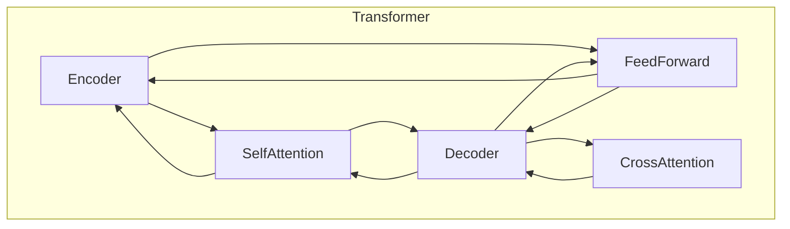
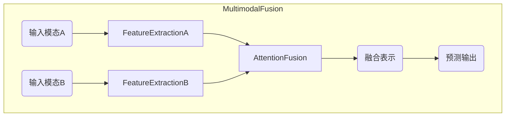

# 多模态大模型：技术原理与实战 基于Transformer的预训练语言模型

## 1.背景介绍

### 1.1 人工智能发展历程

人工智能(Artificial Intelligence, AI)是现代计算机科学的重要组成部分,旨在使机器能够模仿人类的某些行为,如学习、推理、感知和行动。AI的发展经历了几个重要阶段:

- 1950年代:AI的概念正式提出,专家系统和博弈论成为研究热点。
- 1960-1970年代:逻辑推理和知识表示成为主流研究方向。
- 1980-1990年代:机器学习、神经网络和模糊逻辑等新兴技术开始应用于AI。
- 2000年代后期:深度学习技术的兴起,推动了AI在语音识别、图像处理等领域的突破性进展。

### 1.2 大模型兴起

随着算力和数据量的不断增长,AI模型也变得越来越庞大。大模型(Large Model)是指具有数十亿甚至上百亿参数的深度神经网络模型。这些庞大的模型能够捕捉更复杂的数据模式,在自然语言处理、计算机视觉等领域表现出卓越的性能。

典型的大模型包括:

- GPT-3(2020年)
- BERT(2018年)
- DALL-E(2021年)
- AlphaFold(2020年)

大模型的出现催生了全新的AI范式,但也带来了诸多挑战,如模型优化、硬件加速、能耗控制等。

### 1.3 多模态AI兴起

传统的AI系统通常专注于单一模态(如文本、图像或语音)的处理。然而,真实世界是多模态的,人类能够无缝地整合来自不同感官的信息。因此,发展能够处理和关联多种模态数据的AI系统,成为了当前研究的重点方向。

多模态AI(Multimodal AI)旨在构建能够理解和生成多种模态数据(如文本、图像、视频、语音等)的人工智能系统。这种系统需要融合不同模态的表示,并学习它们之间的相互关系,从而实现更准确、更人性化的感知和决策。

多模态大模型正是在这一背景下应运而生,它结合了大模型和多模态AI的优势,为构建通用人工智能系统奠定了基础。

## 2.核心概念与联系

### 2.1 Transformer模型

Transformer是一种全新的基于注意力机制(Attention Mechanism)的神经网络架构,由谷歌的Vaswani等人在2017年提出。它不同于传统的循环神经网络(RNN)和卷积神经网络(CNN),完全摒弃了递归和卷积操作,而是借助注意力机制直接对序列中任意两个位置的元素建模。

Transformer模型的核心组件包括:

1. **编码器(Encoder)**: 对输入序列进行处理,生成对应的序列表示。
2. **解码器(Decoder)**: 根据编码器的输出和之前生成的输出序列,预测下一个输出元素。
3. **注意力机制(Attention)**: 捕捉输入和输出序列中任意两个位置元素之间的依赖关系。
4. **前馈网络(Feed Forward Network)**: 对每个位置的表示进行非线性变换,提供更强的表示能力。

Transformer模型通过自注意力(Self-Attention)机制捕捉序列内元素之间的长程依赖关系,避免了RNN的梯度消失/爆炸问题;同时支持并行计算,比RNN更高效。这些优势使其在自然语言处理、计算机视觉等领域取得了卓越的表现。

### 2.2 预训练语言模型

预训练语言模型(Pre-trained Language Model, PLM)是一种通过大规模无监督预训练,在海量自然语言数据上学习通用语言表示的模型。这种通用表示可用于下游的各种自然语言处理任务,如文本分类、机器翻译、问答系统等,从而显著提高了模型的性能和泛化能力。

常见的预训练语言模型包括:

- **BERT**(2018年)
- **GPT**(2018年)
- **XLNet**(2019年)
- **RoBERTa**(2019年)
- **ALBERT**(2019年)

这些模型采用不同的预训练目标和策略,但都是基于Transformer编码器架构,在大规模文本语料上进行无监督预训练。预训练后的模型参数可用于下游任务的微调(Fine-tuning),从而快速获得出色的性能。

预训练语言模型极大地推动了NLP技术的发展,但也存在一些局限性,如仍然难以很好地捕捉长序列的依赖关系、无法处理多模态数据等。因此,将预训练语言模型与多模态学习相结合,成为了提升模型性能的一个重要方向。

### 2.3 多模态融合

多模态融合(Multimodal Fusion)是指将来自不同模态的信息有效地整合在一起,从而获得更丰富、更准确的数据表示。这是实现多模态AI的核心挑战之一。

常见的多模态融合策略包括:

1. **特征级融合**(Feature-level Fusion):在特征提取阶段,将不同模态的特征拼接或融合。
2. **决策级融合**(Decision-level Fusion):分别对每一模态进行决策,然后将各模态的决策结果组合。
3. **模态变换**(Modality Translation):将一种模态的数据转换为另一种模态的表示。
4. **注意力融合**(Attention Fusion):利用注意力机制动态地融合不同模态的特征表示。

其中,基于注意力机制的融合方式因其高效和可解释性,成为了多模态模型中的主流选择。

## 3.核心算法原理具体操作步骤

### 3.1 Transformer编码器

Transformer编码器的主要作用是对输入序列进行编码,生成对应的序列表示。它由多个相同的层组成,每一层包含两个子层:多头自注意力机制(Multi-Head Self-Attention)和前馈全连接网络(Feed-Forward Network)。

具体操作步骤如下:

1. **输入表示**:将输入序列(如文本序列)映射为一系列embeddings,并添加位置编码(Positional Encoding),以引入位置信息。

2. **多头自注意力**:
   - 将输入embeddings分别传入多个注意力头(Attention Head)
   - 每个注意力头计算输入embeddings之间的注意力权重
   - 根据注意力权重,对embeddings进行加权求和,生成新的表示
   - 对所有注意力头的输出进行拼接,得到该层的输出表示

3. **残差连接与层归一化**:将步骤2的输出与输入embeddings相加,并进行层归一化(Layer Normalization),以保持数据分布的稳定性。

4. **前馈全连接网络**:
   - 将步骤3的输出传入两个全连接层
   - 第一个全连接层增加表示能力,第二个全连接层恢复到原始维度
   - 使用ReLU激活函数引入非线性

5. **残差连接与层归一化**:将步骤4的输出与步骤3的输出相加,并进行层归一化。

6. **堆叠编码器层**:重复步骤2-5,堆叠多个相同的编码器层,得到最终的输出表示。

编码器的输出表示可用于下游任务,如序列分类、机器翻译等。

### 3.2 Transformer解码器

Transformer解码器的作用是根据编码器的输出表示和之前生成的输出序列,预测下一个输出元素。它的结构与编码器类似,但增加了一个额外的交叉注意力(Cross-Attention)子层。

具体操作步骤如下:

1. **输入表示**:将目标输出序列(如机器翻译的目标语言序列)映射为embeddings,并添加位置编码。

2. **掩码多头自注意力**:
   - 对输入embeddings进行掩码,确保每个位置只能关注之前的位置
   - 计算embeddings之间的注意力权重
   - 根据注意力权重,对embeddings进行加权求和,生成新的表示

3. **残差连接与层归一化**:将步骤2的输出与输入embeddings相加,并进行层归一化。

4. **多头交叉注意力**:
   - 将步骤3的输出与编码器的输出表示进行注意力计算
   - 生成输出embeddings的新表示,融合了输入序列的信息

5. **残差连接与层归一化**:将步骤4的输出与步骤3的输出相加,并进行层归一化。

6. **前馈全连接网络**:与编码器中的操作相同。

7. **残差连接与层归一化**:将步骤6的输出与步骤5的输出相加,并进行层归一化。

8. **生成输出**:对步骤7的输出进行线性变换和softmax操作,生成下一个输出元素的概率分布。

9. **堆叠解码器层**:重复步骤2-8,堆叠多个相同的解码器层。

解码器的输出可用于生成目标序列,如机器翻译、文本生成等任务。

### 3.3 注意力机制

注意力机制(Attention Mechanism)是Transformer模型的核心,它能够捕捉输入序列中任意两个位置元素之间的依赖关系。

具体操作步骤如下:

1. **计算注意力分数**:
   - 将查询向量(Query)与所有键向量(Key)进行点积,得到未缩放的注意力分数
   - 将未缩放的注意力分数除以缩放因子$\sqrt{d_k}$,得到缩放后的注意力分数(其中$d_k$是键向量的维度)

2. **计算注意力权重**:
   - 对缩放后的注意力分数进行softmax操作,得到注意力权重

3. **计算加权和**:
   - 将注意力权重与值向量(Value)进行加权求和,得到注意力输出

注意力机制的数学表达式如下:

$$\begin{aligned}
\text{Attention}(Q, K, V) &= \text{softmax}\left(\frac{QK^T}{\sqrt{d_k}}\right)V \\
\text{head}_i &= \text{Attention}\left(QW_i^Q, KW_i^K, VW_i^V\right) \\
\text{MultiHead}(Q, K, V) &= \text{Concat}(\text{head}_1, \dots, \text{head}_h)W^O
\end{aligned}$$

其中$Q$、$K$、$V$分别表示查询、键和值;$W_i^Q$、$W_i^K$、$W_i^V$和$W^O$是可学习的线性变换参数。

多头注意力机制(Multi-Head Attention)是将多个注意力头的输出进行拼接,从而捕捉不同的依赖关系模式。

### 3.4 位置编码

由于Transformer模型完全放弃了循环和卷积操作,因此无法直接捕捉序列的位置信息。为了解决这个问题,Transformer引入了位置编码(Positional Encoding)的概念。

位置编码是一种将位置信息编码为向量的方法,它将被添加到输入embeddings中,使模型能够学习到序列的位置信息。

常见的位置编码方式包括:

1. **正弦位置编码**(Sinusoidal Positional Encoding):使用正弘余弦函数对位置进行编码,具有很好的理论基础。

2. **学习位置编码**(Learned Positional Encoding):将位置编码作为可学习的参数,由模型在训练过程中自动学习。

正弦位置编码的数学表达式如下:

$$\begin{aligned}
PE_{(pos, 2i)} &= \sin\left(pos / 10000^{2i / d_\text{model}}\right) \\
PE_{(pos,