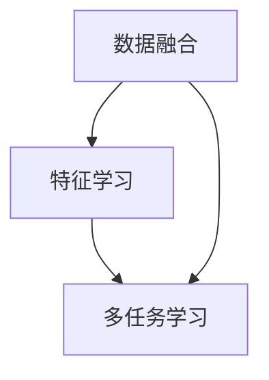

## 1.背景介绍

在当今日益复杂的数据环境中，多模态学习（Multimodal Learning）逐渐成为了一种重要的学习方式。多模态学习是指通过对多种不同类型的数据进行学习，以获得更全面、更深入的理解。这些数据类型可以包括文本、图像、音频、视频、社交网络数据等。多模态学习的目标是通过整合和理解这些不同类型的数据，以提高学习效果，解决更复杂的问题。

## 2.核心概念与联系

多模态学习的核心概念包括数据融合、特征学习和多任务学习。数据融合是指将来自不同源的数据整合到一起，以提供更全面的信息。特征学习是指通过学习算法提取数据的关键特征，以便于进行后续的分析和处理。多任务学习是指同时处理多个相关任务，以提高学习效率和效果。

这些概念之间的关系可以用以下的Mermaid流程图来表示：



## 3.核心算法原理具体操作步骤

多模态学习的核心算法原理包括深度神经网络和卷积神经网络。

深度神经网络是一种模拟人脑神经网络的算法，可以自动学习数据的多层次表示。深度神经网络由多个隐藏层组成，每个隐藏层都由多个神经元组成。每个神经元都可以对输入数据进行一种非线性变换，从而提取出数据的关键特征。

卷积神经网络是一种特殊的深度神经网络，主要用于处理图像数据。卷积神经网络通过卷积层、池化层和全连接层，可以自动学习图像的局部特征和全局特征。

多模态学习的具体操作步骤如下：

1. 数据预处理：将来自不同源的数据进行整合，生成一个统一的数据集。
2. 特征学习：使用深度神经网络或卷积神经网络，对数据集进行训练，学习数据的关键特征。
3. 多任务学习：根据学习到的特征，同时处理多个相关任务，提高学习效率和效果。

## 4.数学模型和公式详细讲解举例说明

在多模态学习中，我们通常使用深度神经网络或卷积神经网络作为数学模型。这些网络的训练过程可以用以下的数学公式来表示：

$$
\min_{\theta} \sum_{i=1}^{n} L(y_i, f(x_i;\theta)) + \lambda R(\theta)
$$

其中，$L$是损失函数，用于衡量模型预测值$f(x_i;\theta)$和真实值$y_i$之间的差距；$R$是正则项，用于防止模型过拟合；$\lambda$是正则化参数，用于控制模型的复杂度；$\theta$是模型的参数，需要通过训练数据来学习。

## 5.项目实践：代码实例和详细解释说明

下面我们将通过一个简单的项目实践，来展示如何使用Python和TensorFlow进行多模态学习。

首先，我们需要导入所需的库：

```python
import tensorflow as tf
from tensorflow.keras.models import Model
from tensorflow.keras.layers import Input, Dense, Conv2D, MaxPooling2D, Flatten, concatenate
```

然后，我们定义一个多模态学习模型。这个模型包括两个分支，一个分支处理文本数据，另一个分支处理图像数据。

```python
# 文本数据分支
text_input = Input(shape=(None,), dtype='int32', name='text')
embedded_text = layers.Embedding(64, 256)(text_input)
encoded_text = layers.LSTM(128)(embedded_text)

# 图像数据分支
image_input = Input(shape=(256, 256, 3), name='image')
x = layers.Conv2D(64, (3, 3), activation='relu')(image_input)
x = layers.MaxPooling2D((2, 2))(x)
x = layers.Conv2D(128, (3, 3), activation='relu')(x)
x = layers.MaxPooling2D((2, 2))(x)
x = layers.Conv2D(128, (3, 3), activation='relu')(x)
encoded_image = layers.Flatten()(x)

# 将两个分支的输出进行融合
merged = layers.concatenate([encoded_text, encoded_image], axis=-1)

# 添加一个全连接层
output = layers.Dense(1, activation='sigmoid')(merged)

# 定义模型
model = Model(inputs=[text_input, image_input], outputs=output)
```

接下来，我们可以使用这个模型进行训练和预测。

## 6.实际应用场景

多模态学习在许多实际应用场景中都有广泛的应用，例如：

- 图像识别：通过结合图像和文本数据，可以提高图像识别的准确性。
- 语音识别：通过结合语音和文本数据，可以提高语音识别的准确性。
- 情感分析：通过结合文本和社交网络数据，可以提高情感分析的准确性。

## 7.工具和资源推荐

推荐以下工具和资源进行多模态学习：

- TensorFlow：一个广泛使用的深度学习框架，支持多模态学习。
- Keras：一个基于TensorFlow的高级深度学习库，提供了许多方便的API进行多模态学习。

## 8.总结：未来发展趋势与挑战

多模态学习作为一种新兴的学习方式，具有广阔的发展前景。然而，多模态学习也面临一些挑战，例如数据融合的复杂性、模型训练的难度、以及如何有效利用不同类型数据的问题。

未来，我们期待有更多的研究和技术可以解决这些挑战，进一步推动多模态学习的发展。

## 9.附录：常见问题与解答

1. 问题：什么是多模态学习？
   答：多模态学习是指通过对多种不同类型的数据进行学习，以获得更全面、更深入的理解。

2. 问题：多模态学习有什么优点？
   答：多模态学习可以整合和理解不同类型的数据，提高学习效果，解决更复杂的问题。

3. 问题：多模态学习有哪些应用场景？
   答：多模态学习在图像识别、语音识别、情感分析等领域都有广泛的应用。

作者：禅与计算机程序设计艺术 / Zen and the Art of Computer Programming