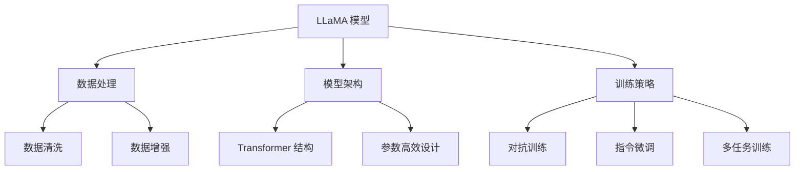
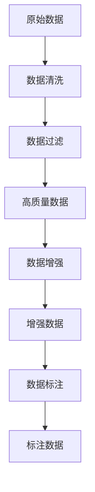
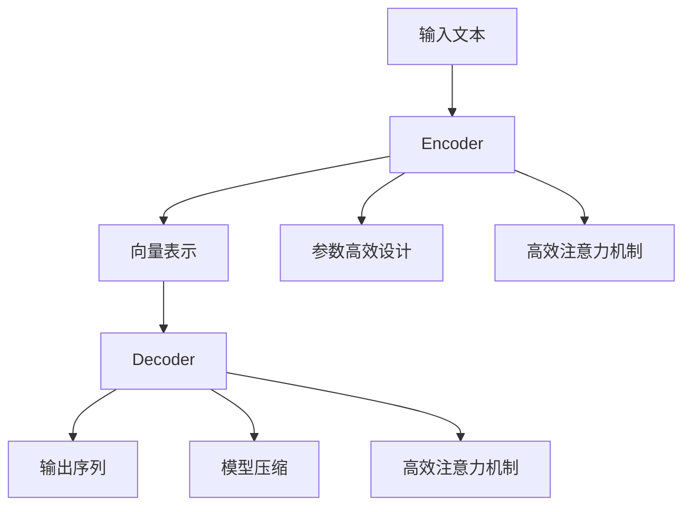
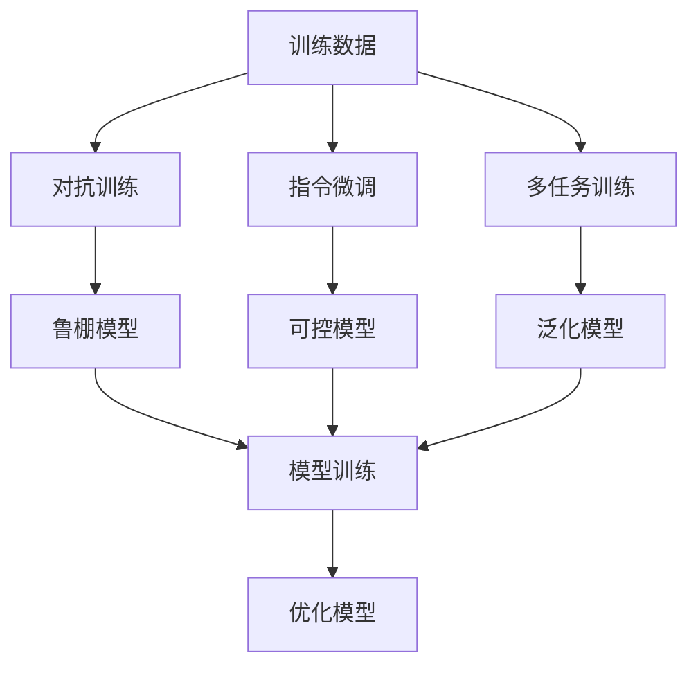

# 大语言模型原理与工程实践：LLaMA 系列

## 1. 背景介绍

随着人工智能技术的快速发展,大型语言模型(Large Language Model, LLM)已经成为自然语言处理领域的关键突破。LLM是一种基于深度学习的模型,能够从海量文本数据中学习语言模式,并生成看似人类编写的自然语言输出。近年来,OpenAI的GPT、谷歌的LaMDA、DeepMind的Chinchilla等大型语言模型取得了令人瞩目的成就,展现出强大的语言生成和理解能力。

在这些LLM中,Meta AI推出的LLaMA(Lean Big-Aligned Awesome Model Approach)系列模型受到了广泛关注。LLaMA模型采用了创新的训练方法和模型架构,在保持高性能的同时,大幅降低了训练成本和碳排放,体现了更高的训练效率。LLaMA系列包括不同规模的模型,从7B参数到65B参数不等,可满足不同场景的需求。

本文将深入探讨LLaMA模型的核心原理、算法细节和工程实践,为读者提供全面的理解和实践指导。我们将介绍LLaMA模型的创新之处,包括数据处理、模型架构、训练策略等,并分享在实际应用中的最佳实践和常见问题解答。



## 2. 核心概念与联系

### 2.1 大型语言模型(LLM)

大型语言模型是一种基于深度学习的模型,能够从海量文本数据中学习语言模式,并生成看似人类编写的自然语言输出。LLM通常采用Transformer架构,由编码器(Encoder)和解码器(Decoder)组成。编码器将输入文本编码为向量表示,解码器则根据这些向量生成输出序列。

LLM的核心优势在于其强大的语言理解和生成能力,能够处理各种复杂的自然语言任务,如文本生成、问答、摘要、翻译等。通过预训练,LLM可以从大量无标注数据中学习语言知识,并通过微调(Fine-tuning)将其应用于特定任务。

### 2.2 LLaMA 模型

LLaMA是Meta AI推出的一系列大型语言模型,旨在提高训练效率和可持续性。LLaMA模型采用了多种创新技术,包括:

1. **数据处理**:LLaMA使用了高效的数据清洗和增强技术,从互联网上收集的海量文本数据中提取高质量数据,并进行数据增强,提高模型的泛化能力。

2. **模型架构**:LLaMA采用了高效的Transformer架构变体,通过参数高效设计和模型压缩技术,在保持高性能的同时大幅降低了模型规模和计算资源需求。

3. **训练策略**:LLaMA使用了多种创新的训练策略,如对抗训练(Adversarial Training)、指令微调(Instruction Tuning)和多任务训练(Multi-Task Training),提高了模型的鲁棒性、可控性和泛化能力。

LLaMA系列包括不同规模的模型,从7B参数到65B参数不等,可满足不同场景的需求,并展现出卓越的语言生成和理解能力。

## 3. 核心算法原理具体操作步骤

### 3.1 数据处理

高质量的训练数据是LLaMA模型取得卓越性能的关键因素之一。LLaMA采用了以下数据处理步骤:

1. **数据收集**:从互联网上收集海量的文本数据,包括网页、书籍、新闻、社交媒体等多种来源。

2. **数据清洗**:使用自然语言处理技术对原始数据进行清洗,去除低质量内容、个人信息、版权内容等。

3. **数据过滤**:根据预定义的质量标准,如语法正确性、连贯性、信息丰富度等,过滤出高质量的数据子集。

4. **数据增强**:对高质量数据进行增强,如通过回译(Back-Translation)、同义替换(Synonym Replacement)等技术生成新的语料,提高数据多样性。

5. **数据标注**:为部分数据添加任务标注,如问答对、摘要等,用于指令微调和多任务训练。



### 3.2 模型架构

LLaMA采用了高效的Transformer架构变体,通过参数高效设计和模型压缩技术,大幅降低了模型规模和计算资源需求。

1. **Transformer 结构**:LLaMA的基础架构是Transformer,由编码器(Encoder)和解码器(Decoder)组成。编码器将输入文本编码为向量表示,解码器则根据这些向量生成输出序列。

2. **参数高效设计**:LLaMA采用了多种参数高效设计技术,如权重分解(Weight Decomposition)、低秩近似(Low-Rank Approximation)等,降低了模型参数数量,从而减少了模型大小和计算资源需求。

3. **模型压缩**:LLaMA使用了模型压缩技术,如知识蒸馏(Knowledge Distillation)、量化(Quantization)等,进一步减小模型大小,提高推理效率。

4. **高效注意力机制**:LLaMA采用了高效的注意力机制变体,如局部注意力(Local Attention)、稀疏注意力(Sparse Attention)等,降低了注意力计算的复杂度。

通过上述技术,LLaMA模型在保持高性能的同时,大幅降低了训练和推理的计算资源需求,提高了训练效率和可持续性。



### 3.3 训练策略

LLaMA采用了多种创新的训练策略,提高了模型的鲁棒性、可控性和泛化能力。

1. **对抗训练(Adversarial Training)**:通过向输入数据添加微小扰动,使模型在训练时面临对抗样本,提高了模型的鲁棒性和泛化能力。

2. **指令微调(Instruction Tuning)**:在预训练的基础上,使用带有任务指令的标注数据对模型进行微调,使模型能够更好地理解和执行指令,提高了模型的可控性和任务性能。

3. **多任务训练(Multi-Task Training)**:同时在多个任务上训练模型,如文本生成、问答、摘要等,提高了模型的泛化能力和多功能性。

4. **反向传播(Backpropagation)**:使用标准的反向传播算法,根据损失函数调整模型参数,优化模型性能。

5. **优化器(Optimizer)**:采用高效的优化器,如AdamW、LAMB等,加速模型收敛并提高训练稳定性。

通过上述训练策略的综合应用,LLaMA模型展现出卓越的语言生成和理解能力,同时具有良好的鲁棒性、可控性和泛化能力。



## 4. 数学模型和公式详细讲解举例说明

### 4.1 Transformer 架构

Transformer 是 LLaMA 模型的核心架构,它由编码器(Encoder)和解码器(Decoder)组成。编码器将输入序列映射为向量表示,解码器则根据这些向量生成输出序列。

编码器和解码器都由多个相同的层组成,每层包含两个子层:多头自注意力机制(Multi-Head Attention)和前馈神经网络(Feed-Forward Neural Network)。

**多头自注意力机制**可以捕捉输入序列中不同位置之间的依赖关系,计算公式如下:

$$
\begin{aligned}
\text{Attention}(Q, K, V) &= \text{softmax}\left(\frac{QK^T}{\sqrt{d_k}}\right)V \\
\text{MultiHead}(Q, K, V) &= \text{Concat}(head_1, \ldots, head_h)W^O\\
\text{where } head_i &= \text{Attention}(QW_i^Q, KW_i^K, VW_i^V)
\end{aligned}
$$

其中 $Q$、$K$、$V$ 分别表示查询(Query)、键(Key)和值(Value)。$d_k$ 是缩放因子,用于防止较深层的值过大导致梯度消失。$W_i^Q$、$W_i^K$、$W_i^V$、$W^O$ 是可训练的权重矩阵。

**前馈神经网络**对每个位置的向量表示进行独立的非线性转换,计算公式如下:

$$
\text{FFN}(x) = \max(0, xW_1 + b_1)W_2 + b_2
$$

其中 $W_1$、$W_2$、$b_1$、$b_2$ 是可训练的权重和偏置。

在训练过程中,Transformer 使用标准的反向传播算法和优化器(如 AdamW、LAMB 等)来调整模型参数,最小化预定义的损失函数。

### 4.2 对抗训练

对抗训练(Adversarial Training)是 LLaMA 模型采用的一种训练策略,旨在提高模型的鲁棒性和泛化能力。

对抗训练的核心思想是向输入数据添加微小的扰动,使模型在训练时面临对抗样本,从而提高模型对噪声和小扰动的鲁棒性。

具体来说,对抗训练包括以下步骤:

1. 计算原始输入 $x$ 的损失函数值 $L(x, y; \theta)$,其中 $y$ 是标签,$ \theta$ 是模型参数。

2. 通过求解以下优化问题,找到对模型最有影响的扰动 $r$:

$$
\begin{aligned}
r^* &= \arg\max_{r, \|r\|_p \leq \epsilon} L(x + r, y; \theta)\\
&\approx \arg\max_{r, \|r\|_p \leq \epsilon} L(x, y; \theta) + \nabla_x L(x, y; \theta)^T r
\end{aligned}
$$

其中 $\|\cdot\|_p$ 表示 $L_p$ 范数,$ \epsilon$ 是扰动的最大幅度。

3. 使用扰动后的对抗样本 $x^* = x + r^*$ 进行模型训练,最小化对抗损失函数:

$$
\min_\theta \mathbb{E}_{(x, y) \sim D} \max_{\|r\|_p \leq \epsilon} L(x + r, y; \theta)
$$

通过对抗训练,LLaMA 模型能够更好地应对噪声和小扰动,提高了鲁棒性和泛化能力。

## 5. 项目实践:代码实例和详细解释说明

在本节中,我们将提供一个基于 PyTorch 的 LLaMA 模型实现示例,帮助读者深入理解模型的核心组件和工作原理。

### 5.1 导入必要的库

```python
import torch
import torch.nn as nn
import math
```

### 5.2 实现多头自注意力机制

```python
class MultiHeadAttention(nn.Module):
    def __init__(self, d_model, num_heads):
        super(MultiHeadAttention, self).__init__()
        self.d_model = d_model
        self.num_heads = num_heads
        self.head_dim = d_model // num_heads

        self.q_linear = nn.Linear(d_model, d_model)
        self.k_linear = nn.