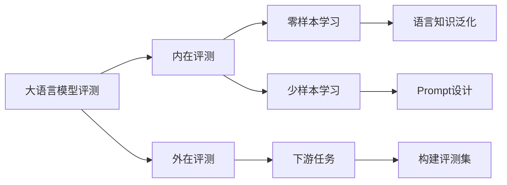

# 大语言模型原理与工程实践：大语言模型的评测

## 1. 背景介绍
### 1.1 大语言模型的兴起
近年来,随着深度学习技术的快速发展,大语言模型(Large Language Model,LLM)受到了学术界和工业界的广泛关注。大语言模型通过在海量文本数据上进行预训练,可以学习到丰富的语言知识和常识,在自然语言处理的各个任务上取得了突破性的进展。从2018年的BERT、GPT到最新的GPT-3、PaLM等模型,大语言模型的参数规模和性能不断刷新着记录。

### 1.2 大语言模型评测的重要性
大语言模型强大的语言理解和生成能力给人们带来了无限的想象空间,但同时也带来了新的挑战。如何客观、全面地评估大语言模型的性能,成为了业界亟需解决的问题。传统的自然语言处理评测方法已经无法满足大语言模型的评测需求。因此,探索大语言模型的评测方法和实践具有重要的理论和实践意义。

### 1.3 本文的主要内容
本文将系统地介绍大语言模型评测的原理和实践。首先,我们将介绍大语言模型评测的核心概念,包括内在评测和外在评测、零样本学习、少样本学习等。然后,我们将重点介绍大语言模型评测的核心算法和数学模型。接着,我们将通过代码实例和详细的解释,讲解如何实现大语言模型的评测。最后,我们将展望大语言模型评测的未来发展趋势和面临的挑战。

## 2. 核心概念与联系
### 2.1 内在评测与外在评测
大语言模型的评测可以分为内在评测(Intrinsic Evaluation)和外在评测(Extrinsic Evaluation)两大类。

内在评测主要关注模型本身的性能,如语言建模的困惑度(Perplexity)、预测精度等。这类评测方法简单直接,可以快速比较不同模型的性能差异。但内在评测无法全面反映模型在下游任务中的真实表现。

外在评测则是在特定的下游任务上评估模型的性能,如文本分类、问答、机器翻译等。外在评测更加贴近实际应用,可以全面考察模型的泛化能力。但外在评测需要构建大量的标注数据,成本较高。

### 2.2 零样本学习与少样本学习
传统的机器学习模型需要大量的标注数据进行训练,但对于大语言模型而言,我们更加关注其在零样本学习(Zero-shot Learning)和少样本学习(Few-shot Learning)场景下的表现。

零样本学习是指在没有任何训练数据的情况下,直接使用预训练好的模型进行推理。这考验了模型学习到的语言知识的泛化能力。

少样本学习是指在给定少量示例的情况下,模型能够快速适应新的任务。通过设计精巧的 Prompt,可以引导模型进行特定任务的推理。

### 2.3 概念之间的联系
下图展示了大语言模型评测中几个核心概念之间的联系:



内在评测和外在评测是大语言模型评测的两个主要方面。内在评测侧重于评估模型在零样本和少样本场景下的语言理解能力,外在评测则考察模型在实际任务中的表现。二者相辅相成,共同构成了大语言模型评测的基本框架。

## 3. 核心算法原理具体操作步骤
### 3.1 内在评测算法
#### 3.1.1 困惑度评测
困惑度(Perplexity)是评估语言模型性能的经典指标。给定一个测试集 $\mathcal{D}=\{x_1,\dots,x_N\}$,语言模型 $M$ 在该测试集上的困惑度定义为:

$$\mathrm{PPL}(M,\mathcal{D})=\exp\left(-\frac{1}{N}\sum_{i=1}^N\log P_M(x_i)\right)$$

其中 $P_M(x_i)$ 表示语言模型 $M$ 对句子 $x_i$ 的概率估计。困惑度越低,说明模型对测试集的预测越准确。

计算困惑度的具体步骤如下:
1. 准备测试集 $\mathcal{D}$,每个样本为一个完整的句子或文档。
2. 使用语言模型 $M$ 对每个样本 $x_i$ 计算对数概率 $\log P_M(x_i)$。
3. 对所有样本的对数概率取平均,然后取指数,得到困惑度 $\mathrm{PPL}(M,\mathcal{D})$。

#### 3.1.2 完形填空评测 
完形填空(Cloze Test)是评估模型语言理解能力的另一种方法。具体做法是:随机挖去句子中的一个单词,让模型根据上下文预测被挖去的单词。预测准确率越高,说明模型的语言理解能力越强。

完形填空评测的步骤如下:
1. 准备测试集,每个样本为一个句子,随机挖去其中的一个单词。 
2. 使用语言模型对被挖去单词的位置进行预测,得到预测单词 $\hat{w}$。
3. 如果 $\hat{w}$ 与真实单词 $w$ 一致,则预测正确。
4. 统计所有样本的预测准确率,得到完形填空的评测指标。

### 3.2 外在评测算法
外在评测一般采用标准的机器学习评测方法,如 Accuracy、F1、BLEU 等。以文本分类任务为例,其评测步骤如下:
1. 收集文本分类数据集,划分为训练集、验证集和测试集。
2. 使用大语言模型在训练集上进行微调(Fine-tuning),得到分类模型。
3. 在测试集上评估分类模型的性能,计算 Accuracy、F1 等指标。

需要注意的是,由于大语言模型的强大语言理解能力,在许多任务上已经可以实现零样本或少样本学习。因此,外在评测时可以考虑少量或不使用训练数据,直接在测试集上评估模型的零样本/少样本学习能力。

## 4. 数学模型和公式详细讲解举例说明
### 4.1 语言模型的概率估计
大语言模型的核心是对语言的概率分布进行建模。给定一个句子 $x=(w_1,\dots,w_T)$,语言模型的目标是估计该句子的概率 $P(x)$。根据概率论的链式法则,句子的概率可以分解为:

$$P(x)=\prod_{t=1}^TP(w_t|w_1,\dots,w_{t-1})$$

其中 $P(w_t|w_1,\dots,w_{t-1})$ 表示在给定前 $t-1$ 个单词的条件下,第 $t$ 个单词为 $w_t$ 的条件概率。语言模型的任务就是学习这个条件概率分布。

以 GPT 模型为例,它使用 Transformer 的解码器结构来建模这个条件概率分布。具体来说,将输入序列 $w_1,\dots,w_{t-1}$ 编码为隐向量 $h_1,\dots,h_{t-1}$,然后预测下一个单词 $w_t$ 的概率:

$$P(w_t|w_1,\dots,w_{t-1})=\mathrm{softmax}(W_vh_{t-1}+b_v)$$

其中 $W_v$ 和 $b_v$ 是可学习的参数矩阵和偏置向量。通过最大化训练数据的对数似然函数来学习这些参数:

$$\mathcal{L}(\theta)=\sum_{x\in\mathcal{D}}\log P_\theta(x)$$

其中 $\theta$ 表示模型的所有参数,$\mathcal{D}$ 为训练数据集。

### 4.2 困惑度的计算
在 3.1.1 节中,我们给出了困惑度的定义:

$$\mathrm{PPL}(M,\mathcal{D})=\exp\left(-\frac{1}{N}\sum_{i=1}^N\log P_M(x_i)\right)$$

这里对其进行详细的解释。困惑度的物理意义是:模型在预测下一个单词时的平均分支数。例如,假设一个语言模型在每个位置都以 80% 的概率预测正确下一个单词,则其困惑度为:

$$\mathrm{PPL}=\exp\left(-\frac{1}{N}\sum_{i=1}^N\log 0.8\right)=\exp(-\log 0.8)=1.25$$

这意味着该模型在预测下一个单词时,平均有 1.25 个备选项。困惑度越低,说明模型的预测越准确,对语言的建模能力越强。

## 5. 项目实践：代码实例和详细解释说明
下面我们通过一个简单的代码实例,演示如何使用 PyTorch 实现大语言模型的内在评测。

```python
import torch
import torch.nn as nn
from transformers import GPT2LMHeadModel, GPT2Tokenizer

# 加载预训练的GPT-2模型和分词器
model = GPT2LMHeadModel.from_pretrained('gpt2')
tokenizer = GPT2Tokenizer.from_pretrained('gpt2')

# 准备测试集
test_sentences = [
    "The quick brown fox jumps over the lazy",
    "I love to eat pizza and",
    "The weather is so nice today, let's go"
]

# 计算困惑度
def compute_perplexity(model, tokenizer, sentences):
    with torch.no_grad():
        total_log_prob = 0
        total_words = 0
        for sentence in sentences:
            input_ids = tokenizer.encode(sentence, return_tensors='pt')
            output = model(input_ids, labels=input_ids)
            log_prob = output.loss * input_ids.size(1)
            total_log_prob += log_prob.item()
            total_words += input_ids.size(1)
        perplexity = torch.exp(torch.tensor(-total_log_prob / total_words)).item()
        return perplexity

perplexity = compute_perplexity(model, tokenizer, test_sentences)
print(f"Perplexity: {perplexity:.2f}")
```

这段代码的主要步骤如下:
1. 加载预训练的 GPT-2 模型和分词器。
2. 准备测试集,这里使用了三个简单的句子。
3. 定义 `compute_perplexity` 函数,用于计算模型在测试集上的困惑度。
   - 对每个测试句子,使用分词器将其编码为模型的输入 `input_ids`。
   - 将 `input_ids` 输入到模型中,同时将其作为标签,计算出模型的损失。
   - 累加所有测试句子的对数概率和单词数。
   - 根据公式计算困惑度,并返回结果。
4. 调用 `compute_perplexity` 函数,计算 GPT-2 在测试集上的困惑度。

这个例子展示了如何使用现有的预训练语言模型和简单的代码,实现大语言模型的内在评测。在实践中,我们可以根据需要,选择不同的预训练模型和测试集,并扩展评测指标。

## 6. 实际应用场景
大语言模型评测在学术研究和工业应用中都有广泛的应用场景。下面列举几个典型的应用案例:

### 6.1 模型选择与优化
在开发实际的自然语言处理应用时,我们经常需要在多个预训练语言模型中进行选择,或者对模型进行微调优化。通过合理的内在评测和外在评测,我们可以比较不同模型的性能,选择最适合任务的模型。例如,可以通过困惑度评测比较不同模型在特定领域数据上的建模能力,通过下游任务评测比较模型的迁移学习能力。

### 6.2 模型监控与更新
对于已经部署上线的语言模型应用,需要持续监控模型的性能,并根据需要进行更新。内在评测可以作为一种简单高效的监控手段,定期计算模型在特定数据集上的困惑度,如果发现困惑度明显上升,则说明模型可能出现