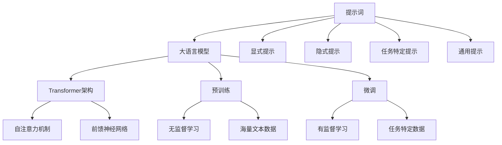

# 大语言模型原理与工程实践：提示词设计的通用原则

## 1. 背景介绍
### 1.1 大语言模型的发展历程
#### 1.1.1 早期的语言模型
#### 1.1.2 Transformer的出现
#### 1.1.3 预训练语言模型的崛起

### 1.2 提示词工程的重要性
#### 1.2.1 提示词在大语言模型应用中的作用
#### 1.2.2 提示词设计的挑战与机遇
#### 1.2.3 提示词工程的研究现状

## 2. 核心概念与联系
### 2.1 大语言模型的基本原理
#### 2.1.1 自注意力机制
#### 2.1.2 Transformer架构
#### 2.1.3 预训练与微调

### 2.2 提示词的定义与分类
#### 2.2.1 提示词的概念
#### 2.2.2 显式提示与隐式提示
#### 2.2.3 任务特定提示与通用提示

### 2.3 提示词与大语言模型的关系
#### 2.3.1 提示词如何引导模型生成
#### 2.3.2 提示词与模型参数的交互
#### 2.3.3 提示词对模型性能的影响

## 3. 核心算法原理具体操作步骤
### 3.1 基于梯度的提示词优化
#### 3.1.1 定义提示词参数
#### 3.1.2 计算提示词梯度
#### 3.1.3 更新提示词参数

### 3.2 基于强化学习的提示词优化
#### 3.2.1 定义奖励函数
#### 3.2.2 策略梯度算法
#### 3.2.3 提示词策略的迭代优化

### 3.3 基于进化算法的提示词搜索
#### 3.3.1 定义提示词的编码方式
#### 3.3.2 遗传算法的选择、交叉与变异
#### 3.3.3 适应度评估与种群迭代

## 4. 数学模型和公式详细讲解举例说明
### 4.1 Transformer的数学表示
#### 4.1.1 自注意力机制的数学推导
$Attention(Q,K,V) = softmax(\frac{QK^T}{\sqrt{d_k}})V$
#### 4.1.2 前馈神经网络的数学表示  
$FFN(x) = max(0, xW_1 + b_1)W_2 + b_2$
#### 4.1.3 残差连接与层归一化的数学表示
$x + Sublayer(LayerNorm(x))$

### 4.2 提示词优化的数学建模
#### 4.2.1 基于梯度的提示词优化目标函数
$$\mathcal{L}(\theta, \phi) = -\sum_{i=1}^{N} \log p_{\theta}(y_i|x_i, \phi)$$
#### 4.2.2 基于强化学习的提示词优化目标函数
$$J(\phi) = \mathbb{E}_{p_{\phi}}[R(y|x)]$$
#### 4.2.3 基于进化算法的提示词适应度函数设计
$$f(\phi) = \sum_{i=1}^{N} \log p_{\theta}(y_i|x_i, \phi)$$

## 5. 项目实践：代码实例和详细解释说明
### 5.1 使用PyTorch实现Transformer
#### 5.1.1 自注意力机制的代码实现
#### 5.1.2 前馈神经网络的代码实现
#### 5.1.3 Transformer编码器与解码器的代码实现

### 5.2 使用TensorFlow实现提示词优化
#### 5.2.1 基于梯度的提示词优化代码实现
#### 5.2.2 基于强化学习的提示词优化代码实现
#### 5.2.3 基于进化算法的提示词搜索代码实现

### 5.3 使用Hugging Face的Transformers库进行提示词工程
#### 5.3.1 加载预训练模型与标记器
#### 5.3.2 设计提示词模板
#### 5.3.3 微调模型与提示词

## 6. 实际应用场景
### 6.1 文本分类中的提示词设计
#### 6.1.1 情感分析
#### 6.1.2 主题分类
#### 6.1.3 意图识别

### 6.2 文本生成中的提示词设计
#### 6.2.1 摘要生成
#### 6.2.2 对话生成
#### 6.2.3 故事生成

### 6.3 信息抽取中的提示词设计
#### 6.3.1 命名实体识别
#### 6.3.2 关系抽取
#### 6.3.3 事件抽取

## 7. 工具和资源推荐
### 7.1 开源的大语言模型
#### 7.1.1 BERT
#### 7.1.2 GPT系列
#### 7.1.3 T5与BART

### 7.2 提示词工程相关的工具包
#### 7.2.1 OpenPrompt
#### 7.2.2 PromptSource
#### 7.2.3 LMPrompt

### 7.3 提示词设计相关的数据集
#### 7.3.1 SuperGLUE
#### 7.3.2 Natural Instructions
#### 7.3.3 PromptPapers

## 8. 总结：未来发展趋势与挑战
### 8.1 提示词工程的发展趋势
#### 8.1.1 提示词的自动生成与优化
#### 8.1.2 提示词的跨任务迁移与泛化
#### 8.1.3 提示词与知识的结合

### 8.2 提示词工程面临的挑战
#### 8.2.1 提示词的可解释性
#### 8.2.2 提示词的鲁棒性
#### 8.2.3 提示词的公平性与伦理

### 8.3 未来研究方向展望
#### 8.3.1 提示词的标准化与模块化
#### 8.3.2 提示词的交互式设计
#### 8.3.3 提示词的多模态扩展

## 9. 附录：常见问题与解答
### 9.1 如何选择合适的提示词模板？
### 9.2 提示词的长度对模型性能有何影响？
### 9.3 如何平衡提示词的通用性与任务特异性？
### 9.4 提示词工程在低资源场景下如何应用？
### 9.5 提示词工程与传统的特征工程有何区别？

作者：禅与计算机程序设计艺术 / Zen and the Art of Computer Programming