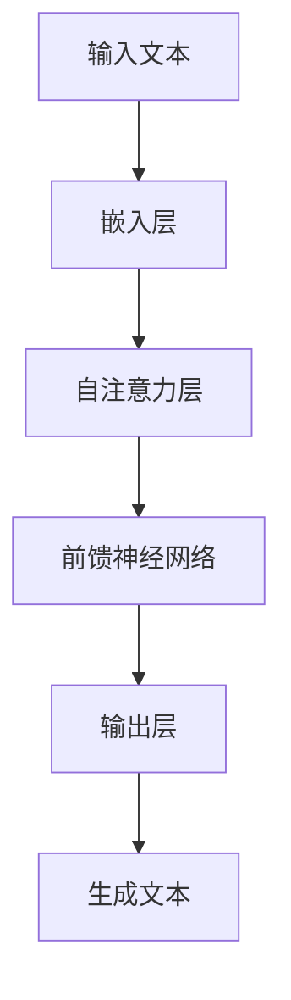

# 大语言模型原理与工程实践：解锁大语言模型

## 1.背景介绍

大语言模型（Large Language Model, LLM）是近年来人工智能领域的一个重要突破。它们通过大量的文本数据进行训练，能够生成高质量的自然语言文本，完成各种复杂的语言任务，如翻译、问答、文本生成等。大语言模型的出现不仅推动了自然语言处理（NLP）的发展，也在各个行业中展现了广泛的应用前景。

在这篇文章中，我们将深入探讨大语言模型的核心概念、算法原理、数学模型、实际应用以及未来发展趋势。通过详细的代码实例和解释，我们希望能够帮助读者更好地理解和应用大语言模型。

## 2.核心概念与联系

### 2.1 大语言模型的定义

大语言模型是一种基于深度学习的模型，通常使用数十亿甚至数千亿的参数，通过大量的文本数据进行训练。其主要目标是理解和生成自然语言文本。

### 2.2 语言模型的基本原理

语言模型的基本原理是通过预测下一个词来生成文本。给定一个词序列 $w_1, w_2, ..., w_{n-1}$，模型的目标是预测下一个词 $w_n$ 的概率分布 $P(w_n | w_1, w_2, ..., w_{n-1})$。

### 2.3 大语言模型与传统语言模型的区别

传统语言模型通常使用较小的参数集和较少的数据进行训练，而大语言模型则使用大规模的参数和数据。这使得大语言模型能够捕捉到更复杂的语言模式和语义关系。

### 2.4 大语言模型的架构

大语言模型通常基于Transformer架构。Transformer通过自注意力机制（Self-Attention）来捕捉词与词之间的关系，从而生成高质量的文本。



## 3.核心算法原理具体操作步骤

### 3.1 数据预处理

数据预处理是训练大语言模型的第一步。包括文本清洗、分词、去停用词等步骤。

### 3.2 模型训练

模型训练是大语言模型的核心步骤。通过大量的文本数据，使用梯度下降算法优化模型参数。

### 3.3 模型评估

模型评估是验证模型性能的重要步骤。常用的评估指标包括困惑度（Perplexity）、BLEU分数等。

### 3.4 模型优化

模型优化包括超参数调优、正则化、剪枝等技术，以提高模型的性能和泛化能力。

## 4.数学模型和公式详细讲解举例说明

### 4.1 语言模型的数学定义

语言模型的目标是最大化训练数据的似然函数。给定一个词序列 $w_1, w_2, ..., w_T$，其似然函数为：

$$
P(w_1, w_2, ..., w_T) = \prod_{t=1}^{T} P(w_t | w_1, w_2, ..., w_{t-1})
$$

### 4.2 自注意力机制

自注意力机制通过计算词与词之间的相关性来捕捉上下文信息。其计算公式为：

$$
\text{Attention}(Q, K, V) = \text{softmax}\left(\frac{QK^T}{\sqrt{d_k}}\right)V
$$

其中，$Q$、$K$、$V$ 分别表示查询矩阵、键矩阵和值矩阵，$d_k$ 表示键的维度。

### 4.3 损失函数

大语言模型通常使用交叉熵损失函数来衡量预测词与真实词之间的差异。其公式为：

$$
L = -\sum_{t=1}^{T} \log P(w_t | w_1, w_2, ..., w_{t-1})
$$

## 5.项目实践：代码实例和详细解释说明

### 5.1 数据预处理

```python
import re
import nltk
from nltk.corpus import stopwords

# 下载停用词
nltk.download('stopwords')

# 文本清洗
def clean_text(text):
    text = re.sub(r'\W', ' ', text)
    text = re.sub(r'\s+', ' ', text)
    text = text.lower()
    return text

# 分词
def tokenize(text):
    tokens = nltk.word_tokenize(text)
    return tokens

# 去停用词
def remove_stopwords(tokens):
    stop_words = set(stopwords.words('english'))
    filtered_tokens = [word for word in tokens if word not in stop_words]
    return filtered_tokens

text = "This is an example sentence."
cleaned_text = clean_text(text)
tokens = tokenize(cleaned_text)
filtered_tokens = remove_stopwords(tokens)
print(filtered_tokens)
```

### 5.2 模型训练

```python
import torch
import torch.nn as nn
import torch.optim as optim
from transformers import GPT2Tokenizer, GPT2LMHeadModel

# 加载预训练模型和分词器
tokenizer = GPT2Tokenizer.from_pretrained('gpt2')
model = GPT2LMHeadModel.from_pretrained('gpt2')

# 定义优化器
optimizer = optim.Adam(model.parameters(), lr=1e-4)

# 训练模型
def train_model(data, epochs=3):
    model.train()
    for epoch in range(epochs):
        for text in data:
            inputs = tokenizer(text, return_tensors='pt')
            outputs = model(**inputs, labels=inputs['input_ids'])
            loss = outputs.loss
            optimizer.zero_grad()
            loss.backward()
            optimizer.step()
        print(f'Epoch {epoch+1}, Loss: {loss.item()}')

data = ["This is a sample text.", "Another example sentence."]
train_model(data)
```

### 5.3 模型评估

```python
from transformers import GPT2Tokenizer, GPT2LMHeadModel

# 加载预训练模型和分词器
tokenizer = GPT2Tokenizer.from_pretrained('gpt2')
model = GPT2LMHeadModel.from_pretrained('gpt2')

# 评估模型
def evaluate_model(text):
    model.eval()
    inputs = tokenizer(text, return_tensors='pt')
    outputs = model(**inputs, labels=inputs['input_ids'])
    loss = outputs.loss
    return loss.item()

text = "This is a sample text."
loss = evaluate_model(text)
print(f'Loss: {loss}')
```

## 6.实际应用场景

### 6.1 文本生成

大语言模型可以用于生成高质量的文本，如新闻报道、小说、技术文档等。

### 6.2 机器翻译

通过大语言模型，可以实现高精度的机器翻译，支持多种语言之间的翻译。

### 6.3 问答系统

大语言模型可以用于构建智能问答系统，提供准确的答案和建议。

### 6.4 情感分析

通过大语言模型，可以对文本进行情感分析，识别文本中的情感倾向。

## 7.工具和资源推荐

### 7.1 工具

- **Transformers**：由Hugging Face提供的开源库，支持多种预训练语言模型。
- **TensorFlow**：谷歌开发的开源深度学习框架，支持大规模模型训练。
- **PyTorch**：Facebook开发的开源深度学习框架，易于使用和扩展。

### 7.2 资源

- **论文**：阅读相关领域的最新研究论文，如《Attention is All You Need》。
- **数据集**：使用大规模的文本数据集进行训练，如Wikipedia、Common Crawl等。
- **教程**：参考在线教程和文档，如Hugging Face的官方文档和示例代码。

## 8.总结：未来发展趋势与挑战

大语言模型在自然语言处理领域展现了巨大的潜力，但也面临一些挑战。未来的发展趋势包括：

### 8.1 模型规模的进一步扩大

随着计算能力的提升，未来的大语言模型将会拥有更多的参数和更强的性能。

### 8.2 多模态学习

未来的大语言模型将不仅限于文本数据，还会结合图像、音频等多种模态的数据进行训练。

### 8.3 可解释性和公平性

提高大语言模型的可解释性和公平性，避免模型产生偏见和歧视，是未来的重要研究方向。

### 8.4 实时应用

实现大语言模型的实时应用，如实时翻译、实时问答等，将是未来的重要发展方向。

## 9.附录：常见问题与解答

### 9.1 大语言模型需要多少数据进行训练？

大语言模型通常需要数十亿甚至数千亿的文本数据进行训练，以保证模型的性能和泛化能力。

### 9.2 如何选择合适的模型架构？

选择合适的模型架构需要考虑任务的具体需求、计算资源和数据规模。常用的架构包括Transformer、BERT、GPT等。

### 9.3 如何提高模型的训练效率？

可以通过分布式训练、模型剪枝、量化等技术提高模型的训练效率。

### 9.4 大语言模型的应用有哪些限制？

大语言模型在处理长文本、生成高质量的对话等方面仍存在一定的限制。此外，模型的计算资源需求较高，训练成本较大。

---

作者：禅与计算机程序设计艺术 / Zen and the Art of Computer Programming