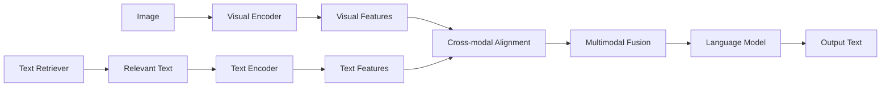

# 大语言模型原理基础与前沿 检索增强视觉语言模型

## 1.背景介绍
### 1.1 大语言模型的发展历程
### 1.2 视觉语言模型的研究现状
### 1.3 检索增强技术的提出背景

近年来,随着深度学习和自然语言处理技术的飞速发展,大语言模型(Large Language Model, LLM)取得了令人瞩目的成就。从2018年Google发布的BERT模型,到2020年OpenAI推出的GPT-3模型,再到最近DeepMind的Chinchilla和Anthropic的宪章模型,大语言模型展现出了惊人的自然语言理解和生成能力,在问答、对话、写作等多个任务上达到甚至超越人类的水平。

与此同时,多模态学习领域也涌现出一批优秀的视觉语言模型,如OpenAI的CLIP、谷歌的ALIGN等。这类模型能够建立视觉和语言之间的联系,在图像描述、视觉问答等任务上表现优异。然而,目前的视觉语言模型大多采用端到端的训练方式,很难充分利用海量的非配对文本和图像数据。

为了进一步提升视觉语言模型的性能,学界开始探索将知识检索和视觉语言模型相结合的思路。通过引入外部的文本知识库,视觉语言模型可以更好地理解图像内容,生成更加丰富和准确的文本描述。这种检索增强的视觉语言模型(Retrieval-Augmented Visual Language Model)代表了视觉语言理解的新方向和新高度。

## 2.核心概念与联系
### 2.1 大语言模型的核心要素
#### 2.1.1 Transformer结构
#### 2.1.2 自注意力机制
#### 2.1.3 预训练和微调范式
### 2.2 视觉语言模型的关键技术  
#### 2.2.1 视觉特征提取
#### 2.2.2 跨模态对齐
#### 2.2.3 多模态融合
### 2.3 知识检索与语言模型的融合方式
#### 2.3.1 基于检索的语言模型
#### 2.3.2 基于知识增强的语言模型

大语言模型的核心要素包括:

1. Transformer结构:摒弃了传统的RNN/LSTM等序列模型,引入了自注意力机制,大大提高了模型的并行计算效率和长程依赖捕捉能力。
2. 自注意力机制:通过计算序列中不同位置之间的注意力权重,使模型能够自适应地聚焦于输入的不同部分,捕捉全局的语义信息。
3. 预训练和微调范式:先在大规模无监督数据上进行自监督预训练,学习通用的语言表示;再在下游任务的有标注数据上进行微调,快速适应特定任务。

视觉语言模型需要解决三个关键问题:视觉特征提取、跨模态对齐和多模态融合。视觉特征提取通常采用预训练的CNN网络,如ResNet等。跨模态对齐旨在学习视觉和文本特征的共同语义空间,常用的方法有对比学习、对偶编码等。多模态融合则聚焦于将不同模态的信息进行有效整合,典型的架构包括多模态Transformer、协同注意力网络等。

知识检索和语言模型的融合有两种主要思路:一是基于检索的语言模型,先从知识库中检索出与输入相关的知识,再将其作为附加输入喂入语言模型;二是基于知识增强的语言模型,在预训练阶段就引入知识,通过知识嵌入、实体掩码等方式让模型学会知识感知。

下图展示了检索增强视觉语言模型的总体架构:



## 3.核心算法原理具体操作步骤
### 3.1 对比学习用于跨模态对齐
#### 3.1.1 视觉语言对比学习的目标函数
#### 3.1.2 对比学习的负样本构建策略
#### 3.1.3 对比学习的温度超参数调节
### 3.2 Dense Retrieval用于文本检索
#### 3.2.1 Dense Retrieval的双塔结构 
#### 3.2.2 Dense Retrieval的负采样技巧
#### 3.2.3 Dense Retrieval的在线推理加速
### 3.3 多流自注意力用于多模态融合
#### 3.3.1 多流自注意力的查询、键、值计算
#### 3.3.2 多流自注意力的交叉注意力机制
#### 3.3.3 多流自注意力的门控机制

对比学习是实现视觉语言跨模态对齐的有效方法。其核心思想是拉近匹配的图文对的特征距离,同时推开不匹配图文对的特征距离。对比学习的目标函数可以写为:

$$
\mathcal{L}=\sum_{i=1}^{N}-\log \frac{\exp \left(\boldsymbol{v}_{i} \cdot \boldsymbol{t}_{i} / \tau\right)}{\exp \left(\boldsymbol{v}_{i} \cdot \boldsymbol{t}_{i} / \tau\right)+\sum_{j \neq i} \exp \left(\boldsymbol{v}_{i} \cdot \boldsymbol{t}_{j} / \tau\right)}
$$

其中$v_i$和$t_i$分别表示第$i$个图像和文本的特征向量,$\tau$为温度超参数。对比学习需要为每个正样本(匹配的图文对)构建多个负样本(不匹配的图文对)。常见的负样本构建策略包括随机采样、最近邻采样等。温度超参数$\tau$控制着软最大化函数的平滑程度,需要进行细致调节以平衡收敛速度和泛化性能。

Dense Retrieval是一种端到端可微的文本检索方法。它采用双塔结构,分别用查询编码器和文档编码器将查询和文档映射为低维稠密向量,然后通过最大内积搜索(MIPS)找出与查询最相关的文档。Dense Retrieval的训练同样依赖对比学习,但更强调负样本的质量而非数量。一些行之有效的负采样技巧包括将BM25等传统检索模型的 Top-K 结果作为"硬负样本"。此外,可以利用 HNSW 等 ANN 算法对文档向量进行索引,大幅加速 Dense Retrieval 的在线查询。

多流自注意力是一种简洁而强大的多模态融合机制。它将每个模态的特征视为一个独立的"流",并在 Transformer 的自注意力计算中引入流间的交互。具体而言,第 $i$ 个流对第 $j$ 个流的注意力权重为:

$$
\alpha_{ij}=\operatorname{Softmax}\left(\frac{Q_{i} K_{j}^{T}}{\sqrt{d}}\right)
$$

其中 $Q_i$ 和 $K_j$ 分别是第 $i$ 个流的查询矩阵和第 $j$ 个流的键矩阵。多流自注意力还可以引入门控机制,自适应地调节不同模态间的交互强度:

$$
\tilde{\alpha}_{ij}=g_{ij} \odot \alpha_{ij}
$$

其中 $g_{ij}$ 是一个可学习的门控矩阵。

## 4.数学模型和公式详细讲解举例说明
### 4.1 视觉语言对比学习的InfoNCE损失
### 4.2 Dense Retrieval的最大内积搜索 
### 4.3 多流自注意力的矩阵计算过程

以视觉语言对比学习为例,详细解释其数学原理。假设我们有一批大小为$N$的图文对$\{(v_i,t_i)\}_{i=1}^N$,其中$v_i$和$t_i$分别表示第$i$个图像和文本。我们希望学习一个视觉编码器$f_v$和一个文本编码器$f_t$,使得匹配的图文对在公共语义空间中的表示尽可能接近,而不匹配的图文对尽可能远离。

令$\boldsymbol{v}_i=f_v(v_i), \boldsymbol{t}_i=f_t(t_i)$分别表示$v_i$和$t_i$的特征向量。对比学习采用InfoNCE损失函数:

$$
\mathcal{L}=-\frac{1}{N} \sum_{i=1}^N \log \frac{\exp(\text{sim}(\boldsymbol{v}_i, \boldsymbol{t}_i)/\tau)}{\sum_{j=1}^N \exp(\text{sim}(\boldsymbol{v}_i, \boldsymbol{t}_j)/\tau)}
$$

其中$\text{sim}(\boldsymbol{v}_i, \boldsymbol{t}_i)$表示$\boldsymbol{v}_i$和$\boldsymbol{t}_i$的相似度,通常取二者的内积$\boldsymbol{v}_i^\top \boldsymbol{t}_i$或余弦相似度$\frac{\boldsymbol{v}_i^\top \boldsymbol{t}_i}{\|\boldsymbol{v}_i\| \|\boldsymbol{t}_i\|}$。$\tau$是一个正的温度超参数,控制着概率分布的平滑程度。

直观地看,InfoNCE损失的分子项$\exp(\text{sim}(\boldsymbol{v}_i, \boldsymbol{t}_i)/\tau)$表示正样本对$(v_i,t_i)$的相似度,分母项$\sum_{j=1}^N \exp(\text{sim}(\boldsymbol{v}_i, \boldsymbol{t}_j)/\tau)$则将其他所有文本$t_j$都视为负样本,计算它们与$v_i$的相似度之和。最小化InfoNCE损失等价于最大化正样本对在所有样本对中的概率密度比,从而达到匹配的图文对聚拢、不匹配的图文对离散的目标。

举一个具体的例子:假设我们有3张图片和3段文本,它们的特征向量分别为:

$\boldsymbol{v}_1=(1,0), \boldsymbol{v}_2=(0,1), \boldsymbol{v}_3=(1,1)$
$\boldsymbol{t}_1=(1,0), \boldsymbol{t}_2=(0,1), \boldsymbol{t}_3=(-1,-1)$

我们希望将$(v_1,t_1),(v_2,t_2),(v_3,t_3)$识别为匹配的图文对。令$\tau=1$,则以$(v_1,t_1)$为例,其InfoNCE损失为:

$$
\mathcal{L}_1=-\log \frac{\exp(\boldsymbol{v}_1^\top \boldsymbol{t}_1)}{\exp(\boldsymbol{v}_1^\top \boldsymbol{t}_1)+\exp(\boldsymbol{v}_1^\top \boldsymbol{t}_2)+\exp(\boldsymbol{v}_1^\top \boldsymbol{t}_3)}=-\log \frac{e^1}{e^1+e^0+e^{-1}}\approx -0.55
$$

类似地,我们可以计算$(v_2,t_2)$和$(v_3,t_3)$的InfoNCE损失:

$$
\mathcal{L}_2\approx-0.55, \mathcal{L}_3\approx-1.00
$$

对3个损失取平均,即得到最终的InfoNCE损失$\mathcal{L}=\frac{1}{3}(\mathcal{L}_1+\mathcal{L}_2+\mathcal{L}_3)\approx-0.70$。最小化该损失函数,即可使匹配的图文对的特征在公共语义空间中尽可能接近。

## 5.项目实践:代码实例和详细解释说明
### 5.1 基于PyTorch的视觉语言对比学习实现
### 5.2 基于Faiss的Dense Retrieval实现
### 5.3 基于Hugging Face的多流自注意力实现

以PyTorch实现视觉语言对比学习为例。首先定义视觉编码器和文本编码器:

```python
import torch
import torch.nn as nn

class ImageEncoder(nn.Module):
    def __init__(self, backbone, embed_dim):
        super().__init__()
        self.backbone = backbone
        self.fc = nn.Linear(backbone.out_dim, embed_dim)
        
    def forward(self, x):
        x = self.backbone(x)
        x = self.fc(x)
        x = nn.functional.normalize(x, dim=-1)
        return x

class TextEncoder