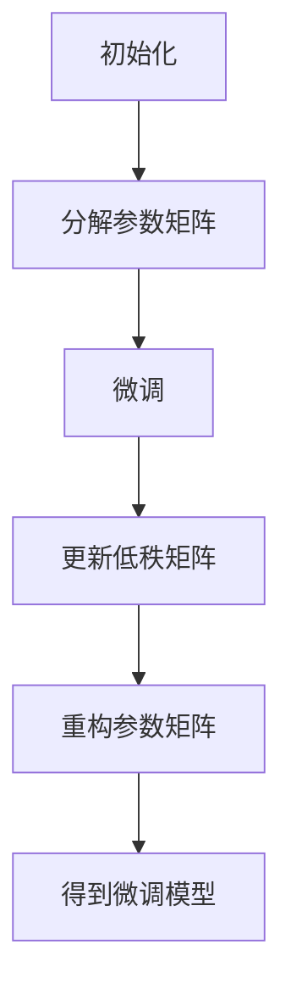

# 大语言模型应用指南：LoRA高效微调

## 1.背景介绍

在人工智能和自然语言处理领域，大语言模型（Large Language Models, LLMs）如GPT-3、BERT等已经展示了其强大的能力。然而，这些模型的训练和微调过程通常需要大量的计算资源和时间。为了提高微调效率，LoRA（Low-Rank Adaptation）技术应运而生。LoRA通过引入低秩矩阵分解的方法，显著减少了微调所需的参数量和计算资源，成为了大语言模型微调的一个重要工具。

## 2.核心概念与联系

### 2.1 大语言模型

大语言模型是基于深度学习的自然语言处理模型，通常包含数十亿到数千亿个参数。它们通过大量的文本数据进行预训练，能够生成高质量的文本、回答问题、翻译语言等。

### 2.2 微调

微调是指在预训练模型的基础上，通过少量的额外训练数据和计算资源，调整模型参数以适应特定任务。传统的微调方法通常需要调整模型的所有参数，计算开销巨大。

### 2.3 LoRA技术

LoRA（Low-Rank Adaptation）是一种通过低秩矩阵分解来减少微调参数量的方法。它通过将模型参数矩阵分解为两个低秩矩阵，从而减少了需要调整的参数数量，显著提高了微调效率。

## 3.核心算法原理具体操作步骤

### 3.1 低秩矩阵分解

LoRA的核心思想是将模型参数矩阵 $W$ 分解为两个低秩矩阵 $A$ 和 $B$，即 $W \approx AB$。其中，$A$ 和 $B$ 的秩远小于 $W$ 的秩，从而减少了参数量。

### 3.2 参数更新

在微调过程中，只需要更新低秩矩阵 $A$ 和 $B$，而不需要更新整个参数矩阵 $W$。这大大减少了计算开销。

### 3.3 操作步骤

1. **初始化**：将预训练模型的参数矩阵 $W$ 分解为两个低秩矩阵 $A$ 和 $B$。
2. **微调**：在特定任务的数据集上，使用梯度下降法更新 $A$ 和 $B$。
3. **重构**：将更新后的 $A$ 和 $B$ 重新组合成参数矩阵 $W$，得到微调后的模型。



## 4.数学模型和公式详细讲解举例说明

### 4.1 低秩矩阵分解公式

假设原始参数矩阵为 $W \in \mathbb{R}^{m \times n}$，我们将其分解为两个低秩矩阵 $A \in \mathbb{R}^{m \times k}$ 和 $B \in \mathbb{R}^{k \times n}$，其中 $k \ll \min(m, n)$。公式如下：

$$
W \approx AB
$$

### 4.2 参数更新公式

在微调过程中，我们只需要更新 $A$ 和 $B$。假设损失函数为 $L$，则参数更新公式为：

$$
A \leftarrow A - \eta \frac{\partial L}{\partial A}
$$

$$
B \leftarrow B - \eta \frac{\partial L}{\partial B}
$$

其中，$\eta$ 为学习率。

### 4.3 举例说明

假设我们有一个预训练的语言模型，其参数矩阵 $W$ 的大小为 $1000 \times 1000$。我们将其分解为两个低秩矩阵 $A$ 和 $B$，其中 $A$ 的大小为 $1000 \times 10$，$B$ 的大小为 $10 \times 1000$。通过这种方式，我们将需要更新的参数数量从 $1000000$ 减少到了 $20000$，显著提高了微调效率。

## 5.项目实践：代码实例和详细解释说明

### 5.1 环境准备

首先，我们需要安装必要的Python库，如TensorFlow或PyTorch。

```bash
pip install tensorflow
pip install torch
```

### 5.2 代码实例

以下是一个使用PyTorch实现LoRA微调的示例代码：

```python
import torch
import torch.nn as nn
import torch.optim as optim

# 假设我们有一个预训练的模型
class PretrainedModel(nn.Module):
    def __init__(self):
        super(PretrainedModel, self).__init__()
        self.fc = nn.Linear(1000, 1000)

    def forward(self, x):
        return self.fc(x)

# 初始化预训练模型
model = PretrainedModel()

# 将参数矩阵分解为低秩矩阵
W = model.fc.weight.data
A = nn.Parameter(torch.randn(1000, 10))
B = nn.Parameter(torch.randn(10, 1000))
model.fc.weight = nn.Parameter(torch.matmul(A, B))

# 定义损失函数和优化器
criterion = nn.MSELoss()
optimizer = optim.SGD([A, B], lr=0.01)

# 假设我们有一个训练数据集
data = torch.randn(100, 1000)
target = torch.randn(100, 1000)

# 微调过程
for epoch in range(100):
    optimizer.zero_grad()
    output = model(data)
    loss = criterion(output, target)
    loss.backward()
    optimizer.step()
    print(f'Epoch {epoch+1}, Loss: {loss.item()}')

# 重构参数矩阵
model.fc.weight = nn.Parameter(torch.matmul(A, B))
```

### 5.3 详细解释

1. **初始化预训练模型**：我们定义了一个简单的线性模型，并初始化其参数。
2. **分解参数矩阵**：将模型的参数矩阵分解为两个低秩矩阵 $A$ 和 $B$。
3. **定义损失函数和优化器**：使用均方误差损失函数和随机梯度下降优化器。
4. **微调过程**：在训练数据集上进行微调，只更新低秩矩阵 $A$ 和 $B$。
5. **重构参数矩阵**：将更新后的 $A$ 和 $B$ 重新组合成参数矩阵，得到微调后的模型。

## 6.实际应用场景

### 6.1 自然语言处理

LoRA技术在自然语言处理任务中有广泛的应用，如文本生成、机器翻译、情感分析等。通过LoRA微调，可以在保持模型性能的同时，显著减少计算资源和时间。

### 6.2 计算机视觉

虽然LoRA主要应用于自然语言处理，但其思想同样适用于计算机视觉任务，如图像分类、目标检测等。通过低秩矩阵分解，可以减少模型参数量，提高微调效率。

### 6.3 语音识别

在语音识别任务中，LoRA技术可以用于微调预训练的语音识别模型，提高模型在特定语音数据集上的性能。

## 7.工具和资源推荐

### 7.1 开源库

- **Hugging Face Transformers**：提供了丰富的大语言模型和微调工具，支持LoRA技术。
- **TensorFlow**：谷歌开发的深度学习框架，支持大语言模型的训练和微调。
- **PyTorch**：Facebook开发的深度学习框架，广泛应用于研究和工业界。

### 7.2 在线资源

- **arXiv**：提供了大量关于LoRA和大语言模型的研究论文。
- **GitHub**：许多开源项目和代码示例，可以帮助理解和实现LoRA技术。

### 7.3 学习资料

- **《深度学习》**：Ian Goodfellow等人编写的经典教材，详细介绍了深度学习的基本原理和技术。
- **Coursera和Udacity**：提供了丰富的在线课程，涵盖大语言模型和微调技术。

## 8.总结：未来发展趋势与挑战

### 8.1 未来发展趋势

随着大语言模型的不断发展，LoRA技术有望在以下几个方面取得突破：

1. **更高效的低秩分解方法**：研究更高效的低秩分解算法，进一步减少微调参数量。
2. **自动化微调工具**：开发自动化的微调工具，使得LoRA技术更加易用。
3. **跨领域应用**：将LoRA技术应用于更多领域，如生物信息学、金融分析等。

### 8.2 挑战

尽管LoRA技术具有显著的优势，但仍面临一些挑战：

1. **模型性能的权衡**：在减少参数量的同时，如何保证模型性能不下降。
2. **复杂任务的适应性**：LoRA技术在处理复杂任务时，可能需要进一步优化和调整。
3. **计算资源的限制**：尽管LoRA减少了微调所需的计算资源，但对于超大规模模型，计算资源仍是一个瓶颈。

## 9.附录：常见问题与解答

### 9.1 LoRA技术适用于哪些模型？

LoRA技术主要适用于大语言模型，如GPT-3、BERT等，但其思想同样适用于其他深度学习模型，如计算机视觉和语音识别模型。

### 9.2 LoRA技术如何提高微调效率？

LoRA通过将模型参数矩阵分解为两个低秩矩阵，减少了需要调整的参数数量，从而显著提高了微调效率。

### 9.3 LoRA技术是否会影响模型性能？

在大多数情况下，LoRA技术能够在减少参数量的同时，保持模型性能不下降。然而，对于某些复杂任务，可能需要进一步优化和调整。

### 9.4 如何选择低秩矩阵的秩？

低秩矩阵的秩是一个超参数，通常需要通过实验来选择。一般来说，秩越小，参数量越少，但可能会影响模型性能。

### 9.5 LoRA技术是否适用于在线学习？

LoRA技术主要用于离线微调，对于在线学习场景，可能需要进一步研究和优化。

---

作者：禅与计算机程序设计艺术 / Zen and the Art of Computer Programming