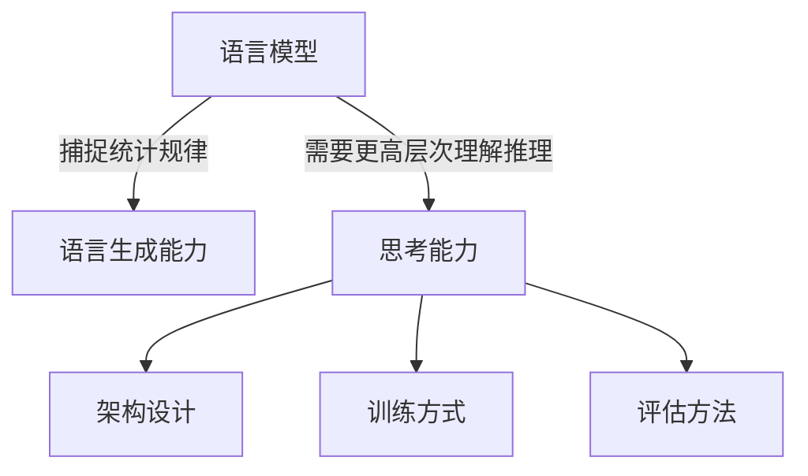
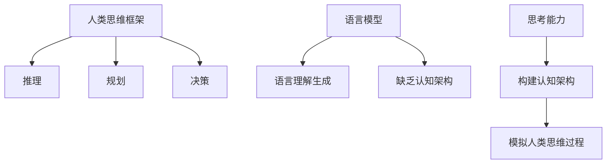
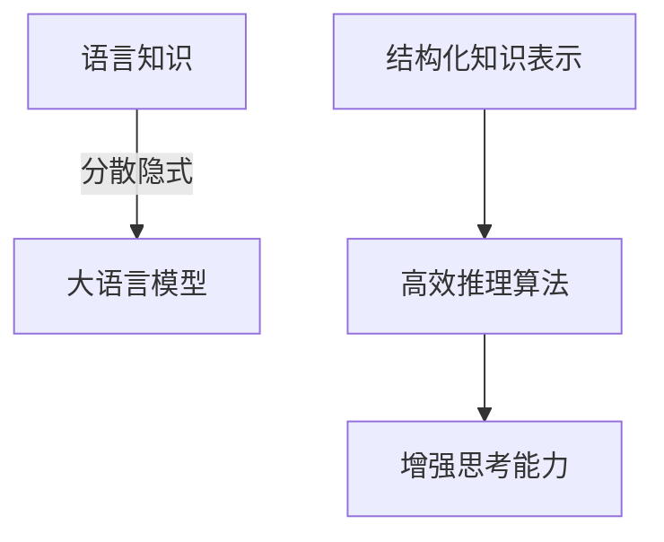
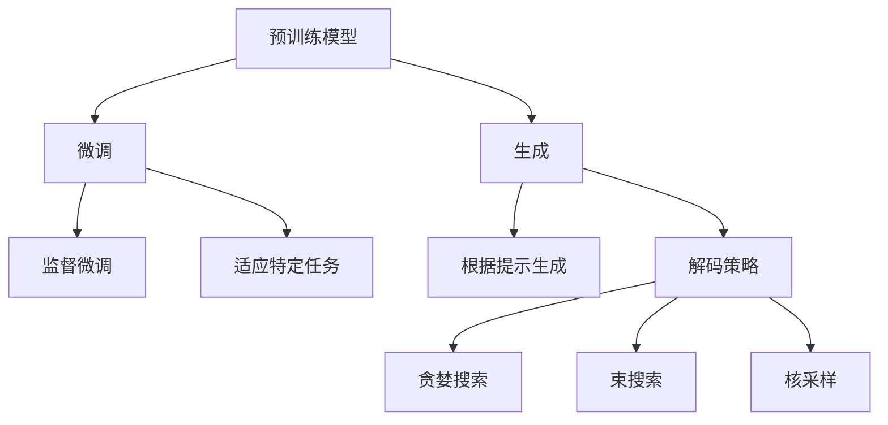

# 大语言模型应用指南：关于大语言模型的思考能力

## 1. 背景介绍

### 1.1 人工智能的崛起

人工智能(AI)技术在过去几十年里取得了长足的进步,尤其是近年来深度学习和大规模语言模型的兴起,使得人工智能系统在自然语言处理、计算机视觉、决策分析等领域展现出了令人惊叹的能力。其中,大型语言模型凭借其强大的语言理解和生成能力,正在重塑人机交互的方式,为各行业带来前所未有的机遇。

### 1.2 大语言模型的兴起

大型语言模型是一种基于深度学习的人工智能模型,通过在海量文本数据上进行自监督学习,获取了丰富的语言知识和上下文理解能力。这些模型能够生成看似人类水平的自然语言输出,在机器翻译、问答系统、文本摘要等任务中表现出色。著名的大语言模型包括GPT-3、BERT、XLNet等。

### 1.3 思考能力的重要性

尽管大语言模型在语言生成方面表现出色,但它们是否真正具备"思考"能力一直存在争议。思考能力指的是理解、推理、分析和创新的能力,是人类智能的核心特征之一。探索大语言模型的思考能力,不仅有助于我们更好地评估和利用这些模型,也将推动人工智能系统向真正的"通用人工智能"迈进。

## 2. 核心概念与联系

### 2.1 语言模型与思考能力

语言模型本质上是一种概率模型,通过学习大量文本数据,捕捉单词之间的统计规律和上下文关系。然而,思考能力则需要更高层次的理解、推理和创新能力。因此,探索语言模型的思考能力,需要从模型的架构、训练方式和评估方法等多个角度入手。



### 2.2 思维框架与认知架构

人类的思维框架和认知架构是思考能力的基础。大语言模型虽然具有一定的语言理解和生成能力,但它们缺乏类似于人类的思维框架和认知架构。因此,赋予语言模型思考能力需要构建相应的认知架构,模拟人类的推理、规划和决策过程。



### 2.3 知识表示与推理

思考能力需要对知识进行合理的表示和有效的推理。大语言模型通过自监督学习获取了丰富的语言知识,但这种知识表示形式分散、隐式,难以支持复杂的推理任务。因此,需要探索更加结构化和明确的知识表示方式,并设计高效的推理算法,以增强语言模型的思考能力。



## 3. 核心算法原理具体操作步骤

### 3.1 自监督预训练

大语言模型的核心算法原理是基于自监督学习的预训练。该过程包括以下几个主要步骤:

1. **数据预处理**: 从互联网上收集海量的文本数据,进行标记化、词干提取等预处理操作。

2. **掩码语言模型(Masked Language Modeling)**: 在输入序列中随机掩码部分词元,模型需要根据上下文预测被掩码的词元。这有助于模型学习语义和上下文理解能力。

3. **下一句预测(Next Sentence Prediction)**: 给定两个句子,模型需要判断第二个句子是否为第一个句子的下一句。这有助于模型捕捉句子之间的逻辑关系。

4. **模型更新**: 使用掩码语言模型和下一句预测的损失函数,通过反向传播算法更新模型参数。

5. **迭代训练**: 重复上述步骤,在大规模语料库上进行多次迭代训练,直到模型收敛。

通过自监督预训练,大语言模型可以学习到丰富的语言知识和上下文理解能力,为后续的下游任务奠定基础。

### 3.2 微调与生成

经过预训练后,大语言模型可以通过微调和生成两种方式应用于下游任务:

1. **微调(Fine-tuning)**: 在目标任务的标注数据上进行监督微调,使模型适应特定任务。例如,在问答任务上微调模型,使其能够更好地理解问题并生成准确的答案。

2. **生成(Generation)**: 直接利用预训练模型进行语言生成,如机器翻译、文本摘要、创意写作等。模型会根据给定的提示或上下文,生成相应的自然语言输出。

在生成过程中,常用的解码策略包括贪婪搜索(Greedy Search)、束搜索(Beam Search)和核采样(Nucleus Sampling)等。这些策略可以控制生成的多样性和质量。



## 4. 数学模型和公式详细讲解举例说明

### 4.1 transformer 模型

transformer 是大语言模型的核心架构,它基于自注意力机制,能够有效捕捉长距离依赖关系。transformer 模型的核心公式如下:

1. **缩放点积注意力(Scaled Dot-Product Attention)**:

$$
\text{Attention}(Q, K, V) = \text{softmax}\left(\frac{QK^T}{\sqrt{d_k}}\right)V
$$

其中 $Q$ 为查询(Query)、$K$ 为键(Key)、$V$ 为值(Value),$d_k$ 为缩放因子,用于防止内积过大导致梯度饱和。

2. **多头注意力(Multi-Head Attention)**:

$$
\text{MultiHead}(Q, K, V) = \text{Concat}(head_1, \dots, head_h)W^O
$$
$$
\text{where } head_i = \text{Attention}(QW_i^Q, KW_i^K, VW_i^V)
$$

多头注意力通过线性投影将查询、键和值分别映射到不同的子空间,并在这些子空间中并行计算注意力,最后将结果拼接起来。这种方式可以允许模型关注不同的位置映射关系。

以上注意力机制使 transformer 能够有效建模长距离依赖关系,是大语言模型取得卓越表现的关键。

### 4.2 生成概率模型

大语言模型本质上是一种生成概率模型,它通过学习大量文本数据,估计给定上下文下生成下一个词元的条件概率。常用的生成概率模型包括 n-gram 语言模型和神经网络语言模型。

1. **n-gram 语言模型**:

$$
P(w_1, \dots, w_n) = \prod_{i=1}^n P(w_i | w_1, \dots, w_{i-1})
$$
$$
\approx \prod_{i=1}^n P(w_i| w_{i-n+1}, \dots, w_{i-1})
$$

n-gram 语言模型基于马尔可夫假设,认为一个词元的概率只与前 n-1 个词元相关。这种模型简单高效,但难以捕捉长距离依赖关系。

2. **神经网络语言模型**:

$$
P(w_t | w_1, \dots, w_{t-1}) = \text{softmax}(W_o h_t + b_o)
$$
$$
h_t = \text{RNN}(w_{t-1}, h_{t-1})
$$

神经网络语言模型使用递归神经网络(RNN)或变体(LSTM、GRU)来编码上下文,并通过 softmax 层预测下一个词元的概率。这种模型能够更好地捕捉长期依赖关系,但计算效率较低。

大语言模型通常采用transformer编码器作为神经网络语言模型的backbone,在大规模语料库上进行自监督预训练,从而获得强大的语言生成能力。

## 5. 项目实践: 代码实例和详细解释说明

以下是使用 Hugging Face 的 transformers 库对 GPT-2 大语言模型进行文本生成的 Python 代码示例:

```python
from transformers import GPT2LMHeadModel, GPT2Tokenizer

# 加载预训练模型和分词器
model = GPT2LMHeadModel.from_pretrained('gpt2')
tokenizer = GPT2Tokenizer.from_pretrained('gpt2')

# 输入提示
prompt = "今天天气很好,"

# 对提示进行编码
input_ids = tokenizer.encode(prompt, return_tensors='pt')

# 生成文本
output = model.generate(input_ids, max_length=100, do_sample=True, top_k=50, top_p=0.95, num_return_sequences=1)

# 解码输出
generated_text = tokenizer.decode(output[0], skip_special_tokens=True)

print(f"提示: {prompt}")
print(f"生成的文本: {generated_text}")
```

上述代码的关键步骤如下:

1. 导入 GPT2LMHeadModel 和 GPT2Tokenizer 类,分别用于加载预训练的 GPT-2 语言模型和分词器。

2. 使用 `from_pretrained` 方法加载预训练模型和分词器。

3. 定义输入提示 `prompt`。

4. 使用分词器的 `encode` 方法将提示转换为模型可以理解的张量表示 `input_ids`。

5. 调用模型的 `generate` 方法生成文本。其中,`max_length` 控制生成文本的最大长度,`do_sample` 指定是否进行采样生成,`top_k` 和 `top_p` 用于控制生成的多样性,`num_return_sequences` 指定生成序列的数量。

6. 使用分词器的 `decode` 方法将生成的张量转换为可读的文本。

7. 打印输入提示和生成的文本。

通过上述代码,我们可以利用预训练的 GPT-2 大语言模型生成与输入提示相关的连贯文本。根据设置的参数,生成的文本可以具有不同程度的多样性和创造性。

需要注意的是,上述代码仅展示了基本的文本生成过程。在实际应用中,我们可能需要对生成的文本进行进一步的过滤、优化和控制,以满足特定的需求和场景。

## 6. 实际应用场景

大语言模型由于其强大的语言理解和生成能力,在多个领域都有广泛的应用前景:

### 6.1 自然语言处理任务

- **机器翻译**: 利用大语言模型进行高质量的机器翻译,支持多种语言对。
- **文本摘要**: 自动生成文本的摘要,用于信息检索和知识管理。
- **问答系统**: 基于大语言模型构建智能问答系统,回答用户的各种查询。
- **情感分析**: 利用语言模型分析文本的情感倾向,用于舆情监测和客户服务。

### 6.2 内容创作和辅助写作

- **创意写作**: 大语言模型可以根据提示生成小说、诗歌、剧本等创意内容。
- **辅助写作**: 协助人类进行文案撰写、新闻报道、技术文档等写作工作。
- **对话生成**: 生成自然、流畅的对话内容,用于虚拟助手和聊天机器人。

### 6.3 决策支持和分析

- **智能决策**: 结合大语言模型和知识图谱,为决策提供分析和建议。
- **风险评估**: 分析文本内容,评估潜在的风险和合规性问题。
- **文本探索**: 从大量